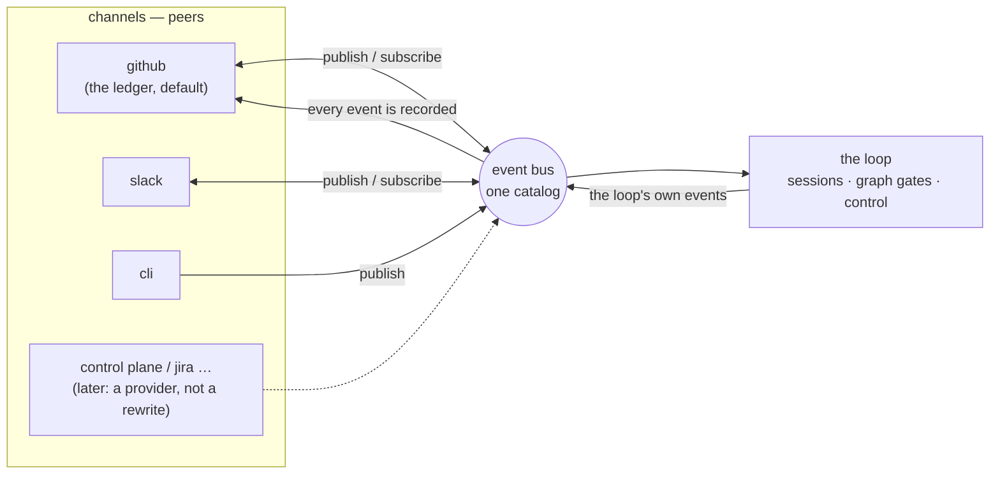

# Requirements: one event bus, many channels, one ledger

> Phase 1 of 3 (requirements → design → tasks). Tier 4 (`human-approves-pr` **plus** a
> named human security sign-off, `security.review.humanSignOffMinTier: 4`): this work item
> lets a chat message advance a human gate and create a work item, and it touches
> `.the-loop/cli-config.schema.json` and `.the-loop/cli-config.yaml`
> (`autonomy.sensitivePaths`).

## Introduction

[Issue #309](https://github.com/MadaraUchiha-314/the-loop/issues/309), opened by
@jc1993, is the seed: driving the-loop from a Slack DM on a phone works for the one path
that exists — an agent's question goes out, an authorized reply comes back — and fails for
everything around it. Five gaps were named against `bf8ab84` (12.1.0):

1. a real issue comment never reaches the bound Slack thread, so the thread and the
   ticket diverge;
2. an approval ping carries neither a link nor the thing being approved;
3. an authorized Slack reply routes input but cannot advance a gate;
4. `work-item-complete` is in the catalog and fired by nothing;
5. a top-level DM cannot start a work item, and the-loop has no work-item *create* path
   of its own.

The owner's comment on the ticket sets the **architecture** this work item builds, and it
is wider than the five gaps: every channel — Slack today, Jira and a control-plane UI
tomorrow, GitHub and the CLI already — is a peer that **subscribes to any event** and
**publishes any event the-loop recognises**; **one channel is the ledger**, the single
source of truth every event accumulates on, GitHub by default and the operator's choice;
each channel type **renders** an event natively (Slack buttons, Slack choice lists); and
identity is declared **in one place**, one entry per person carrying that person's ids on
every channel, instead of two allow-lists in two blocks.

The five gaps are then not five features. Each is one event type, one grant, or one
renderer inside that model — which is how this work item delivers them.

## Requirements

### Requirement 1 — one event catalog, one bus

**User story:** As an operator, I want everything the-loop says and hears to be one kind
of thing — an event with a type — so that adding a channel is adding a provider, not
adding a new path per feature.

#### Acceptance criteria (EARS)

1.1 the-loop SHALL keep **one catalog** of event types, each entry declaring its
description, whether a channel MAY subscribe to it, whether a channel MAY publish it, and
whether the ledger records it when it originates off the ledger.

1.2 The catalog SHALL cover, at minimum: the ask (`session.awaiting_input`); the graph
notification events (`decision-pending`, `phase-approval-pending`, `pr-review-pending`,
`security-sign-off-pending`, `conflict-escalated`, `work-item-complete`); the ledger's
comment events (`comment.human`, `comment.agent`); and the channel-originated events
(`work-item.reply`, `gate.feedback`, `control.command`, `work-item.create`).

1.3 WHEN any component of the-loop has something to say — the ask verb, a graph hook, the
ingress that saw a comment, a channel that read a message — THEN it SHALL say it by
**publishing one event on the bus**, never by calling a channel directly.

1.4 WHEN an event is published THEN the bus SHALL, in this order: record it on the ledger
(R3), then deliver it to every enabled channel that subscribes to its type and is not the
channel it came from. Every step SHALL be best-effort per channel: a failing channel
yields a recorded failure, never an exception to the publisher.

1.5 `the-loop events --types`, `the-loop channels status` and the configuration reference
SHALL all print the catalog from the one definition; a test SHALL pin them together.

### Requirement 2 — every channel subscribes and publishes by grant

**User story:** As an operator, I want to say, per channel, which events it may hear and
which it may raise, so that a chat surface has exactly the authority I wrote down.

2.1 Each channel's config SHALL carry a `subscribe` allow-list (event types it receives)
and a `publish` allow-list (event types a message on it MAY become).

2.2 `subscribe` SHALL default to `[session.awaiting_input]` (today's behaviour) and
`publish` SHALL default to `[work-item.reply]` (today's behaviour: a reply is input to the
session and nothing else).

2.3 WHEN a message arrives on a channel THEN the-loop SHALL classify it into exactly one
catalog event type, and IF that type is not in the channel's `publish` list THEN the
message SHALL be dropped with a recorded reason (`unpublishable-event`) — never
downgraded to a different type. A control keyword a channel may not publish is dropped,
not delivered to the agent as prose.

2.4 A name outside the catalog in either list SHALL be warned about and kept (a custom
process graph may fire a custom notify event); a publish grant for a type the catalog does
not mark publishable SHALL be warned about and **ignored**.

2.5 Silence is no: a channel whose config names no `publish` list holds only the default
grant, and a malformed list resolves to the default, loudly.

### Requirement 3 — one channel is the ledger

**User story:** As an operator, I want one place every event lands whatever surface it
came from, so that the tracker stays the record and an audit never needs Slack.

3.1 `channels.ledger` SHALL name the channel of record. It SHALL default to `github`, and
`github` SHALL be the only value this work item ships; an unknown value SHALL be refused
at load with the accepted values named.

3.2 WHEN an event originates off the ledger and its catalog entry says it is recorded
THEN the ledger SHALL write it onto the work item **before** any other channel receives
it, as a comment carrying a machine-readable **envelope** naming the event type, the
source channel and the actor's identities.

3.3 The ask's ledger record SHALL be the question comment itself — one comment, not a
question plus a mirror.

3.4 A `work-item.reply` record SHALL be the-loop's own comment: marker-stamped, quoted,
scrubbed and control-keywords defanged — exactly today's mirror — so both ingresses drop
it and the reply is processed once, by the channel pipeline.

3.5 A `gate.feedback` or `control.command` record SHALL be a comment **without** the
self-authored marker, posted under the operator's credential, carrying the envelope and a
visible attribution of the originating channel and member. The ledger's own ingress then
reads it as an authorized human's comment — the gate classifies it, the control keyword
executes — and that is how a channel advances the loop: **through the ledger, never
around it.**

3.6 WHEN a `work-item.create` event is recorded THEN the ledger SHALL create the work item
(a GitHub issue) with the configured labels and an envelope in its body, and SHALL bind
the originating conversation to the new work item's ref.

3.7 The ledger's ingress SHALL recognise an envelope: a comment carrying one is never
re-published as `comment.*` (the channel that raised it already has it), and a
marker-stamped comment carrying one is dropped exactly as any marker-stamped comment is.

### Requirement 4 — rendering is the channel's

**User story:** As someone approving from a phone, I want the message to show me what I am
approving and give me the buttons my chat app has, so that I never have to open GitHub to
say yes.

4.1 Every channel SHALL render an event itself; the bus hands over the event, never a
pre-rendered string.

4.2 The Slack channel SHALL render with Block Kit: a header naming the event and work
item, the event's text, and a **link button** to the ledger record or work item whenever
the event carries a URL. `verbosity` keeps today's meaning and levels stay strict
supersets.

4.3 WHEN the event is an approval-shaped notification (`phase-approval-pending`,
`pr-review-pending`, `security-sign-off-pending`) AND the channel may publish
`gate.feedback` AND `read.mode` is `socket` THEN the Slack message SHALL carry
**Approve** / **Request changes** action buttons; a press SHALL enter the inbound pipeline
as a reply by that member carrying the button's text. In `poll` mode no action button is
rendered — a button nobody can receive is worse than none.

4.4 WHEN the graph's `notify` hook fires THEN the event SHALL carry the work item's URL
and, when the node names an artifact, an excerpt of that artifact capped at
`channels.slack.maxChars` — so `quiet` finally carries the link its contract always
promised, `normal` the excerpt, `verbose` the context detail.

4.5 A `comment.*` event SHALL render as the comment's author, the work item, the body
(capped, with a link to the rest) and a link button to the comment.

### Requirement 5 — identity in one place

**User story:** As an operator, I want to write a person down once with their id on every
channel, so that "who may direct the loop" is one list I can read.

5.1 `routing.authorizedUsers` SHALL accept, per entry, either a bare string — a GitHub
login, the ledger's identity — or a mapping whose keys are channel names (`github`,
`slack`, …) and whose values are that channel's native id, plus an optional `name`.

5.2 Every consumer that read `routing.authorizedUsers` as GitHub logins SHALL keep
reading exactly the GitHub logins out of it (the router, the poller, the dispatcher's
control seam, the graph's human gates); nothing widens.

5.3 The Slack channel SHALL take its member-id allow-list from the `slack` ids of those
same entries; `channels.slack.authorizedUsers` SHALL be removed and refused at load.

5.4 WHEN a channel-originated event is recorded on the ledger THEN the envelope SHALL
carry every id the entry declares for that actor, so the record can be read as one person
rather than one member id.

5.5 An entry that names no `github` id is a person who may act on the channels they are
named on and on nothing that reads GitHub logins; an entry that is neither a string nor a
mapping is dropped with a warning. Empty stays fail-closed everywhere.

### Requirement 6 — the five gaps, as consequences

6.1 **Comment mirror.** WHEN the ledger's ingress accepts a human comment (an authorized
user's, or a work-item collaborator's) THEN it SHALL publish `comment.human`; WHEN it drops
a marker-stamped, envelope-less comment (the agent's own) THEN it SHALL publish
`comment.agent`. A Slack channel subscribed to `comment.agent` alone gets the agent's
artifacts and no human's words; one subscribed to both gets the thread.

6.2 **Content-rich notify.** R4.4. No new key.

6.3 **Gate advance.** WHEN a Slack channel holds the `gate.feedback` grant AND the work
item's graph is parked at a human gate AND an authorized member replies in the bound
thread THEN the reply SHALL be recorded per R3.5 and the gate SHALL classify it on the
ledger's next ingress; the artifact's `approvedBy` SHALL name the **person** (the entry's
GitHub login), with the envelope as provenance. Without the grant the same reply is
`work-item.reply`, exactly today.

6.4 **Done.** The outer loop's `complete` node SHALL publish `work-item-complete`.

6.5 **Kickoff.** WHEN a Slack channel holds the `work-item.create` grant AND
`channels.slack.kickoff.repo` is set AND an authorized member posts a **top-level**
message in the configured channel THEN the-loop SHALL publish `work-item.create`, the
ledger SHALL create the issue (R3.6) with `kickoff.labels`, and the bot SHALL reply in
the new thread with the issue's link. An empty `repo` disables the path even with the
grant present.

### Requirement 7 — configuration and migration

7.1 The CLI config SHALL move to version `0.7.0`. `channels.slack.events` SHALL be renamed
`subscribe`; `channels.slack.authorizedUsers` SHALL be removed (R5.3); `channels.ledger`,
`channels.slack.publish`, `channels.slack.maxChars` and `channels.slack.kickoff`
SHALL be added.

7.2 WHEN a config still declares a removed key THEN load SHALL refuse it naming the key,
the replacement and `the-loop migrate-config`; the migration SHALL move `events` to
`subscribe` and each Slack member id into a `{slack: …}` entry under
`routing.authorizedUsers`, reporting every move and noting that the operator should fold
each Slack id into the person's GitHub entry. It SHALL be idempotent.

7.3 A config that says nothing new SHALL behave exactly as 12.1.0 did, with two stated
exceptions: `work-item-complete` now fires (anyone who had subscribed to it starts
receiving it — release-notes material), and a notification ping now carries a link.

### Requirement 8 — observability

8.1 Every bus step SHALL be a registered event-log type: `bus.published`,
`bus.recorded`, `bus.record_failed`, plus the existing `channel.*`; `channel.dropped`
gains the reasons `unpublishable-event` and `kickoff-disabled`.

8.2 Payloads SHALL carry ids and event types, never message text and never tokens.

## Non-functional requirements

- **No new runtime dependency.** Block Kit is JSON the SDK already sends.
- **Latency.** A reply granted `gate.feedback` reaches the gate on the ledger's next
  ingress (a webhook delivery, or one poll interval) — stated, not hidden.
- **Bounded state.** The kickoff cursor is one more key in the existing channel state;
  the thread cap is unchanged.

## Security considerations

- **Actors & trust.** Untrusted: every Slack message (author id, text, button payload),
  every GitHub comment body, every issue body a kickoff creates. Trusted: the config, the
  operator's credentials the ledger writes with, the graph's own hooks.
- **Trust boundaries & data.** Three widen: a chat message may now become a **gate
  answer** (R6.3), a **control command** (R3.5) and a **new work item** (R6.5). Each
  crosses into the loop only as a ledger record the ledger's own ingress then judges, so
  the existing guards — self-marker, `authorizedUsers`, the named-actor control re-check —
  run on it unchanged. No secret moves: tokens stay env-named and call-time read.
- **Abuse cases (EARS):**
  1. WHEN a Slack member not in any `routing.authorizedUsers` entry replies, presses a
     button or posts top-level THEN the system SHALL neither record, deliver, nor create
     anything, and SHALL record `unauthorized-actor`.
  2. WHEN an authorized member types a control keyword on a channel without the
     `control.command` grant THEN the system SHALL drop it as `unpublishable-event` — not
     deliver it to the agent, not record it undefanged.
  3. WHEN a GitHub commenter who is a work-item collaborator (not authorized) posts a
     comment forging an envelope that names an authorized person THEN the gate SHALL
     attribute the comment to the **poster**, and the poster's own authorization SHALL
     decide — an envelope re-attributes only a comment its poster was authorized to make.
  4. WHEN an unauthorized GitHub user posts a comment carrying an envelope THEN both
     ingresses SHALL drop it before anything reads the envelope.
  5. WHEN a relayed `control.command` record reaches the ledger's ingress THEN it SHALL
     pass through the same named-actor, allow-listed control seam every typed keyword
     passes; the relay buys no shortcut.
  6. WHEN a kickoff message is received and `kickoff.repo` is empty THEN nothing SHALL be
     created, whatever the grant says (`kickoff-disabled`).
  7. WHEN a kickoff creates an issue THEN its body SHALL NOT carry the self-authored
     marker (it must be armable) but SHALL carry the envelope, and it SHALL be armed only
     by the labels the operator configured — never by a label the message named.
  8. WHEN the ledger records a channel event THEN the actor recorded SHALL be resolved
     from config, never from the message (a message cannot claim to be someone).
  9. WHEN a Block Kit action arrives whose `value` is not one of the values the-loop
     rendered THEN it SHALL be treated as free text through the ordinary reply path, with
     the same authorization — a crafted payload buys nothing a typed message would not.
  10. WHEN a comment records an envelope THEN ingress SHALL never re-publish it to
      channels, so a channel cannot make the bus echo its own message back (loop
      prevention across channels).
- **Fail closed.** Unknown ledger name → refuse; unknown publish grant → ignored with a
  warning; empty allow-list → nobody; empty `kickoff.repo` → nothing created; unknown
  `read.mode` → `off` (unchanged).

## Out of scope

- A Jira or control-plane-UI channel provider. The bus, the catalog and the ledger
  abstraction are built so that one is a provider behind the existing contract.
- Per-role or per-person targeting of notifications (deferred since decision-094).
- A ledger other than GitHub. The key exists; the enum has one value.
- Threaded Slack *conversations* per comment, reactions, edits and deletes.
- Replacing the graph's `request-review` comment with the bus record of
  `phase-approval-pending`. Both exist; the catalog says the event is not recorded.

## Open questions

Raised on the ticket and linked here as they are answered. The owner's comment settled
the architecture; the one question left to the review is the spelling of the identity
entry (R5.1), which the design records with its alternatives.

## Review comments

> Appended by the-loop's `record-feedback` hook when a human gate approves with
> comments (issue-109). Append-only and attributed: an approval never silently
> discards a reviewer's suggestions, and the feedback travels with the document
> it concerns rather than living in a side-channel tracker.
