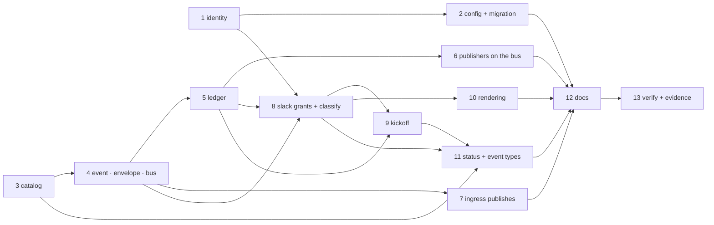

# Tasks: one event bus, many channels, one ledger

> The last spec artifact. A DAG derived from the approved design and testing plan; each
> task names the testing-plan row that proves it. TDD: the test first, red, then green.

## Task list

- [x] 1. Identity in one place — `identity.py`, `authz.resolve_authorized_users`,
  `RoutingConfig.principals`, `SlackChannelConfig` reading Slack ids from it
  - _Depends on:_ none
  - _Requirements:_ R5.1–R5.5
  - _Test:_ T1 — `cli/tests/test_identity.py`; `test_channels.py::test_slack_member_ids_come_from_routing_authorized_users`
- [x] 2. Config surface and migration 0.7.0 — schema (`.the-loop/` + packaged copy),
  template, this repo's config, `migrations.py` (refuse `channels.slack.events` /
  `.authorizedUsers`; move both), docs of `migrate-config`
  - _Depends on:_ 1
  - _Requirements:_ R7.1–R7.3, R3.1
  - _Test:_ T10 — `test_migrations.py` (new section), `test_config_schema_parity.py`, `make validate`
- [x] 3. The catalog — `channels/events.py` rows with the four flags and the derived
  views; `channels status` and the docs table from the one definition
  - _Depends on:_ none
  - _Requirements:_ R1.1, R1.2, R1.5
  - _Test:_ T1 — `test_channels.py::test_the_catalog_*`, `test_the_docs_list_every_subscribable_event`
- [x] 4. `Event`, the envelope and the bus — `channels/base.py` (`Event`, `PublishResult`,
  `subscribes`/`may_publish`), `channels/envelope.py`, `channels/bus.py` (`publish`;
  `broadcast` as a wrapper)
  - _Depends on:_ 3
  - _Requirements:_ R1.3, R1.4, R3.2, R3.7, R8.1
  - _Test:_ T1 — `cli/tests/test_bus.py`
- [x] 5. The GitHub ledger — `channels/github.py` (`GitHubLedger.record` for the four
  record shapes; `create_issue` in `comments.py`), `load_channels` returning the ledger
  - _Depends on:_ 4
  - _Requirements:_ R3.1–R3.6
  - _Test:_ T1 — `test_bus.py::test_record_shapes_*`; T8 — A7, A8
- [x] 6. Publishers moved onto the bus — `ask_session`, `notify` (url + excerpt, no role
  gate), standing announcement; graph YAML: `complete` notifies, approval nodes name
  their artifact
  - _Depends on:_ 4, 5
  - _Requirements:_ R1.3, R3.3, R4.4, R6.2, R6.4
  - _Test:_ T2 — `Scenario: An asked question is one ledger comment and one Slack post`; `Scenario: The complete node announces work-item-complete with a link`
- [x] 7. Ingress publishes comments — router + poller `publisher`, daemons wiring it,
  envelope suppression, `comments_from(authorized=)` re-attribution in `graphlink`
  - _Depends on:_ 4
  - _Requirements:_ R6.1, R3.7, R6.3 (attribution)
  - _Test:_ T2 — `Scenario: An agent's comment reaches the Slack thread …`; T8 — A3, A4, A10
- [x] 8. Slack: grants, classification and the three new inbound types —
  `SlackChannelConfig.publish/max_chars/kickoff`, `inbound.classify`, `process_reply`
  recording through the bus, `gate.feedback`/`control.command` stopping at the record
  - _Depends on:_ 1, 4, 5
  - _Requirements:_ R2.1–R2.5, R3.4, R3.5, R6.3
  - _Test:_ T2 — the gate-grant, control-grant and no-grant scenarios; T8 — A2, A5
- [x] 9. Slack: kickoff — `fetch_kickoffs` (`conversations.history`, `channel:<id>`
  cursor), `process_kickoff`, thread binding and the link reply; Socket Mode top-level
  messages
  - _Depends on:_ 5, 8
  - _Requirements:_ R6.5, R3.6
  - _Test:_ T2 — `Scenario: A top-level DM becomes a labelled issue bound to its thread`; T8 — A1, A6, A7
- [x] 10. Slack: rendering — `render_blocks`, `post` sending `blocks` + fallback `text`,
  action buttons under the two conditions, Socket Mode `block_actions` → reply
  - _Depends on:_ 8
  - _Requirements:_ R4.1–R4.3, R4.5
  - _Test:_ T1 — `test_channels.py::test_render_blocks_*`; T2 — `Scenario: An Approve button press …`; T8 — A9
- [x] 11. `the-loop channels status` — ledger, subscribe/publish ticks, kickoff target;
  event-log types registered (`bus.*`, new `channel.dropped` reasons)
  - _Depends on:_ 3, 8, 9
  - _Requirements:_ R1.5, R8.1, R8.2
  - _Test:_ T1 — `test_channels_status_prints_the_catalog_with_ticks` (extended); `test_eventlog.py` catalog pin
- [x] 12. Docs — capability doc, `channels-options`, `routing-options`, `channels`
  command, `state.md`, `reference/collaboration.md`, `decision-103`, decisions index
  - _Depends on:_ 2–11
  - _Requirements:_ R1.5 (docs pin), the capability-docs gate
  - _Test:_ T12 — `make lint` (markdownlint); T1 — the docs↔catalog pin
- [x] 13. Verification and evidence — run T1, T2, T8, T10, T12; write `evidence/`;
  security review (T13); fill the testing plan's results; execution log; PR briefing
  - _Depends on:_ 12
  - _Requirements:_ all
  - _Test:_ T12 — `make check`

## Dependency graph (DAG)

## Checkpoints

After tasks 2, 5, 8 and 10: the unit rows (T1, T10) and `make lint typecheck`. After
task 11: T2. After task 13: `make check`, evidence committed, the testing plan's results
filled, the execution log updated, then the review chain and the security gate.

## Review comments

> Appended by the-loop's `record-feedback` hook when a human gate approves with
> comments (issue-109). Append-only and attributed: an approval never silently
> discards a reviewer's suggestions, and the feedback travels with the document
> it concerns rather than living in a side-channel tracker.
