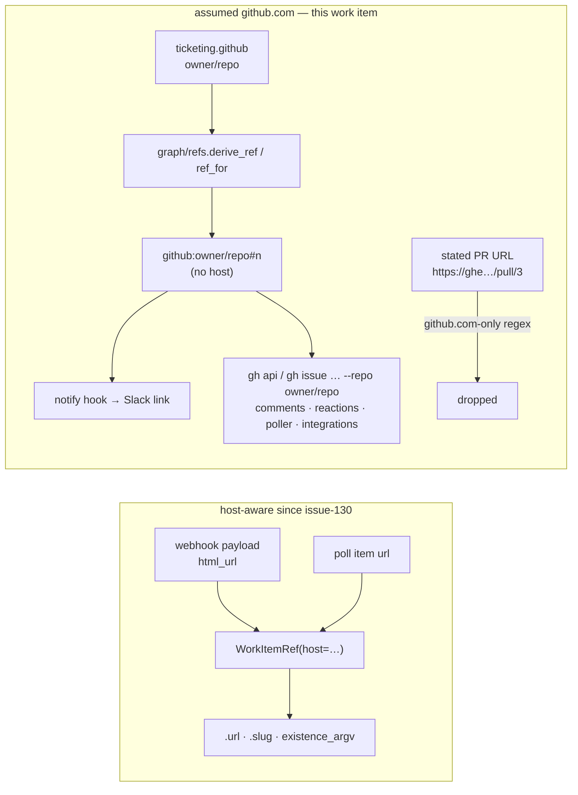

# Bugfix: every link and every `gh` call the-loop makes names the GitHub it is on

> Phase 1 of 3 (requirements → design → tasks). Following the Kiro spec approach
> (https://kiro.dev/docs/specs/). Tier 4 (`human-approves-pr` **plus** a named human
> security sign-off, `security.review.humanSignOffMinTier: 4`): the change adds a key to
> the CLI-config schema (`**/*schema*` is a sensitive path), and a configured host string
> reaches both a URL people click and a `gh` argument that selects which credential is
> sent.

## Introduction

[Issue #311](https://github.com/MadaraUchiha-314/the-loop/issues/311): on GitHub
Enterprise the links the-loop posts — in Slack for a decision that needs a human, in the
portable record, in the reviewer's suggested pull-request list — point at `github.com`,
and so do some of the `gh` calls behind them. The owner's ask is an **audit** of every
place `github.com` is assumed, and a fix that takes the host from the CLI config or from
`gh` itself.

Issue-130 already taught the *ingress* about hosts: a work item that arrives through a
webhook or a poll carries its host in its ref (`github:ghe.corp/octo/repo#15`), and the
ref's URL, file name and existence check follow it. The audit found that the host stops
there. Two families of code never learned:

1. **Refs minted from configuration, not from an event.** The graph names its work item
   by deriving a ref from `ticketing.github` (`owner` + `repo`), which has no host, so
   every ref the *session* mints is a `github.com` ref — and the `notify` hook derives
   the Slack link from exactly that ref. This is the symptom the issue reports.
2. **`gh` calls that pass `owner/repo` and nothing else.** `gh` resolves the host from
   `GH_HOST`, the checkout's remote, or `github.com`; a comment, reaction, issue lookup or
   poll listing for a hosted work item therefore goes wherever `gh` happens to point,
   not where the work item is. Only `linkage.existence_argv` passes `--hostname`.

### The audit — every `github.com` in the runtime, and its verdict

| # | Site | What it assumes | Verdict |
|---|------|-----------------|---------|
| S1 | `graph/refs.py` `derive_ref`/`ref_for`; `graph/bootstrap.py` `prRef`; `graph/runtime.py` `work_item` | a ref built from `ticketing.github` has no host ⇒ github.com | **fix** (R1, R2) |
| S2 | `graph/hooks/sideeffects.py` `_work_item_url` → the Slack/bus link | inherits S1 | fixed by S1 |
| S3 | `graph/hooks/review.py` `_PULL_URL` (`https?://github\.com/…/pull/n`), `_PULL_SLUG`, `_own_repo`, `_state_pulls` | a stated pull-request URL on another host is dropped; a hosted work-item ref is mis-split | **fix** (R3) |
| S4 | `graph/integrations/github.py` `_split_ref`, `GitHubCli` (`--repo owner/repo`, `api …`), `GitHubApi` (`api.github.com`), `_linked_pull_refs` | a hosted ref is mis-split; every call goes to `gh`'s default host / the public API | **fix** (R4) |
| S5 | `comments.py` `comment_argv`, `issue_argv`/`create_issue` | `gh api repos/…` with no `--hostname`; the created issue's ref has no host | **fix** (R4) |
| S6 | `reactions.py` `_argv` | `gh api …/reactions` with no `--hostname` | **fix** (R4) |
| S7 | `poller/github.py` `RepoSpec`, `GhClient` (every listing, comment and state read) | `repos: OWNER/REPO` only; `--repo owner/repo` and `api …` with no host | **fix** (R4, R5) |
| S8 | `linkage.py` `existence_argv` | — (already `--hostname`) | keep; reuse its rule |
| S9 | `sessions/registry.py` `DEFAULT_GITHUB_HOST`, `WorkItemRef.url` | a ref without a host means github.com | **keep** — the ref grammar is the identity (issue-130, decision-048) |
| S10 | `webhook/router.py` `_host`, `_CLOSING_KEYWORD_RE` | the host is read off the payload; a closing-keyword URL's host is discarded but the ref is built from the payload's host | keep (correct) |
| S11 | `workspace.py`, `routing.workspace.defaultHost` | the checkout directory's host, with an explicit key | keep; documented against the new key |
| S12 | `core/selfdiagnosis.py`, `harness_plugins.py` marketplace, `api/config.py` CORS origin, `core/config.py` schema URL | the-loop's **own** repository, marketplace, dashboard and schema live on github.com | keep — these name the-loop, not the operator's GitHub |
| S13 | `skills/`, `commands/`, `hooks/`, templates | no runtime assumption found beyond links to the-loop's own repository | nothing to change |

## Requirements

### Requirement 1 — one answer to "which GitHub"

**User story:** As an operator on GitHub Enterprise, I want to say once where my GitHub
is, so that every link and every call the-loop makes lands there.

1.1 the-loop SHALL resolve the GitHub host from one function with one documented
precedence: (a) `integrations.github.host` in the CLI config; (b) the host of
`integrations.github.api.baseUrl` when that is not the public API; (c) the `GH_HOST`
environment variable — `gh`'s own override; (d) the `origin` remote of the repository
the loop is running in — `gh`'s own next answer — when a repository is at hand;
(e) `github.com`.

1.2 A candidate that is not the shape of a host (a dotted name or a name with an
explicit port; no scheme, no path, no credentials) SHALL be skipped with a warning, never
interpolated. The rule SHALL be the one `WorkItemRef` already applies to a host in a ref.

1.3 `integrations.github.host` SHALL be declared in both copies of the CLI-config schema,
in the shipped template, and documented. It SHALL be optional; a config that omits it
SHALL behave exactly as before wherever the resolution ends at `github.com`.

1.4 No configuration version bump SHALL be needed: the key is additive.

### Requirement 2 — a ref minted from configuration carries the resolved host

2.1 WHEN the graph derives its work item's ref from `ticketing.github` THEN the ref SHALL
carry the resolved host (unwritten when it is `github.com`), so `WorkItemRef.url` — and
therefore the `notify` hook's link, the `session.awaiting_input` link and the portable
record's `url` — names the right GitHub.

2.2 The same SHALL hold for the pull-request ref an inner loop is built with (`prRef`).

2.3 `derive_ref`/`ref_for` SHALL stay total and fail closed: an invalid host yields `""`,
exactly as an invalid slug does, and `origin_repo` SHALL remain `<owner>/<repo>` — the
host is an argument, never smuggled into the slug.

### Requirement 3 — the review brief accepts pull requests where they are

3.1 A stated pull-request URL on any host SHALL be recognised and frozen as a ref that
names that host (unwritten for `github.com`).

3.2 A bare number or an `owner/repo#n` slug SHALL resolve on the **work item's** host —
the ticket's GitHub is the default for everything named beside it.

3.3 The pull requests detected from `pr-loops/` state SHALL carry the work item's host.

### Requirement 4 — every `gh` call names the work item's host

4.1 Every `gh api` invocation the-loop composes for a work item SHALL pass
`--hostname <host>` when the work item's host is not `github.com`, and SHALL pass
nothing when it is (so every existing argv is unchanged for github.com).

4.2 Every `gh issue|pr <verb> --repo` invocation SHALL pass `[<host>/]<owner>/<repo>` —
`gh`'s own `--repo` grammar — with the host present exactly when it is not `github.com`.

4.3 The API transport SHALL address a hosted work item at `https://<host>/api/v3` when
`integrations.github.api.baseUrl` is the public default, and SHALL honour an explicit
`baseUrl` verbatim otherwise.

4.4 A ref the-loop composes from a GitHub answer (`linked-pulls`, a created kickoff
issue) SHALL carry the host it was asked on.

4.5 The host SHALL be spelled by the one rule in 4.1/4.2 (a shared helper), never by an
f-string at a call site.

### Requirement 5 — poll sources on an enterprise host

5.1 A poll source's `repos` entry SHALL accept `[HOST/]OWNER/REPO`; `OWNER/REPO` SHALL
keep meaning the resolved default host.

5.2 Every read the poller makes for such a repository — listings, comments, reviews,
closure state — SHALL go to that host (R4), and the items it discovers SHALL carry that
host in their refs (already true via their URL).

5.3 `owns()` SHALL compare the host too, so a github.com ref is not claimed by an
enterprise source with the same `owner/repo`.

### Requirement 6 — the paper trail

6.1 The resolved host SHALL be logged at debug level with the tier it came from, so an
operator can see *why* a link went where it went.

## Security considerations

A host string selects **which credential `gh` sends** (it authenticates per host) and
**where a human is sent** when they click. Both are boundaries this work item touches.

| # | Abuse case | Boundary | Mitigation |
|---|------------|----------|------------|
| A1 | A configured host carries a scheme, path, `@user`, or whitespace and reaches an argv or a URL | config → argv / URL | R1.2: one host grammar (`_HOST_RE`), applied before any interpolation; a value that fails is skipped with a warning and the resolution continues. `gh` is spawned from an argv list, never a shell |
| A2 | A hosted ref makes the-loop send the operator's github.com token to another host | ref → `gh --hostname` | `gh` keeps credentials **per host** and sends only the one it holds for that host; the API transport uses the configured token only against the base it derives from the host, which the operator configured or `gh` already authenticated to. A host nobody authenticated gets an auth error, not a leaked token |
| A3 | A webhook payload names a host to redirect the-loop's calls | payload → ref (issue-130, unchanged) | Unchanged boundary: the payload is signed with the receiver's secret, and the ref grammar already accepts a host from it; this work item makes the *outbound* calls agree with the ref instead of ignoring it. A forged host would already have been the work item's identity |
| A4 | The checkout's `origin` remote (tier d) is pointed somewhere else | filesystem → host | Read only when a repository root is given (the graph's own session), through `git config --get`, validated as a host, and consulted **after** the operator's config and `GH_HOST`. Whoever sets the remote already chooses where that checkout pushes |
| A5 | A `github.com` deployment changes behaviour | regression | R4.1/R4.2: the host is written only when it is not the default; every existing argv, ref and URL for github.com is byte-identical |

## Out of scope

- **`routing.workspace.defaultHost`.** The checkout directory's host has its own explicit
  key and the payload's `html_url` wins over it; it is documented against the new key,
  not folded into it.
- **the-loop's own homes** (S12): self-diagnosis files issues on the-loop's repository,
  the marketplace is the-loop's, the dashboard origin is the-loop's Pages. A GHE-only
  network cannot reach them, which is a deployment fact, not a link bug.
- **Contributing repositories on a different host than the ticket.** `repos:` entries stay
  `<owner>/<repo>` and inner loops inherit the work item's host.
- **Jira.** Nothing here touches the Jira transport.
