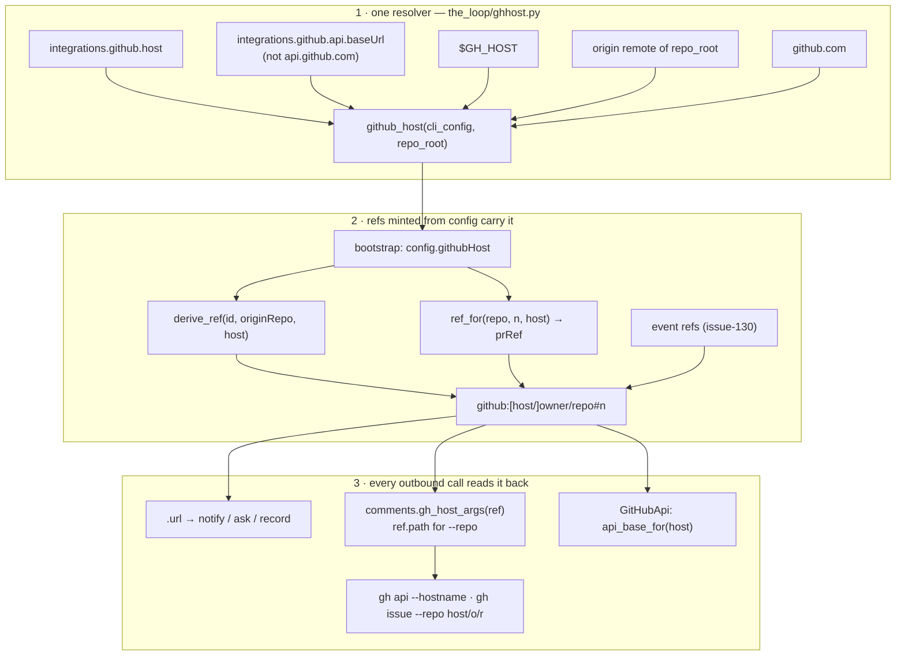

# Design: the host is the ref's, and the ref is minted with the resolved host

> Phase 2 of 3. Derived from the locked `bugfix.md`; reviewed together with
> `testing-plan.md`.

## Overview

Issue-130 settled *where the host lives*: in the ref, unwritten when it is `github.com`.
This work item does not add a second place. It (1) gives the-loop **one resolver** for the
host a ref should carry when no event supplied one, (2) mints every configuration-derived
ref **with** that host, and (3) makes every outbound `gh`/API call **read the host back
off the ref** through one helper. Nothing downstream of a ref has to know about
configuration; nothing upstream has to know about `gh`.



## 1. The resolver — `cli/the_loop/ghhost.py`

```python
def github_host(cli_config, *, env=os.environ, repo_root=None, remote_url=None) -> str
def api_base_for(host) -> str        # "https://api.github.com" | "https://<host>/api/v3"
def host_of_api_base(base_url) -> str  # "" for the public API or anything unparsable
def host_from_remote(url) -> str      # https://, ssh://, git@host:o/r.git, "" otherwise
```

`github_host` walks the five tiers in R1.1 and returns the first candidate that
`sessions.is_github_host` accepts, logging the tier at debug (R6.1) and a warning for a
candidate it skipped (R1.2). `repo_root` is consulted only when given — the graph passes
its root; a daemon passes nothing — and the remote is read the way `graphlink` already
reads it (`git config --get remote.origin.url`, no shell, a 10 s timeout, empty on any
failure). `remote_url` is the injectable seam for tests.

Why a module and not a method on `WorkItemRef`: the ref is a value; the resolver reads
configuration, the environment and a subprocess. Keeping them apart is what keeps
`WorkItemRef` pure and total.

Why `api.baseUrl` ranks above `GH_HOST`: both are the operator's, but the config file is
the declaration the-loop documents and validates; the environment variable is `gh`'s
mechanism, honoured because the issue asks for "the gh cli itself". A remote outranks
nothing the operator wrote down.

## 2. Minting — `graph/refs.py`, `graph/bootstrap.py`, `graph/runtime.py`

- `ref_for(repo_slug, number, host="")` and `derive_ref(work_item_id, origin_repo,
  host="")`: the host is a **separate argument** (R2.3). The slug contract — `owner/repo`
  and nothing else — is unchanged, and so is every refusal the existing tests pin; a host
  that fails `is_github_host` is one more refusal (`""`). The ref is still spelled by
  `WorkItemRef(...).ref`, which writes the host only when it is not the default.
- `build_runtime` resolves once — `config["githubHost"] = github_host(cli_cfg,
  repo_root=root)` — and builds `prRef` with it; `Runtime.work_item` passes it to
  `derive_ref`. Every hook that reads `ctx.work_item.ref` (notify's URL, the ask, the
  audit comments, every integration call) is now host-correct without change.

## 3. Reading it back — `comments.gh_host_args` and `WorkItemRef.path`

Two spellings, both already defined:

| Need | Spelling | Where it is defined |
|------|----------|---------------------|
| `gh api …` | `--hostname <host>` when the ref's host is not the default, else nothing | new `comments.gh_host_args(item_or_host)`; `linkage.existence_argv` switches to it |
| `gh issue\|pr … --repo` | `[<host>/]<owner>/<repo>` | `WorkItemRef.path` — it is already this string |

Callers (R4.5): `comments.comment_argv`, `comments.issue_argv`/`create_issue` (which now
accepts a `[host/]owner/repo` slug and returns a hosted ref), `reactions._argv` (the
target gains a `host`, read off the routed work item), the poller's `GhClient` (every
method gains `host=""`; `RepoSpec` gains `host` and a `gh_repo` property), and
`GitHubCli` in the graph integrations.

`GitHubApi` gets `_ref_parts(ref) → (host, owner, repo, number)` beside the unchanged
3-tuple `_split_ref`, and addresses a hosted ref at `api_base_for(host)` when its
`base_url` is the public default, verbatim otherwise (R4.3). `_linked_pull_refs(data,
host)` mints refs on the host it asked (R4.4).

## 4. The review brief — `graph/hooks/review.py`

`_PULL_URL` captures any host (`https?://(?P<host>[^/\s]+)/o/r/pull/n`); `_own_coords`
replaces `_own_repo` and returns `(host, owner, repo)` via `WorkItemRef.parse`; slugs and
bare numbers take the work item's host; `_state_pulls` builds its refs with it. All four
spell the ref through `WorkItemRef`, so a github.com brief freezes exactly the strings it
does today.

## 5. The poller — `poller/github.py`

`RepoSpec.parse` accepts three segments when the first is a host (`is_github_host`);
`full_name` stays `owner/repo` (it is the payload's `repository.full_name`), `gh_repo` is
the `--repo` form. `owns()` compares `(host, owner, repo)`. `closure()` passes `ref.host`;
`list_comments` passes the item's host, read from its URL with the ingress's own
`host_from_url`.

## 6. Configuration and docs

- `integrations.github.host` (string, optional) in `.the-loop/cli-config.schema.json` and
  its byte-identical package copy; the template and this repo's config carry it
  commented; `docs/config/cli/integrations-options.md` documents it (the docs↔schema
  parity test enforces both directions); `polling-options.md` documents
  `[HOST/]OWNER/REPO`; `routing-options.md` cross-references `workspace.defaultHost`;
  `docs/cli/concepts.md` and `state.md` say what changed for a ref minted in-session.
- Capability docs: `cli.md` (the ref rule gains the minting side; the integrations rule
  gains the host) and `channels.md` (links carry the ledger's host).

## Security design

- **One grammar, applied before interpolation** (A1): `is_github_host` is the public
  name of `_HOST_RE`, and the resolver, `ref_for`, `RepoSpec.parse` and `create_issue`
  all refuse through it. No candidate reaches `--hostname`, a URL or a path unvalidated.
- **Per-host credentials** (A2): `gh` is the credential holder and sends per host; the
  API transport derives a base only from a host that passed the grammar, and sends the
  configured token there — which is what the operator asked for by naming that host.
- **The remote is last and local** (A4): tier (d) runs only in the graph's own session,
  after every declared answer, from `git config` with no shell.
- **github.com is untouched** (A5): the host is written into a ref, an argv or a URL only
  when it is not the default; the existing tests for those strings are kept as-is.

## Error handling

Every failure fails closed to the next tier or to `""`: an unparsable `baseUrl`, a missing
`git`, a checkout without an `origin`, an invalid configured host (warned). No new
exception type; no call site learns a new error.

## Alternatives considered

| Alternative | Why not |
|-------------|---------|
| Make `DEFAULT_GITHUB_HOST` configurable | A ref's meaning would then depend on the machine reading it; the portable record travels between machines (issue-128) and issue-130 chose the explicit host for exactly that reason |
| Add `host` to `ticketing.github` in the harness config | It is the plugin's file and describes *the ticket*, but the issue asks for the CLI config or `gh`; and the daemon, which posts most of these links, never reads the harness config (decision-032) |
| Derive the host from `api.baseUrl` only, no new key | A `cli`-transport operator has no `baseUrl` to set; `host` is the plain declaration, and `baseUrl` stays honoured for whoever already set it |
| Pass `GH_HOST` into every `gh` spawn's environment | Global per process; a daemon polling two hosts would need two processes. `--hostname`/`--repo host/o/r` is per call and is what `gh` documents |

Decision record: [`decision-104`](../../decisions/decision-104.md).
