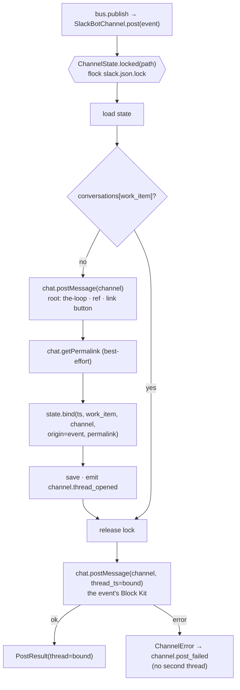

# Design: the thread is the work item's — one root, opened once, every event a reply

> Phase 2 of 3. Derived from [`requirements.md`](requirements.md); reviewed together with
> [`testing-plan.md`](testing-plan.md). Tier 3.

## Overview

Three moves, all inside `cli/the_loop/channels/` plus one CLI action:

1. **The state gains a per-work-item map and a lock.** `ChannelState.conversations`
   (work item → channel, thread, opened, origin, permalink) sits beside the thread-keyed
   `threads` map the reader already uses; every mutation is a load → change → save under
   an exclusive `flock` on a sibling lock file.
2. **`post()` opens a root, then replies.** With no conversation bound, the channel posts
   a root that names the work item, binds it, and only then posts the event — as a reply.
   With one bound, it replies. A failed reply never opens a thread.
3. **The conversation is observable.** `channel.thread_opened` in the event log,
   `the-loop channels threads` on the command line, a count in `channels status`.



## 1. The state — `channels/state.py`

```python
@dataclass
class ChannelState:
    threads: Dict[str, Dict[str, str]]        # thread ts → {workItem, channel}   (unchanged; the reader's map)
    cursors: Dict[str, str]                   # thread ts | channel:<id> → last ts (unchanged)
    conversations: Dict[str, Dict[str, str]]  # work item → {channel, thread, opened, origin, permalink}

    @classmethod
    @contextmanager
    def locked(cls, path) -> Iterator["ChannelState"]   # exclusive; loads; caller saves
    def bind(self, thread, work_item, channel_id, *, origin="event", permalink="") -> None
    def thread_for(self, work_item) -> Optional[Tuple[str, str]]   # conversations first, then the legacy scan
    def conversation(self, work_item) -> Optional[Dict[str, str]]
```

- **Two maps, one truth.** `threads` stays the reader's map (`fetch_replies` iterates it,
  `work_item_for` answers the socket transport) and `conversations` is the writer's answer
  to "where does this work item go". `bind` writes both; `thread_for` reads
  `conversations` and falls back to the newest `threads` entry naming the work item —
  the pre-issue-312 file — backfilling the conversation so the next save carries it
  (R3.4). Eviction past `THREAD_CAP` drops the thread's conversation with it.
- **The lock is a sibling file, not the state file.** `save` replaces the state file's
  inode (`tempfile` + `os.replace`), so a lock on it would be released by the very write
  it protects. `<path>.lock` is opened once per critical section and `flock`ed exclusively
  through `runlock.fcntl`, the module that already owns the platform check; without
  `flock` (`runlock.HAVE_FLOCK` false) the context manager logs once at debug and yields
  unlocked — R1.4 becomes best-effort on a platform the runner does not support anyway.
  Two threads in one process open two descriptions and therefore also exclude each other.
- **`opened` is UTC ISO-8601** written by the-loop, not Slack's ts — it is for a person
  reading the listing.

## 2. The channel — `channels/slack.py`

```python
def post(self, event: Event) -> PostResult:
    with ChannelState.locked(self.state_path) as state:
        bound = state.thread_for(event.work_item) if event.work_item else None
        if event.work_item and not bound:
            bound = self._open_thread(client, state, event.work_item)   # root + bind + save
    ts = client.chat_postMessage(channel=bound[0], thread_ts=bound[1], text=…, blocks=…)
    return PostResult(channel=self.name, ok=True, thread=bound[1])
```

- **`_open_thread`** posts the root — `render_root(work_item, url, reading)` — reads the
  `ts`, asks for the permalink inside `try/except Exception` (the fake client in the tests
  has no such method, and Slack may refuse; either way the link is `""`), binds with
  `origin="event"`, saves, and emits `channel.thread_opened`. An event with no work item
  (none exists today; `broadcast` callers may pass `""`) posts top-level and binds nothing,
  as before.
- **`render_root`** is pure: a `header` block `the-loop · <ref>`, a `section` saying the
  thread carries every message about the work item (with `<url|ref>` when the ref parses
  as a `WorkItemRef`; a standing ref has no URL and is named bare) and, when the channel
  reads (`read.mode != "off"`), that replies from an authorized member reach it; an
  `actions` block with the link button when there is a URL. Its input is the bound ref,
  never an event's text (A2).
- **The reply is outside the lock.** The lock protects the decision, not the delivery: a
  slow Slack call must not hold the watcher's `advance` for its duration.
- **A reply's failure is the same `ChannelError` as today** and is never followed by a
  root post (R2.3): the `_open_thread` branch is entered only when no binding exists.
- `say()` (the kickoff's "here is your issue") and `bind()` are unchanged in shape;
  `bind` takes the lock and passes `origin="kickoff"` from `process_kickoff`.
  `advance`/`advance_kickoff` and the kickoff baseline in `fetch_kickoffs` take the lock
  too — every read-modify-write in the module goes through the same door.

## 3. Observability — `eventlog.py`

| Event | Fields | When |
|-------|--------|------|
| `channel.thread_opened` | `channel`, `work_item`, `thread`, `channel_id`, `origin` | a root was posted and bound (`origin=event`), or a kickoff thread was bound (`origin=kickoff`) |

`channel.posted` keeps its shape (the thread it carries is now always the root's ts for a
bound work item). The catalog test (`test_eventlog.py`) pins the new entry.

## 4. The command — `commands/channels_cmd.py`

```bash
the-loop channels threads                       # every conversation, one line each
the-loop channels threads --work-item github:o/r#7
the-loop channels threads --json
```

Columns: work item, channel id, thread ts, opened, origin, link (the permalink, or `—`).
Reads the state file only; no Slack call, no token needed. `status` prints
`conversations: N work item(s) in M bound thread(s), K cursor(s)`.

## 5. Documentation

`docs/cli/commands/channels.md` (the action and the thread rule),
`docs/cli/state.md` (the `conversations` map and the lock file),
`docs/config/cli/channels-options.md` (one paragraph: what a thread is and how it opens),
`docs/capabilities/channels.md` (current behaviour + history row),
`skills/the-loop/reference/collaboration.md` (one sentence: the thread is the work
item's). The schema's `channels.slack` description already says "one thread per work
item" and is not edited — it is a sensitive path and the statement stays true.

## UI/UX design

N/A — a CLI and a Slack bot; the Block Kit shape is asserted structurally in tests.

## Data models

```json
{
  "threads":       { "1700.000001": { "workItem": "github:o/r#7", "channel": "C123" } },
  "cursors":       { "1700.000001": "1700.000009", "channel:C123": "1600.4" },
  "conversations": {
    "github:o/r#7": {
      "channel": "C123", "thread": "1700.000001",
      "opened": "2026-09-02T10:00:00Z", "origin": "event",
      "permalink": "https://example.slack.com/archives/C123/p1700000001"
    }
  }
}
```

## Error handling

| Failure | Behaviour |
|---------|-----------|
| root post fails | `ChannelError` → `channel.post_failed`; nothing bound; the next event tries again |
| permalink fails | logged at debug; `permalink: ""` |
| reply fails | `ChannelError` → `channel.post_failed`; binding kept (R2.3) |
| lock unavailable (no `flock`) | one debug line; unlocked read-modify-write |
| corrupt state file | loads empty (unchanged); a fresh thread is opened and bound |

## Security design

- **AuthN/AuthZ:** unchanged. A binding attributes replies to a work item; the member
  allow-list authorizes them, per reply, after the bot drop. Nothing here grants anything.
- **Input validation & injection surfaces:** the root is rendered from the bound ref
  (already validated by whoever minted it) and a URL derived from it through
  `WorkItemRef`; a ref that does not parse is rendered bare. No event text, no member text
  and no Slack-returned string other than `ts` and `permalink` is written, and those are
  stored as opaque strings, never interpolated into a command or a URL the-loop follows.
- **Secrets handling:** the token is read at call time as before and never enters the
  state file or the event log (`test_token_never_lands_in_the_state_file` stands).
- **Least privilege:** the same scopes (`chat:write`, `channels:history`);
  `chat.getPermalink` needs none beyond them.
- **Fail-closed behaviour:** every existing refusal (no channel id, no token, disabled
  section) is reached before any of this runs.
- **Abuse-case coverage:**

| # | Abuse case | Mechanism | Negative test |
|---|------------|-----------|---------------|
| A1 | a member's message shaped like a root | only `_open_thread` and `process_kickoff` (grant + allow-list) call `bind` | `test_a_members_root_shaped_message_binds_nothing` |
| A2 | text in an event or a message reaching the root | `render_root(ref, url)` has no text input | `test_the_root_is_built_from_the_ref_alone` |
| A3 | permalink failure | `try/except` → `""`, binding kept | `test_a_failed_permalink_still_binds_the_thread` |
| A4 | corrupt state | `ChannelState.load` → empty (unchanged); a root is opened | `test_a_corrupt_state_file_opens_a_fresh_thread` |
| A5 | no `flock` | `HAVE_FLOCK` false → yields unlocked, logs once | `test_without_flock_the_lock_degrades_to_today` |

## Testing strategy

Unit tests on the state (the new map, the lock, the backfill, eviction) and on the channel
(root shape, reply placement, failure without a second root, the CLI listing) in
`test_channels.py`; scenario tests in `test_channels_integration.py` and
`test_bus_integration.py` with the SDK client faked at the process boundary:
`Scenario: Every message about a work item is a reply in its one thread`,
`Scenario: Two writers open one thread`, `Scenario: A kickoff thread is the work item's
conversation`, `Scenario: A pre-issue-312 state file keeps its threads`,
`Scenario: channels threads lists the conversation`. The existing scenarios that indexed
`posted[0]` as the event are re-pointed at `posted[1]` — the change they pin is the point
of this work item. The executable detail is in `testing-plan.md`.

## Trade-offs & decisions

[`decision-105`](../../decisions/decision-105.md): the root is the work item's (one more
API call per work item, the first event no longer visible in the channel view — accepted:
replies were already hidden there, and Slack shows the root's unfurl); the lock is a
sibling `flock` (not a lock on the state file, not a process-wide mutex); the conversation
stays local (decision-094 / issue-245 D4).

## Open questions

None.

## Review comments

> Appended by the-loop's `record-feedback` hook when a human gate approves with
> comments (issue-109). Append-only and attributed: an approval never silently
> discards a reviewer's suggestions, and the feedback travels with the document
> it concerns rather than living in a side-channel tracker.
