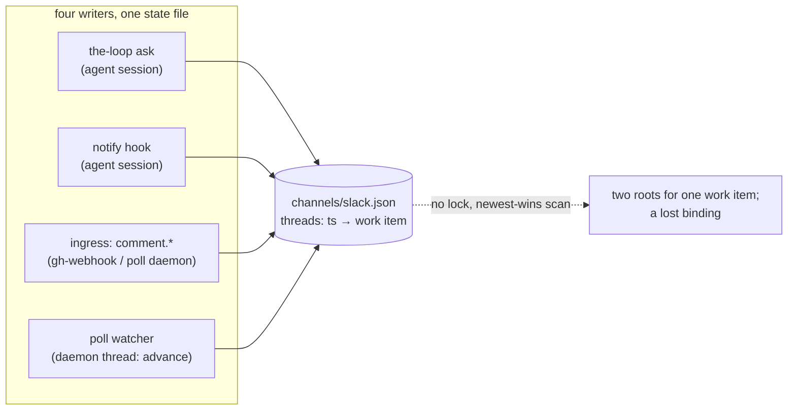

# Requirements: every message about a work item is a reply in its one Slack thread

> Phase 1 of 3 (requirements → design → tasks). Tier 3 (`human-approves-pr`): the change
> lives in `cli/the_loop/channels/` and its tests; no schema, workflow or harness-config
> path (`autonomy.sensitivePaths`) is touched, and no new grant is introduced.

## Introduction

[Issue #312](https://github.com/MadaraUchiha-314/the-loop/issues/312) asks three things of
the Slack channel: that a thread exists for every work item (opened lazily, when the first
event needs delivering), that every later message about that work item is a **reply** in
it, and whether the-loop tracks the channel-and-thread information for a work item at all.

At `2bd6d3b` (13.0.1) the channel is close and not there. `SlackBotChannel.post` reuses a
bound thread when it finds one, so the *second* message is a reply — but the *first*
message is the thread root, so what a member sees at the top of the thread is whichever
event happened to arrive first (a question, a comment, a "done"), not the work item. The
binding is found by scanning a thread-keyed map for the newest entry naming the work item,
and every mutation of that map is an unlocked load → change → save: the webhook daemon's
ingress (`comment.human`), the graph's `notify` hook in the agent's session and `the-loop
ask` are three processes, and the poll watcher is a fourth writer on a background thread.
Two of them delivering the first events for one work item within the same second open
**two** threads, and a `bind` racing an `advance` loses one of the two writes — after
which the work item's messages split across threads. And the only answer to "which thread
is issue 42 in?" is to open `slack.json` and scan it.

This work item makes the thread **the work item's**: a root message that names the work
item, opened once under a lock, every event — the first included — a reply into it, and a
per-work-item conversation record an operator can list.

## Requirements

### Requirement 1 — one thread per work item, opened lazily, opened once

**User story:** As a Slack member following the-loop's channel, I want one thread per work
item whose root says which work item it is, so that I can find and follow a work item
without reading every event.

#### Acceptance criteria (EARS)

1.1 WHEN the Slack channel is enabled AND an event for a work item reaches it AND no
conversation is bound to that work item THEN the channel SHALL open a thread whose root
message names the work item — its ref, and its link when one can be derived from the ref —
and SHALL bind that thread to the work item **before** posting the event.

1.2 The root SHALL be the work item's, never the event's: the event that caused the thread
to open SHALL be posted as the thread's **first reply**, rendered exactly as any later one.

1.3 WHEN a conversation is bound to the work item THEN every event for it SHALL be posted
as a reply into that thread; the channel SHALL NOT post a second top-level message for a
bound work item.

1.4 WHEN two writers — processes or threads — deliver the first events for one work item
concurrently THEN exactly one thread SHALL be opened; the writer that did not open it SHALL
reply into the one that exists. Open-and-bind SHALL be mutually exclusive per state file.

1.5 A thread a member started that became a work item (`work-item.create`, issue-309)
SHALL remain that work item's thread: its binding **is** the conversation, and no root is
opened for it.

1.6 A standing session's thread (issue-277) SHALL follow the same rule: the root names the
session's ref and the announcement is its first reply.

### Requirement 2 — every message about the work item is a reply

**User story:** As an operator, I want everything the-loop says about a work item to land
in that one thread, so that the Slack side reads like the ticket does.

#### Acceptance criteria (EARS)

2.1 Every event type the channel subscribes to SHALL be placed by the same binding lookup
— one code path decides the thread — and every other reply the channel posts for a work
item (the kickoff's confirmation) SHALL go into the thread that lookup would return.

2.2 A reply SHALL carry the same Block Kit the message carries today: header, text,
excerpt, context and the buttons the event earns. Only its placement changes.

2.3 WHEN a reply into a bound thread fails THEN the failure SHALL be recorded
(`channel.post_failed`) and the channel SHALL NOT open another thread for the work item —
a transient failure never splits a conversation.

### Requirement 3 — the conversation is tracked per work item and observable

**User story:** As an operator, I want to ask the-loop which Slack thread a work item is
in, so that I can check on it, link to it, or debug why a message went elsewhere.

#### Acceptance criteria (EARS)

3.1 The channel state SHALL record, per work item: the Slack channel id, the thread ts,
when the conversation was opened, how it was opened (`event` — the-loop opened it for an
event; `kickoff` — a member's top-level message became the work item), and the thread's
permalink when Slack returns one.

3.2 WHEN a thread is opened THEN the-loop SHALL emit `channel.thread_opened` with the
channel, the work item, the thread ts and the origin — ids only, never text.

3.3 `the-loop channels threads` SHALL list every conversation (work item, channel, thread,
opened, origin, link), SHALL accept `--work-item <ref>` to show one, and `--json` for the
records; `the-loop channels status` SHALL count work items with a conversation.

3.4 The record SHALL survive a restart, and a state file written before this work item —
`threads` and `cursors` only — SHALL keep working: its conversations are derived from the
newest binding per work item on load and written in the new shape on the next save.

3.5 The state SHALL stay **local** (issue-245 D4): a thread ts is a handle into one
workspace, and the file SHALL carry ids and timestamps only — no token, no message text.

## Non-functional requirements

- **Cost:** one extra `chat.postMessage` per work item (the root) and one best-effort
  `chat.getPermalink`; nothing per event.
- **Lock hold time:** the exclusive section covers the load, the root post and the save —
  bounded by the SDK's request timeout; a reply is posted outside it.
- **Observability:** the new event type joins `EVENT_TYPES` (the catalog test pins it);
  `channel.posted` is unchanged and still carries the thread.

## Security considerations

- **Actors & trust:** the operator (the config and the state file are theirs); the
  operator's own processes (four writers on one file); Slack members, authorized or not
  (their messages are untrusted); Slack itself (its API answers — a `ts`, a permalink —
  are stored, never interpreted).
- **Trust boundaries & data:** the state file records ids and timestamps; the root message
  renders a ref and a URL derived from that ref. No token, no comment text and no member
  text enters either. A binding is **attribution** (which work item a thread's replies
  belong to), never **authority**: who may speak is still the `slack` ids of
  `routing.authorizedUsers`, checked per reply, unchanged.
- **Abuse cases (EARS):**
  1. WHEN a member posts a top-level message shaped like the-loop's own root (same words,
     same ref) THEN the channel SHALL bind nothing to it — only a post the-loop made, or a
     kickoff that passed the grant and the allow-list, binds a thread.
  2. WHEN an event's text or a member's text contains a ref, a URL or Block Kit markup THEN
     the root SHALL render none of it — the root is built from the bound ref alone.
  3. WHEN Slack's permalink call fails or returns nothing THEN the conversation SHALL still
     be bound with an empty link — a missing nicety never blocks delivery or opens a
     second thread.
  4. WHEN the state file is corrupt THEN the state SHALL load as empty (unchanged) and the
     next post SHALL open a fresh, correctly bound thread rather than crash a daemon.
  5. WHEN the platform has no `flock` THEN the channel SHALL log once and proceed without
     exclusion — today's behaviour, never a refusal to deliver.
- **Fail closed:** no channel id, no token, a disabled or malformed section — every
  existing refusal stands; this work item adds none and removes none.

## Out of scope

- Re-binding a work item to a different thread by command (an operator who deleted a
  thread in Slack deletes the state file, as `docs/cli/state.md` describes).
- A root carrying the issue **title** — it needs a ledger read the channel does not make;
  Slack's GitHub unfurl shows it beside the link.
- Posting the thread's permalink onto the ledger.
- More than one Slack channel per work item.

## Open questions

None raised on the ticket; the three bullets of the issue map onto R1, R2 and R3.

## Review comments

> Appended by the-loop's `record-feedback` hook when a human gate approves with
> comments (issue-109). Append-only and attributed: an approval never silently
> discards a reviewer's suggestions, and the feedback travels with the document
> it concerns rather than living in a side-channel tracker.
