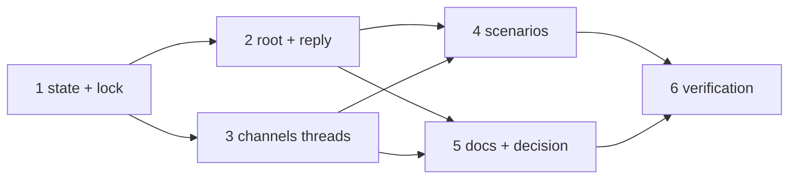

# Tasks: the thread is the work item's

> The last spec artifact. A DAG derived from the design and testing plan; each task names
> the testing-plan row that proves it. TDD: the test first, red, then green.

## Task list

- [x] 1. The state — `channels/state.py`: `conversations` map, `bind(…, origin, permalink)`
  writing both maps, `thread_for` reading it first with the legacy scan + backfill,
  `conversation()`, eviction dropping the conversation, `ChannelState.locked(path)` over
  `<path>.lock` via `runlock.fcntl` (unlocked with one debug line when absent)
  - _Depends on:_ none
  - _Requirements:_ R1.4, R3.1, R3.4, R3.5
  - _Test:_ T1 — `test_channels.py::test_bind_records_the_conversation_per_work_item`, `::test_a_pre_issue_312_state_file_backfills_its_conversations`, `::test_eviction_drops_the_conversation_with_the_thread`, `::test_locked_sections_on_one_path_serialize`; T8 — A5 `::test_without_flock_the_lock_degrades_to_today`
- [x] 2. The root and the reply — `channels/slack.py`: `render_root`, `_open_thread`
  (root → permalink → bind → save → `channel.thread_opened`), `post` replying outside the
  lock, `bind`/`advance`/`advance_kickoff`/kickoff baseline under the lock; `eventlog.py`
  gains `channel.thread_opened`; `inbound.process_kickoff` binds with `origin="kickoff"`
  - _Depends on:_ 1
  - _Requirements:_ R1.1–R1.3, R1.5, R1.6, R2.1–R2.3, R3.2
  - _Test:_ T1 — `test_channels.py::test_the_first_post_opens_a_root_and_replies_into_it`, `::test_the_second_post_is_one_reply`, `::test_a_failed_reply_opens_no_second_thread`, `::test_thread_opened_is_emitted_with_ids_only`, `test_eventlog.py` catalog; T8 — A1 `::test_a_members_root_shaped_message_binds_nothing`, A2 `::test_the_root_is_built_from_the_ref_alone`, A3 `::test_a_failed_permalink_still_binds_the_thread`, A4 `::test_a_corrupt_state_file_opens_a_fresh_thread`
- [x] 3. The command — `commands/channels_cmd.py`: `channels threads [--work-item] [--json]`;
  `status` counting work items
  - _Depends on:_ 1
  - _Requirements:_ R3.3
  - _Test:_ T1 — `test_channels.py::test_channels_threads_lists_and_filters_conversations`, `::test_channels_status_counts_work_items`
- [x] 4. Scenarios and re-pointed tests — the five Gherkin scenarios; existing scenarios
  that indexed `posted[0]` as the event re-pointed at the reply; the standing-session
  scenarios re-pointed (announcement is the first reply)
  - _Depends on:_ 2, 3
  - _Requirements:_ R1.1–R1.6, R2.1, R3.1, R3.3, R3.4
  - _Test:_ T2 — `test_channels_integration.py`, `test_bus_integration.py`, `test_standing_channels_integration.py`; T10 — the legacy-file case
- [x] 5. Docs, capability doc, decision — `docs/cli/commands/channels.md`,
  `docs/cli/state.md`, `docs/config/cli/channels-options.md`,
  `docs/capabilities/channels.md`, `skills/the-loop/reference/collaboration.md`,
  `decision-105` + index row
  - _Depends on:_ 2, 3
  - _Requirements:_ R3.3 (documented), the capability-docs gate
  - _Test:_ T12 — `make check` (markdownlint included)
- [x] 6. Verification — execute `testing-plan.md`, record `evidence/verification.md` and
  `evidence/security-review.md`
  - _Depends on:_ 4, 5
  - _Requirements:_ all
  - _Test:_ T1, T2, T8, T10, T12, T13

## Dependency graph (DAG)

## Checkpoints

After task 1 and after task 2: `test_channels.py` red → green recorded in
`evidence/verification.md`. After task 4: the three integration files green. After task 5:
`make check`. Then the verification node, then the self-review rounds and the security
review gate (`evidence/security-review.md`), then the PR with the reviewer briefing.

## Review comments

> Appended by the-loop's `record-feedback` hook when a human gate approves with
> comments (issue-109). Append-only and attributed: an approval never silently
> discards a reviewer's suggestions, and the feedback travels with the document
> it concerns rather than living in a side-channel tracker.
