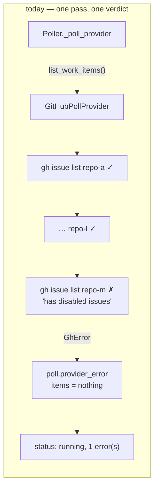

# Bugfix: one repository's failure is that repository's — the poller keeps polling the rest

> Phase 1 of 3 (bugfix → design → tasks). Following the Kiro spec approach
> (https://kiro.dev/docs/specs/). Tier 3 (`human-approves-pr`): the change is confined to
> the poller, its heartbeat and the status surface; no schema, workflow or config file is
> touched, so `inferFromChange` raises nothing.

## Summary

[Issue #315](https://github.com/MadaraUchiha-314/the-loop/issues/315): a fork with GitHub
Issues disabled was added to a `polling.sources[].repos` list beside twelve healthy
repositories, and from that cycle on **nothing was polled** — `items_seen: 0`, no comment
forwarded, no session spawned, for every repository — while `the-loop status` reported
the poller running with a bare `1 error(s)`. A human comment on an open pull request in a
healthy repository sat undelivered for hours. The condition was permanent (Issues are
off until somebody turns them on), and the poller retried into it every cycle,
`will_retry: true`, 199 times.

Three defects compound:

1. **No fault isolation.** The GitHub provider lists every configured repository in one
   pass and lets the first `gh` failure abort the whole pass, so twelve successful
   listings are discarded because a thirteenth failed.
2. **No classification.** "Issues are disabled" is configuration drift, not a transient
   fault, yet it is retried hot every cycle and never surfaced as what it is.
3. **No visibility.** The heartbeat counts errors; it does not say *what* failed or that
   zero repositories were effectively polled, so `status` looked healthy.

## Steps to reproduce

1. Add a repository with GitHub Issues disabled to `polling.sources[].repos`, next to
   healthy repositories with labelled, started work items.
2. `the-loop start` (with `polling.enabled: true`).
3. Every `poll.cycle` reports `items_seen: 0`; `poll.provider_error` carries
   `gh issue list --repo exited 1: the '<owner>/<repo>' repository has disabled issues`;
   comments on the healthy repositories are never forwarded; `the-loop status` shows the
   poller running with `1 error(s)`.

## Expected vs actual

- **Expected:** the twelve healthy repositories are polled as before; the one that
  cannot be listed is reported once, skipped (its pull requests still polled, since
  `gh pr list` does not need Issues), and re-probed slowly; `the-loop status` names it.
- **Actual:** see the log excerpt on the ticket — a whole-provider `poll.provider_error`
  and `items_seen: 0` every cycle, with the poller "running/healthy".

## Root cause (confirmed)

`GitHubPollProvider.list_work_items` (`cli/the_loop/poller/github.py`) is a plain loop
over `self.repos`; each `gh` call raises `GhError` on a non-zero exit, and the exception
propagates out of the loop with the items already collected. `Poller._poll_provider`
(`cli/the_loop/poller/poller.py`) catches it as one `ProviderError`, records
`poll.provider_error` with `will_retry=True`, and returns — correctly refusing to
reconcile closures on a failed listing (issue-159), but also processing none of the
items it never received. The heartbeat (`poller/heartbeat.py`) serialises
`len(summary.errors)` and nothing about which scope failed, so `the-loop status`
(`poller/daemon.py::heartbeat_lines`) can only print a count.

## Requirements

### Requirement 1 — per-scope fault isolation

**User story:** As an operator polling many repositories from one source, I want one
repository's failure to cost me that repository only, so that the others keep working.

1.1 WHEN one repository in a GitHub source cannot be listed THEN the poller SHALL still
process every work item discovered in the source's other repositories in the same cycle
(spawns, comment forwarding, closure reconciliation), exactly as if the failing
repository were not configured.

1.2 WHEN a repository's listing fails THEN the poller SHALL record it per repository —
one event naming the repository and the error — and SHALL count it in the cycle's
`errors`, so a failure is never silent.

1.3 WHEN a repository's listing fails THEN nothing in that repository SHALL be
reconciled as closed in that cycle: a partial listing is not proof anything ended
(issue-159), and that rule now applies per repository rather than per provider.

1.4 The provider contract SHALL express this generically — a source lists in **scopes**,
and a scope can fail on its own — so a future provider (Jira projects) inherits the
isolation without a core change. A provider that cannot be asked at all (no scopes
configured, its binary missing) SHALL still fail as a whole, exactly as today
(`poll.provider_error`).

### Requirement 2 — a permanent condition is classified, surfaced once, and not hot-retried

**User story:** As an operator, I want a repository whose Issues are disabled to be
told to me once and then left alone, so that my log is not the same error every minute
and my pull requests in that repository still reach their sessions.

2.1 WHEN `gh issue list` fails because the repository has disabled Issues THEN the
poller SHALL classify the failure as **permanent** (configuration drift), SHALL surface
it once as a warning-level event naming the repository, and SHALL stop asking that
repository for issues.

2.2 WHILE a repository's issues are skipped THEN its pull requests SHALL still be
polled (`gh pr list` does not depend on Issues), so an open, labelled pull request there
keeps its session.

2.3 The skip SHALL NOT be permanent in the poller's memory: the repository's issues
SHALL be re-probed every `60` cycles (one hour at the default interval), on a hot reload
that rebuilds the sources, and on a restart. A re-probe that still fails SHALL renew the
skip silently (no second warning); one that succeeds SHALL emit a recovery event and
resume normal polling.

2.4 Every other listing failure SHALL stay **transient**: retried on the next cycle,
recorded each time (R1.2), never quarantined. Only the condition `gh` itself names as
"has disabled issues" is classified permanent by this work item.

### Requirement 3 — `status` shows the degradation

**User story:** As an operator, I want `the-loop status` to tell me which repositories
were not polled and why, so that a healthy-looking poller cannot hide a blind spot.

3.1 The heartbeat SHALL carry, per cycle, which scopes failed (with the error and whether
the failure is permanent), which scopes were deliberately skipped (with the reason), and
how many scopes answered.

3.2 WHEN the last cycle had a failed or skipped scope THEN `the-loop status` SHALL print
one `degraded:` line per scope naming it and its reason beneath the `last cycle:` line,
and `--format json` SHALL carry the same facts in `lastCycle`.

3.3 WHEN no scope answered in the last cycle THEN `the-loop status` SHALL say so in
words ("no repository was polled") rather than leave the reader to infer it from
`0 item(s)`.

3.4 The exit code of `status` SHALL be unchanged: it answers "is every enabled service
running", and a degraded poller is running. The degradation is visible, not fatal.

### Requirement 4 — regression tests

4.1 The fix SHALL include tests that fail before it: a two-repository source where one
repository's `gh issue list` reports disabled Issues and the other lists a labelled item
— the item is processed, the failure is recorded per repository, the next cycle skips
that repository's issues and still lists its pull requests, and the heartbeat and
`status` name it.

## Security considerations

No new trust boundary is crossed: the poller reads the same `gh` answers it always did
and writes the same local files. Two things a reviewer should still check:

| # | Abuse case | Boundary | Mitigation |
|---|------------|----------|------------|
| A1 | `gh`'s stderr — which a repository owner can influence through the repository's name — is written into the heartbeat and printed by `status` | provider output → local state file → terminal | The error text was already written to `events.jsonl` verbatim; the heartbeat is the same local, operator-only file class (`docs/cli/state.md`). It is printed as text, never interpreted, and never posted to a ticket or channel by this work item |
| A2 | A repository whose Issues are disabled *by an attacker who controls it* is skipped, hiding its pull requests | classification → skip | The skip covers issues only (R2.2); pull requests keep being listed. And a repository that can turn its own Issues off is one the operator chose to poll |
| A3 | A transient failure misread as permanent parks a healthy repository for an hour | classification | Only `gh`'s own "has disabled issues" message classifies (R2.4); everything else is retried next cycle. A misclassified repository is visible in `status` and recovers on the re-probe, a reload or a restart |
| A4 | Isolation lets a partial listing close sessions | listing → reconciliation | R1.3: reconciliation is skipped for every failed or skipped scope, so the issue-159 guarantee is kept at the finer grain |

Fail-closed direction: under doubt a scope is *not* reconciled and *not* quarantined.

## Out of scope

- **A channel notification for the degradation.** The bus catalogue (`subscribe`) is a
  documented vocabulary in the CLI-config schema — a sensitive path — and the event log,
  the once-surfaced warning and `status` cover the ticket's ask. A subscriber-facing
  `poll.degraded` event is a follow-up if an operator wants it in Slack.
- **Classifying other permanent conditions** ("Could not resolve to a Repository", a
  revoked token). A 404 is also what an expired credential looks like; without a
  reproduced case each stays transient and isolated (R2.4).
- **Per-kind reconciliation inside a degraded repository.** A pull-request session in a
  repository whose issues are skipped is not reconciled until the repository recovers —
  a refusal to close, never a wrong close (R1.3).
- **The webhook ingress.** It receives per-repository deliveries and has no listing to
  isolate.

## Open questions

None — the ticket states the expected behaviour in full.
