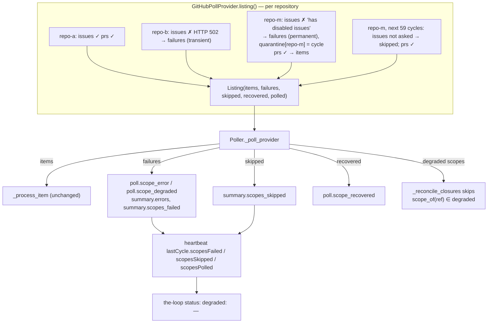

# Design: a source lists in scopes, a scope fails alone, and the heartbeat names it

> Phase 2 of 3. Derived from `bugfix.md`; reviewed together with `testing-plan.md`.

## Overview

Three small changes, one per defect. The provider contract gains a **`Listing`** — items
plus the scopes that failed, were skipped or recovered — and the poller core consumes it
instead of a bare item list. The GitHub provider fills it **per repository**, classifying
`gh`'s "has disabled issues" as permanent and keeping a per-repository quarantine that is
re-probed slowly. The heartbeat serialises the scope facts and `the-loop status` renders
them as `degraded:` lines.



## Architecture

### 1. The contract — `poller/base.py`

```python
@dataclass(frozen=True)
class ScopeFailure:
    scope: str            # provider vocabulary: "[host/]owner/repo" for GitHub
    error: str            # what failed, or why it is skipped
    permanent: bool = False

@dataclass
class Listing:
    items: List[WorkItem]
    failures: List[ScopeFailure]   # this cycle's listing failures
    skipped: List[ScopeFailure]    # standing conditions: not asked this cycle
    recovered: List[str]           # scopes a re-probe brought back
    polled: List[str]              # scopes that answered (fully or partly)
    degraded -> set[str]           # failures ∪ skipped, by scope

class PollProvider:
    def listing(self) -> Listing:        # default: Listing(items=self.list_work_items())
    def scope_of(self, ref) -> str:      # default: "" — an unscoped provider
```

`listing()` is what the core calls. A provider that does not override it keeps today's
all-or-nothing behaviour — `FakeProvider` in the tests, a future provider that has not
learned scopes — and a `ProviderError` raised from it still means "the provider could not
be asked at all". `list_work_items()` stays as the strict form: the GitHub provider
defines it as `listing()` with any failure or skip re-raised, so every existing caller and
test keeps its semantics.

### 2. The GitHub provider — `poller/github.py`

- `listing()` walks `self.repos`; per repository it lists issues, then pull requests,
  each in its own `try`. A `GhError` becomes a `ScopeFailure(scope, str(exc))` and the
  loop continues. `scope` is `RepoSpec.gh_repo.lower()`, the same string `owns()` compares.
- **Quarantine.** `_issues_off: Dict[scope, cycle]` and a cycle counter. An issue listing
  whose error contains `has disabled issues` marks the scope permanent: first sighting →
  `failures` with `permanent=True`; while `cycle - since < 60` → `skipped` with the
  standing reason and **no `gh issue list` call**; at 60 → re-probe; success → `recovered`
  and the entry dropped; failure → the entry renewed and the scope back in `skipped` (not
  `failures`, so no second warning). Pull requests are listed regardless.
- `scope_of(ref)` returns the ref's repository in the same spelling, `""` for a ref on
  another provider.
- Why in-memory: a hot reload rebuilds the providers (`build_plan`) and a restart starts
  fresh — both are exactly the moments the ticket's workaround showed recovery is wanted.
  A durable ledger would add a file to `state.py` for a fact worth one hour of memory.

### 3. The core — `poller/poller.py`

`_poll_provider` calls `provider.listing()`; the `ProviderError` path is unchanged. Then,
before processing items:

| Listing field | Log | Event | Summary |
|---|---|---|---|
| `failures`, transient | `error` | `poll.scope_error` (`scope`, `provider`, `error`, `will_retry=True`) | `errors` + `scopes_failed` |
| `failures`, permanent | `warning` | `poll.scope_degraded` (`scope`, `provider`, `error`, `retry_after_cycles=60`) | `errors` + `scopes_failed` |
| `skipped` | — (debug) | — | `scopes_skipped` |
| `recovered` | `info` | `poll.scope_recovered` (`scope`, `provider`) | — |
| `polled` | — | — | `scopes_polled` |

`_reconcile_closures` gains a `degraded: set` argument and skips any active session whose
`provider.scope_of(ref)` is in it (R1.3). `PollSummary` gains `scopes_failed`,
`scopes_skipped` (lists of `ScopeFailure`) and `scopes_polled: int`. The cycle log line
gains `, N scope(s) degraded` when either list is non-empty.

### 4. The heartbeat and `status` — `poller/heartbeat.py`, `poller/daemon.py`

`_counters` adds `scopesPolled` (int), `scopesFailed` and `scopesSkipped` (lists of
`{scope, error, permanent}`), read duck-typed like the rest. `heartbeat_lines` appends,
after the `last cycle:` line:

```text
degraded:   no repository was polled — every listing failed          # scopesPolled == 0 and scopesFailed
degraded:   octo/repo-b — listing failed, retried next cycle: gh issue list --repo exited 1: HTTP 502
degraded:   octo/repo-m — issues are disabled on this repository; its issues are skipped and re-probed every 60 cycles, its pull requests are still polled
```

`describe_cycle` is unchanged, so the existing `status` assertions hold byte-for-byte for
a cycle with no degraded scope. `status_all` already copies `lastCycle` wholesale into the
JSON row, so R3.2's JSON half needs no change.

## Components & interfaces

| Component | Change | Contract |
|---|---|---|
| `poller/base.py` | `ScopeFailure`, `Listing`, `PollProvider.listing`, `PollProvider.scope_of` | additive; defaults reproduce today |
| `poller/github.py` | `listing`, `_list_scope`, `_issues_off`, `scope_of`; `list_work_items` = strict `listing` | `list_work_items` raises exactly when it did before |
| `poller/poller.py` | `_poll_provider` consumes a `Listing`; `_reconcile_closures(…, degraded)`; `PollSummary` fields | `PollSummary.errors` unchanged in shape |
| `poller/heartbeat.py` | three new `lastCycle` keys | older heartbeats read as before (missing keys → empty) |
| `poller/daemon.py` | `heartbeat_lines` degraded lines | `describe_cycle` unchanged |
| `eventlog.py` | `poll.scope_error`, `poll.scope_degraded`, `poll.scope_recovered` in the catalogue | parity test |
| `poller/__init__.py` | re-export `Listing`, `ScopeFailure` | — |

## UI/UX design

N/A — a CLI daemon and a status line.

## Data models

`lastCycle` in `<state.root>/poll-status.json`:

```json
{
  "itemsSeen": 24, "spawns": 0, "commentsForwarded": 1,
  "closures": 0, "failures": 0, "errors": 1, "interrupted": false,
  "scopesPolled": 12,
  "scopesFailed": [{"scope": "octo/repo-m", "error": "gh issue list --repo exited 1: …", "permanent": true}],
  "scopesSkipped": []
}
```

## Error handling

- A `GhError` from any listing is caught per scope; nothing else is caught — a `GhError`
  from `list_comments` inside `_process_item` stays an item error, as today.
- A provider raising from `listing()` is the whole-provider failure it always was.
- The heartbeat serialises lists with `getattr` defaults, so a `PollSummary` from a test
  double without the new fields still writes.
- The permanent classifier is a substring test on `gh`'s message. If GitHub rewords it,
  the failure degrades to transient (retried, isolated, visible) — never to silence.

## Security design

- **A1 — error text in the heartbeat.** Written by the same atomic writer, into the same
  operator-local file class as the event log; rendered as plain text by `status`, never
  interpreted, never posted outward. No redaction is added because the text is `gh`'s
  own and was already logged.
- **A2 — a skip hides work.** The quarantine is per *kind*: only `gh issue list` is
  withheld; `gh pr list` runs every cycle for a quarantined repository.
- **A3 — misclassification.** One exact condition classifies; the re-probe, the hot
  reload and the restart bound the damage to one hour, and `status` shows it meanwhile.
- **A4 — partial listing closes sessions.** `_reconcile_closures` is handed the degraded
  scopes and skips their sessions before asking the provider anything.

## Testing strategy

Unit tests on the provider (`listing`, quarantine timeline, `scope_of`, the strict form),
on the core (isolation, per-scope events, reconciliation skip, summary fields), on the
heartbeat (round trip with the new keys, older heartbeats) and on `status` (degraded lines,
JSON). One Gherkin integration scenario drives the real provider with a two-repository
`gh` double through the ticket's exact sequence. Full matrix in `testing-plan.md`.

## Alternatives considered

| Alternative | Why not |
|---|---|
| Keep `list_work_items() -> List[WorkItem]` and log per-repository failures inside the provider | The core would not know which scopes failed, so it could neither count them nor keep them out of reconciliation (R1.3), and `status` could not name them (R3) |
| Raise a `PartialListingError` carrying the items | An exception as a return value: every caller would have to catch to get results, and the strict/lenient split would be invisible in the signature |
| Drop a quarantined repository from `self.repos` | Loses its pull requests (R2.2) and can only recover on restart |
| A durable quarantine under `state.root` | One more generated path (`state.py`, the state doc, its parity test) for a fact a reload should forget anyway |
| Re-probe on a wall-clock interval | Time-based state is harder to test and no more useful; 60 cycles is one hour at the default interval and scales with the operator's `intervalSeconds` |
| Flip `status`'s exit code when degraded | The exit code is the documented keepalive primitive ("every enabled service is running"); a degraded poller is running, and flipping it would restart a poller that would degrade identically |

Decision record: [`decision-106`](../../decisions/decision-106.md).
