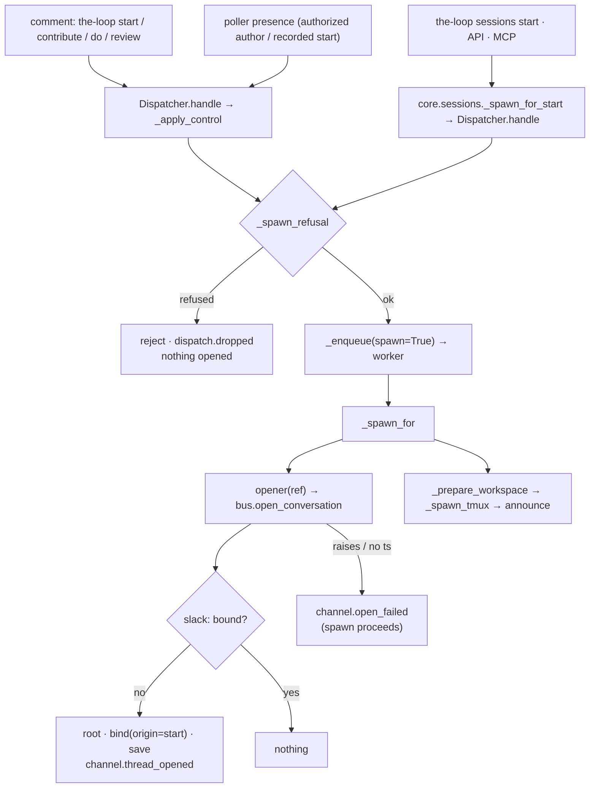

# Design: the start opens the conversation — one seam on the spawn path

> Phase 2 of 3. Derived from [`requirements.md`](requirements.md); reviewed together with
> [`testing-plan.md`](testing-plan.md). Tier 3.

## Overview

Four moves, all small, on the shape issue-309 and issue-312 already built:

1. **A channel can `open` a conversation.** `SlackBotChannel.open(work_item)` is
   issue-312's open-and-bind without the reply: under the lock, bound → return it;
   unbound → post the root, bind with origin `start`, save, emit `channel.thread_opened`.
   The GitHub ledger has no `open` — the issue is its conversation.
2. **The bus opens on every channel.** `bus.open_conversation(work_item, cli_config)` loads
   the enabled channels and calls `open` on each that is `Conversational` (a
   `runtime_checkable` protocol beside `Channel` in `base.py`), best-effort per channel;
   a failure is a `PostResult` and a `channel.open_failed` line, never an exception.
3. **The dispatcher calls it at the top of the spawn path.** `Dispatcher` takes an
   injected `opener` (a callable taking the ref), called first thing in `_spawn_for` —
   after every refusal, before the workspace checkout, on the work item's own worker.
4. **The daemons and the facade wire it.** `channels.publishers.conversation_opener`
   builds the opener over a config getter (the comment publisher's shape, so a reload is
   honoured); `gh-webhook`, `poll` and the core facade's `_build_dispatcher` pass it.



## 1. The channel — `channels/slack.py`

```python
def open(self, work_item: str) -> PostResult:
    """Open the work item's thread now, or return the one it has (issue-317)."""
    if not self.config.channel: raise ChannelError(…)      # as post()
    client = self._client()                                  # token at call time, as post()
    with ChannelState.locked(self.state_path) as state:
        bound = state.thread_for(work_item)
        if not bound:
            bound = self._open_thread(client, state, work_item, origin="start")
        elif state.backfilled:
            state.save(self.state_path)
    return PostResult(channel=self.name, ok=True, thread=bound[1])
```

- **`_open_thread` gains `origin`** (default `"event"`, so `post` is unchanged) and passes
  it to `state.bind` and to `channel.thread_opened`. Nothing else in the root path moves:
  `render_root`, the permalink, the lock, the save.
- **No reply.** A start posts the root and stops; R1.2. The first subscribed event finds
  the binding and replies (issue-312 `post`, unchanged).
- **The failure vocabulary is `post`'s:** no channel id and no token raise `ChannelError`
  before any call; a root that fails to post raises `ChannelError` and binds nothing.

## 2. The state — `channels/state.py`

`CONVERSATION_ORIGINS` gains `"start"`. `_record` already coerces an unknown origin to
`event`, so a file written by this version and read by 13.1.1 would show `event` — the
safe direction. `channels threads` prints the origin column as before.

## 3. The bus — `channels/bus.py`

```python
def open_conversation(work_item, cli_config=None, *, channels=None, client_factory=None) -> List[PostResult]
```

For every loaded channel that is `Conversational`: call `open`; `ChannelError` and any other
exception become `PostResult(ok=False, error=…)` plus `channel.open_failed`
(`channel`, `work_item`, `error`); a success emits nothing here — a fresh open already
emitted `channel.thread_opened` from the channel, and an idempotent one is silent. The
ledger is not loaded: it has no conversation to open (R1.6). An empty `work_item` opens
nothing.

## 4. The opener — `channels/publishers.py`

```python
def conversation_opener(config_getter) -> Callable[[str], None]
```

The comment publisher's twin: reads the CLI config per call; a getter that raises opens
nothing; no `channels` section → return without building anything; otherwise
`open_conversation(ref, cli_config)`; never raises.

## 5. The dispatcher — `webhook/dispatcher.py`

- `Dispatcher.__init__(…, opener: Optional[Callable[[str], None]] = None)` → `self.opener`.
  Injected like the announcer; it reads config per call, so `reload` leaves it alone.
- `_spawn_for` calls `self._open_conversations(work_item)` right after its adapter check
  and **before** `_prepare_workspace`: `opener is None` → no-op; otherwise call it inside
  `try/except Exception` with `logger.exception` — belt and braces over an opener that
  already never raises. Before the checkout, so the thread appears when the start is
  accepted rather than after a clone (R1.1); after every refusal (`_spawn_refusal` upstream,
  the missing-adapter check in the method) so a refused start opens nothing (R1.4).
- Not called from `_respawn_tmux` (a dead session's respawn: the conversation exists or
  the next event opens it) nor from `_apply_control`'s live-session branch (R1.3, out of
  scope).

## 6. The wiring

| Builder | Opener |
|---------|--------|
| `webhook/daemon._build_routing` | `conversation_opener(lambda: load_cli_config(_config_path()))` — beside the router's publisher |
| `poller/daemon._build_dispatcher(routing_map, layout, cli_config_getter=None)` | the same default getter; the poller and the facade both build through it |
| `core/sessions._dispatcher_for(config, …)` | passes `lambda: dict(config)` when it was handed a config, else `None` (the file) — the `_routing` rule: never overrule a caller's explicit config |

## 7. Observability — `eventlog.py`

| Event | Fields | When |
|-------|--------|------|
| `channel.thread_opened` | `origin` may now be `start` | a start opened the root |
| `channel.open_failed` | `channel`, `work_item`, `error` | a start could not open a channel's conversation; the spawn proceeded |

## 8. Documentation

`docs/capabilities/channels.md` (current behaviour + history row),
`docs/capabilities/interactive-sessions.md` (the spawn now opens the channels; history
row), `docs/cli/commands/channels.md` (§ One thread per work item),
`docs/cli/commands/sessions.md` (the `start` bullet), `docs/cli/state.md` (the `start`
origin), `docs/config/cli/channels-options.md` (the thread paragraph),
`skills/the-loop/reference/collaboration.md` (one clause), `decision-107` + index row.

## UI/UX design

N/A — a CLI daemon and a Slack bot; the root's Block Kit is issue-312's, asserted
structurally there.

## Data models

`conversations` record, unchanged in shape; one more origin value:

```json
{ "github:o/r#7": { "channel": "C123", "thread": "1700.000001",
                    "opened": "2026-09-03T10:00:00Z", "origin": "start", "permalink": "" } }
```

## Error handling

| Failure | Behaviour |
|---------|-----------|
| no `channels` section / channel disabled | opener returns before loading anything; spawn unchanged |
| no channel id / no token | `ChannelError` → `channel.open_failed`; spawn unchanged; the next event retries |
| root post fails / no `ts` | `ChannelError` → `channel.open_failed`; nothing bound |
| permalink fails | logged at debug; `permalink: ""` (issue-312 A3) |
| config getter raises | opener logs at debug and returns |
| opener raises anyway | caught in `_open_conversations`, logged; spawn unchanged |
| corrupt state file | loads empty; a fresh thread is opened and bound |

## Security design

- **AuthN/AuthZ:** unchanged. The open sits after `_spawn_refusal` — the arming check, the
  actor's authorization, the collaborator no-spawn rule, the spawn policy — so only a start
  the dispatcher would act on reaches it. A conversation attributes replies; the member
  allow-list authorizes them, per reply, as before.
- **Input validation & injection surfaces:** the opener receives `work_item.ref` — the
  router's own extraction, never payload text — and the root is `render_root(ref, url)`
  with no text input (issue-312 A2 stands). No event payload field is read.
- **Secrets handling:** the token is read at call time inside the channel, as for `post`;
  it never enters the state file, the event log or a log line.
- **Least privilege:** the same scopes (`chat:write`); no new API call.
- **Fail-closed behaviour:** every existing refusal is reached first; an open that fails
  binds nothing and changes nothing about the spawn.
- **Abuse-case coverage:**

| # | Abuse case | Mechanism | Negative test |
|---|------------|-----------|---------------|
| A1 | an unauthorized start | `_apply_control` refuses before `_on_unmatched`; the opener is on `_spawn_for` only | `test_an_unauthorized_start_opens_no_thread` |
| A2 | a start on an unarmed work item | `_spawn_refusal` → `spawn-policy`; never enqueued | `test_a_refused_start_opens_no_thread` |
| A3 | the channel raises / no ts | `open_conversation` catches → `channel.open_failed`; `_spawn_for` proceeds | `test_a_channel_outage_never_fails_the_spawn` |
| A4 | payload text reaching the root | the opener is handed the ref; `render_root` has no text input | `test_the_opener_is_handed_the_ref_alone` |
| A5 | corrupt state | `ChannelState.load` → empty; a fresh root is bound | `test_a_corrupt_state_file_still_opens_on_start` |

## Testing strategy

Unit tests on the channel's `open` (root, no reply, idempotent, failures), the bus's
`open_conversation` (every opening channel, the ledger skipped, a failure a result), the
opener (config per call, no section → nothing) and the dispatcher seam (called once on
spawn, before the checkout, not on refusal, never raising) in `test_channels.py`,
`test_bus.py` and `test_control_integration.py`; scenario tests in
`test_channels_integration.py` with the SDK client faked at the process boundary:
`Scenario: A start opens the work item's thread before any event`, `Scenario: A refused
start opens no thread`, `Scenario: A restarted work item keeps its thread`, `Scenario: A
Slack outage never fails the spawn`. The executable detail is in `testing-plan.md`.

## Trade-offs & decisions

[`decision-107`](../../decisions/decision-107.md): the open is a channel operation on the
spawn path, not a bus event (an event would be subscribe-gated and would leave a reply
nobody asked for); it runs before the checkout, not beside the announcement (the thread is
the point, and a failed spawn's thread is harmless — the retry reuses it); the ledger opens
nothing (the issue is the conversation).

## Open questions

None.

## Review comments

> Appended by the-loop's `record-feedback` hook when a human gate approves with
> comments (issue-109). Append-only and attributed: an approval never silently
> discards a reviewer's suggestions, and the feedback travels with the document
> it concerns rather than living in a side-channel tracker.
