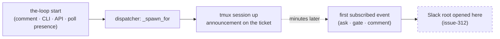

# Requirements: a work item's channel conversation opens when the work item starts

> Phase 1 of 3 (requirements → design → tasks). Tier 3 (`human-approves-pr`): the change
> lives in `cli/the_loop/channels/`, one seam of `cli/the_loop/webhook/dispatcher.py`,
> the two daemons' wiring and their tests; no schema, workflow or harness-config path
> (`autonomy.sensitivePaths`) is touched, and no new grant is introduced.

## Introduction

[Issue #317](https://github.com/MadaraUchiha-314/the-loop/issues/317) asks that the
Slack thread — "or whatever is the equivalent for the channel" — exist for a work item
**as soon as `the-loop start` happens on it**, instead of being opened lazily by the first
event that needs delivering.

At `f56a71f` (13.1.1) the thread is the work item's (issue-312): a root that names the
work item, opened once under a lock, every event a reply. But it is opened **by the first
event**: a member following the channel sees nothing for a started work item until the
agent asks a question, a gate needs an approval, or a subscribed comment lands — which on
a work item whose first phase is `phase-selection` can be many minutes after the session
came up. Meanwhile the ticket already carries the announcement comment ("the-loop started
an interactive session for …"); the Slack side is silent, and an operator wanting to link
the thread from the ticket, or to say something in it before the agent does, has no thread
to link or reply in.

This work item moves the opening to the start: the dispatcher's one spawn path — which
every way of starting a work item converges on — asks every configured channel to open
its conversation for the work item before the harness runs, and the first event then
replies into a thread that already exists.

## Requirements

### Requirement 1 — a start opens the conversation on every configured channel

**User story:** As a Slack member following the-loop's channel, I want a work item's
thread to appear the moment the work item is started, so that I can find it, link it and
speak in it before the agent's first message.

#### Acceptance criteria (EARS)

1.1 WHEN a session is spawned for a work item — however the start was issued: an
authorized user's `the-loop start` / `contribute` / `do` / `review` comment, `the-loop
sessions start`, the control plane's start route, or the poller's presence spawn for an
authorized author — AND a channel is enabled THEN the-loop SHALL open that channel's
conversation for the work item **before** the harness is launched, and SHALL NOT wait for
an event to do so.

1.2 The opened conversation SHALL be the one issue-312 defines: a root that names the work
item (its ref, and its link when one can be derived), bound under the channel's lock, with
**no reply** — a start posts nothing but the root.

1.3 WHEN the work item already has a conversation on the channel THEN the start SHALL open
nothing and post nothing (idempotent): a restarted work item, a work item bound by a
kickoff, and a work item whose first event already opened a thread all keep their thread.

1.4 WHEN a start is refused — the work item is not armed, the actor is not authorized, the
spawn policy refuses, or the dispatcher has no adapter — THEN no conversation SHALL be
opened: opening happens on the spawn path only, after every refusal.

1.5 Opening SHALL be best-effort by contract: a channel that is unreachable, misconfigured
or raising SHALL NOT fail, delay beyond one request or change the outcome of the spawn;
the failure SHALL be recorded (`channel.open_failed`) and the next event SHALL open the
thread lazily as before.

1.6 WHEN a channel has no conversation to open THEN it SHALL be skipped: the GitHub ledger's
conversation **is** the work item, so a start opens nothing there; a standing session
(issue-277) already opens its thread when it comes up and is unchanged.

1.7 Every later event for the work item SHALL reply into the thread the start opened
(issue-312 R1.3 stands): the first subscribed event is the thread's first reply.

### Requirement 2 — the start-opened conversation is observable

**User story:** As an operator, I want to see that a thread was opened by a start rather
than by an event, so that I can tell the two apart when debugging where a message went.

#### Acceptance criteria (EARS)

2.1 A conversation a start opened SHALL be recorded with origin `start` beside the existing
`event`, `kickoff` and `legacy`, and `the-loop channels threads` SHALL list it as such.

2.2 WHEN a start opens a thread THEN `channel.thread_opened` SHALL be emitted with
`origin: start` — ids only, never text. WHEN a start cannot open one THEN
`channel.open_failed` SHALL be emitted with the channel, the work item and the error.

### Requirement 3 — one seam, every entry point

**User story:** As an embedder of the SDK, I want the opening to be an injectable seam on
the dispatcher, so that my configuration is honoured and my tests can observe it.

#### Acceptance criteria (EARS)

3.1 The bus SHALL be the only caller of a channel's `open`, exactly as it is of `post`
(decision-103): the dispatcher SHALL call an injected opener, and the opener SHALL read the
CLI config per call so a reload is honoured, as the comment publisher does.

3.2 Both daemons (`gh-webhook`, `poll`) and the core facade's own dispatcher (`the-loop
sessions start`, the control plane's start route, the MCP tool) SHALL wire the opener; the
facade SHALL pass the config it was given rather than re-reading the default path.

3.3 A dispatcher built without an opener (tests, embedders that opted out) SHALL open
nothing and behave exactly as at 13.1.1.

## Non-functional requirements

- **Cost:** one `chat.postMessage` (the root) and one best-effort `chat.getPermalink` per
  work item, moved earlier — not added: the first event no longer pays them.
- **Latency:** the open runs on the work item's own dispatch worker, before the workspace
  checkout; bounded by the SDK's request timeout, and it never holds the channel lock
  across the Slack call longer than issue-312 already does.
- **Observability:** `channel.open_failed` joins `EVENT_TYPES` (the catalog test pins it);
  `channel.thread_opened` gains the `start` origin.

## Security considerations

- **Actors & trust:** authorized users (`routing.authorizedUsers`, the only people whose
  start is applied); strangers who comment a keyword (refused before any spawn); the
  operator's own daemons and CLI (trusted, they hold the config); Slack (its `ts` and
  permalink are stored, never interpreted).
- **Trust boundaries & data:** the root is built from the work item's ref and a URL derived
  from it — the same `render_root` as issue-312, with no text input; nothing from the
  spawning event's payload reaches the channel. The opener reads the CLI config the daemon
  already trusts. A conversation is **attribution**, never **authority**: who may speak in
  the thread is still the member allow-list, checked per reply.
- **Abuse cases (EARS):**
  1. WHEN an unauthorized user comments the start keyword THEN no session SHALL spawn and no
     conversation SHALL be opened — the refusal precedes the spawn path.
  2. WHEN a start is refused because the work item is not armed THEN no conversation SHALL be
     opened, so a refused start leaves nothing standing on any channel either.
  3. WHEN the channel raises, times out or returns no `ts` THEN the spawn SHALL proceed
     unchanged and the failure SHALL be recorded; nothing is bound.
  4. WHEN the spawning event's payload carries text, a URL or Block Kit markup THEN none of
     it SHALL reach the root — the opener is handed the ref alone.
  5. WHEN the channel state file is corrupt THEN the state SHALL load as empty (unchanged)
     and the start SHALL open a fresh, correctly bound thread.
- **Fail closed:** no `channels` section, a disabled or malformed channel, no channel id, no
  token — every existing refusal stands and the opener does nothing; this work item adds
  no grant and widens no authorization.

## Out of scope

- A first reply announcing the session in the thread (the ticket's announcement comment
  reaches the thread through `comment.agent` when subscribed).
- Opening a conversation on a `the-loop start` that finds a live session (`effect: noop` /
  `resumed`): no spawn, no open; the next event opens it lazily if none exists.
- A `work-item.started` bus event (see decision-107 for why the open is not an event).
- Posting the thread's permalink onto the ticket.

## Open questions

None raised on the ticket; the two bullets of the issue map onto R1 and R3.

## Review comments

> Appended by the-loop's `record-feedback` hook when a human gate approves with
> comments (issue-109). Append-only and attributed: an approval never silently
> discards a reviewer's suggestions, and the feedback travels with the document
> it concerns rather than living in a side-channel tracker.
