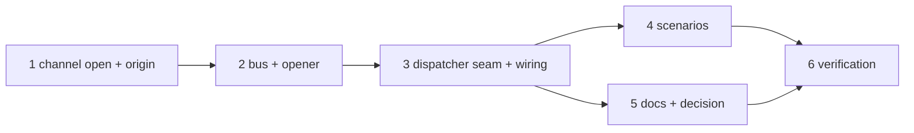

# Tasks: the start opens the conversation

> The last spec artifact. A DAG derived from the design and testing plan; each task names
> the testing-plan row that proves it. TDD: the test first, red, then green.

## Task list

- [x] 1. The channel and the state — `channels/slack.py`: `open(work_item)`, `_open_thread(…, origin)`;
  `channels/state.py`: `CONVERSATION_ORIGINS` + `start`; `eventlog.py`: `channel.open_failed`,
  the `thread_opened` description
  - _Depends on:_ none
  - _Requirements:_ R1.2, R1.3, R1.5, R2.1, R2.2
  - _Test:_ T1 — `test_channels.py::test_open_posts_the_root_alone_and_binds_with_origin_start`, `::test_open_is_idempotent_for_a_bound_work_item`, `::test_open_fails_closed_like_post`, `::test_a_failed_open_binds_nothing`; T10 — `::test_an_unknown_origin_is_coerced_to_event`; `test_eventlog.py` catalog
- [x] 2. The bus and the opener — `channels/bus.py`: `open_conversation`; `channels/publishers.py`:
  `conversation_opener`
  - _Depends on:_ 1
  - _Requirements:_ R1.5, R1.6, R2.2, R3.1
  - _Test:_ T1 — `test_bus.py::test_open_conversation_opens_on_every_channel_that_can_and_skips_the_ledger`, `::test_a_failing_open_is_a_result_and_an_event_never_an_exception`, `::test_the_daemon_opener_reads_the_config_per_call_and_needs_a_channels_section`
- [x] 3. The dispatcher seam and the wiring — `webhook/dispatcher.py`: `opener`,
  `_open_conversations` at the top of `_spawn_for`; `webhook/daemon.py`, `poller/daemon.py`
  (`_build_dispatcher(cli_config_getter)`), `core/sessions._dispatcher_for`
  - _Depends on:_ 2
  - _Requirements:_ R1.1, R1.4, R3.2, R3.3
  - _Test:_ T1 — `test_control_integration.py::test_a_start_opens_the_conversation_once_before_the_checkout`, `::test_a_refused_start_opens_no_thread`, `::test_an_unauthorized_start_opens_no_thread`, `::test_a_raising_opener_never_fails_the_spawn`, `::test_the_opener_is_handed_the_ref_alone`; `test_core_sessions.py::test_the_facade_dispatcher_opens_with_the_config_it_was_given`
- [x] 4. Scenarios — the four Gherkin scenarios in `test_channels_integration.py`
  - _Depends on:_ 3
  - _Requirements:_ R1.1–R1.5, R1.7, R2.1
  - _Test:_ T2; T8 — A3 `::test_a_channel_outage_never_fails_the_spawn`, A5 `test_channels.py::test_a_corrupt_state_file_still_opens_on_start`
- [x] 5. Docs, capability docs, decision — `docs/capabilities/channels.md`,
  `docs/capabilities/interactive-sessions.md`, `docs/cli/commands/channels.md`,
  `docs/cli/commands/sessions.md`, `docs/cli/state.md`, `docs/config/cli/channels-options.md`,
  `skills/the-loop/reference/collaboration.md`, `decision-107` + index row
  - _Depends on:_ 3
  - _Requirements:_ the capability-docs gate
  - _Test:_ T12 — `make check` (markdownlint included)
- [x] 6. Verification — execute `testing-plan.md`, record `evidence/verification.md` and
  `evidence/security-review.md`
  - _Depends on:_ 4, 5
  - _Requirements:_ all
  - _Test:_ T1, T2, T8, T10, T12, T13

## Dependency graph (DAG)

## Checkpoints

After task 1 and after task 3: the named tests red → green recorded in
`evidence/verification.md`. After task 4: the integration files green. After task 5:
`make check`. Then the verification node, then the self-review rounds and the security
review gate (`evidence/security-review.md`), then the PR with the reviewer briefing.

## Review comments

> Appended by the-loop's `record-feedback` hook when a human gate approves with
> comments (issue-109). Append-only and attributed: an approval never silently
> discards a reviewer's suggestions, and the feedback travels with the document
> it concerns rather than living in a side-channel tracker.
