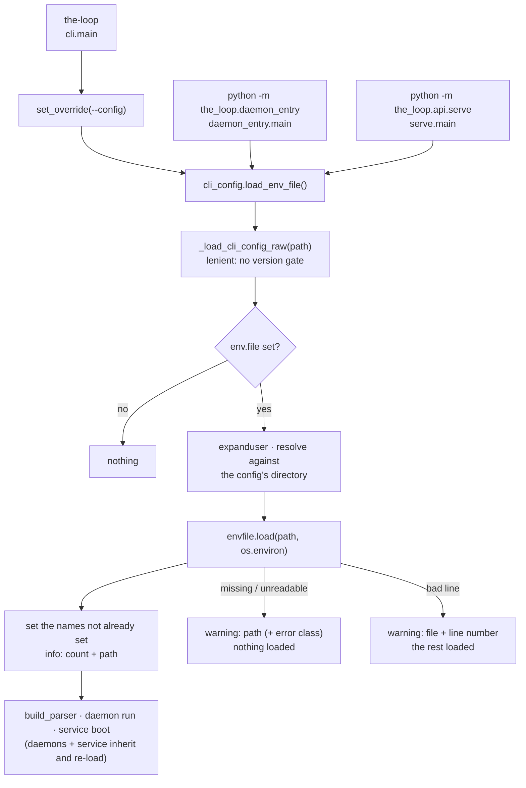

# Design: one stdlib loader, called first by every process entry point

> Phase 2 of 3. Derived from [`requirements.md`](requirements.md); reviewed together with
> [`testing-plan.md`](testing-plan.md). Tier 3.

## Overview

Three moves:

1. **A stdlib dotenv loader** — `cli/the_loop/envfile.py`: `parse` (text → values and
   the numbers of the lines it skipped) and `load` (a path into a mapping, never
   overwriting). No dependency: PyYAML stays the CLI's only one (decision-038).
2. **One resolver on the CLI config** — `cli_config.load_env_file()`: resolves the config
   path as every command does, reads the file **leniently** (no version gate), takes
   `env.file`, resolves it against the config's directory, and calls `envfile.load`.
3. **Every process entry point calls it first.** `cli.main` (right after the `--config`
   pre-scan, before the parser is built — commands compute flag defaults from the config
   and may read the environment doing so), `daemon_entry.main`, and `api/serve.main`.
   The processes `the-loop start` spawns inherit the CLI's environment *and* load the
   file again on their own start, so a unit that runs `daemon_entry` directly sees the
   same variables.



## 1. The loader — `envfile.py`

```python
NAME_RE = re.compile(r"[A-Za-z_][A-Za-z0-9_]*")

@dataclass(frozen=True)
class ParseResult:
    values: Dict[str, str]      # in file order; a later duplicate wins
    invalid_lines: Tuple[int, ...]  # 1-based line numbers that were skipped

def parse(text: str) -> ParseResult: ...

@dataclass(frozen=True)
class LoadResult:
    path: Path
    loaded: Tuple[str, ...]     # names set by this call
    skipped: Tuple[str, ...]    # names already present, left alone
    invalid_lines: Tuple[int, ...]

def load(path: Path, environ: MutableMapping[str, str]) -> Optional[LoadResult]: ...
```

`parse`, per line: strip; empty or `#` → ignored; a leading `export` keyword → dropped; split on
the first `=`; the name must match `NAME_RE` in full, else the line number is recorded
and the line skipped; the value: `"…"` → the text up to the closing unescaped quote, with
`\n \t \r \\ \"` unescaped; `'…'` → literal to the closing quote; otherwise trimmed, cut
at the first comment (a space, then `#`). An unterminated quote is invalid. No interpolation, no multi-line
values. The parser reads a string and returns a value; it never touches the environment.

`load`: `None` (with a warning naming the path) when the path is not a regular file or
cannot be read; otherwise the file's mode is checked (`stat().st_mode & 0o077` on POSIX →
one warning), the text parsed, and each name **absent** from `environ` set. Warnings name
the path, the line numbers and the error class; never a value, never a line's text.

## 2. The resolver — `cli_config.py`

```python
def resolve_env_file(config: Mapping, config_path: Path) -> Optional[Path]
def load_env_file(config_path: Optional[Path] = None) -> Optional[envfile.LoadResult]
```

`resolve_env_file`: `env.file` as a non-empty string, else `None`; `Path(value)
.expanduser()`; a relative result is joined onto `config_path.parent`. A non-mapping
`env` or a non-string `file` resolves to `None` with a warning — the schema rejects them
for the dashboard, but a hand-written file bypasses the schema, and a wrong type must not
be `str()`-ed into a path.

`load_env_file`: `config_path or default_cli_config_path()`; `_load_cli_config_raw(path,
strict=False)` — the **lenient** read, deliberately not `load_cli_config`, so a stale
version or a broken file loads nothing and leaves its refusal to the command (R2.6); then
`envfile.load(resolved, os.environ)`. Never raises.

Why against the config's directory rather than the working directory (decision-108 D2):
the config is found in four places, two of them outside any checkout; "the file next to
my config" is the one rule that reads the same from all four, and it is what the
template's commented example says.

## 3. The entry points

| Entry point | Where the call lands | Why there |
|-------------|---------------------|-----------|
| `cli.main` | after `cli_config.set_override(_peek_config_flag(argv))`, before `build_parser()` | `--config` must be honoured; `add_arguments` reads the config for flag defaults |
| `daemon_entry.main` | first statement of `main`, before the daemon module is imported | the daemon's `run` reads `secretEnv` / the Slack tokens |
| `api/serve.main` | first statement, before `load_cli_config` | the service hosts the ingresses (`service.hostIngresses`) and reads the same variables |

`core/daemons.py` and `core/lifecycle.py` spawn with `subprocess.Popen(...)` and no
`env=`, so a child inherits the CLI's environment: unchanged.

## 4. The schema — `cli-config.schema.json` (authored + packaged, byte-identical)

```json
"env": {
  "type": "object", "additionalProperties": false,
  "description": "…",
  "properties": {
    "file": { "type": "string", "default": "", "description": "…" }
  }
}
```

An additive key: no version bump, no migration (`CURRENT_CONFIG_VERSION` stays 0.7.0),
because a config without it behaves exactly as before and a config with it is refused by
nothing older — an older the-loop's schema validation of the dashboard would reject an
unknown key, but the loaders are lenient and ignore it.

## 5. Documentation

`docs/config/cli/index.md` (a section beside `state.root`, with the `### env.file`
heading the parity test reads), `docs/cli/getting-started.md` and `docs/cli/receiver.md`
(the `export` lines), `docs/config/cli/webhook-options.md` and `channels-options.md`
(the `secretEnv` / `botTokenEnv` boxes), the template and this repo's `cli-config.yaml`,
`docs/capabilities/cli.md` (current behaviour + history row), `decision-108` + index row.

## UI/UX design

N/A — a CLI process start; the dashboard's Settings tab renders the new block from the
schema description, as it renders every other block.

## Data models

None persisted. In memory, `ParseResult` and `LoadResult` above; the environment is
`os.environ`.

## Error handling

| Failure | Behaviour |
|---------|-----------|
| no `env` block / empty `file` | nothing resolved, nothing logged |
| `env` not a mapping / `file` not a string | warning; nothing loaded |
| path missing / not a regular file | warning naming the resolved path; nothing loaded |
| unreadable (permissions, decode error) | warning naming the path and the error class; nothing loaded |
| group/world readable (POSIX) | one warning; loaded |
| invalid line | warning naming file + line numbers; the valid lines loaded |
| name already in the environment | left alone; listed in `skipped` |
| CLI config missing / unparseable / stale version | nothing loaded; the command's own handling stands |
| the loader raises anyway | caught at the entry point (`load_env_file` never raises; belt and braces) |

## Security design

- **AuthN/AuthZ:** untouched — nothing here decides who may do what; it decides where an
  already-declared variable's value comes from.
- **Input validation & injection surfaces:** the file is parsed by a fixed grammar and
  never evaluated, expanded or passed to a shell; a name is validated against `NAME_RE`
  before it is set; the value is a string placed in `os.environ` (abuse case 3).
- **Secrets handling:** values are never logged, never written to state or the event log,
  never echoed in a warning (R2.5, abuse case 1); the file's mode is checked and a
  readable-by-others file warned about (abuse case 2); `redact.scrub` already masks
  sensitive-named environment values in self-diagnosis reports and sees loaded ones the
  same way.
- **Least privilege:** the process environment wins over the file (abuse case 4), so a
  config edit cannot swap a running operator's exported credential.
- **Fail-closed behaviour:** every failure loads nothing or only the valid lines; each
  credential-dependent feature keeps its own refusal when its variable is absent.
- **Abuse-case coverage:**

| # | Abuse case | Mechanism | Negative test |
|---|------------|-----------|---------------|
| A1 | a loaded value reaching a log, state file or event | warnings carry paths, line numbers and error classes only | `test_a_warning_never_carries_a_value_or_a_line` |
| A2 | a world-readable secrets file | mode check → one warning, still loaded | `test_a_file_readable_by_others_is_warned_about_and_still_loaded` |
| A3 | a hostile or malformed line | fixed grammar; the line is skipped by number | `test_malformed_lines_are_skipped_by_number_and_the_rest_loaded` |
| A4 | the file replacing an exported credential | absent-only set | `test_the_environment_wins_over_the_file` |
| A5 | a path outside the config directory | honoured; the resolved path is in the warning | `test_an_absolute_or_parent_path_is_honoured_and_named` |

## Testing strategy

Unit tests on the parser (grammar, quoting, comments, `export`, duplicates, invalid
lines), the loader (absent-only, missing, unreadable, mode warning, no values in logs),
the resolver (config-relative, `~`, absolute, wrong types, lenient config read) and the
three entry points (each calls the loader before its own work) in `test_envfile.py`;
one scenario in `test_envfile_integration.py` with a Gherkin docstring: a config naming
`channels.slack.botTokenEnv` and an env file carrying it, `the-loop` run, the token in the
environment. The executable detail is in `testing-plan.md`.

## Trade-offs & decisions

[`decision-108`](../../decisions/decision-108.md): a stdlib parser rather than
`python-dotenv` (one dependency, decision-038; the subset needed is small and the
behaviour must be ours to state); config-relative resolution rather than cwd-relative
(the config lives in four places); environment-wins rather than file-wins (a config edit
must not redirect a credential); load once at start, not on reload (a reload must not
change the credentials a running process holds).

## Open questions

None.

## Review comments

> Appended by the-loop's `record-feedback` hook when a human gate approves with
> comments (issue-109). Append-only and attributed: an approval never silently
> discards a reviewer's suggestions, and the feedback travels with the document
> it concerns rather than living in a side-channel tracker.
