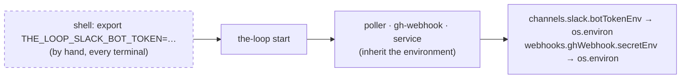

# Requirements: the CLI loads an env file the CLI config names, at start

> Phase 1 of 3 (requirements → design → tasks). Tier 3 (`human-approves-pr`): the change
> adds one block to `.the-loop/cli-config.schema.json` (an `autonomy.sensitivePaths`
> entry) and one stdlib module the three process entry points call; no authorization,
> routing or workflow path is touched.

## Introduction

[Issue #318](https://github.com/MadaraUchiha-314/the-loop/issues/318) asks that an
operator be able to name a `.env` file in `cli-config.yaml`, and that the-loop load the
variables it declares when the-loop starts — so a Slack token, a webhook secret or a
GitHub token is available to the daemons without being exported by hand first.

At `31b1183` (13.2.0) every secret the-loop uses is read from the **process
environment** by a name the config declares — `webhooks.ghWebhook.secretEnv`,
`channels.slack.botTokenEnv` / `appTokenEnv`, `integrations.github.api.tokenEnv` — and
the config file never carries a value. That is the right boundary, but it leaves the
operator to put the values *into* the environment: an `export` in the shell before
`the-loop start`, an `EnvironmentFile=` in a systemd unit, a wrapper script. A laptop that
runs `the-loop start` from a fresh terminal starts a receiver that accepts unsigned
deliveries and a Slack channel with no token, and says so only in the logs.

This work item lets the config name the file that holds those exports, and loads it once
per process, at start, before anything reads the environment. The config still names
variables, never values; the values live in a file the operator keeps out of git.

## Requirements

### Requirement 1 — the CLI config names an env file, and the-loop loads it at start

**User story:** As an operator, I want to name a `.env` file in `cli-config.yaml`, so that
every the-loop process finds the tokens it needs without me exporting them first.

#### Acceptance criteria (EARS)

1.1 The CLI config SHALL accept `env.file`: the path of a file in dotenv format. Unset or
empty, the-loop SHALL load nothing and behave exactly as at 13.2.0.

1.2 WHEN a the-loop process starts — the `the-loop` CLI, `python -m the_loop.daemon_entry
<poller|gh-webhook>`, `python -m the_loop.api.serve` — AND `env.file` is set THEN the
process SHALL load the file into its own environment **before** any command, daemon or
service reads the environment or the CLI config proper.

1.3 A relative `env.file` SHALL resolve against the directory of the CLI config file that
declares it, and a leading `~` SHALL expand to the home directory, so a config at
`~/.the-loop/cli-config.yaml` naming `.env` finds `~/.the-loop/.env` from any working
directory.

1.4 The file SHALL be read in dotenv format: one `NAME=value` per line; blank lines and
lines starting with `#` ignored; an optional leading `export` keyword; a value in double quotes
with `\n`, `\t`, `\r`, `\\` and `\"` unescaped; a value in single quotes taken literally; an
unquoted value trimmed, with a trailing comment (a space, then `#`) removed. Variable interpolation
(`${OTHER}`) SHALL NOT be performed.

1.5 A variable already present in the process environment SHALL NOT be overwritten: the
environment the operator (or the parent process) set wins over the file, so a
deliberately exported value is never silently replaced.

1.6 The daemons and the service `the-loop start` spawns SHALL see the loaded variables:
they inherit the CLI's environment, and each loads the file again on its own start (1.2,
idempotent under 1.5), so a daemon started by systemd or cron sees the same variables as
one started by the CLI.

### Requirement 2 — failures are visible, contained and never leak a value

**User story:** As an operator, I want a misnamed or malformed env file to be reported
without stopping the CLI and without printing a secret, so that I can fix the file and
nothing else changes meanwhile.

#### Acceptance criteria (EARS)

2.1 WHEN `env.file` is set AND the file does not exist or is not a regular file THEN
the-loop SHALL log a warning naming the resolved path and SHALL continue with nothing
loaded; every downstream fail-closed behaviour (an unsigned receiver warns, a channel
without a token is refused) then stands as at 13.2.0.

2.2 WHEN a line is not `NAME=value` with a valid name (`[A-Za-z_][A-Za-z0-9_]*`) THEN the
line SHALL be skipped and a warning SHALL name the file and the line **number** — never
the line's text or value; the remaining lines SHALL still be loaded.

2.3 WHEN the file cannot be read (permissions, encoding) THEN a warning SHALL name the path
and the error class, and the process SHALL continue with nothing loaded.

2.4 On a POSIX filesystem, WHEN the file is readable by group or others THEN the-loop SHALL
warn once that a secrets file is readable by others, and SHALL still load it.

2.5 No log line, event or output SHALL carry a loaded **value**. The names of the loaded
variables MAY be logged at `debug`; the count and the path at `info`.

2.6 The CLI config SHALL be read leniently for this purpose — a config that fails the
version gate (`migrations.assert_current`) or fails to parse SHALL load no env file and
SHALL leave that refusal to the command that reads the config proper, so `the-loop
migrate-config` and `the-loop --version` keep working against a stale config.

### Requirement 3 — the change is documented where the secrets are

**User story:** As a new operator following the docs, I want the env file mentioned at
the point each guide tells me to `export` a secret, so that I learn the option where I
need it.

#### Acceptance criteria (EARS)

3.1 `env.file` SHALL be documented under `docs/config/cli/` with its type, default and
resolution rule; the docs↔schema parity test (`test_docs_parity.py`) SHALL pass.

3.2 The shipped template (`skills/the-loop/templates/cli-config.yaml`) SHALL carry a
commented `env` block, and this repository's own `cli-config.yaml` SHALL show the same
block unset.

3.3 The getting-started and receiver pages, and the option pages that name
`secretEnv` and `botTokenEnv`, SHALL point at the env file as the alternative to a shell
`export`.

## Non-functional requirements

- **Dependencies:** none added. The CLI's one runtime dependency stays `pyyaml`
  (decision-038); the dotenv parser is stdlib and under a hundred lines.
- **Cost:** one small file read per process start; nothing per request, nothing on reload.
- **Reload:** the file is read once, at start. A change to it needs a restart, like a
  change to `service.host`; the daemons' hot reload of `cli-config.yaml` does not re-read
  it, because a reload must not be able to change the credentials a running process
  holds.
- **Observability:** logging only — `the-loop.env` logger, warnings for 2.1–2.4, `info`
  for the count. No event-log record: the event log is configured from the same config,
  after this runs, and a record would tempt someone to put names or values in it.

## Security considerations

- **Actors & trust:** the operator (trusted; owns the machine, the config and the file);
  other local users on a shared machine (untrusted; may read a world-readable file); a
  repository the config is tracked in (untrusted for **values**: the config names a path,
  never a value); the-loop's own daemons and spawned harness sessions (trusted; they
  already inherit the operator's environment).
- **Trust boundaries & data:** the boundary the-loop already enforces — the config names
  variables, the environment holds values — is kept; the file is a second *source* of
  environment, chosen by the operator. Loaded values enter `os.environ` and so reach every
  subprocess the-loop spawns (daemons, `gh`, the harness), exactly as an exported variable
  does today. `redact.scrub` value-scans sensitive-named variables from `os.environ`
  (issue-242), so a token loaded here is masked from a self-diagnosis report the same way
  an exported one is.
- **Abuse cases (EARS):**
  1. WHEN a config tracked in git names an env file THEN the file's **values** SHALL NOT
     enter the repository through the-loop: nothing the-loop writes (state, event log,
     evidence, comments) SHALL carry a loaded value.
  2. WHEN the env file is readable by other local users THEN the-loop SHALL warn so the
     operator can fix the mode; it SHALL NOT refuse, because the same values exported in
     a shell are equally visible to root and a refusal would only push operators back to
     `export`.
  3. WHEN the file contains a malformed or hostile line (no `=`, a name with spaces, a
     shell command) THEN the line SHALL be skipped and reported by number; the-loop SHALL
     NOT evaluate, expand or execute any part of the file.
  4. WHEN a variable is already set in the environment THEN the file SHALL NOT replace it,
     so a config edit (by anyone able to edit the config) cannot redirect a running
     operator's deliberately exported credential to a value from a file.
  5. WHEN `env.file` points outside the config's directory (an absolute path, `..`) THEN
     it SHALL be honoured — the operator chose it — and the resolved path SHALL be named
     in every warning, so a surprising file is visible in the logs.
- **Fail closed:** a missing, unreadable or malformed file loads nothing or only its valid
  lines; every credential-dependent feature keeps its 13.2.0 refusal when its variable is
  absent. This work item adds no grant: it changes where a value comes from, not who may
  do what with it.

## Out of scope

- Interpolation (`${VAR}`), multi-line values, `.env.local` layering, per-source or
  per-channel env files.
- A `--env-file` flag or a `$THE_LOOP_ENV_FILE` variable: the config already has a flag
  and a variable to pick *it*, and the env file rides on it.
- Re-reading the file on config reload (see Non-functional requirements).
- Loading the file for SDK embedders: a host application owns its process environment
  and its own dotenv handling; `the_loop.envfile` is importable if it wants the same
  loader.
- Passing the file to spawned harness sessions by any means other than inheritance.

## Open questions

None raised on the ticket; the two bullets of the issue map onto R1.1 and R1.2.

## Review comments

> Appended by the-loop's `record-feedback` hook when a human gate approves with
> comments (issue-109). Append-only and attributed: an approval never silently
> discards a reviewer's suggestions, and the feedback travels with the document
> it concerns rather than living in a side-channel tracker.
