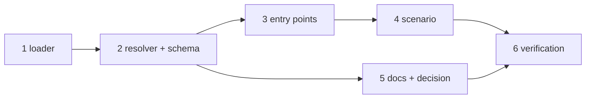

# Tasks: the env file the CLI config names

> The last spec artifact. A DAG derived from the design and testing plan; each task names
> the testing-plan row that proves it. TDD: the test first, red, then green.

## Task list

- [x] 1. The loader — `cli/the_loop/envfile.py`: `parse`, `load`, `ParseResult`,
  `LoadResult`
  - _Depends on:_ none
  - _Requirements:_ R1.4, R1.5, R2.1–R2.5
  - _Test:_ T1 — `test_envfile.py::test_the_grammar_*`, `::test_the_environment_wins_over_the_file`, `::test_a_missing_file_warns_and_loads_nothing`, `::test_an_unreadable_file_warns_with_the_error_class`, `::test_a_file_readable_by_others_is_warned_about_and_still_loaded`, `::test_malformed_lines_are_skipped_by_number_and_the_rest_loaded`, `::test_a_warning_never_carries_a_value_or_a_line`
- [x] 2. The resolver and the schema — `cli_config.resolve_env_file`, `cli_config.load_env_file`;
  `env.file` in `.the-loop/cli-config.schema.json` and the packaged copy
  - _Depends on:_ 1
  - _Requirements:_ R1.1, R1.3, R2.6, R3.1
  - _Test:_ T1 — `test_envfile.py::test_a_relative_path_resolves_against_the_config_directory`, `::test_tilde_is_expanded`, `::test_an_absolute_or_parent_path_is_honoured_and_named`, `::test_a_config_without_an_env_block_loads_nothing`, `::test_a_wrong_type_is_a_warning_not_a_path`, `::test_a_stale_or_broken_config_loads_nothing_and_does_not_raise`; T10 — `test_config_schema_parity.py`, `make validate`
- [x] 3. The entry points — `cli.main`, `daemon_entry.main`, `api/serve.main`
  - _Depends on:_ 2
  - _Requirements:_ R1.2, R1.6
  - _Test:_ T1 — `test_envfile.py::test_the_cli_loads_the_env_file_before_building_the_parser`, `::test_the_daemon_entry_loads_the_env_file_before_running`, `::test_the_service_loads_the_env_file_before_its_config`
- [x] 4. The scenario — `test_envfile_integration.py`
  - _Depends on:_ 3
  - _Requirements:_ R1.2, R1.5, R1.6
  - _Test:_ T2
- [x] 5. Docs, template, capability doc, decision — `docs/config/cli/index.md`,
  `docs/cli/getting-started.md`, `docs/cli/receiver.md`, `docs/config/cli/webhook-options.md`,
  `docs/config/cli/channels-options.md`, `skills/the-loop/templates/cli-config.yaml`,
  `.the-loop/cli-config.yaml`, `docs/capabilities/cli.md`, `decision-108` + index row
  - _Depends on:_ 2
  - _Requirements:_ R3.1–R3.3, the capability-docs gate
  - _Test:_ T10 — `test_docs_parity.py`; T12 — `make check`
- [x] 6. Verification — execute `testing-plan.md`, record `evidence/verification.md` and
  `evidence/security-review.md`
  - _Depends on:_ 4, 5
  - _Requirements:_ all
  - _Test:_ T1, T2, T8, T10, T12, T13

## Dependency graph (DAG)

## Checkpoints

After task 1 and after task 3: the named tests red → green recorded in
`evidence/verification.md`. After task 4: the integration file green. After task 5:
`make check`. Then the verification node, then the self-review rounds and the security
review gate (`evidence/security-review.md`), then the PR with the reviewer briefing.

## Review comments

> Appended by the-loop's `record-feedback` hook when a human gate approves with
> comments (issue-109). Append-only and attributed: an approval never silently
> discards a reviewer's suggestions, and the feedback travels with the document
> it concerns rather than living in a side-channel tracker.
