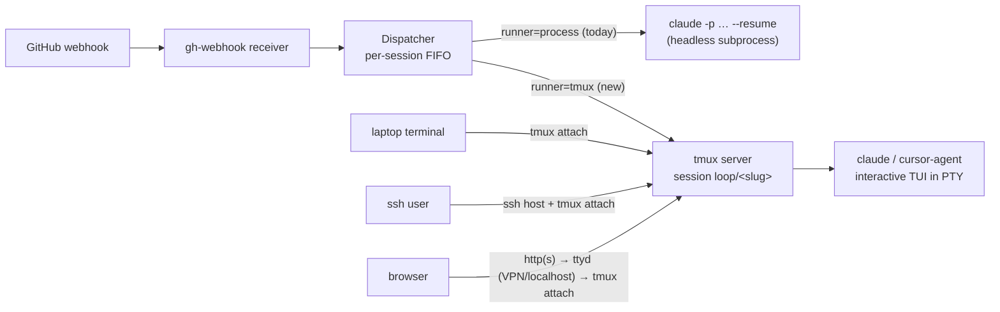

# Brainstorm: tmux-backed observable/interactive harness sessions

> Root artifact for issue #32. The issue is explicitly exploratory ("what will be the
> architecture? what's the role of tmux? what are the alternatives?"), so the loop starts
> here. Iterate with feedback; once locked, derive `requirements.md`.

## Problem / opportunity

When the webhook receiver auto-executes a work item (issue-15), it spawns the harness as
a **headless subprocess** — `claude -p <prompt> --output-format json` (or
`cursor-agent -p …`) via `Dispatcher._spawn_for` → `HarnessAdapter.spawn`. The session
runs to completion invisibly; the only trace is the receiver's log line and whatever the
agent pushes to GitHub. A human who wants to *watch* the agent work, or *step in* and
steer it mid-run, has no way to do so — the process owns no terminal.

The ask: spawn the harness inside something attachable (tmux being the candidate) so
anyone with access to the host — locally, over SSH, or through a web terminal — can
observe and interact with the live session.

## Context & constraints

- **Current spawn/resume model (issue-15, decision-016):** one shot, non-interactive.
  `spawn` = `claude -p <prompt> --output-format json`; the JSON output yields the
  `session_id` stored in the registry (`.the-loop/sessions/<slug>.json`). Each later
  webhook event is a *new* subprocess: `claude -p <event-prompt> --resume <session-id>`.
  Between events, **no process exists** — a "session" is registry metadata + harness
  conversation state on disk.
- **Per-session FIFO dispatch:** the dispatcher already serializes events per work item
  (one worker thread per session), so "one thing talks to the session at a time" is an
  established invariant a design must preserve or consciously relax.
- **Zero-runtime-dependency guarantee (decision-005/016):** the CLI subprocess-drives the
  official harness CLIs; no SDK, no daemons beyond the receiver itself. tmux would be an
  *optional* host tool, not a Python dependency.
- **Both harnesses matter:** whatever the mechanism, it should treat `claude` and
  `cursor-agent` uniformly through the `HarnessAdapter` contract (R4 of issue-15).
- **Access control is environmental, not a the-loop feature** *(owner assumption, PR #33
  review, 2026-07-17)*: an attachable session is a keyboard into an agent with repo write
  access, but the-loop builds no auth of its own. On a local laptop nothing is needed
  (bind to localhost); on a remote host the network layer is assumed to protect access —
  VPN, private network, or the hosting provider's controls. The design's obligation is
  only to *bind sensibly by default* (e.g. any web terminal listens on 127.0.0.1 or the
  VPN interface unless explicitly told otherwise).

## The core tension: headless dispatch vs. interactive terminal

The current model and the wish are at odds in one specific place:

- Today's **resume path needs a non-interactive process** it can feed a prompt and
  collect JSON from.
- A human needs an **interactive TUI** (`claude` full-screen mode) attached to a PTY.
- The same harness conversation **cannot safely be driven by both at once** — an
  interactive `claude --resume <id>` and a concurrent `claude -p --resume <id>` race on
  the same conversation state, and the dispatcher's one-at-a-time invariant is exactly
  the thing that would break.

Every option below is a different resolution of this tension.

## Ideas & options

### Option A — tmux hosts the *interactive* session; events are injected via `send-keys` ✅ leaning

The dispatcher spawns the harness **interactively inside a named tmux session**
(`tmux new-session -d -s loop/<work-item-slug> -- claude …`) instead of a one-shot `-p`
process. The tmux session *is* the running agent; webhook events are delivered by typing
into it programmatically:

```
tmux load-buffer -b loop-evt <prompt-file>
tmux paste-buffer -p -b loop-evt -t loop/<slug>   # -p = bracketed paste
tmux send-keys -t loop/<slug> Enter
```

Humans attach with `tmux attach -t loop/<slug>` (read-write) or
`tmux attach -r` (read-only) and see exactly what the agent sees — including events
arriving as pasted prompts — and can type their own steering messages between turns.

- **Pros:** full observe *and* interact, both harness TUIs work unchanged, session
  survives independent of the receiver process (tmux server owns it), discovery is
  `tmux ls`, works for all three access modes (below).
- **Cons / risks:**
  - `send-keys` is lossy by design: if the TUI is mid-turn, showing a permission dialog,
    or the human is mid-keystroke, injected text can interleave or be swallowed.
    Mitigations exist (bracketed paste; only inject when the pane's foreground command
    is idle via `#{pane_current_command}`; queue in the dispatcher — which already
    serializes), but "reliably typing into a TUI" is inherently best-effort.
  - **Session-id capture changes:** interactive mode prints no JSON. Need
    `$CLAUDE_SESSION_ID` via a SessionStart hook, `--session-id <uuid>` (pre-chosen id),
    or parsing; per-harness capability audit required (cursor-agent equivalents).
  - **Completion detection changes:** today `subprocess.run` returning = turn done. An
    interactive session never exits; the dispatcher loses its natural "resume finished"
    signal (affects `dispatchTimeoutSeconds`, semaphore release). Options: fire-and-forget
    with `pane_current_command` polling, harness Stop-hooks touching a sentinel file, or
    dropping per-event completion tracking in tmux mode.

### Option B — keep headless dispatch; tmux is a *viewer* (observe-only)

Spawn/resume stay exactly as today, but each dispatch runs **inside a tmux window**
(`tmux new-window -t loop/<slug> -- claude -p … --output-format stream-json --verbose`)
so the streaming output is watchable live, and the window's scrollback is the session
history. Humans *observe* in real time; to *interact* they open their own
`claude --resume <session-id>` between events (the registry has the id), or just comment
on GitHub — which is already the loop's steering channel.

- **Pros:** near-zero change to dispatch semantics (JSON capture, completion, timeouts
  all keep working); no injection fragility; the "interact" story reuses channels that
  already exist (GitHub comments; manual `--resume` between turns).
- **Cons:** not the full ask — you can't type into the *running* turn; `stream-json`
  output is developer-grade, not the friendly TUI; two humans racing `--resume` against
  a webhook event re-introduces the concurrency race (needs a `the-loop sessions attach`
  helper that pauses dispatch, or documented discipline).

### Option C — runner abstraction: `process` (today) | `tmux`, chosen in config

Not a third mechanism but the packaging of A and/or B: introduce a **SessionRunner**
seam next to `HarnessAdapter` (`routing.runner: process | tmux`, default `process`),
registry entries gain `runner` + `tmuxTarget`, and tmux mode is opt-in. Preserves
decision-005 (tmux absent → clean error or fallback to `process`).

### Rejected / parked alternatives to tmux

- **GNU screen** — same detach/attach model, weaker scripting surface (`stuff` vs.
  send-keys/paste-buffer, no format strings for idle-detection). tmux is strictly better
  where both are installable. ✗
- **dtach / abduco** — minimal detach/attach, no windowing, no programmatic input API
  worth relying on, no read-only attach. Too little. ✗
- **Zellij** — modern, nice, but far less ubiquitous, and its automation surface
  (`zellij action write-chars`) is younger than tmux's. Revisit if tmux proves limiting. ✗
- **ttyd / GoTTY / wetty (web terminal servers)** — **not alternatives; the complement.**
  They serve a command's PTY over HTTP(S); serving `tmux attach -t …` is precisely the
  "user with a URL" mode. Parked as an optional layer *on top of* tmux; access control is
  assumed environmental (localhost / VPN / provider network — see constraints), so the
  layer only needs sensible default binding, not its own auth. ○
- **Harness-native sharing** (claude.ai/code remote sessions, Cursor background agents'
  web UI) — solves observe/interact but only on the vendor's hosted surface; issue #32
  is explicitly about the *self-hosted* receiver (same reasoning as decision-016). ✗
- **asciinema-style streaming** — observe-only broadcast, no interaction. Subsumed by
  tmux read-only attach. ✗

## Sketches & notes



User-interaction pattern (Option A): the human is a *co-pilot on the same keyboard* —
`the-loop sessions list` (gains a `TMUX` column) → `tmux attach -t loop/<slug>` → watch
turns stream; type guidance or answer the TUI's permission prompts inline; detach with
`C-b d` and the agent continues autonomously. Webhook events keep arriving in the same
pane, visibly.

## Does it work in the three access modes?

| Mode | Path | Verdict |
|------|------|---------|
| Local (receiver on laptop) | any terminal → `tmux attach -t loop/<slug>` (same user's tmux server) | ✅ native |
| SSH into remote host | `ssh host`, then attach; this is tmux's canonical use-case; read-only attach for spectators | ✅ native |
| Web terminal (user has a URL) | ttyd/GoTTY on the host serving `tmux attach` (or a picker script); access control assumed environmental (localhost / VPN / provider network) | ✅ workable; optional layer, not v1-default |

All three converge on "get a shell as the right user, attach to the tmux socket" — which
is exactly why tmux (a user-level daemon owning the PTYs) is the right substrate and a
plain child process is not.

## Open questions

1. **Interaction fidelity (product):** ~~is observe-only with attach-between-turns
   (Option B) enough for v1, or is typing into the live TUI (Option A) the actual bar?~~
   → **Resolved: Option A** (owner, PR #33 review, 2026-07-17). Typing into the live TUI
   is the bar; the architecture is A-semantics behind the Option C `runner` seam.
2. **Event injection reliability (Option A):** is best-effort `send-keys` (with
   idle-detection + the dispatcher's existing serialization) acceptable for webhook
   delivery, or must event delivery remain the crash-safe headless path? A hybrid —
   interactive TUI in tmux *plus* headless `-p --resume` only when the pane is idle — may
   be the pragmatic middle. With Option A chosen, this becomes the central design-phase
   decision (likely resolved by a small spike against both harness TUIs).
3. **Session-id + completion signals per harness:** confirm `claude --session-id` /
   SessionStart-hook capture and the cursor-agent equivalents; without an id the registry
   can't route follow-up events.
4. **Web mode scope** *(auth half resolved — owner, PR #33 review, 2026-07-17:
   access control is environmental — VPN / hosting provider network for remote hosts,
   nothing needed on a local laptop; the-loop ships no auth of its own)*. Remaining
   half — a pure scope/minimalism call, no longer security-gated: does the-loop **ship**
   the web layer (e.g. `the-loop sessions serve --web` wrapping ttyd) or **document** it
   as a recipe? (Recommend: document first.) Context:
   - *What web mode is:* a web-terminal server (ttyd or GoTTY) on the same host serving
     `tmux attach -t loop/<slug>` as a browser page — opening the URL gives a live
     terminal on the agent's PTY. The whole recipe is roughly
     `ttyd --writable tmux attach -t loop/<slug>` bound to localhost or the VPN
     interface.
   - *Why document rather than ship in v1:* shipping means the-loop spawns and
     supervises a network-exposed service and owns its lifecycle and configuration
     surface. A documented recipe delivers the capability without that ownership, and
     the web layer is purely additive later — it is just another client attaching to
     the same tmux session.
5. **Mixed fleets:** ~~may `runner` differ per work item (overrides), or is it
   receiver-global?~~ → **Resolved: receiver-global** (owner, PR #33 review,
   2026-07-17). One setting (`routing.runner`) in `.the-loop/config.yaml`; every spawned
   session uses the same runner, and flipping it needs no migration since it only
   affects newly spawned sessions. Per-work-item selection (front-matter `overrides` or
   a label) stays a possible later extension at zero migration cost — the registry
   records `runner`/`tmuxTarget` per session anyway, so the dispatcher handles a mixed
   fleet regardless.

## Leaning / working hypothesis

Option **C packaging** with **A semantics** — confirmed by the owner's Option-A call on
question 1 — staged: introduce a **receiver-global** `routing.runner` (`process` default,
`tmux` opt-in; question 5 resolved); tmux mode spawns the harness TUI in
`loop/<work-item-slug>`, captures the session id via pre-assigned id/hook, injects events
via bracketed-paste + idle-check (keeping the dispatcher's FIFO as the safety layer), and
registers `tmuxTarget` in the session registry. Local + SSH attach are v1; the web
terminal rides on the environmental-access-control assumption (localhost / VPN /
provider network — no auth built by the-loop), pending only the ship-vs-document call in
question 4. Option B's stream-view remains the documented fallback if the question-2
spike finds injection too fragile.

## Hand-off → requirements

Carries forward once locked: the `runner` config seam, tmux session naming + registry
fields, event-injection contract (or the B fallback), per-harness id/completion capture,
`sessions list/attach` UX, and the three-mode access matrix with the web-auth gate.
Rejected alternatives (screen, dtach, Zellij, asciinema, vendor-hosted) stay here as the
record.
