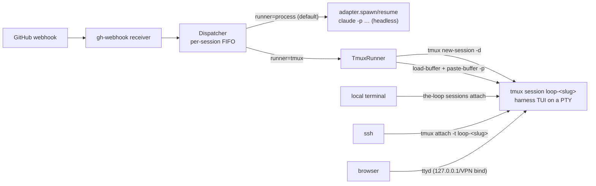

# Design: tmux-backed observable/interactive harness sessions

> Phase 2 of 3, derived from the approved [`requirements.md`](requirements.md).
> Decides brainstorm Q2 (event delivery) and Q3 (session identity) — see
> [decision-021](../../decisions/decision-021.md). No UI artifacts: this is CLI/infra
> work (`design.uiArtifacts` n/a).

## Overview

An opt-in **tmux runner** for webhook-spawned sessions. With
`routing.runner: tmux`, the dispatcher starts the harness's *interactive TUI* inside a
detached, named tmux session instead of a one-shot headless subprocess; webhook events
are pasted into that TUI; humans attach to it locally, over SSH, or through a
ttyd-served browser terminal. With `routing.runner: process` (default/unset) nothing
changes.



## Key decisions (brainstorm Q2/Q3 → decision-021)

1. **Q2 — event delivery = bracketed-paste injection, no hybrid.** `TmuxRunner.deliver`
   loads the rendered prompt into a tmux buffer and pastes it with `-p` (bracketed
   paste), then sends `Enter`. Safety comes from layers that already exist: the
   dispatcher's per-session FIFO (one delivery at a time), both harness TUIs queueing
   input that arrives mid-turn, and GitHub redelivery as the retry path when a paste
   fails. The hybrid (headless `-p --resume` when idle) is **rejected**: a concurrent
   headless resume against a live interactive session races on conversation state —
   the exact hazard the brainstorm's core-tension section names — and reliable
   idle-detection doesn't exist (`pane_current_command` shows `claude` whether the TUI
   is thinking or waiting).
2. **Q3 — session identity = pre-assigned id, not captured.** The runner generates a
   UUID and passes it to the harness at spawn (`claude --session-id <uuid>`), so the
   registry knows the id before the TUI even starts — nothing to parse from a TUI that
   prints no JSON. This is exposed per-adapter as `interactive_argv(prompt,
   session_id)`; **claude implements it; cursor-agent has no documented equivalent**
   (no `--session-id`/pre-assigned chat id in interactive mode), so its adapter raises
   `UnsupportedRunnerError` and a tmux-mode spawn for cursor fails with a clear message
   (R2.2: never register a session that can't receive events). The runner *contract*
   stays harness-uniform (R2.3); cursor gains support when its CLI does.
3. **Turn completion is not tracked in tmux mode.** Delivery is the paste, which
   returns immediately; the global dispatch semaphore is held only for the tmux
   commands. `dispatchTimeoutSeconds` still bounds each tmux subprocess. The TUI's own
   input queue absorbs bursts; per-event "resume finished" bookkeeping (a headless-mode
   concept) has no tmux equivalent and nothing depends on it.
4. **tmux session naming: `loop-<work-item-slug>`** (e.g.
   `loop-github-octo-repo-15`). The brainstorm sketched `loop/<slug>`; `-` replaces `/`
   because `:` and `.` are tmux target separators and keeping the name
   separator-free avoids quoting hazards. The name is stored in the registry
   (`tmuxTarget`), never re-derived.

## Components & interfaces

### 1. `cli/the_loop/runner.py` (new)

```python
class UnsupportedRunnerError(Exception): ...

@dataclass
class TmuxResult:
    ok: bool
    error: str = ""

class TmuxRunner:
    def __init__(self, binary: str = "tmux"): ...
    def is_available(self) -> bool                      # shutil.which
    def target_for(self, work_item: WorkItemRef) -> str # "loop-<slug>"
    def spawn(self, work_item, adapter, prompt, cwd, session_id, timeout) -> TmuxResult
        # tmux new-session -d -s <target> -c <cwd> -- <adapter.binary> <interactive_argv>
    def deliver(self, session, prompt, timeout) -> TmuxResult
        # tmux load-buffer -b the-loop-evt <tmpfile>
        # tmux paste-buffer -p -d -b the-loop-evt -t <target>
        # tmux send-keys -t <target> Enter
    def kill(self, session, timeout) -> TmuxResult      # tmux kill-session -t <target>
    def has_session(self, target) -> bool               # tmux has-session -t <target>

def check_dependencies(runner: str, web_enabled: bool) -> list[str]
    # returns human-readable "missing dependency" lines with per-platform hints
```

All tmux calls are `subprocess.run` with `capture_output` and the configured timeout —
same shape as `HarnessAdapter._run`. The prompt travels via a temp file →
`load-buffer` (never argv) so size/quoting are non-issues.

### 2. `HarnessAdapter.interactive_argv` (extend `harness/base.py`)

```python
def interactive_argv(self, prompt: str, session_id: str) -> List[str]:
    raise UnsupportedRunnerError(f"{self.name} does not support the tmux runner")
```

`ClaudeCodeAdapter`: `["--session-id", session_id, prompt] + extra_args`.
`CursorAgentAdapter`: inherits the raise (documented above).

### 3. Registry (`sessions/registry.py`)

`Session` gains `runner: str = "process"` and `tmux_target: str = ""`; serialized as
`runner`/`tmuxTarget`; `from_dict` defaults keep every existing registry file readable
(NFR back-compat).

### 4. Dispatcher (`webhook/dispatcher.py`)

- `RoutingConfig` gains `runner: str = "process"` and
  `web_terminal: WebTerminalConfig` (`enabled: bool = False`, `host: str =
  "127.0.0.1"`, `port: int = 7681`), parsed from `routing.runner` /
  `routing.webTerminal`.
- `Dispatcher.__init__` builds a `TmuxRunner` when `config.runner == "tmux"`.
- `_spawn_for`: `runner == "tmux"` → generate `uuid4`, `TmuxRunner.spawn(...)`,
  register `Session(runner="tmux", tmux_target=..., harness_session_id=uuid)`.
- `_dispatch_one`: `session.runner == "tmux"` → `TmuxRunner.deliver(...)`; failures
  log + discard the delivery id (R3.3), exactly like a failed resume.
- PR-close handling: in addition to `registry.close`, `TmuxRunner.kill` the session's
  tmux target (R7.1); a missing tmux session is a no-op.
- Sessions with `runner == "tmux"` whose events arrive when `config.runner` is
  `process` still deliver via tmux — the *session's* recorded runner wins (mixed
  fleets work by construction, per the locked brainstorm).

### 5. Receiver (`commands/gh_webhook.py`)

- On `start --route`: `check_dependencies(runner, web.enabled)`; missing → error out
  with the guidance lines (R6.1), present → silent (R6.2).
- When `web_terminal.enabled`: spawn
  `ttyd --writable -p <port> -i <host> tmux new-session -A -s the-loop-hub` as a
  child `subprocess.Popen`; each browser connection lands in a shared `the-loop-hub`
  tmux session from which `loop-*` sessions are one `tmux switch-client`/`choose-tree`
  away, and the same keyboard reaches any of them (R5.4). ttyd is terminated on
  receiver shutdown. Default bind `127.0.0.1` (R5.2); no auth of our own (R5.3).

### 6. Sessions CLI (`commands/sessions_cmd.py`)

- `list`: new `Runner` and `Tmux` columns (JSON output carries the new fields via
  `to_dict` automatically).
- `attach <--work-item> [--read-only]`: resolve session → must be `runner == tmux` and
  `tmux has-session` → `os.execvp("tmux", ["tmux", "attach-session", (-r), "-t",
  target])`; clear errors otherwise (R4.3).
- `close`: after registry close, best-effort `tmux kill-session` when the session was
  tmux-mode; reports when the tmux session was already gone (R7.2/R7.3).

### 7. Config schema (`.the-loop/config.schema.json`) + `config.yaml`

`routing.runner` (`enum: [process, tmux]`, default `process`) and
`routing.webTerminal` (`enabled`/`host`/`port`). Mirrored (commented) in this repo's
`config.yaml`.

## Data model

Registry file (new fields ⭐):

```json
{
  "workItem": {"ref": "github:octo/repo#15", "...": "..."},
  "harness": "claude",
  "harnessSessionId": "7f3c…-uuid4",
  "cwd": "/work/repo",
  "status": "active",
  "runner": "tmux",          ⭐
  "tmuxTarget": "loop-github-octo-repo-15",  ⭐
  "createdAt": "…", "lastEventAt": "…", "recentDeliveries": ["…"]
}
```

## Event delivery sequence (tmux mode)

```mermaid
sequenceDiagram
    participant GH as GitHub
    participant RX as receiver/router
    participant D as dispatcher (FIFO/session)
    participant TR as TmuxRunner
    participant T as tmux session loop-<slug>
    participant H as harness TUI
    GH->>RX: POST /gh-webhook (signed)
    RX->>D: RoutedEvent
    D->>TR: deliver(session, rendered prompt)
    TR->>T: load-buffer + paste-buffer -p
    TR->>T: send-keys Enter
    T->>H: prompt appears as (queued) input
    Note over H: human attached sees the event arrive;<br/>TUI queues it if a turn is running
    TR-->>D: ok → registry.touch(delivery id)
```

## Error handling

| Failure | Behaviour |
|---------|-----------|
| tmux missing, runner=tmux | receiver start fails with per-platform guidance (R6.1); spawn-time re-check errors per event, never silent fallback (R1.4) |
| ttyd missing, web enabled | receiver start fails with guidance (R6.1) |
| harness lacks interactive support (cursor) | spawn fails with `UnsupportedRunnerError` message; no registry entry (R2.2) |
| tmux session died (crash/manual kill) | `deliver` fails (`has-session` false) → log + discard delivery id → GitHub redelivery retries; `attach` explains and points at `sessions list` (R4.3) |
| paste fails mid-delivery | non-zero tmux exit → same failure path as a failed resume (R3.3) |
| PR-close for missing tmux session | registry closes; kill is best-effort no-op (R7.3) |

## Testing strategy

- **Unit (`cli/tests/test_tmux_runner.py`):** argv/target construction,
  `interactive_argv` per adapter (claude args; cursor raises), `Session`
  round-trip with/without new fields (back-compat), `RoutingConfig` parsing of
  `runner`/`webTerminal`, `check_dependencies` messages.
- **Integration (`cli/tests/test_tmux_runner_integration.py`,** Gherkin docstrings per
  `config.testing`): a **stub `tmux` binary** records invocations (same pattern as the
  existing stub-harness): signed webhook POST → spawn creates `new-session` with the
  claude interactive argv and registers a tmux-mode session; a follow-up event becomes
  `load-buffer`/`paste-buffer`/`send-keys` on that target; PR-close issues
  `kill-session`; `sessions list/attach/close` surface/act on the new fields. Real
  `tmux` is deliberately not required by CI.
- **TDD:** standard mode — each task lands red → green; transitions recorded in the
  execution log.

## Minimalism ladder

- **No new Python dependencies** (stdlib `subprocess`/`uuid`/`tempfile` only); tmux and
  ttyd are host binaries verified at start (decision-005 preserved).
- **No `SessionRunner` base class:** exactly two behaviours exist (`process` = current
  adapter path, `tmux` = `TmuxRunner`); a dispatcher branch on one field is less code
  than an abstraction for two cases. Revisit only if a third runner appears.
- **No hub-picker code for the web layer:** one ttyd child process + tmux's built-in
  session switching replaces any session-picker UI.
- **Rejected:** auto-installing ttyd (brainstorm), SDK adapters (decision-016), a
  persistent runner daemon (tmux server *is* the daemon).
