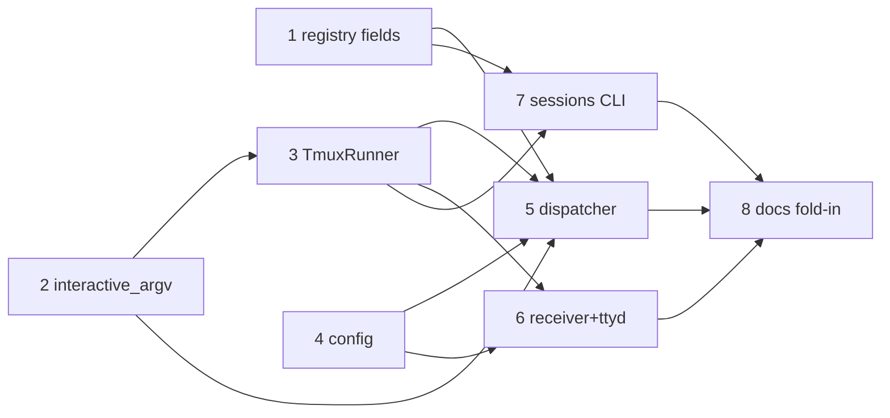

# Tasks: tmux-backed observable/interactive harness sessions

> Phase 3 of 3, derived from the approved [`design.md`](design.md). TDD invariant
> (`tdd.mode: standard`): each task's test goes red before the production code makes it
> green; transitions recorded in the execution log.

## Task list

- [x] 1. Session registry carries runner metadata
  - Add `runner` (default `"process"`) + `tmux_target` to `Session`; serialize as
    `runner`/`tmuxTarget`; `from_dict` defaults keep old registry files readable.
  - _Depends on:_ none
  - _Requirements:_ R1.3, NFR back-compat
  - _Test:_ `cli/tests/test_tmux_runner.py::TestSessionRunnerFields` (red→green)
- [x] 2. `interactive_argv` on the harness adapters
  - Base raises `UnsupportedRunnerError`; claude returns
    `["--session-id", <id>, <prompt>] + extra_args`; cursor inherits the raise.
  - _Depends on:_ none
  - _Requirements:_ R2.1, R2.3
  - _Test:_ `cli/tests/test_tmux_runner.py::TestInteractiveArgv` (red→green)
- [x] 3. `TmuxRunner` (spawn / deliver / kill / has_session / target_for) + dependency check
  - New `cli/the_loop/runner.py` per design §1; prompt via tempfile + `load-buffer`;
    `check_dependencies` returns per-platform guidance lines.
  - _Depends on:_ 2
  - _Requirements:_ R1.1, R3.1, R6.1–R6.2, R7 (mechanics)
  - _Test:_ `cli/tests/test_tmux_runner.py::TestTmuxRunner` + `::TestCheckDependencies` (red→green)
- [x] 4. Routing config: `runner` + `webTerminal`
  - `RoutingConfig.runner`, `WebTerminalConfig`; schema additions in
    `.the-loop/config.schema.json`; commented keys in `.the-loop/config.yaml`.
  - _Depends on:_ none
  - _Requirements:_ R1.2, R5.1–R5.2, NFR schema
  - _Test:_ `cli/tests/test_tmux_runner.py::TestRoutingConfigRunner`; `make validate` (red→green)
- [x] 5. Dispatcher integration: spawn/deliver/close through the tmux runner
  - `_spawn_for` (uuid4 + register tmux session), `_dispatch_one` (session's recorded
    runner wins), PR-close kills the tmux session; failures discard delivery ids.
  - _Depends on:_ 1, 2, 3, 4
  - _Requirements:_ R1.1–R1.4, R2.1–R2.2, R3.1–R3.3, R7.1
  - _Test:_ `cli/tests/test_tmux_runner_integration.py` (webhook→tmux scenarios, stub tmux) (red→green)
- [x] 6. Receiver preflight + ttyd web-terminal lifecycle
  - `check_dependencies` on `start --route`; spawn/terminate ttyd child when
    `webTerminal.enabled` (`tmux new-session -A -s the-loop-hub`).
  - _Depends on:_ 3, 4
  - _Requirements:_ R5.1–R5.4, R6.1–R6.2
  - _Test:_ `cli/tests/test_tmux_runner.py::TestReceiverPreflight` (red→green)
- [x] 7. Sessions CLI: list columns, `attach`, close kills tmux
  - `Runner`/`Tmux` columns; `attach --work-item [--read-only]` exec's tmux with clear
    errors; `close` best-effort `kill-session`.
  - _Depends on:_ 1, 3
  - _Requirements:_ R4.1–R4.4, R7.2–R7.3
  - _Test:_ `cli/tests/test_tmux_runner.py::TestSessionsCli` (red→green)
- [x] 8. Docs fold-in: capability doc, decision record, README/config docs
  - New `docs/capabilities/interactive-sessions.md` + index row; history row in
    `webhook-triggers.md`; `docs/decisions/decision-021.md` + index; execution log.
  - _Depends on:_ 5, 6, 7
  - _Requirements:_ ready-to-ship gate (capability fold-in)
  - _Test:_ `make lint` (markdownlint) green

## Dependency graph (DAG)

## Checkpoints

After tasks 3, 5 and 7: `make test`; after 8: `make check` (lint, format-check,
typecheck, validate, test — CI parity). Red→green evidence per task in
[`execution-log.md`](execution-log.md).
