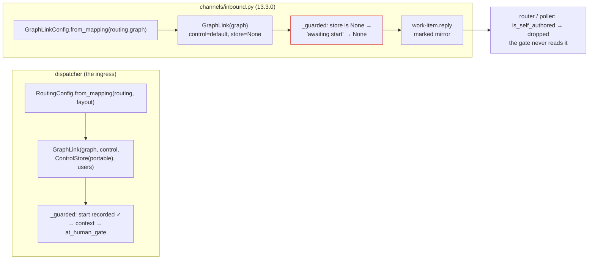

# Bugfix spec: an authorized user's gate approval sent from a channel is stamped self-authored and dropped

> Phase 1 of 3 for a bug (bugfix → design → tasks). Tier 3 (`human-approves-pr`; below
> `security.review.humanSignOffMinTier: 4`): the change lives in
> `cli/the_loop/channels/inbound.py` and its tests, one line of the ledger's attribution,
> one event-log field, and the docs. No new grant, no schema, no sensitive path: a
> message becomes a gate answer only on a channel that already holds `gate.feedback`,
> and the ledger's ingress judges it through the guards it has today.

## Summary

[Issue #321](https://github.com/MadaraUchiha-314/the-loop/issues/321), opened by
@jc1993 against 13.2.0: an authorized user answers a human gate **from a bound Slack
thread** and the gate never locks. The reply is recorded on the ticket as the-loop's
own **marked** comment (`<!-- the-loop:agent-comment -->`), the gate's comment reader
discards every marked comment, and nothing tells the operator. The same word typed
natively on GitHub locks the gate in seconds. Their reproduction on work item #430
(comment 21404829, `🗣️ the-loop — reply from jchou2 (slack:W8GN4CKNK)…`, marked) is
the shape this spec fixes.

## Steps to reproduce

1. A work item parked at `requirements-approval`, its Slack thread bound, the channel
   granted `publish: [work-item.reply, gate.feedback]`, the replying member in
   `routing.authorizedUsers`, and the daemon under its default control policy
   (`routing.control.enabled: true`, `requireStartCommand: true`) with the item armed.
2. The member replies `approved` in the thread.
3. Read the ticket: the record is a marked `work-item.reply` mirror. Read the graph:
   the item is still parked at the gate.

Reproduced at `ba0c433` (13.3.0) with a real checkout, a real registry record and a
real `graph-state.json` — see [`evidence/verification.md`](evidence/verification.md):
the dispatcher's read says *at a gate*, the pipeline's read says *not*.

## Expected vs actual

- **Expected:** the reply is classified `gate.feedback`, recorded **unmarked** with the
  envelope naming the person, and the ledger's ingress classifies it on its next
  delivery or poll — the gate locks and `approvedBy` names the person (issue-309 R6.3).
- **Actual:** the reply is classified `work-item.reply`, recorded as a marked, defanged
  mirror, and delivered straight into the session. The router and the poller drop the
  marked comment before the gate ever reads it; the pipeline's own direct delivery hands
  the session text it cannot act on (the session never locks a gate, issue-281). The
  event log says `channel.reply_received … kind: work-item.reply` and nothing else.

## Root cause (confirmed)

**The pipeline's graph read is a second, drifted construction of the dispatcher's.**
`inbound._at_human_gate` builds `GraphLink(GraphLinkConfig.from_mapping(routing.graph))`
with **no control config, no control store and no authorized users**. Every `GraphLink`
read runs behind `_guarded`, whose first gate is `_awaiting_start`: under the default
control policy a link **without a control store** answers "awaiting start" for every
work item — the fail-closed answer that is right for a link about to *drive* a graph
and wrong for one that only *reads* it — so `context()` returns `None`, the pipeline
reports "not at a gate", and `classify` falls through to `work-item.reply`. The
dispatcher never sees this because it hands its link the control config, the
`ControlStore` on the portable directory and the allow-list (`Dispatcher.__init__`).

Two more paths reach the same drop and are fixed by the same change of posture:

- **no session record for the work item** (the session ended, a different machine, a
  registry the pipeline cannot see) — `record_owning` is `None`, the read is
  "not at a gate", the marked mirror is undeliverable *and* invisible;
- **any fault reading the graph** — caught and reported as "not at a gate".

In every one of these the pipeline does not *know* the item is not at a gate; it
**cannot tell**, and it turns "cannot tell" into the one record shape the gate can
never read. The 13.3.0 docs called that "the fail-closed direction". It is not: the
closed outcome for an approval is *the gate stays open and nobody is told*, and the
marked record is what makes it silent.

## Requirements

### Requirement 1 — an authorized reply that answers an open gate reaches the gate

**User story:** As an authorized user answering a gate from Slack, I want my approval
to lock the gate exactly as a typed GitHub comment does, so that the channel is a way
to drive the loop rather than a way to lose an answer.

#### Acceptance criteria (EARS)

1.1 WHEN a work item is parked at a human gate AND its channel holds the `gate.feedback`
grant AND an authorized member replies THEN the pipeline SHALL classify the reply
`gate.feedback` and record it **unmarked**, with the envelope, under the daemon's
**default** control policy with the item armed — the scenario in *Steps to reproduce*.

1.2 The pipeline's graph read SHALL be built from the same `routing` configuration and
state layout the dispatcher builds its coupling from — the same control config, the
same control store directory, the same allow-list, the same registry directory — and a
test SHALL pin the two together so they cannot drift again.

1.3 WHEN the pipeline **cannot read** the graph — no session record, a record with no
checkout, no context, a fault — AND the channel holds `gate.feedback` THEN the reply
SHALL be classified `gate.feedback`: recorded unmarked, keywords intact, delivered by
nothing but the ledger's ingress, which judges it with the graph it actually keeps.

1.4 WHEN the pipeline cannot read the graph AND the channel does **not** hold
`gate.feedback` THEN the reply SHALL be a `work-item.reply` exactly as at 13.3.0
(marked mirror, direct delivery): the grant remains the only thing that lets a message
on a channel become a gate answer.

1.5 WHEN the graph coupling is disabled (`routing.graph.enabled: false`) THEN there is
no gate to answer and the reply SHALL be a `work-item.reply`.

1.6 WHEN the graph reads and reports the item **not** at a human gate THEN the reply
SHALL be a `work-item.reply`, as at 13.3.0.

1.7 A control keyword SHALL outrank every gate answer as before: the classification
order stays keyword → gate → reply, whatever the graph read returns.

1.8 The fix SHALL include a regression test that runs the *Steps to reproduce* against a
real checkout, a real registry record and a real `graph-state.json`, fails at `ba0c433`
and passes after.

### Requirement 2 — the classification is visible

**User story:** As an operator, I want the event log to say what the pipeline could see
when it classified a reply, so that "why did my approval not lock the gate" has an
answer without reading code.

#### Acceptance criteria (EARS)

2.1 `channel.reply_received` SHALL carry `gate: open | none | unknown` — what the graph
read returned — beside `kind`. Ids and enums only, never text.

2.2 A ledger record made under 1.3 SHALL say so in its visible attribution: a *reply*
recorded so the loop reads it from the work item, not an "answer to the open gate" the
pipeline never saw.

### Requirement 3 — the documented behaviour matches

3.1 The channels configuration reference (`slack.publish`), the channels capability doc
and the collaboration reference SHALL describe classification as it now is: a gate the
pipeline can read decides; a gate it cannot read defers to the ledger when the grant
allows, and stays a reply when it does not.

## Security considerations

**The bug is not exploitable; it loses an authorized answer.** The fix touches one trust
boundary — the classification that decides whether a channel message may become a gate
answer — and keeps every guard on both sides of it.

- **Who may speak:** unchanged. An unlisted member is dropped as `unauthorized-actor`
  before classification runs; an empty allow-list denies everyone (issue-245 R5.1).
- **What a message may become:** unchanged. `gate.feedback` is granted per channel in
  `channels.slack.publish`; without it a reply is a marked mirror whatever the graph
  read says (1.4). The fallback in 1.3 widens nothing past the grant — it changes which
  *reader* judges a reply the pipeline could not, from "nobody" to "the ledger's
  ingress".
- **Who judges the record:** unchanged. An unmarked record is posted under the
  operator's credential and read by the ingress through the self-marker check,
  `authorizedUsers`, `classify-feedback`'s filter and `comments_from`'s
  narrow-only envelope attribution (decision-103 D4). The graph the ingress consults
  is the authoritative one, so a reply recorded under 1.3 for an item that is *not* at
  a gate is delivered to the session as a human comment — once, one hop later — and
  never approves anything.
- **The reader mutates nothing:** the pipeline's coupling calls `context()` only, a
  read-only method that runs no chain; it is handed the allow-list for symmetry with
  the dispatcher, not because any pipeline path advances a graph.
- **Fail-closed, restated:** "cannot tell" no longer collapses into the one shape no
  reader accepts. The closed outcome for a gate answer is *judged by the authority and
  refused*, never *recorded where nothing reads it*.

| # | Abuse case | Expected behaviour | Proof |
|---|------------|--------------------|-------|
| A1 | A channel granted only `work-item.reply` carries "approved" while the pipeline cannot read the gate | a marked mirror, direct delivery — the gate never sees it | `test_an_unreadable_gate_without_the_grant_is_a_marked_reply_as_before` |
| A2 | An unlisted member replies "approved" while the pipeline cannot read the gate | dropped `unauthorized-actor`; nothing recorded | `test_an_unlisted_member_is_dropped_before_the_gate_is_even_read` |
| A3 | A control keyword arrives while the pipeline cannot read the gate | `control.command` (or dropped without that grant); never a gate answer | `test_a_control_keyword_outranks_an_unreadable_gate` |
| A4 | A reply recorded under 1.3 reaches the session twice | the pipeline delivers nothing for `gate.feedback`; the ingress delivers once | `test_an_unreadable_gate_defers_to_the_ledger_when_the_channel_may_answer_gates` |
| A5 | The pipeline's coupling drives the graph it should only read | `context()` only; the graph state is byte-identical after classification | `test_the_pipelines_read_moves_nothing` |

## Out of scope

- The ledger's own ingress and the human-gate hooks: they already judge an unmarked
  record correctly, as the native-comment path in the issue shows.
- Direct delivery of `work-item.reply` on a channel that also holds `gate.feedback`:
  a reply the pipeline *can* see is not a gate answer keeps its direct delivery.
- The relay's one-hop latency (issue-309 R6.3, stated cost).

## Open questions

None. The ticket's two fix options were weighed in
[`decision-109`](../../decisions/decision-109.md): option 2 (an authoritative read) is
the root-cause fix; option 1 (never mark an inbound reply) is not taken as written,
because an unmarked mirror of a reply the pipeline already delivered would be delivered
again by the ingress — the marker on a `work-item.reply` record is load-bearing — but
its intent is met by 1.3 for exactly the case where the marker was hiding an answer.

## Review comments

> Appended by the-loop's `record-feedback` hook when a human gate approves with
> comments (issue-109). Append-only and attributed: an approval never silently
> discards a reviewer's suggestions, and the feedback travels with the document
> it concerns rather than living in a side-channel tracker.
