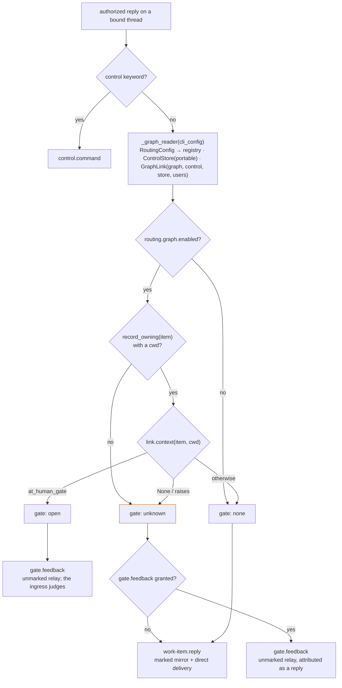

# Design: the pipeline reads the graph the way the dispatcher does, and defers to the ledger when it cannot

> Phase 2 of 3. Derived from [`bugfix.md`](bugfix.md); reviewed together with
> [`testing-plan.md`](testing-plan.md). Tier 3.

## Overview

Three moves, all in `cli/the_loop/channels/inbound.py` and one line beside it:

1. **One reader, built like the dispatcher's.** `_graph_reader(cli_config)` builds the
   `RoutingConfig` from `routing` and the state layout — the constructor both daemons
   use — and from it the registry, the `ControlStore` on the portable directory and
   the `GraphLink` with the control config and the allow-list: the four arguments
   `Dispatcher.__init__` passes, in the same order. `_at_human_gate` is that reader's
   `context()`.
2. **A three-valued answer.** `_at_human_gate` returns `True` (parked at a human gate),
   `False` (the graph says it is not, or the coupling is off — there are no gates) or
   `None` (the pipeline cannot tell: no record, no checkout, no context, a fault).
   Today's `bool` folded the third into the second.
3. **`None` defers to the ledger when the grant allows.** `classify` takes the channel's
   grants: `True` → `gate.feedback`; `None` with `gate.feedback` granted →
   `gate.feedback`; otherwise `work-item.reply`. The record of a deferred reply says
   *reply*, not *answer to the open gate*, and `channel.reply_received` carries the
   read's answer as `gate: open | none | unknown`.



## 1. The reader — `_graph_reader`

```python
def _graph_reader(cli_config) -> Tuple[RoutingConfig, SessionRegistry, GraphLink]:
    config = dict(cli_config or {})
    routing = RoutingConfig.from_mapping(dict(_routing(config)), _layout(config))
    registry = SessionRegistry(routing.registry_dir)
    link = GraphLink(
        routing.graph,
        routing.control,
        ControlStore(routing.portable_dir, legacy=routing.legacy),
        routing.authorized_users,
    )
    return routing, registry, link
```

`RoutingConfig.from_mapping` is what `poller/daemon._build_dispatcher` and
`webhook/daemon` call; `ControlStore(portable_dir, legacy=legacy)` is
`Dispatcher.__init__`'s own line; `_routing` / `_layout` are `core.sessions`' rule that
the config a call was *given* is the one read, never the default path. The imports are
lazy, as `_at_human_gate`'s already are — `webhook.dispatcher` is a heavy module the
poll watcher and `channels listen` need only when a reply arrives.

`registry_dir` is `routing.registryDir or layout.local_dir`: the value
`core.sessions._registry_dir(config, "")` computed before, so the registry the pipeline
opens does not move.

Why not a shared factory on `GraphLink`? `graphlink` cannot import `RoutingConfig`
(`webhook.dispatcher` imports `graphlink`), and the dispatcher's construction also
carries two sinks the reader must not have (it delivers no assignments and freezes no
graphs). The drift guard is a **test** instead (`testing-plan.md` T1): the reader's
control config, control-store root, allow-list and registry directory equal a
`Dispatcher`'s built over the same config.

## 2. The three-valued read — `_at_human_gate`

| Condition | Returns | Because |
|-----------|---------|---------|
| empty ref, or a standing session (`standing:<name>`) | `False` | no ticket, no graph |
| `routing.graph.enabled: false` | `False` | nothing drives a graph, so nothing is parked at a gate; the reply keeps its direct delivery |
| no session record, or a record with no `cwd` | `None` | the pipeline cannot see the graph — it may well be at a gate on a checkout this process does not know |
| `context()` is `None` (a `_guarded` skip: not started, a foreign checkout, a spec dir outside the checkout, a runtime fault) | `None` | the same: an answer the reader could not produce |
| any exception | `None` | as today, but named for what it is |
| a context | `context.at_human_gate` | the graph's own answer |

The first row is the one behaviour of 13.3.0 kept as a definite `False`: a standing
session has no ticket to relay onto.

## 3. Classification — `classify` and `_classify`

```python
def classify(reply, cli_config, grants=()) -> str            # public, unchanged shape
def _classify(reply, cli_config, grants) -> Tuple[str, str]  # (event type, gate word)
```

`_classify` keeps the order keyword → gate → reply and returns the read's word beside
the type (`open` / `none` / `unknown`; `n/a` for a control keyword, which never reads
the graph). `process_reply` calls it, puts `gate` on `channel.reply_received`, and
puts `{"gate": "unknown"}` in the event's `detail` when the fallback fired so the
ledger can phrase the record. `classify` is the same call without the word, so its
existing callers and tests keep their contract.

The grant is a *parameter of the fallback only*: a `True` read is `gate.feedback`
whatever the grants (the grant check after classification then drops it as
`unpublishable-event`, unchanged), and a `False` read is a reply whatever the grants.
Only "cannot tell" asks who is allowed to judge.

## 4. The record — `relay_body`

`relay_body` phrases the attribution from the event: `answer to the open gate` for a
gate the pipeline saw, `control command` for a keyword, and **`reply`** when
`event.detail["gate"] == "unknown"` — "recorded here so the loop reads it from the
work item" is already true of all three. Nothing else about the record changes: quoted,
scrubbed, unmarked, keywords intact, enveloped `gate.feedback` with the person's ids.

## 5. Observability — `eventlog`

`channel.reply_received` gains `gate` (`open | none | unknown`); its catalog
description names the field. `channel.dropped` and the rest are untouched.

## UI/UX design

N/A — a daemon-side classification. The one human-visible change is the attribution
word on a deferred record.

## Data models

None persisted. `GraphContext` is read, never written.

## Error handling

| Failure | Behaviour |
|---------|-----------|
| `webhook.dispatcher` / `graphlink` import or construction raises | caught in `_at_human_gate` → `None` (logged at debug with the work item) |
| `WorkItemRef.parse` fails | `None` → with the grant, the relay; the ledger's own parse then reports the bad ref as a failed record, as today |
| the registry directory is unreadable | `record_owning` raises → `None` |
| the checkout is gone (`cwd` points nowhere) | `_guarded` fails the ownership check → `context()` `None` → `None` |
| the ledger write fails for the relay | `channel.mirror_failed`, outcome `processed` with `mirrored: false` — unchanged |

## Security design

- **AuthN/AuthZ:** unchanged; see `bugfix.md` § Security considerations. The reader is
  handed the allow-list only so its construction equals the dispatcher's; no pipeline
  path calls anything but `context()`.
- **Input validation & injection surfaces:** the reply's text is never read to decide
  the gate; the graph state and the registry are the-loop's own files.
- **Fail-closed behaviour:** a reply the pipeline cannot place is judged by the ledger's
  ingress when the channel may answer gates, and stays a marked reply when it may not.
- **Abuse-case coverage:** A1–A5 in `bugfix.md`, one negative test each.

## Testing strategy

Unit tests on the reader (the drift guard, the coupling-off row, the no-record row, the
read-only guarantee), on the three-valued classification (each row of § 2 through
`process_reply`, with `_at_human_gate` patched to `True` / `False` / `None`), on the
record's attribution and on the event-log field, in `test_channels.py`; two scenarios
with Gherkin docstrings in `test_bus_integration.py`: the issue's reproduction against
a real checkout, a real registry record, a real `graph-state.json` and a recorded
`start` (red at `ba0c433`), and the no-session-record case. The executable detail is
in `testing-plan.md`.

## Trade-offs & decisions

[`decision-109`](../../decisions/decision-109.md): the read is the dispatcher's own
construction rather than a looser one (a reader with fewer guards would read graphs
the daemon has not proved are the work item's); "cannot tell" defers to the ledger
rather than to invisibility, and only within the grant; the marker on a
`work-item.reply` record stays, because the pipeline delivered that reply itself and
the ingress would deliver an unmarked copy again.

## Open questions

None.

## Review comments

> Appended by the-loop's `record-feedback` hook when a human gate approves with
> comments (issue-109). Append-only and attributed: an approval never silently
> discards a reviewer's suggestions, and the feedback travels with the document
> it concerns rather than living in a side-channel tracker.
