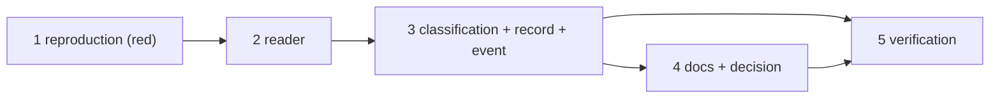

# Tasks: a channel's gate answer reaches the gate

> The last spec artifact. A DAG derived from the design and testing plan; each task names
> the testing-plan row that proves it. TDD: the test first, red, then green.

## Task list

- [x] 1. The reproduction — the two T2 scenarios in `test_bus_integration.py`, red at
  `ba0c433`
  - _Depends on:_ none
  - _Requirements:_ R1.1, R1.3, R1.8
  - _Test:_ T2
- [x] 2. The reader — `_graph_reader` and the three-valued `_at_human_gate` in
  `channels/inbound.py`
  - _Depends on:_ 1
  - _Requirements:_ R1.2, R1.5
  - _Test:_ T1 — `test_the_pipeline_reads_the_graph_through_the_dispatchers_own_coupling`, `test_a_disabled_graph_coupling_means_no_gate_to_answer`, `test_no_session_record_is_an_unknown_gate_not_a_closed_one`, `test_the_pipelines_read_moves_nothing`
- [x] 3. The classification — `_classify` / `classify(grants)`, `process_reply`, the
  `gate` field on `channel.reply_received` and its catalog description, the relay's
  attribution in `channels/github.py`
  - _Depends on:_ 2
  - _Requirements:_ R1.3, R1.4, R1.6, R1.7, R2.1, R2.2
  - _Test:_ T1 — the remaining rows of the trace table; T8
- [x] 4. Docs, capability doc, decision — `docs/config/cli/channels-options.md`,
  `skills/the-loop/reference/collaboration.md`, `docs/capabilities/channels.md`,
  `decision-109` + index row
  - _Depends on:_ 3
  - _Requirements:_ R3.1, the capability-docs gate
  - _Test:_ T10; T12 — `make check`
- [x] 5. Verification — execute `testing-plan.md`, record `evidence/verification.md` and
  `evidence/security-review.md`
  - _Depends on:_ 3, 4
  - _Requirements:_ all
  - _Test:_ T1, T2, T8, T10, T12, T13

## Dependency graph (DAG)

## Checkpoints

After task 1: the two scenarios red, recorded in `evidence/verification.md`. After
task 3: T1 and T2 green. After task 4: `make check`. Then the verification node, the
self-review rounds and the security review gate (`evidence/security-review.md`), then
the PR with the reviewer briefing.

## Review comments

> Appended by the-loop's `record-feedback` hook when a human gate approves with
> comments (issue-109). Append-only and attributed: an approval never silently
> discards a reviewer's suggestions, and the feedback travels with the document
> it concerns rather than living in a side-channel tracker.
