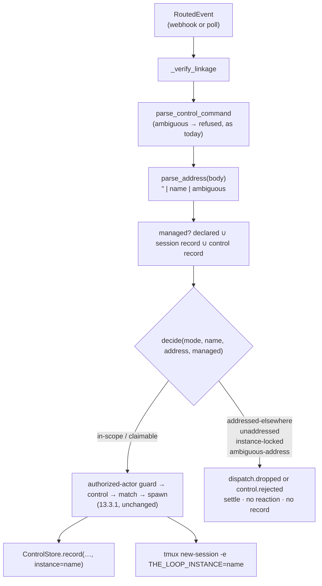

# Design: one `instance` block, one scope seam in the dispatcher, one address token

> Phase 2 of 3. Derived from [`requirements.md`](requirements.md); reviewed together with
> [`testing-plan.md`](testing-plan.md). Tier 4.

## Overview

Five moves, in the order an event meets them:

1. **The `instance` block** — `cli/the_loop/instance.py`: `InstanceConfig` (name, mode,
   declared refs), `parse_address` (the token grammar), and `decide` (the pure scope
   decision). Fanned into `routing` under a private key by `cli_config.load_cli_config`,
   the way `integrations.github.cli.binary` already reaches `routing.control` — so every
   `RoutingConfig.from_mapping` built from a loaded config carries it, and the hot-reload
   path rebuilds it with the rest (decision-109 D1: one construction).
2. **The scope seam** — `Dispatcher.handle`, after linkage verification and the control
   parse, before authorization and matching: `decide(...)` over the event's work items,
   its address and the instance's managed set. A refusal is recorded (`dispatch.dropped`,
   or `control.rejected` for an authorized command) and settled; nothing else happens.
3. **The record** — `ControlRecord.instance`, written by every `ControlStore.record`
   the dispatcher and `core.sessions` make; the CLI's posted keyword and the spawn
   announcement carry the name.
4. **The session** — `TmuxRunner.spawn_in` adds `-e THE_LOOP_INSTANCE=<name>` for a named
   instance, after one probe of the tmux version.
5. **The surface** — `core.instance.describe_instance` behind `GET /api/v1/instance`, in
   `the-loop status`, and on the SDK as `loop.instance()`.



## 1. The block — `instance.py`

```python
NAME_RE = re.compile(r"^[a-z0-9][a-z0-9-]{0,39}$")          # standing-session grammar
OPEN, ADDRESSED, LOCKED = "open", "addressed", "locked"
MODES = (OPEN, ADDRESSED, LOCKED)

@dataclass(frozen=True)
class InstanceConfig:
    name: str = ""
    mode: str = OPEN
    declared: Tuple[str, ...] = ()        # refs, normalised: github:owner/repo#15

    @classmethod
    def from_mapping(cls, data: Optional[Mapping]) -> "InstanceConfig": ...
    def declares(self, ref: str) -> bool: ...

@dataclass(frozen=True)
class Address:
    name: str = ""            # the one instance named, validated
    ambiguous: bool = False   # two or more different names
    matched: Tuple[str, ...] = ()

def parse_address(body: Optional[str]) -> Address: ...

# Outcomes. The first two accept; the rest refuse and are settled.
IN_SCOPE, CLAIMABLE = "in-scope", "claimable"
ADDRESSED_ELSEWHERE, UNADDRESSED, INSTANCE_LOCKED, AMBIGUOUS_ADDRESS = (
    "addressed-elsewhere", "unaddressed", "instance-locked", "ambiguous-address")

@dataclass(frozen=True)
class ScopeDecision:
    outcome: str
    @property
    def accepted(self) -> bool: return self.outcome in (IN_SCOPE, CLAIMABLE)

def decide(config: InstanceConfig, address: Address, managed: bool) -> ScopeDecision: ...
```

`from_mapping`: `name` must match `NAME_RE` in full, else a warning and `""`; `mode` must
be one of `MODES`, else a warning and `locked`; `addressed` with an empty name is a
warning and `locked` (R1.4, R1.5). Each `scope.workItems` entry goes through
`WorkItemRef.parse` for a ref, or the URL form `WorkItemRef.from_url` where one exists —
today refs are parsed by `WorkItemRef.parse` and a GitHub URL is recognised by a small
regex here (`https://<host>/<owner>/<repo>/(issues|pull)/<n>` → `github:[<host>/]owner/repo#n`,
the `github.com` host elided as `WorkItemRef` does). A bad entry is warned about **by
index** and skipped; the value is not echoed, because a config is data an operator may
have pasted from anywhere.

`parse_address`: `(?<![\w:/-])instance:([^\s]*)` — every occurrence; each captured
candidate is accepted only if it matches `NAME_RE`, else ignored (R3.4). Distinct accepted
names > 1 → `ambiguous`. The regex captures up to whitespace so that `instance:a b` yields
candidate `a` (valid) — the token is one word, and what follows it is prose.

`decide`, in this order (R2, R3):

| # | condition | outcome |
|---|-----------|---------|
| 1 | `address.ambiguous` | `ambiguous-address` |
| 2 | `address.name` and `address.name != config.name` | `addressed-elsewhere` |
| 3 | `managed` | `in-scope` |
| 4 | `config.mode == open` | `claimable` |
| 5 | `config.mode == locked` | `instance-locked` |
| 6 | `address.name == config.name` (non-empty, `addressed`) | `claimable` |
| 7 | otherwise (`addressed`, no address) | `unaddressed` |

Row 2 before row 3 is R3.2: an explicit address is authoritative even for a managed work
item. Row 5 before row 6 is R2.4 and abuse case 3: an address does not unlock.

## 2. The fan-out — `cli_config.py`

```python
def apply_instance(config: dict) -> dict:
    routing = config.setdefault("routing", {})   # only when the doc is non-empty
    routing["_instance"] = dict(config.get("instance") or {})
```

Called from `load_cli_config` beside `apply_integrations`, so every consumer of a loaded
config — the receiver's boot and `apply()` reload, the poller's `build_plan`, the
service's `ConfigHolder`, `core.sessions._routing`, `channels.inbound` — gets the block
through the one `RoutingConfig.from_mapping(routing, layout)` construction. `RoutingConfig`
gains `instance: InstanceConfig`, read from `data.get("_instance")`. A `RoutingConfig`
built from a bare routing dict (tests, a caller that never loaded a file) is unnamed and
open: 13.3.1.

`core.sessions.control_session` reads the same field off the `RoutingConfig` it already
builds, for R2.7.

## 3. The seam — `Dispatcher.handle`

Between the `control.ambiguous` return and `if control.command:`:

```python
address = parse_address(event_body(routed.event, routed.payload))
managed = any(self._manages(item) for item in routed.work_items)
scope = decide(self.config.instance, address, managed)
if not scope.accepted:
    self._refuse_scope(routed, scope, control)
    return
```

`_manages(item)`: `self.config.instance.declares(item.ref)` or
`self.registry.record_owning(item) is not None` or `self.control_store.get(item) is not
None`. All three reads already happen later in `handle` for an accepted event; the cost is
the reads happening once more for a refused one.

`_refuse_scope`: if `control.command` and the actor is authorized →
`_reject_control(command, routed, actor, scope.outcome)` (which emits `control.rejected`
and settles as `control-rejected`); else `dispatch.dropped` with `reason=scope.outcome`,
`instance=name`, the refs and the address, then `_settle(routed, scope.outcome)`. The
four refusal outcomes join `SETTLED_OUTCOMES` so `delivery_status` and the poll path read
them as deliberate. The delivery id stays in the deduper (a redelivery reaches the same
answer; a changed config is picked up by the *next* event, and the operator who changed
it runs `the-loop sessions start` on the instance to claim what was refused).

Why after the control parse and before authorization: the reject-vs-drop shape needs the
parsed command, and a refusal must come before anything is *recorded* — the authorized
path's first act is `_record_graph_command` / `_apply_control`. Why after linkage: a
branch-invented work item must not count as managed. The `deduper` check stays first so a
duplicate delivery is never re-judged.

The close path (`_is_close_event`) is behind the seam: an unmanaged item's close is dropped
on an `addressed`/`locked` instance, which is right — there is nothing here to close — and
`open` behaves as today.

## 4. The record, the comment, the announcement

- `ControlRecord.instance: str = ""` — in `to_dict` / `from_dict`; `ControlStore.record`
  takes `instance=""`. The dispatcher's `record()` closure, `_record_graph_command` and
  `core.sessions.control_session` pass `config.instance.name`.
- `command_comment(..., address="")` appends `instance:<address>` (space-separated) to the keyword line;
  `core.sessions._announce` passes the instance name. The self-authored marker is what
  keeps every instance — this one and the others — from reading it back; the token is
  for the humans and for a future manager reading the thread.
- `announcement_body(session, instance="")` adds an `| instance | \`name\` |` row when
  named; `SessionAnnouncer(config, instance=...)` receives it from the dispatcher's
  construction and reload. The body is still built only from registry fields plus the
  config value, never event text.

## 5. The session environment — `runner.py`

`TmuxRunner.instance: str = ""`; the dispatcher sets it from `config.instance.name` at
construction and on reload (like `remain_on_exit`); `core.standing._runner` passes it too,
so a standing session on a named instance knows its instance. `spawn_in` inserts
`["-e", f"THE_LOOP_INSTANCE={instance}"]` after `-c cwd` when `instance` is set **and**
`_supports_env()` — a once-per-runner `tmux -V` parse, `>= 3.2`, a warning and `False`
when the probe fails or the version is older. The name is the config value, validated by
`NAME_RE` (abuse case 6).

## 6. The surface — `core/instance.py`, the route, `status`, the SDK

```python
def describe_instance(config: Optional[dict] = None) -> Dict[str, Any]:
    # {"name", "scope": {"mode", "workItems": [refs]},
    #  "managed": [{"ref", "url", "source": "declared|session|control", "status"?}]}
```

Managed is assembled from `InstanceConfig.declared`, `SessionRegistry.list_sessions()`
(live records — `record_owning` semantics: status not `closed`), and
`WorkItemStore.refs()` filtered by `has_section(ref, CONTROL)`; one row per ref, the
sources merged into a list (`["declared", "control"]`). `status_all` adds
`instance: describe_instance(config)`; the text renderer prints
`instance    <name or "(unnamed)"> [<mode>] — N declared, M managed`. The route
`GET /api/v1/instance` (`operation_id="getInstance"`) is added to `routes.py` and to the
authored contract; the MCP registry is built from the core surface and picks it up as a
read tool. The SDK gains `TheLoop.instance()` in the client's own namespace table and
docs row (`test_sdk_docs_parity`).

## 7. The schema — `cli-config.schema.json` (authored + packaged, byte-identical)

```json
"instance": {
  "type": "object", "additionalProperties": false,
  "properties": {
    "name": {"type": "string", "default": "", "pattern": "^$|^[a-z0-9][a-z0-9-]{0,39}$"},
    "scope": {
      "type": "object", "additionalProperties": false,
      "properties": {
        "mode": {"type": "string", "enum": ["open", "addressed", "locked"], "default": "open"},
        "workItems": {"type": "array", "default": [], "items": {"type": "string"}}
      }
    }
  }
}
```

Additive: no version bump, no migration (`CURRENT_CONFIG_VERSION` stays 0.7.0), by the
issue-318 precedent.

## 8. Documentation

`docs/config/cli/instance-options.md` (`configBase: instance`; `### name`,
`### scope.mode`, `### scope.workItems`), a row in `docs/config/cli/index.md`'s
options-by-area table, the sidebar entries, `docs/cli/instances.md` (the guide, R5.2),
`docs/cli/state.md` (`control.instance`), `docs/cli/commands/status.md` (the line),
the template and this repository's `cli-config.yaml`, the OpenAPI contract,
`skills/the-loop/reference/automation.md` (the token beside the keywords), the new
capability doc `docs/capabilities/instances.md` with rows in `webhook-triggers.md`,
`cli.md` and `control-plane.md`, and [`decision-110`](../../decisions/decision-110.md).

## The future additions, and where they attach

| Future | Seam left by this design |
|--------|--------------------------|
| A **manager** instance exposing the same APIs aggregated across instances | every instance serves one identical surface; `GET /api/v1/instance` names it and lists what it manages; `control.instance` on each portable record says who took what. The manager is a client of N base URLs — the dashboard already takes a base URL per browser |
| An instance **managed from a ticket** (issue / Jira) | the address token is the vocabulary that ticket speaks to route work; `instance.ticket` is the reserved place for the binding, deliberately not in the schema yet so it is designed when its loop is |

## UI/UX design

N/A — the dashboard's Settings tab renders the new block from the schema description as it
renders every block; no screen is added.

## Data models

`InstanceConfig`, `Address`, `ScopeDecision` above, in memory. On disk:
`control.instance` in `<state.root>/portable/<slug>.json`.

## Error handling

| Failure | Behaviour |
|---------|-----------|
| no `instance` block | unnamed, open — 13.3.1 |
| `name` outside the grammar | warning; unnamed |
| unknown `scope.mode` | warning; `locked` |
| `addressed` with no name | warning; `locked` |
| a `scope.workItems` entry that does not parse | warning naming the index; skipped |
| `instance` not a mapping | warning; defaults |
| address token outside the grammar | not an address |
| two different addresses | `ambiguous-address`; dropped and settled |
| tmux older than 3.2 on a named instance | one warning; spawn without `-e` |
| `tmux -V` cannot be run | treated as unsupported; one warning |

## Security design

- **AuthN/AuthZ:** the seam sits after the self-marker and (for commands) after the
  authorized-actor guard, and its only power is refusal. An address token from an
  unauthorized actor changes nothing they could not already cause (abuse case 1).
- **Input validation & injection surfaces:** the token is grammar-validated before
  comparison; the decision reads a boolean and a validated name; the only values that
  reach an argv (`-e`), a comment or a record are config values validated by `NAME_RE`
  (abuse cases 2, 6). Declared refs are parsed, never echoed.
- **Fail-closed behaviour:** unknown mode → `locked`; addressed-without-name →
  `locked`; an address never unlocks (abuse cases 3, 4).
- **No marks from a non-owner:** a refused event returns before any reaction, comment,
  record or registry write (abuse case 5).
- **Abuse-case coverage:**

| # | Abuse case | Mechanism | Negative test |
|---|------------|-----------|---------------|
| A1 | an unauthorized commenter addressing an instance | actor guard unchanged; the seam only refuses | `test_an_unauthorized_address_grants_nothing` |
| A2 | a token shaped to escape the grammar | `NAME_RE` on every candidate; body text reaches nothing | `test_a_malformed_token_is_not_an_address_and_reaches_no_record` |
| A3 | addressing a locked instance | row 5 before row 6 in `decide` | `test_an_address_does_not_unlock_a_locked_instance` |
| A4 | an unknown mode after a reload | `from_mapping` → `locked` | `test_an_unknown_mode_resolves_to_locked` |
| A5 | a non-owner leaving marks | refusal returns before reactor/announcer/stores | `test_a_refused_event_leaves_no_mark` |
| A6 | event text reaching the argv or a comment | only `config.instance.name` is interpolated | `test_only_the_configured_name_reaches_tmux_and_the_comment` |

## Testing strategy

Unit tests on `instance.py` (config parsing, the token grammar, the decision table),
the record round-trip, the comment and announcement bodies, the tmux argv and version
probe, `describe_instance`, and the status line; integration scenarios with two
dispatchers on one event stream (`test_instance_integration.py`, Gherkin docstrings);
contract, docs and schema parity. The executable detail is in `testing-plan.md`.

## Trade-offs & decisions

[`decision-110`](../../decisions/decision-110.md): the scope lives in `cli-config.yaml`
rather than a second file; the managed set is *derived* from records the instance
already keeps plus a declared list, rather than a second registry of "my work items";
three modes rather than a boolean lock; an address token in the comment rather than a
per-instance keyword vocabulary; refusal is silent on the thread; the future manager is a
client, not a peer protocol.

## Open questions

None.

## Review comments

> Appended by the-loop's `record-feedback` hook when a human gate approves with
> comments (issue-109). Append-only and attributed: an approval never silently
> discards a reviewer's suggestions, and the feedback travels with the document
> it concerns rather than living in a side-channel tracker.
