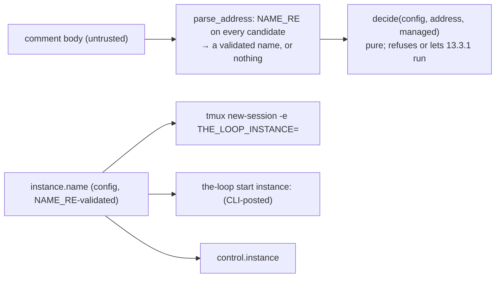

# Security review — issue-322 (instances scoped to their own work items)

> Mechanism: the-loop checklist (`security.review.mechanism: auto`; no security-review
> skill is invocable from this session's plugin set). Tier 4 (`riskTier: 4` ≥
> `security.review.humanSignOffMinTier: 4`): a **named human sign-off is required** and
> is requested from the owner at the PR; the autonomous review below is the material for
> it, not a substitute.

## What changed at the trust boundary

The dispatch path gained one seam that can only **refuse**. Comment text gained one new
thing the daemon reads to decide — the address token — and that token is grammar-validated
before it is compared with anything. The only values that reach a tmux argv, a comment
body or a record are config values validated by `instance.NAME_RE`.

## Abuse cases

| # | Abuse case | Mechanism | Test | Verdict |
|---|------------|-----------|------|---------|
| A1 | an unauthorized commenter addresses an instance (`the-loop start instance:alpha` by `mallory`) | the scope seam runs before the authorized-actor guard only to *refuse*; an accepted event reaches the guard unchanged, which rejects `unauthorized-actor` as before. Nothing is spawned, recorded or posted | `test_instance_integration.py::test_an_unauthorized_address_grants_nothing` | closed |
| A2 | a token shaped to escape the grammar (`instance:LAPTOP`, `instance:../etc`, `instance:a/b`, `instance:-x`, `instance: a`, `http://instance:a`) | `_TOKEN_RE` needs a word boundary before `instance:`; every candidate is matched against `NAME_RE` in full or discarded; nothing but a validated name is kept, logged or compared | `test_instance.py::test_a_malformed_token_is_not_an_address_and_reaches_no_record` (eleven bodies) | closed |
| A3 | an authorized user addresses a `locked` instance | `decide` tests `locked` before it tests the address (row 5 before row 6); the refusal is recorded as `control.rejected` / `instance-locked` and settled | `test_instance.py::test_an_address_does_not_unlock_a_locked_instance`; `test_instance_integration.py::test_an_address_does_not_unlock_a_locked_instance_but_a_declaration_does` | closed |
| A4 | a config (re)load with an unknown `scope.mode`, or `addressed` on an unnamed instance | `InstanceConfig.from_mapping` warns and resolves to `locked`, never `open` | `test_instance.py::test_an_unknown_mode_resolves_to_locked`, `::test_the_block_addressed_without_a_name_is_locked` | closed |
| A5 | a non-owner leaving a mark on a work item it refused | `_refuse_scope` returns before the reactor, the announcer, the control store, the collaborator store and the registry; the portable directory is not even created | `test_instance_integration.py::test_a_refused_event_leaves_no_mark` (no `portable/`, no session, no spawn, no delivery, one `dispatch.dropped`) | closed |
| A6 | event text reaching the tmux argv or a posted comment through the instance name | only `config.instance.name` is interpolated; a name like `instance:evil` fails `NAME_RE` at config load and the instance is unnamed, so no `-e` flag and no token | `test_instance.py::test_only_the_configured_name_reaches_tmux_and_the_comment` | closed |

## Checklist

- **AuthN/AuthZ unchanged.** No new grant; the authorized-actor guard and the
  self-authored marker still gate every command; a collaborator still cannot spawn.
- **Input validation.** One new parser (`parse_address`), closed grammar, tested against
  eleven malformed shapes; declared refs go through `WorkItemRef.parse` and are reported
  by index, never echoed.
- **Injection surfaces.** The tmux argv gains one element built from a `NAME_RE` value;
  the posted comment gains one token built from the same value; no payload text reaches
  either.
- **Secrets.** None touched. `THE_LOOP_INSTANCE` carries a name, not a credential.
- **Fail closed.** Unknown mode → `locked`; addressed-without-name → `locked`; an
  ambiguous address refuses everywhere; a refused event is settled, not retried.
- **Least privilege across instances.** Instances share nothing; a refusal writes nothing
  another instance or a human could read as a decision.
- **Compatibility.** An unnamed open instance runs the 13.3.1 path: the existing control,
  graphlink and dispatcher suites pass unchanged.

## Outcome

**Pass** on the autonomous review: six abuse cases, six closed by tests. **Human sign-off:
pending** — tier 4 requires the owner's named sign-off at the PR before the work item
completes.
