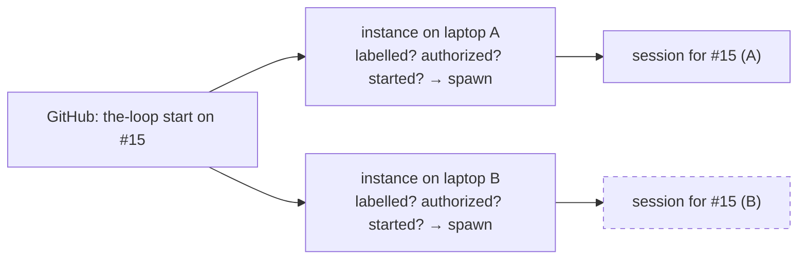

# Requirements: several instances of the-loop, each scoped to its own work items

> Phase 1 of 3 (requirements → design → tasks). Tier 4 (`human-approves-pr`, and a named
> human security sign-off at `humanSignOffMinTier: 4`): the change adds a seam to the
> **dispatch path** — the one place an event becomes a session — and a block to
> `cli-config.schema.json` (an `autonomy.sensitivePaths` entry). It widens no grant: an
> instance that ignores an event is the only new outcome.

## Introduction

[Issue #322](https://github.com/MadaraUchiha-314/the-loop/issues/322) asks for several
instances of the-loop to run at once, each in an isolated environment the operator
provides, each **scoped to a set of work items** — and for a way to tell an instance which
work items are its own, and to **lock** it so it takes on nothing more.

At `10a55b3` (13.3.1) every instance of the-loop is the same instance. The receiver and
the poller are configured by one `cli-config.yaml`; every event on every work item that
carries the auto-execute label is judged by every daemon that sees it, and the judgement
is the same everywhere: labelled, authorized, started → spawn. Two operators — or one
operator with two laptops — running the-loop against the same repository would each
spawn a session for the same `the-loop start`, in two checkouts, with two dev servers
fighting over one port.

This work item gives an instance an **identity** and a **scope**: a name, a mode that says
how new work items reach it, and a declared list of the work items it manages. The
environment the instance runs in — the machine, the container, the checkout, the ports —
stays the operator's concern, exactly as the issue says.

## Requirements

### Requirement 1 — an instance has a name and a scope, declared in the CLI config

**User story:** As an operator running more than one instance, I want each instance to
carry a name and a declared scope in its own CLI config, so that the config that already
defines *this* daemon also says what it works on.

#### Acceptance criteria (EARS)

1.1 The CLI config SHALL accept a top-level `instance` block with `name` (a string
matching `^[a-z0-9][a-z0-9-]{0,39}$`, or empty), `scope.mode` (one of `open`,
`addressed`, `locked`) and `scope.workItems` (a list of work-item references, each a
`<provider>:<owner>/<repo>#<n>` ref or a GitHub issue / pull-request URL).

1.2 Unset, the block SHALL resolve to an **unnamed, open** instance whose behaviour is
byte-for-byte that of 13.3.1: every existing config, test and daemon SHALL behave
identically. No config version bump and no migration SHALL be needed — the block is
additive.

1.3 The scope SHALL live in `cli-config.yaml` and **not** in a second file: an instance
*is* a running `cli-config.yaml` (decision-032 — the daemon is not tied to a repository),
the file is hot-reloaded by both daemons and the service, and it is editable from the
dashboard's Settings tab. A scope edit SHALL take effect on the next event without a
restart, through the reload the daemons already run.

1.4 A `scope.workItems` entry that does not parse SHALL be warned about, by position, and
skipped; the remaining entries SHALL still be honoured. A `name` outside its grammar SHALL
be warned about and treated as unset. An unrecognised `scope.mode` SHALL be warned about
and resolved to **`locked`** — the closed choice, because a scope typo must never make an
instance take on work it was not meant to.

1.5 `scope.mode: addressed` with an empty `name` SHALL be warned about and resolved to
`locked`: nothing can address an instance that has no name, so the open reading would be a
lie.

### Requirement 2 — an instance manages a closed set, and its mode says how the set grows

**User story:** As an operator, I want to say whether an instance takes on new work items
on its own, only when addressed, or never, so that two instances watching the same
repository cannot both pick up the same ticket.

The **managed set** of an instance is the union of: the work items declared under
`scope.workItems`; the work items with a live session record in the instance's registry;
and the work items with a control record (a recorded start, stop, pause, resume,
contribute, do, review or cleanup) in the instance's portable state. A work item leaves
the set when its session closes and its control record is cleared, as today, or when its
declaration is removed.

#### Acceptance criteria (EARS)

2.1 WHEN an event names a work item in the managed set THEN the instance SHALL handle it
exactly as at 13.3.1, in every mode — delivery to its session, a control command, a
close, a collaborator grant, a graph command.

2.2 WHEN an event names no work item in the managed set AND `scope.mode` is `open` THEN
the instance SHALL judge it as at 13.3.1 (label, authorization, start) — the default is
the current behaviour, so a single instance that names itself changes nothing.

2.3 WHEN an event names no work item in the managed set AND `scope.mode` is `addressed`
THEN the instance SHALL take the work item on only if the event **addresses this
instance by name** (Requirement 3); otherwise the event SHALL be dropped, recorded as
`dispatch.dropped` with reason `unaddressed`, and settled — not retried, not redelivered,
not reacted to, not commented on.

2.4 WHEN an event names no work item in the managed set AND `scope.mode` is `locked` THEN
the instance SHALL drop it, recorded with reason `instance-locked`, whether or not the
event addresses this instance. The only way into a locked instance's set SHALL be an edit
to `scope.workItems`.

2.5 WHEN a dropped event carried a control command from an authorized user THEN the drop
SHALL be recorded as `control.rejected` with the same reason, so the operator who typed
it can find out why nothing happened — and it SHALL still be settled, because the
instance's answer would be the same on a retry.

2.6 An instance SHALL NOT react (emoji), comment, or write any portable or local record
for an event it drops as out of scope: another instance may own that work item, and a
non-owner that leaves marks on the thread is noise at best and a second `stop` at worst.

2.7 `the-loop sessions start <ref>` (and its API and MCP forms) run **on** an instance
SHALL count as addressed to that instance: it SHALL claim the work item on an `addressed`
instance, and SHALL be refused — exit code 1, effect `instance-locked`, nothing recorded,
nothing posted — on a `locked` instance whose managed set does not hold the work item.

### Requirement 3 — a control comment can address one instance by name

**User story:** As an authorized user, I want to name the instance that should take a work
item when I start it, so that with several instances listening I decide which one runs it.

#### Acceptance criteria (EARS)

3.1 A comment SHALL be able to carry an **address token** `instance:<name>` — matched as a
whole token anywhere in the body, case-insensitive on the `instance:` prefix, the name
validated against the name grammar of 1.1 — beside any control keyword: `the-loop start
instance:laptop-b`.

3.2 WHEN a comment addresses an instance whose name is not this instance's (an unnamed
instance included) THEN this instance SHALL drop the event, recorded with reason
`addressed-elsewhere` (or `control.rejected` per 2.5), in every mode and whether or not the
work item is in its managed set: an explicit address is authoritative.

3.3 WHEN a comment carries address tokens naming two or more **different** instances THEN
every instance SHALL drop it, recorded with reason `ambiguous-address`, exactly as a
comment carrying two different control keywords is refused (issue-106).

3.4 A token that does not fit the grammar (`instance:` followed by nothing, or by a name
with a capital letter, a slash or a space) SHALL NOT be an address: the comment is read
as unaddressed. Nothing from the comment body other than a grammar-validated name SHALL
reach a record, a log line or a decision.

3.5 The address token SHALL be recognised on both ingresses (webhook and poll) and on
every event type that carries a body a control keyword is read from.

### Requirement 4 — which instance took a work item is on the record

**User story:** As an operator or a future manager of several instances, I want to see
which instance is managing a work item, so that I can find the session and the checkout.

#### Acceptance criteria (EARS)

4.1 WHEN an instance records a control command for a work item THEN the record
(`<state.root>/portable/<slug>.json` → `control`) SHALL carry the instance's `name`
(empty for an unnamed instance) as `instance`. Records written before this field existed
SHALL read as unnamed.

4.2 WHEN a named instance posts a control keyword back to the ticket from the CLI
(`the-loop sessions start|pause|resume|stop|cleanup`, `add-collaborator`,
`remove-collaborator`) THEN the posted comment SHALL carry the address token naming that
instance, so the thread says which instance acted — and every other instance, reading
the self-authored marker as today, ignores it.

4.3 WHEN a named instance announces a spawned session on the ticket (issue-86) THEN the
announcement SHALL name the instance in its table.

4.4 The control-plane API SHALL expose `GET /api/v1/instance`: the instance's name, its
scope (mode and the declared work items, normalised to refs), and its managed set with
the source of each entry (`declared`, `session`, `control`). The authored OpenAPI contract
SHALL carry the route and the parity test SHALL pass. This is the seam a future manager
instance aggregates across (§ Out of scope).

4.5 `the-loop status` SHALL print one line naming the instance and its scope mode, and
its JSON form SHALL carry the same `instance` document 4.4 returns.

4.6 A harness session a **named** instance spawns SHALL find `THE_LOOP_INSTANCE=<name>`
in its environment, so a dev server the session starts can derive a port or a container
name from it. An unnamed instance SHALL set nothing and spawn with the argv it uses today.

### Requirement 5 — the change is documented where instances are configured and run

#### Acceptance criteria (EARS)

5.1 The `instance` options SHALL be documented under `docs/config/cli/` with type, default
and grammar; the docs↔schema parity test SHALL pass.

5.2 A guide page under `docs/cli/` SHALL explain running several instances: the three
modes, the address token, the locked instance, what stays the operator's concern
(isolation, ports, checkouts), and the two clashes the design does **not** prevent (two
`open` instances; one work item declared on two instances).

5.3 The shipped template and this repository's own `cli-config.yaml` SHALL carry the
block at its defaults, commented; `docs/cli/state.md` SHALL document `control.instance`;
the skill's automation reference SHALL mention the address token beside the keywords.

## Non-functional requirements

- **Dependencies:** none added. tmux's `-e` (3.2+) is used to pass the instance name into
  a spawned session and only when the instance is named; an older tmux is detected once
  and the variable omitted with a warning, never a failed spawn.
- **Cost:** one registry lookup and one portable-record read per event, both already
  performed by the matching step that follows; the scope decision is a pure function.
- **Reload:** the block is soft policy — hot-reloaded with the rest of `routing` by the
  receiver, the poller and the service, so a scope edit needs no restart.
- **Observability:** every drop is an event-log record naming the reason and the
  instance; `GET /api/v1/instance` and `the-loop status` show the live scope.
- **Compatibility:** an unnamed open instance is 13.3.1; `control.instance` is additive
  in the portable record; the `GET /api/v1/instance` route is additive in the contract.

## Security considerations

- **Actors & trust:** the operator (trusted; owns the config and the machine each instance
  runs on); authorized users (trusted to steer, by `routing.authorizedUsers`); work-item
  collaborators (input only, issue-307); anyone who can comment on a public repository
  (untrusted); a second instance of the-loop (trusted as far as its own config goes —
  instances share no state and cannot speak to each other).
- **Trust boundaries & data:** the address token is the one new piece of comment text
  the daemon *reads to decide*. It is validated against a closed grammar before it is
  compared with anything, and only the validated name is ever recorded. The scope
  decision runs **after** the self-authored marker and the authorized-actor guard where
  a command is involved, and can only *narrow* what an instance does: no mode and no
  token can make an instance spawn, record or post where 13.3.1 would not.
- **Abuse cases (EARS):**
  1. WHEN an unauthorized commenter writes `instance:laptop-b` on a work item THEN no
     instance SHALL take, drop-with-record, or act on anything it would not have without
     the token: the authorized-actor guard still refuses the command, and a plain comment
     from a non-collaborator was already never delivered.
  2. WHEN a comment body carries a token shaped to escape the grammar
     (`instance:../etc`, `instance:LAPTOP`, `instance:a b`) THEN it SHALL be read as no
     address; the body text SHALL reach no log line, no record, no argv.
  3. WHEN an authorized user addresses an instance that is `locked` THEN the instance
     SHALL refuse and record the refusal; the address SHALL NOT unlock it.
  4. WHEN a config reload sets a mode the daemon does not know THEN the instance SHALL
     resolve to `locked` and say so, never to `open`.
  5. WHEN an instance drops an event as out of scope THEN it SHALL leave no reaction,
     comment, control record, collaborator grant or session record — nothing that a
     second instance, or a human, could read as a decision.
  6. WHEN the instance name reaches a tmux argv (`-e THE_LOOP_INSTANCE=<name>`) or a
     comment body THEN it SHALL be the grammar-validated config value, never text from
     an event.
- **Fail closed:** every unresolvable state (unknown mode, addressed-without-name, a
  malformed declaration) narrows the instance; an out-of-scope event is settled so it is
  not retried into a different answer.

## Out of scope

- **Spinning up the isolated environments.** How an instance gets its machine,
  container, checkout root or port range is the operator's; the-loop hands the session
  `THE_LOOP_INSTANCE` and nothing else.
- **A manager instance** that aggregates every instance's API. This work item leaves the
  seam it will use: one identical surface per instance, `GET /api/v1/instance` naming
  each, and `control.instance` on every portable record. The manager is a client of N
  base URLs, which the dashboard already parameterises.
- **Managing an instance from a ticket** (an issue or Jira item that *is* the instance).
  The address token is the vocabulary such a ticket would speak; the `instance` block is
  where its binding (`instance.ticket`) would go. Neither is added now.
- Claiming a work item *away* from another instance, or any instance-to-instance
  protocol. Instances share nothing; a work item declared on two instances is managed by
  two instances.
- A `the-loop instance` command. `status` carries the line; the API carries the document.

## Open questions

The issue asks three questions; each is answered in the design and its decision:

- *A new file, or `cli-config.yaml`?* — `cli-config.yaml` (1.3, decision-110 D1).
- *How does one tell the-loop to be scoped to a work item?* — declare it under
  `scope.workItems`, or address the instance on the start comment (Requirement 3), or
  run `the-loop sessions start` on it (2.7).
- *How does one lock an instance?* — `scope.mode: locked` (2.4).

## Review comments

> Appended by the-loop's `record-feedback` hook when a human gate approves with
> comments (issue-109). Append-only and attributed: an approval never silently
> discards a reviewer's suggestions, and the feedback travels with the document
> it concerns rather than living in a side-channel tracker.
