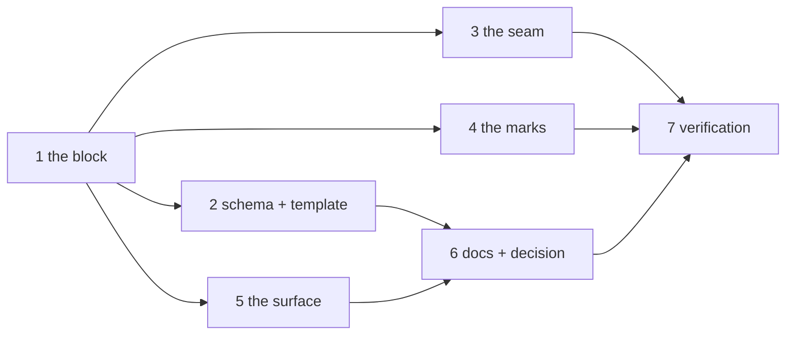

# Tasks: instances scoped to their own work items

> The last spec artifact. A DAG derived from the design and testing plan; each task names
> the testing-plan row that proves it. TDD: the test first, red, then green.

## Task list

- [x] 1. The block — `cli/the_loop/instance.py`: `InstanceConfig`, `parse_address`,
  `decide`, the outcome constants; `cli_config.apply_instance`; `RoutingConfig.instance`
  - _Depends on:_ none
  - _Requirements:_ R1.1, R1.2, R1.4, R1.5, R3.1, R3.3, R3.4, R2.1–R2.4 (the table)
  - _Test:_ T1 — `test_instance.py::test_the_block_*`, `::test_the_token_*`,
    `::test_decide_*`, `::test_an_unknown_mode_resolves_to_locked`,
    `::test_a_malformed_token_is_not_an_address_and_reaches_no_record`
- [x] 2. The schema — `instance` in `.the-loop/cli-config.schema.json` and the packaged
  copy; the template and this repository's `cli-config.yaml`
  - _Depends on:_ 1
  - _Requirements:_ R1.1, R1.2, R5.3
  - _Test:_ T10 — `test_config_schema_parity.py`, `test_migrations.py`, `make validate`
- [x] 3. The seam — `Dispatcher._manages`, `_refuse_scope`, the call in `handle`;
  `SETTLED_OUTCOMES`; `ControlRecord.instance` and the three `record` call sites;
  `core.sessions.control_session`'s locked refusal
  - _Depends on:_ 1
  - _Requirements:_ R2.1–R2.7, R3.2, R3.5, R4.1
  - _Test:_ T2 — `test_instance_integration.py` (every scenario); T8 —
    `test_an_unauthorized_address_grants_nothing`,
    `test_an_address_does_not_unlock_a_locked_instance`,
    `test_a_refused_event_leaves_no_mark`
- [x] 4. The marks — `command_comment(address=)` and `core.sessions._announce`;
  `announcement_body(instance=)` and `SessionAnnouncer`; `TmuxRunner.instance`, the
  version probe and the `-e` argv; the dispatcher and `core.standing` setting it
  - _Depends on:_ 1
  - _Requirements:_ R4.2, R4.3, R4.6
  - _Test:_ T1 — `test_control.py::test_the_posted_keyword_carries_the_address`,
    `test_announce.py::test_the_announcement_names_the_instance`,
    `test_instance.py::test_a_named_instance_spawns_with_the_environment_variable`,
    `::test_an_old_tmux_gets_no_environment_flag_and_one_warning`; T8 —
    `test_only_the_configured_name_reaches_tmux_and_the_comment`
- [x] 5. The surface — `core/instance.py::describe_instance`; `GET /api/v1/instance` in
  `routes.py` and the authored contract; `status_all` and the `status` line; the SDK's
  `instance()` and its docs row
  - _Depends on:_ 1
  - _Requirements:_ R4.4, R4.5
  - _Test:_ T1 — `test_instance.py::test_describe_instance_*`,
    `test_lifecycle_cmd.py::test_status_prints_the_instance_line`; T3 —
    `test_api_contract_parity.py`, `test_mcp_integration.py`; T10 —
    `test_sdk_docs_parity.py`
- [x] 6. Docs, capability docs, decision — `docs/config/cli/instance-options.md`,
  `docs/config/cli/index.md`, the sidebar, `docs/cli/instances.md`, `docs/cli/state.md`,
  `docs/cli/commands/status.md`, `skills/the-loop/reference/automation.md`,
  `docs/capabilities/instances.md` + index, rows in `webhook-triggers.md`, `cli.md`,
  `control-plane.md`; `decision-110` + index row
  - _Depends on:_ 2, 5
  - _Requirements:_ R5.1–R5.3, the capability-docs gate
  - _Test:_ T10 — `test_docs_parity.py`; T12 — `make check`
- [x] 7. Verification — execute `testing-plan.md`, record `evidence/verification.md` and
  `evidence/security-review.md`
  - _Depends on:_ 3, 4, 6
  - _Requirements:_ all
  - _Test:_ T1, T2, T3, T8, T10, T12, T13

## Dependency graph (DAG)

## Checkpoints

After task 1 and after task 3: the named tests red → green recorded in
`evidence/verification.md`. After task 5: the contract and MCP tests green. After task 6:
`make check`. Then the verification node, then the self-review rounds and the security
review gate (`evidence/security-review.md`), then the PR with the reviewer briefing.

## Review comments

> Appended by the-loop's `record-feedback` hook when a human gate approves with
> comments (issue-109). Append-only and attributed: an approval never silently
> discards a reviewer's suggestions, and the feedback travels with the document
> it concerns rather than living in a side-channel tracker.
