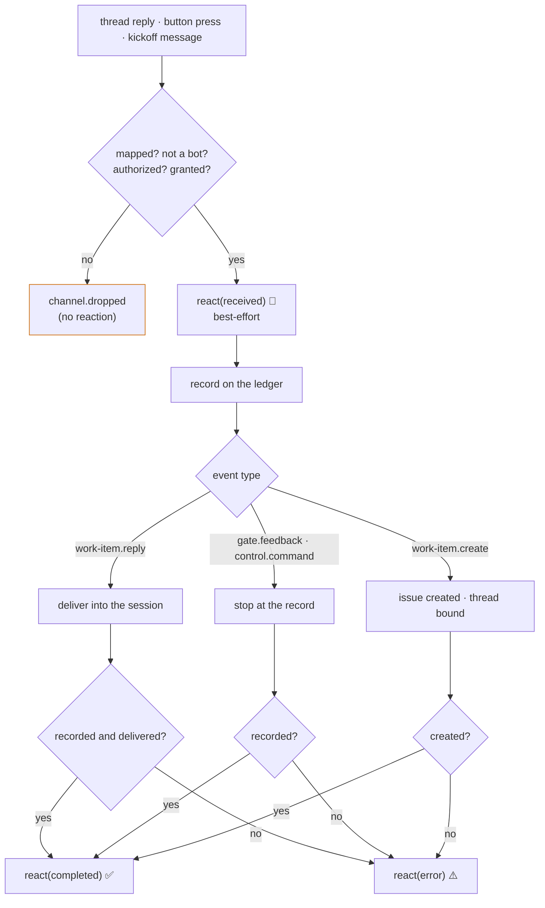

# Design: the Slack channel reacts on the message it accepted

> Phase 2 of 3. Derived from [`requirements.md`](requirements.md); reviewed together with
> [`testing-plan.md`](testing-plan.md). Tier 3.

## Overview

Four moves, three of them in `cli/the_loop/channels/`:

1. **A config block, parsed like the rest of the section.** `SlackReactionConfig`
   (frozen: `enabled`, `received`, `completed`, `error`) parsed from
   `channels.slack.reactions` inside `SlackChannelConfig.from_mapping`, validated
   against one grammar, defaults equal to the schema's.
2. **One method on the channel.** `SlackBotChannel.react(reply, state) -> bool` — the
   `reactions.add` call, on `reply.channel_id` / `reply.ts`, through the same
   `_client()` every other call uses. It **never raises**: every failure is a
   `channel.reaction_failed` line and `False`.
3. **Two calls on each accepted path of the pipeline.** `process_reply` and
   `process_kickoff` react `received` after the grant check and before the record, and
   `completed` or `error` after the action, from the outcome they already compute. A
   dropped message never reaches either call.
4. **The socket transports hand the pipeline a channel.** `handle_socket_event` and
   `handle_socket_action` build a `SlackBotChannel` (with an injectable
   `client_factory`, as `poll_once` has) and pass it in; the button press's `ts`
   becomes the pressed message's `ts`.



The GitHub reactor is not reused. `reactions.py` is built around a `RoutedEvent` and a
`gh` argv, and its palette is GitHub's fixed eight; the Slack call is one SDK method
with a free emoji name. What is mirrored is the **contract** — enabled by default,
three states, `""` skips one, best-effort, ids-only events — not the code.

## 1. The config — `SlackReactionConfig`

```python
REACTION_STATES = ("received", "completed", "error")
DEFAULT_REACTIONS = {"received": "eyes", "completed": "white_check_mark", "error": "warning"}
_EMOJI_NAME_RE = re.compile(r"^[a-z0-9_+-]{1,100}$")

@dataclass(frozen=True)
class SlackReactionConfig:
    enabled: bool = True
    received: str = "eyes"
    completed: str = "white_check_mark"
    error: str = "warning"

    def content_for(self, state: str) -> str: ...      # "" = skip
    @classmethod
    def from_mapping(cls, raw: Any) -> "SlackReactionConfig": ...
```

`from_mapping` takes the raw `reactions` value of the section: `None` → defaults; not a
mapping → a warning and the defaults; each state's value → stripped of surrounding
colons (`:eyes:` is how Slack renders the name and how people copy it), then matched
against the grammar — a miss is a warning naming the key and the value, and `""` for
that state. `enabled` is `bool(raw.get("enabled", True))`. The grammar admits Slack's
built-in names (`white_check_mark`, `+1`, `-1`), skin-tone suffixes are not needed for
a reaction, and a workspace's custom emoji names follow the same rules.

`SlackChannelConfig` gains `reactions: SlackReactionConfig = SlackReactionConfig()`,
parsed inside the existing `try` so a malformed value degrades with the section, and
the `TypeError`/`ValueError` net stays one.

## 2. The call — `SlackBotChannel.react`

```python
def react(self, reply: InboundReply, state: str) -> bool:
    """Add the configured reaction for ``state`` to ``reply``'s message. Never raises."""
```

| Step | Outcome |
|------|---------|
| `reactions.enabled` false, or `content_for(state) == ""` | `False`, silent |
| no `reply.ts` or no channel id (`reply.channel_id or self.config.channel`) | `False`, debug |
| `_client()` raises `ChannelError` (no token) | `False`, debug — R3.2 |
| `client.reactions_add(channel=…, timestamp=reply.ts, name=…)` raises | `False`, `channel.reaction_failed` at warning, with `str(exc)` as `error` |
| success | `True`, `channel.reaction_added` at debug |

`reactions_add` is the SDK's method name for `reactions.add`; the fake clients in the
tests grow the same method. The SDK's default timeout (30 s) bounds the call (A5); no
retry, no removal. The work item on the events is `reply.work_item` (empty for a
kickoff until the issue exists — the event then carries none, as `channel.dropped`
does for an unmapped message).

`react` is a method on the channel rather than a function in `inbound.py` because the
channel owns the client, the token rule and the config; the pipeline owns *when*.

## 3. The pipeline — where the two calls sit

`process_reply`, after the grant check and `channel.reply_received`:

```python
bot = channel or SlackBotChannel(config, slack_state_path(cli_config))
bot.react(reply, "received")
...
recorded = _record(event, reply, cli_config, post_comment)
if event_type != "work-item.reply":
    bot.react(reply, "completed" if recorded else "error")
    return {...}
delivered = _deliver(reply, cli_config, deliver)
bot.react(reply, "completed" if recorded and delivered else "error")
```

`process_kickoff`, after the authorization and the empty-text check: `received`; after
`publish(...)`: `error` on `create-failed`, `completed` once `bind` and `say` have run
(the "Opened …" reply is the human's link; the ✅ is the at-a-glance mark on their
own message). The channel it uses is the one it already builds for `bind`/`say`, built
earlier.

A standing session's reply (`standing:<name>`) is accepted like any other and reacted
on like any other — the mirror is skipped there, so *lands* is delivery alone for it:
`_record` returns `False` for a standing ref today, which would read as `error`. The
pipeline therefore treats the mirror-skipped case as recorded for the reaction's
purpose: `recorded or parse_standing_ref(reply.work_item)`.

Nothing else in the pipeline moves. The order map → drop-own → authorize → classify →
grant → **ack** → record → deliver → **ack** keeps the record before any delivery (D6)
and puts the first acknowledgment after the last refusal (R1.4).

## 4. The transports

- `poll_once` already passes `channel=channel` to `process_reply` and `process_kickoff`;
  the same instance reacts.
- `handle_socket_event(event, cli_config, *, …, client_factory=None)` and
  `handle_socket_action(payload, cli_config, *, …, client_factory=None)` build
  `SlackBotChannel(config, state_path, client_factory=client_factory)` once and pass it
  to `process_reply` / `process_kickoff`. The listener calls them with the default
  factory (`build_client`, resolved at call time), exactly as `post` resolves it.
- `handle_socket_action` sets `reply.ts` to
  `container.message_ts or message.ts or action_ts`: the message carrying the button
  is the only message a press has, and nothing read `action_ts` from the reply (the
  action path advances no cursor).

## 5. The schema

`channels.slack.reactions` in both copies of `cli-config.schema.json` (the authored
`.the-loop/` one and the packaged `cli/the_loop/schemas/` one — `test_config_schema_parity`
pins them byte-identical): an object, `additionalProperties: false`, with `enabled`
(boolean, default `true`) and the three string states (defaults `eyes`,
`white_check_mark`, `warning`; `pattern: ^([a-z0-9_+-]{1,100})?$`). Purely additive.
The description names the scope (`reactions:write`), the best-effort contract and
that Slack's palette is open where GitHub's is fixed.

## 6. Observability

| Event | Level | Fields |
|-------|-------|--------|
| `channel.reaction_added` | debug | `channel`, `work_item`, `state`, `content`, `thread` |
| `channel.reaction_failed` | warning | `channel`, `work_item`, `state`, `content`, `thread`, `error` |

Both join `EVENT_TYPES` (the catalog test refuses an emitted type it does not know).
`content` is the emoji name, as `reaction.added` carries the GitHub content.

## UI/UX design

N/A — the visible change is three emoji on the operator's own Slack message.

## Data models

None persisted. The channel state file is not touched: a reaction moves no cursor and
binds nothing.

## Error handling

| Failure | Behaviour |
|---------|-----------|
| `reactions.enabled: false` or a state `""` | no call, no event |
| bot token missing | no call; debug line (the read already warned) |
| `reactions_add` raises (`missing_scope`, `invalid_name`, `already_reacted`, `message_not_found`, rate limit, transport) | `channel.reaction_failed`; the outcome is unchanged |
| a malformed emoji name in config | refused at load with a warning; that state is skipped |
| the channel built inside a socket handler cannot be built | cannot happen: construction reads no token and opens no connection |

## Security design

| Boundary (requirements) | Enforcement |
|-------------------------|-------------|
| who gets acknowledged | `react` is reachable only after `process_reply` / `process_kickoff` passed the bot drop, the allow-list and the grant; every `_drop` returns before it (A1, A2) |
| what the call carries | `channel`, `timestamp` from Slack's own `ts`, `name` from config through the grammar; never message text (A4, A6) |
| what a failure costs | `react` catches everything and returns; the record and delivery lines are unchanged (A3, A5) |
| the token | read at call time through `_client()`, never held, never logged (A6) |
| the scope | `reactions:write` is documented as needed for this feature alone; without it every reaction fails as a logged no-op and nothing else changes |

## Testing strategy

See [`testing-plan.md`](testing-plan.md): unit rows over the config, the method and
each pipeline path with a fake client; an integration scenario through `poll_once` and
the socket handlers; one negative test per abuse case; the schema/docs parity suites.
