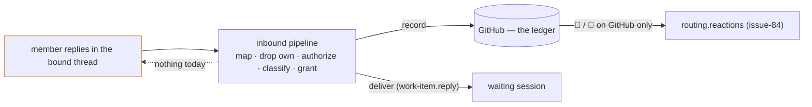

# Requirements: the Slack channel acknowledges an accepted reply with a reaction

> Phase 1 of 3 (requirements → design → tasks). Tier 3 (`human-approves-pr`; below
> `security.review.humanSignOffMinTier: 4`): the change adds one **reaction-only** write
> to Slack under the bot token the channel already posts with, one additive block to
> `cli-config.schema.json` (an `autonomy.sensitivePaths` entry), and two event-log
> types. No new grant, no new reader: a reaction lands only on a message the pipeline
> already accepted, and a dropped message gets none.

## Introduction

[Issue #325](https://github.com/MadaraUchiha-314/the-loop/issues/325), opened by
@jc1993 against 13.3.1: when the-loop dequeues a GitHub comment it acknowledges it on
GitHub — 👀 started, 🎉 completed, 😕 error (`routing.reactions`, issue-84). When an
operator drives the loop **from a bound Slack thread** — approves a gate, types a
control keyword, answers the agent's question — the reply is read, recorded on the
ledger and acted on, but nothing lands back on the Slack message. The only feedback is
a later posted message in the thread, and until it arrives the operator on a phone
cannot tell whether the reply was seen at all.

At `1920a03` (13.4.0) the two halves are separate by construction:

- `reactions.py` reacts on the **GitHub** entity a routed event concerns;
  `target_from_event` returns `None` for any non-GitHub provider, so a Slack message
  never gets one.
- `channels/slack.py` calls `chat.postMessage`, `conversations.replies`,
  `conversations.history`, `chat.getPermalink` and `auth.test` — never `reactions.add`.

This work item closes the loop on the channel the operator is looking at: the moment
the pipeline **accepts** a Slack message it reacts on that message (👀 by default), and
when the resulting action **lands** it reacts again (✅), or ⚠️ when it did not. Slack's
palette, unlike GitHub's, has the ✅ the original issue-84 ask wanted.

## Requirements

### Requirement 1 — an accepted inbound Slack message is acknowledged on the message itself

**User story:** As an operator driving the-loop from Slack, I want a reaction on my
own reply the instant the-loop picks it up, so that I know it was seen without waiting
for a posted message.

#### Acceptance criteria (EARS)

1.1 WHEN an inbound Slack message — a thread reply, a Block Kit button press, or a
top-level kickoff message — passes the pipeline's authorization, classification and
grant checks THEN the channel SHALL add the configured `received` reaction (default
`eyes`, 👀) to that message **before** the record is written to the ledger.

1.2 WHEN the accepted message's action lands THEN the channel SHALL add the configured
`completed` reaction (default `white_check_mark`, ✅) to the same message. *Lands*
means: for `work-item.reply`, the record was written **and** the reply was delivered
into the session; for `gate.feedback` and `control.command`, the unmarked record was
written to the ledger (the ledger's ingress acts on it later — the pipeline cannot see
that, and does not claim to); for `work-item.create`, the issue was created and the
thread bound to it.

1.3 WHEN the accepted message's action fails — the record could not be written, the
reply could not be delivered (no session, paused, dead pane, transport), or the issue
could not be created — THEN the channel SHALL add the configured `error` reaction
(default `warning`, ⚠️) instead of `completed`.

1.4 WHEN an inbound message is **dropped** — bot-authored, unmapped, from an unlisted
member, classified as a type the channel is not granted, or a kickoff with no target
— THEN the channel SHALL add **no** reaction. A drop leaves no mark on the channel, as
it leaves none on the ticket.

1.5 The target of every reaction SHALL be the message the pipeline read: its channel
id and its `ts`. For a button press, the target SHALL be the message carrying the
button (the press has no message of its own).

1.6 The reaction SHALL be posted through the same bot token the channel posts with
(`channels.slack.botTokenEnv`, read at call time) and the same client the channel
reads with; it needs the `reactions:write` scope on that token.

### Requirement 2 — configured beside the GitHub reactions, on by default, mirroring them

**User story:** As an operator who already tuned `routing.reactions`, I want the Slack
acknowledgment configured the same way, so that the two surfaces read alike and I can
turn either off.

#### Acceptance criteria (EARS)

2.1 The CLI config SHALL accept `channels.slack.reactions` with `enabled` (boolean,
default `true`), `received`, `completed` and `error` (each a Slack emoji **name**
without colons — `eyes`, `white_check_mark`, `warning`, or a workspace's custom emoji
— or `""` to skip that state). Defaults: `eyes`, `white_check_mark`, `warning`.

2.2 IF `enabled` is `false` THEN no `reactions.add` call SHALL be made for any state.
The channel's own `enabled: false` (the default) already means nothing is read, so
nothing is acknowledged.

2.3 WHEN a state's name does not match the grammar `^[a-z0-9_+-]{1,100}$` after
surrounding colons are stripped THEN the config parser SHALL warn once at load and
treat that state as skipped (`""`) — a malformed name is never placed into an API
argument.

2.4 The defaults the parser applies SHALL equal the defaults the schema documents
(the existing `test_config_defaults_match_the_schema` extends to the block), and
`make validate` SHALL accept this repository's config and the shipped template with
the block present.

2.5 The block SHALL be **additive**: a 13.4.0 config with no `reactions` block SHALL
parse to the defaults above, and no other option's meaning changes.

### Requirement 3 — best-effort by contract: a reaction never blocks, delays past the SDK's timeout, or fails a delivery

**User story:** As an operator, I want the acknowledgment to be a decoration, so that a
missing scope or a Slack outage never costs me a recorded decision.

#### Acceptance criteria (EARS)

3.1 WHEN `reactions.add` fails for any reason — `missing_scope`, `invalid_name`,
`already_reacted`, `message_not_found`, a transport error, an exception from the
client — THEN the pipeline's outcome for that message SHALL be exactly what it would
have been without the reaction, and the failure SHALL be recorded as
`channel.reaction_failed` (channel, work item, state, name, thread, error) at
`warning`.

3.2 WHEN the bot token is not set THEN `react` SHALL make no call and record nothing
above `debug` — the read that produced the message has already reported the missing
token, or (on the socket path) the listener refused to start without it.

3.3 WHEN a reaction is added THEN the channel SHALL record `channel.reaction_added`
(channel, work item, state, name, thread) at `debug`.

3.4 Event-log payloads for both types SHALL carry ids, the state and the emoji name —
never the message text and never a token.

3.5 The `received` reaction SHALL be attempted **before** the record and the
`completed` / `error` reaction **after** the action, in the pipeline's own thread;
neither is retried, and neither moves the cursor — a message is processed at most
once whatever its reactions did (issue-245 R4.6, unchanged).

### Requirement 4 — documented where the operator looks

**User story:** As an operator, I want the option where the other Slack options are and
a pointer from the GitHub reactions, so that I find it without reading the code.

#### Acceptance criteria (EARS)

4.1 `docs/config/cli/channels-options.md` SHALL document every new leaf with its type
and default (the docs-parity test's P4 and P5), including the `reactions:write` scope
the bot token now needs for this feature alone.

4.2 `docs/config/cli/routing-options.md` § `reactions.enabled` SHALL point at the
Slack mirror; the capability doc `docs/capabilities/channels.md` SHALL carry the
behaviour and a history row; the two config templates SHALL carry the block, commented,
at its defaults; the event catalog (`eventlog.EVENT_TYPES`) SHALL describe both new
types.

## Security considerations

- **Actors & trust:** authorized members (`routing.authorizedUsers`, `slack` ids) —
  the only people whose messages are accepted, so the only messages that get a
  reaction; strangers and unlisted members (dropped before classification — no
  reaction, so no oracle telling them the bot reads the thread); bots, the-loop's own
  included (dropped first); Slack (the API's error strings are logged, never
  interpreted); the operator (their config names the emoji and the token variable).
- **Trust boundaries & data:** the reaction is a write to Slack under the bot token
  the channel already holds, **reaction-only** — no text, no attachment, no message of
  its own — on a message in a thread the bot itself opened (or a top-level message in
  the one channel it is configured to read). The API arguments are the channel id and
  `ts` Slack itself returned, and an emoji name from the operator's config validated
  against a fixed grammar. Nothing from the message text reaches the call. The
  reaction is **attribution of receipt**, never authority: it is added *after* the
  authorization and grant checks and changes nothing about what the message becomes.
- **Abuse cases (EARS):**
  1. WHEN an unlisted member or a bot posts in a bound thread THEN no reaction SHALL be
     added — the drop precedes the acknowledgment, so the-loop's presence is not
     confirmed to anyone it would not act for.
  2. WHEN an authorized member's message classifies as a type the channel is not
     granted THEN no reaction SHALL be added — dropped, never downgraded, and never
     acknowledged as if it were accepted.
  3. WHEN Slack refuses the reaction (`missing_scope`, `invalid_name`, a rate limit)
     THEN the record and the delivery SHALL proceed unchanged and the refusal SHALL be
     logged — the acknowledgment is never in the delivery's critical path.
  4. WHEN the configured emoji name is malformed or carries characters outside the
     grammar THEN it SHALL be refused at load and never sent — the config cannot craft
     an API argument.
  5. WHEN the reaction client raises or hangs THEN the SDK's own timeout SHALL bound
     the call and the pipeline outcome SHALL be unchanged.
  6. WHEN a reaction event is recorded THEN the event log SHALL carry no message text
     and no token.
- **Fail closed:** no `channels` section, a disabled or malformed channel, no channel
  id, no token, `reactions.enabled: false`, or a state set to `""` — every one of these
  means no call. This work item adds no grant and widens no authorization; the one new
  scope (`reactions:write`) is needed only for this decoration, and without it the
  channel behaves exactly as 13.4.0 plus one warning per refused reaction.

## Out of scope

- A reaction on the **GitHub** record of a Slack reply (the ledger's ingress already
  reacts on comments it dequeues, and a record the pipeline wrote is either marked —
  dropped by ingress — or a relayed human comment the ingress reacts on as it would any).
- A `completed` reaction when the ledger's ingress finishes acting on a relayed
  `gate.feedback` / `control.command` (the gate lock, the started session) — the
  pipeline does not observe that; a later work item could subscribe the channel to the
  outcome event.
- Reactions on messages the bot **posts** (its own notifications), and reactions as
  an *input* (a member reacting 👍 to approve).
- Removing a reaction (`reactions.remove`) — 👀 stays beside ✅, as on GitHub.

## Open questions

None raised on the ticket. The ticket's "optionally a completion reaction when the
resulting action lands" is taken as R1.2 with *lands* defined per event type; the
palette question the ticket does not ask — Slack has ✅ and ⚠️ where GitHub does not —
is decided in [decision-111](../../decisions/decision-111.md).

## Review comments

> Appended by the-loop's `record-feedback` hook when a human gate approves with
> comments (issue-109). Append-only and attributed: an approval never silently
> discards a reviewer's suggestions, and the feedback travels with the document
> it concerns rather than living in a side-channel tracker.
