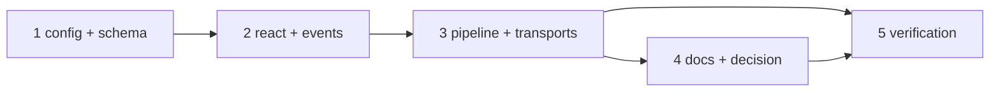

# Tasks: the Slack channel acknowledges an accepted reply with a reaction

> The last spec artifact. A DAG derived from the design and testing plan; each task names
> the testing-plan row that proves it. TDD: the test first, red, then green.

## Task list

- [x] 1. The config — `SlackReactionConfig`, `REACTION_STATES`, the grammar, and
  `SlackChannelConfig.reactions`, in `channels/slack.py`; the `reactions` block in both
  copies of `cli-config.schema.json`
  - _Depends on:_ none
  - _Requirements:_ R2.1–R2.5
  - _Test:_ T1 — the five config tests; T10 — schema parity
- [x] 2. The call — `SlackBotChannel.react` and the two event types in `eventlog.py`
  - _Depends on:_ 1
  - _Requirements:_ R1.5, R1.6, R3.1–R3.4
  - _Test:_ T1 — `test_react_adds_the_named_reaction_on_the_message`, `test_react_never_raises_and_records_the_failure`, `test_react_without_a_token_is_a_quiet_noop`; T10 — the event catalog
- [x] 3. The pipeline — `received` / `completed` / `error` on the accepted paths of
  `process_reply` and `process_kickoff`; the socket handlers build and pass a channel
  (`client_factory`), the button press's `ts`
  - _Depends on:_ 2
  - _Requirements:_ R1.1–R1.4, R3.5
  - _Test:_ T1 — the pipeline and drop tests; T2 — the three scenarios; T8
- [x] 4. Docs, capability doc, decision — `docs/config/cli/channels-options.md`,
  `docs/config/cli/routing-options.md`, `docs/cli/commands/channels.md`, the two
  config templates, `docs/capabilities/channels.md`, `decision-111` + index row
  - _Depends on:_ 3
  - _Requirements:_ R4.1, R4.2, the capability-docs gate
  - _Test:_ T10 — docs parity; T12 — `make check`
- [x] 5. Verification — execute `testing-plan.md`, record `evidence/verification.md` and
  `evidence/security-review.md`
  - _Depends on:_ 3, 4
  - _Requirements:_ all
  - _Test:_ T1, T2, T8, T10, T12, T13

## Dependency graph (DAG)

## Checkpoints

After task 1: the config tests green, schema parity green. After task 3: T1 and T2
green. After task 4: `make check`. Then the verification node, the self-review rounds
and the security review gate (`evidence/security-review.md`), then the PR with the
reviewer briefing.

## Review comments

> Appended by the-loop's `record-feedback` hook when a human gate approves with
> comments (issue-109). Append-only and attributed: an approval never silently
> discards a reviewer's suggestions, and the feedback travels with the document
> it concerns rather than living in a side-channel tracker.
