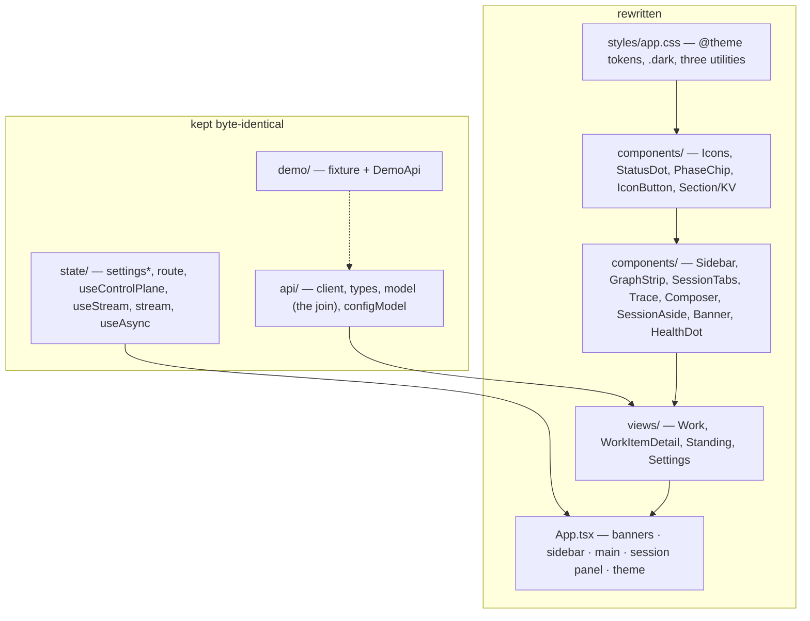

# Design: Control Plane UI 3.0

> Phase 2 of 3. Derives from [`requirements.md`](requirements.md). The **visual** contract
> is the prototype at https://the-loopy-one.lovable.app/, explored in a browser and
> recorded below; this document is the mapping from its elements to the dashboard's
> existing data and actions.

## Overview

The dashboard keeps its brain and gets a new body. Everything under `ui/src/api/`,
`ui/src/state/` and `ui/src/demo/` stays as it is; `ui/src/components/`, `ui/src/views/`,
`ui/src/styles/`, `App.tsx`, `main.tsx` and `index.html` are rewritten against the
prototype. The Classical stylesheet is deleted. The design system is expressed as a
Tailwind v4 theme whose tokens are the prototype's own oklch values, so the JSX can carry
the prototype's utility classes almost verbatim and a reviewer can check the
implementation class-for-class against the prototype's rendered DOM.



`*` `state/settings.ts` gains one key, `theme`, with the same validate-or-default
treatment every other key has.

## Architecture

One screen, three columns, viewport-locked:

```text
div.flex.h-screen.overflow-hidden.bg-background.text-foreground
├─ banners (demo · not connected)                      full width, above the columns
└─ div.flex.min-h-0.flex-1
   ├─ aside  w-[19rem]  Sidebar     brand · search · groups · standing · footer
   ├─ main   flex-1 min-w-0         header · graph strip · session tabs · trace · composer
   │                                (or Standing, or Settings — same column)
   └─ aside  w-[19rem]  SessionAside attention · harness · tmux · ticket · controls
```

Routing is unchanged (`state/route.ts`): `#/` and `#/item/<ref>` render the work
column, `#/standing` swaps the main column for the standing-sessions pane, `#/settings`
for the settings pane; the sidebar stays in all three. The two side panels can be
collapsed and reopened from the header; that is view state, not a route.

## Components & interfaces

| Component | Replaces | Responsibility |
|---|---|---|
| `Icons.tsx` | — | ~25 inline SVG icons (lucide paths, `stroke-width 2`), sized by class. No icon package. |
| `StatusDot` | `SessionDot` | `<span class="h-1.5 w-1.5 rounded-full bg-current text-state-*">`, `pulse-dot` when active. `sessionLabel` kept. |
| `PhaseChip` | the row chip | dot + `loop:` + value, mono, surface-2, hairline. |
| `IconButton` | — | 28 px square, `aria-label` + `title`, hover border/fill. |
| `Section` / `KV` | `<dl>` facts | the session panel's titled block and key/value line. |
| `Sidebar` | `Work.tsx` aside | groups via `sidebarGroup(view)`, search filter, nested PR rows, standing group, footer with the settings link and `HealthDot`. |
| `GraphStrip` | `NodeRail` | the loop as compacted node buttons with `Full graph`; `railLabel` kept; `compactRail` exported for its test. |
| `SessionTabs` | trace-head tabs | one link per session: **Work item loop**, `PR #n` (+ repo when elsewhere, pause icon when paused); footer `n sessions · …`. |
| `Trace` | `TranscriptView` + fallback | `ThreadRow[]` → entries; **Tool calls** switch; event-trail fallback in the same idiom. |
| `Composer` | `ChatBar` | `rows=1` auto-growing textarea, send icon button, hint line with the tmux target; same `replySession`, ⌘/Ctrl+Enter. |
| `SessionAside` | detail actions + facts | attention banner, Harness / tmux / Ticket / Controls sections for the viewed session (outer or PR). |
| `Banner` | `Banner` | demo (`role=status`) and not-connected (`role=alert`) strips. |
| `HealthDot` | `Nav.tsx` | same `<details>` popover, drawn as the footer's `● live / degraded / unknown` word. |
| `Standing` | `Standing.tsx` | same form, cards and verbs, restyled as sections. |
| `Settings` / `ConfigEditor` | same | same five cards and the schema-derived editor, restyled as sections in the main column. |

### Functionality map — where each existing action and state lives

| At `5495800` | In 3.0 | Backing call (unchanged) |
|---|---|---|
| sidebar row → item | sidebar row (grouped) | hash `#/item/<ref>` |
| nested PR row → PR session | nested PR row + session tab | hash `#/item/<prRef>` |
| header verbs start/pause/resume/stop | session panel **Controls** grid | `controlSession` |
| parked-gate card, Approve | accent banner above the composer, Approve | `graphComplete` |
| "The loop asks" card | accent banner above the composer, "Reply below" | (`awaitingInput` model) |
| chat bar | composer | `replySession` |
| trace tabs | session tabs | hash |
| transcript path caption | session panel **Harness › transcript** | `transcriptPath` |
| rail note (parked/blocked) | graph strip's trailing status + panel attention banner | `railNote` |
| Open on GitHub ↗ | header icon + panel **Ticket › open** | `view.url` |
| health dot + popover | sidebar footer word + popover | `daemons`, stream state |
| Settings → | footer gear link | hash `#/settings` |
| standing list + Manage | sidebar **Standing** group | `standingSessions`, hash `#/standing` |
| Standing create/start/stop/restart/delete/say | same, restyled | same |
| Settings five cards | same, as sections | same |
| Demo / Not-connected banners | full-width strips above the columns | same |
| loading / empty / missing-ref / no-transcript / truncated / blocked chat | same sentences, muted or accent idiom | same |

Not rendered, because nothing backs them: **New work item**, **Checks**, **cleanup**,
`/` commands (decision-112). Rendered because the loaded data backs them and the
prototype draws them: **search** (filters rows by ref, title, repo, node), **copy ref**
and **copy tmux command** (`navigator.clipboard`).

### Sidebar grouping

`itemGroup` in `model.ts` yields `needs-you | running | idle`. The prototype adds
**Shipped**, so a view-side `sidebarGroup(view)` refines `idle` into `shipped` when every
walked node is done (the rail's `complete` case), else `idle`. Order: Needs you · In
flight · Shipped · Idle. The row dot: `blocked` for needs-you, `active` for a live
session, `done` for shipped, `skipped` (grey) for paused, `pending` otherwise.

### Graph strip compaction

```ts
compactRail(nodes): (RailNode | "gap")[]  // first, last, ±2 around current/blocked; else one "gap"
```

Counts: `done` = nodes in state `done`; total = all nodes; `skipped` = state `skipped`;
trailing status = `at <current>` (active colour), `blocked at <node>` (blocked colour),
`complete`, or `planned` for a frozen rail. Each node is a `<button title="<id> · <state>">`
inside `<li>` of an `<ol role="list" aria-label="loop position">`, `aria-current="step"` on
the current one, `line-through` on a skipped one. An empty rail renders the existing
empty-message sentence inside the strip.

### Trace rendering

`transcriptThread(entries)` is unchanged; each `ThreadRow` maps to prototype idioms:

| `ThreadRow.kind` | Rendered as |
|---|---|
| `assistant` text | meta line `[bot] the-loop ——— hh:mm`, then paragraphs (`•`/`-` lines indented). `**x**` → `<strong>`, `` `x` `` → `.ref-chip` — both rendered as text nodes inside those elements. |
| `assistant` thinking | `<details>` group **Thinking**, body in `<pre>`. |
| `tools` on a row | `<details>` group **Used n tools**; each call a nested `<details>`: terminal icon, mono name, one-line summary, `error` chip; body = input + result `<pre>`. Hidden entirely when the switch is off. |
| `user` | right-aligned `bg-primary` bubble, time beneath. |
| `tool result` (orphan) | `<details>` group **output**. |
| `meta` | meta line: label mono, hairline, time. |
| `malformed` | meta line in the blocked colour, raw text behind `<details>`. |
| event-trail fallback | notice banner, then one meta line per event (`event` mono · `describeEvent`, time). |

## UI/UX design

| Artifact | Type | Location / link | Covers (screen · requirement) | Status |
|----------|------|-----------------|-------------------------------|--------|
| the-loopy-one prototype | link (Lovable app) | https://the-loopy-one.lovable.app/ | every screen · R1–R4 | approved — attached to the issue by the owner |
| `design/screenshots/prototype-01-home-dark.png`, `-light.png` | rendered still | [`design/screenshots/`](design/screenshots/) | Work, home · R1, R2 | approved (export of the link) |
| `prototype-04-full-graph-dark.png` | still | same | graph strip expanded · R1.6 | approved |
| `prototype-06-toolcalls-off-light.png`, `prototype-07-toolcalls-expanded-dark.png` | stills | same | trace switch and groups · R1.7 | approved |
| `prototype-08-sidebar-collapsed-light.png` | still | same | panel toggles · R4.6 | approved |
| `prototype-10-aside-element-dark.png`, `prototype-10b-aside-pr41-element-light.png` | stills | same | session panel, outer and PR · R3.2 | approved |
| `prototype-03-tab-pr-41-dark.png` | still | same | PR session tab · R3.2 | approved |
| `prototype-19-mobile-390-dark.png` | still | same | the prototype's unbreakpointed narrow state — what R4.6 corrects | reference |

- **Flows & states:** select item → main column and panel swap; select session tab →
  trace and panel swap; Full graph ↔ Collapse graph; Tool calls on/off; collapse/open
  each side panel; theme toggle; gate approve and question reply from the accent banners;
  Standing and Settings in the main column. Loading, empty, error and fallback states use
  the muted-text or accent-banner idiom.
- **Design system / tokens:** authored in oklch, exactly the prototype's:

  | Token | Light | Dark |
  |---|---|---|
  | background | `oklch(98.4% .004 85)` | `oklch(16.5% .008 265)` |
  | foreground | `oklch(24% .012 265)` | `oklch(94% .006 85)` |
  | surface / surface-2 | `oklch(99.8% .002 85)` / `oklch(96.2% .006 85)` | `oklch(19.6% .009 265)` / `oklch(22.8% .01 265)` |
  | primary / primary-foreground | `oklch(63% .15 48)` / `oklch(99% .005 85)` | `oklch(75% .14 55)` / `oklch(19% .03 48)` |
  | accent / accent-foreground | `oklch(94% .02 60)` / `oklch(30% .03 48)` | `oklch(28% .03 55)` / `oklch(85% .08 65)` |
  | muted-foreground | `oklch(53% .014 265)` | `oklch(68% .012 265)` |
  | border / border-strong | `oklch(90% .006 85)` / `oklch(84% .008 85)` | `oklch(100% 0 0 / .09)` / `oklch(100% 0 0 / .16)` |
  | state done · active · blocked · skipped · pending | `oklch(55% .11 155)` · `oklch(63% .15 48)` · `oklch(56% .19 25)` · `oklch(68% .01 265)` · `oklch(80% .008 265)` | `oklch(70% .13 158)` · `oklch(78% .14 60)` · `oklch(68% .18 25)` · `oklch(50% .012 265)` · `oklch(40% .012 265)` |
  | human | `oklch(52% .13 265)` | `oklch(70% .12 268)` |
  | radius | `.625rem` (md 8 px · lg 10 px · xl 14 px) | same |

  Type: Space Grotesk 600 (title 18 px, wordmark 14 px); IBM Plex Sans 400/500/600 (14 px
  body, 12 px meta, 10.9 px uppercase labels at `.1em` tracking); JetBrains Mono 400 for
  identifiers at 11.2 px / 12 px. Rhythm: `px-6` main, `px-4` panels, `px-3` blocks, `px-2`
  rows; `space-y-5` between trace entries; trace and composer at `max-w-3xl`. Three custom
  utilities: `.ref-chip`, `.scroll-thin`, `.pulse-dot`. No shadows.
- **Theme mechanism:** the `.dark` class on `<html>` (Tailwind `@custom-variant dark`).
  `state/theme.ts` resolves `settings.theme ?? prefers-color-scheme`; `App` applies it in
  an effect; a four-line inline script in `index.html` applies the stored value before
  the first paint (R2.3). `color-scheme` follows so native controls match.
- **Accessibility & responsiveness:** roles and `aria-current` as today; native
  `<details>` for every disclosure; the tools switch answers Enter and Space; `pulse-dot`
  is disabled under `prefers-reduced-motion`; panels default closed below 1280 px (session
  panel) and 768 px (sidebar), reopened from header icon buttons; the main column keeps
  `min-w-0 flex-1` so it is never zero-width.
- **Evidence:** `evidence/verification.md` with the built app's screenshots in both
  themes, captured on the demo fixture (R5).

## Data models

None new on the wire. One settings key:

```ts
theme?: "light" | "dark";   // absent = follow prefers-color-scheme
```

Validated on load like every other key; an unknown value is dropped.

## Error handling

Unchanged sentences, new idiom: `ApiError.advice` in a `role="alert"` line in the
blocked colour (action failed, chat refused, not connected); the service's own refusal
verbatim on the Standing pane; the transcript fallback's two sentences as an accent
notice above the event trail; a font that fails to load falls back to the system stack.

## Security design

- **AuthN/AuthZ:** none in the app, unchanged (decision-059; the gateway's job).
- **Input validation & injection surfaces:** transcript, event and title text reaches the
  DOM only as React text nodes — `renderInline` splits a string on `**` and backticks
  and returns `<strong>`/`<code>` elements *whose children are strings*; no
  `dangerouslySetInnerHTML` anywhere (a grep is part of the security checklist). The
  theme script compares `localStorage` against two literals and adds a class.
- **Secrets handling:** none stored or displayed; unchanged.
- **Least privilege:** the clipboard is written, never read.
- **Fail-closed behaviour:** absent clipboard → copy control inert with a title saying
  so; malformed settings → defaults.
- **Abuse-case coverage:** AC1 → `Transcript.test.tsx` "renders attacker-shaped tool text
  as text" plus a new case with `**` and backtick payloads; AC2 → `settings.test.ts`
  "drops an unknown theme"; AC3 → review of the inline script (checklist).

## Testing strategy

The behaviour suite is the contract: every existing test that asserts a role, a label or
a sentence stays green; the handful that select on Classical class names are re-pointed
at `data-*` hooks. New unit tests cover the view-side helpers this design adds
(`sidebarGroup`, `compactRail`, theme resolution and persistence, the search filter, the
tools switch, the inline renderer's escaping). UI/visual proof is a Playwright script
against the built app in demo mode, both themes, committed as screenshots. Detail in
[`testing-plan.md`](testing-plan.md).

## Trade-offs & decisions

- **Tailwind v4 as a build dependency** rather than hand-written CSS on the tokens: the
  prototype *is* a Tailwind build, and copying its class strings is how the
  implementation stays checkable against the contract. It runs at build time only.
  [decision-112](../../decisions/decision-112.md).
- **Inline SVG icons** rather than `lucide-react`: ~25 icons, one file, no runtime
  dependency (minimalism ladder: inline before a new dep).
- **Google Fonts**, as the current stylesheet already does; `@fontsource` would add three
  packages and ~400 KB to the bundle for a loopback dashboard.
- **Search filters; New work item is absent** — decision-112.
- **Two themes, not three:** the toggle is the prototype's; the browser preference is the
  default, not a third state to manage.

## Open questions

None. Judgement calls are in decision-112 for the reviewer to overturn on the PR.

## Review comments

> Appended by the-loop's `record-feedback` hook when a human gate approves with
> comments (issue-109). Append-only and attributed.
