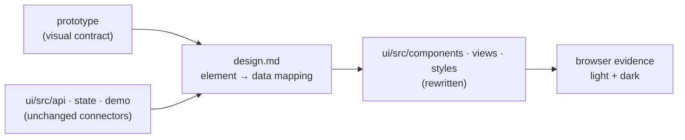

# Requirements: Control Plane UI 3.0

> Phase 1 of 3 (requirements → design → tasks). Tier 3 (`human-approves-pr`; below
> `security.review.humanSignOffMinTier: 4`): the change replaces the dashboard's
> **presentational layer** only. No API route, model join, control verb, settings key
> other than the theme, or build workflow changes; the one new build-time dependency
> (Tailwind) ships nothing at runtime beyond generated CSS.

## Introduction

[Issue #327](https://github.com/MadaraUchiha-314/the-loop/issues/327), opened by the
owner: *the current control plane UI is very bad — remove the entire UI presentational
components and replace it with the prototype at https://the-loopy-one.lovable.app/;
explore it thoroughly; support light and dark mode; don't invent new functionality and
follow the design system in the prototype; have proper fonts, padding, margins and
spacing to make it readable; test in a browser and post screenshot evidence.*

At `5495800` (13.5.0) the dashboard is the issue-298 **Classical** re-skin: Cormorant
Garamond over Lora, hairline rules, a sidebar of work items beside one canvas, Settings
as a reading column. Everything under `ui/src/api/`, `ui/src/state/` and `ui/src/demo/`
— the connectors, the join, the refresh machinery, the demo transport — is unchanged by
this work item and is the functionality this rewrite must carry across intact.

The prototype is a three-column operations console: a work-item sidebar grouped by what
needs a human, a main column with the item's header, its loop drawn as a compacted node
strip, one tab per session, the harness trace as a reading column with a reply composer,
and a right-hand session panel (harness, tmux, branch, controls). It is dark by default
with a warm light variant, set in IBM Plex Sans with JetBrains Mono for every identifier
and Space Grotesk for the title. Its exploration is recorded in
[`design.md`](design.md) § UI/UX design, with the rendered screens checked in under
[`design/screenshots/`](design/screenshots/).

## Requirements

### Requirement 1 — the dashboard renders the prototype's design system

**User story:** As the operator, I want the control plane to look and read like the
prototype, so that a day of watching work items is calm and legible instead of noisy.

#### Acceptance criteria (EARS)

1. WHEN the Work surface renders THEN the system SHALL lay it out as the prototype's
   three columns — a 19 rem sidebar, a main column, and a 19 rem session panel — inside a
   viewport-locked shell that never scrolls as a page.
2. WHEN any element of the dashboard renders THEN its colour, type, spacing, radius and
   border SHALL come from the prototype's token set (`design.md` § Design system), and
   the system SHALL use no drop shadow, no gradient and no colour the token set does not
   define.
3. WHEN text renders THEN the system SHALL set body copy in IBM Plex Sans, every
   identifier (refs, ids, node names, tmux targets, times) in JetBrains Mono, and the page
   title and wordmark in Space Grotesk, with the prototype's sizes and weights.
4. WHEN a work item, node or session has a machine state THEN the system SHALL signal it
   the prototype's way — a 6 px status dot in one of the five state colours (done, active,
   blocked, skipped, pending), pulsing when active — and a mono chip for the phase label.
5. WHEN the sidebar renders THEN the system SHALL group work items under **Needs you**,
   **In flight**, **Shipped** and **Idle**, each group headed by an uppercase tracked label
   and its count, and SHALL hide an empty group.
6. WHEN the main column renders a work item THEN the system SHALL draw its loop as the
   prototype's node strip — the loop's name, `n of m nodes passed`, the skipped count, the
   current node — compacted to the first, the last and two nodes either side of the current
   one, with a **Full graph** control that expands the strip into one horizontally
   scrolling row.
7. WHEN the harness trace renders THEN the system SHALL render it as the prototype's
   reading column: agent turns as prose, human replies as right-aligned bubbles, node
   transitions and bookkeeping as one-line meta rows, and tool calls grouped behind a
   **Used n tools** disclosure, with a **Tool calls** switch that hides those groups.

### Requirement 2 — light and dark, chosen once, kept

**User story:** As the operator, I want the dashboard in the theme I read best, so that
a dark terminal and a light office window both have a version that fits.

#### Acceptance criteria (EARS)

1. WHEN the dashboard first loads in a browser with no stored choice THEN the system SHALL
   follow the browser's `prefers-color-scheme`.
2. WHEN the operator activates the theme control in the header THEN the system SHALL
   switch between light and dark at once and SHALL persist the choice in the browser's
   settings, beside the base URL.
3. WHEN a page loads with a stored choice THEN the system SHALL apply that theme before
   the first paint, so no frame renders in the other theme.
4. WHILE either theme is active every token in Requirement 1.2 SHALL resolve to that
   theme's value, and text SHALL keep at least the contrast the prototype's pairs give.
5. IF the stored theme value is not one of `light` or `dark` THEN the system SHALL treat
   it as unset and follow the browser preference.

### Requirement 3 — nothing invented, nothing lost

**User story:** As the owner, I want a redesign, not a rewrite of what the dashboard
does, so that every connector and control I rely on is still there and nothing appears
that the service cannot back.

#### Acceptance criteria (EARS)

1. WHEN this work item lands THEN `ui/src/api/`, `ui/src/state/` (except the theme
   setting of R2) and `ui/src/demo/` SHALL be byte-identical to `5495800`, and every
   `TheLoopApi` method a view calls today SHALL still be called from the same user action.
2. WHEN the redesigned surface is compared with `5495800` THEN every user action listed in
   `design.md` § Functionality map SHALL have a home: select a work item or a PR session,
   start / pause / resume / stop a session, approve a parked gate, answer the agent's
   question, reply into a session, create / start / stop / restart / delete / message a
   standing session, set and probe the base URL, switch live / demo, choose the refresh
   mode and interval, schedule a restart, edit the CLI config.
3. WHEN the redesigned surface is compared with `5495800` THEN every state listed in
   `design.md` § Functionality map SHALL still render: loading, empty board, demo banner,
   connection error, missing deep link, no transcript (event-trail fallback), truncated
   tail, blocked chat bar with its reason, stream live / reconnecting / fallen back,
   daemon stopped, refused standing-session action.
4. WHEN the prototype shows a control the service cannot back — **New work item**, a
   **Checks** section, a **cleanup** verb — the system SHALL NOT render it. A control the
   service can back only partially (search filters the loaded rows; copy writes a ref to
   the clipboard) SHALL do exactly that and nothing more.
5. WHEN a hash the dashboard parsed at `5495800` is opened THEN the system SHALL land on
   the same surface it did then; the hash SHALL remain the only record of what the main
   column shows, and every navigation SHALL remain an anchor.

### Requirement 4 — readable, and still accessible

**User story:** As a reader of the dashboard, I want the density of the prototype without
losing the keyboard and screen-reader affordances the current one has.

#### Acceptance criteria (EARS)

1. WHEN the trace column renders THEN it SHALL be centred at the prototype's reading
   measure (48 rem) with 20 px between entries, and body copy SHALL keep the prototype's
   relaxed line height.
2. WHEN the trace panel renders THEN it SHALL remain its own scroll container with
   `role="log"`, an accessible name and keyboard focus, and the follow-the-newest rule
   (`isAtNewest`) SHALL keep working.
3. WHEN a selected row, tab or node renders THEN it SHALL carry `aria-current`; WHEN a
   disclosure renders (tool group, health popover, learn-more) THEN it SHALL be a native
   `
` or a control with `aria-expanded`, operable from the keyboard.
4. WHEN the **Tool calls** switch has focus THEN Enter **and** Space SHALL toggle it.
5. WHEN the viewer prefers reduced motion THEN the active dot SHALL NOT pulse.
6. WHEN the viewport is narrower than 1280 px THEN the session panel SHALL start closed;
   narrower than 768 px THEN the sidebar SHALL start closed; both SHALL remain openable
   from the header, so the main column is never zero-width.

### Requirement 5 — proved in a browser

**User story:** As the owner, I want screenshot evidence of the built UI, so that I can
approve the PR without running it.

#### Acceptance criteria (EARS)

1. WHEN the work item reaches verification THEN the system SHALL have captured headless
   Chromium screenshots of the built app on the demo fixture — Work, a PR session, full
   graph, tool calls off, the gate and question banners, Standing, Settings, panels
   collapsed, and a narrow viewport — in **both** themes, committed under
   `evidence/`.
2. WHEN the PR is raised THEN its briefing SHALL embed those screenshots beside the
   prototype's.

### Requirement 6 — the documentation follows the change

1. WHEN this work item lands THEN `ui/README.md` and
   `docs/capabilities/control-plane.md` SHALL describe the new design system, layout and
   theme behaviour, and SHALL no longer describe Classical as current.

## Non-functional requirements

- **Bundle:** the production bundle SHALL be built by the same three CI commands (`bun
  run lint`, `bun run test`, `bun run build`); the CSS the build emits is the only
  runtime artefact the new dependency adds.
- **Fonts:** loaded from Google Fonts with system fallbacks, as the current stylesheet
  already does; the dashboard SHALL remain readable if the font request fails.
- **Motion:** one animation (the active dot's ring), guarded by `prefers-reduced-motion`.

## Security considerations

- **Actors & trust:** the operator's browser (trusted), the service's JSON (trusted
  transport, but it carries **untrusted text** — transcript lines written by a harness,
  ticket titles, event fields), the prototype (a design reference, nothing executable is
  taken from it), Google Fonts (a third-party origin already trusted by the current
  stylesheet).
- **Trust boundaries & data:** transcript and event text crosses from JSON into the DOM
  — it must stay text. The theme choice is read from `localStorage`, which any script on
  the origin can write. No secret is stored, moved or displayed; the tmux command the
  panel offers to copy is built from a target the service already serves.
- **Abuse cases (EARS):**
  1. WHEN a transcript line contains markup, or the `**` / backtick sequences the trace's
     inline renderer recognises, THEN the system SHALL render it as text (React escaping)
     and SHALL create no element from it.
  2. WHEN `localStorage` holds a theme value outside `light` / `dark` THEN the system SHALL
     ignore it and follow the browser preference.
  3. WHEN the pre-paint theme script runs THEN it SHALL read one key, compare it to two
     literals and add one class; it SHALL evaluate nothing from storage.
- **Fail closed:** a font that does not load falls back to the system stack; a clipboard
  API that is absent leaves the copy control inert with its label saying so.
- **No new attack surface**, justified: the change adds no route, no request the current
  app does not make, no HTML rendering, no `eval`, no inline event handler on served
  content, and no dependency that runs in the browser (Tailwind is a build step).

## Out of scope

- Any change under `ui/src/api/`, `ui/src/demo/`, the service, or the OpenAPI contract.
- The prototype's controls the service cannot back: **New work item**, **Checks**,
  **cleanup**, `/` commands in the composer.
- A `system` third theme state with its own control; the default *follows* the browser
  and the toggle then chooses.
- Drawer-style overlays on narrow viewports; panels collapse in-flow instead (R4.6).

## Open questions

None blocking. Two judgement calls are recorded rather than asked, so the reviewer can
overturn them on the PR: search filters the loaded rows (R3.4) and **New work item** is
not rendered (decision-112).

## Review comments

> Appended by the-loop's `record-feedback` hook when a human gate approves with
> comments (issue-109). Append-only and attributed.
