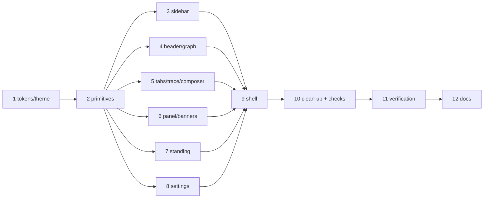

# Tasks: Control Plane UI 3.0

> Derived from the approved requirements, design and testing plan. Each task names the
> testing-plan row that proves it; production code follows a failing test (`tdd.mode:
> standard`) where the task has testable logic, and the React suite where it is markup.

## Task list

- [ ] 1. Tokens, theme and the Tailwind layer
  - `ui/index.html`: fonts link (Space Grotesk, IBM Plex Sans, JetBrains Mono), pre-paint
    theme script, title.
  - `ui/src/styles/app.css`: `@import "tailwindcss"`, `@custom-variant dark`, `@theme`
    with the prototype's oklch tokens (light on `:root`, dark on `.dark`), fonts, radius,
    base layer, `.ref-chip` / `.scroll-thin` / `.pulse-dot`, reduced-motion guard. Delete
    `classical.css`.
  - `state/settings.ts`: `theme?: "light" | "dark"` validated on load; `state/theme.ts`:
    `resolveTheme`, `applyTheme`.
  - _Depends on:_ none
  - _Requirements:_ R1.2, R1.3, R2, R4.5
  - _Test:_ T1/T10 — `settings.test.ts` (theme round-trip, unknown dropped, absent = unset), `theme.test.ts` (resolve from preference) (red→green)
- [ ] 2. Primitives
  - `components/Icons.tsx` (inline lucide paths), `StatusDot` (+ `sessionLabel`),
    `PhaseChip`, `IconButton`, `Section`, `KV`, `renderInline`.
  - _Depends on:_ 1
  - _Requirements:_ R1.4, Sec AC1
  - _Test:_ T1/T8 — `inline.test.tsx`: `**`/backtick → strong/code with string children; `` payload creates no element (red→green)
- [ ] 3. Sidebar
  - `components/Sidebar.tsx`: brand + collapse, search box (`filterViews`), groups via
    `sidebarGroup`, rows (dot · `#n` · title / repo · node · age · flag), nested PR rows
    (`aria-label="Pull requests for …"`, links, `aria-current`), Standing group, footer
    (settings link, `HealthDot` as the `live` word).
  - _Depends on:_ 2
  - _Requirements:_ R1.5, R3.2, R3.4, R3.5
  - _Test:_ T1 — `sidebar.test.ts` (`sidebarGroup`, `filterViews`); T2 — `App.test.tsx` sidebar scenarios re-pointed at `data-row` hooks (red→green)
- [ ] 4. Header and graph strip
  - `components/GraphStrip.tsx`: `compactRail`, counts line, `Full graph` toggle, node
    buttons in an `<ol role="list" aria-label="loop position">`, `aria-current="step"`,
    empty-rail sentence, trailing status from `railNote`.
  - Header in `WorkItemDetail`: title, ref-chip, `PhaseChip`, repo, updated; icon
    buttons copy / GitHub / theme / open-panel.
  - _Depends on:_ 2
  - _Requirements:_ R1.6, R2.2, R3.2
  - _Test:_ T1 — `GraphStrip.test.tsx` (`compactRail` shape; Full graph shows all nodes); T2 — theme toggle flips `.dark` and persists (red→green)
- [ ] 5. Session tabs, trace and composer
  - `components/SessionTabs.tsx` (links, `aria-label` = shortRef, pause icon, footer
    counts); `components/Trace.tsx` (row → idiom mapping per design, tools switch with
    Enter/Space, `
` groups, event-trail fallback, truncated/empty/loading
    sentences, `role="log"` scroll container kept in `WorkItemDetail`);
    `components/Composer.tsx` (`replySession`, blocked reasons, ⌘⏎, hint line).
  - _Depends on:_ 2
  - _Requirements:_ R1.7, R3.2, R3.3, R4.1–R4.4
  - _Test:_ T2 — `Transcript.test.tsx` re-pointed at `data-*` hooks + new switch test (hidden when off; Enter and Space); `WorkItemDetail.test.tsx` role/focus contract (red→green)
- [ ] 6. Session panel and the two banners
  - `components/SessionAside.tsx`: attention banner (`railNote` / flag), Harness (harness,
    session id, status, current node, transcript path), tmux (target, cwd, copy command),
    Ticket (repo, number, open link), Controls (contextual verbs → `controlSession`, busy
    labels, `role=alert` error). Gate banner (Approve → `graphComplete`; request changes
    link) and question banner ("The loop asks", "Reply below", ticket link) above the
    composer.
  - _Depends on:_ 2
  - _Requirements:_ R3.2, R3.3
  - _Test:_ T2 — `App.test.tsx` gate approval, question + reply closes the banner, transcript path visible (red→green)
- [ ] 7. Standing pane
  - `views/Standing.tsx` restyled: header, create form, cards as sections, KV facts,
    controls grid, say input; same verbs, same verbatim refusals.
  - _Depends on:_ 2
  - _Requirements:_ R3.2, R3.3
  - _Test:_ T2 — `Standing.test.tsx` with `card()` re-pointed at the section element (red→green)
- [ ] 8. Settings pane and config editor
  - `views/Settings.tsx` + `components/ConfigEditor.tsx` restyled as sections in the main
    column; all five cards, probe states, radiogroup, restart, editor behaviours unchanged.
  - _Depends on:_ 2
  - _Requirements:_ R3.2, R3.3
  - _Test:_ T2 — `ConfigEditor.test.tsx` (14, unchanged) green
- [ ] 9. Shell
  - `App.tsx`: banners above the columns, panel open/closed state with viewport defaults
    (R4.6), sidebar in every route, theme effect; `Work.tsx` composes sidebar + main +
    panel; `main.tsx` imports the one stylesheet.
  - _Depends on:_ 3, 4, 5, 6, 7, 8
  - _Requirements:_ R1.1, R3.5, R4.6
  - _Test:_ T2 — `App.test.tsx`: collapse sidebar shows the open control; legacy hashes land as before (red→green)
- [ ] 10. Clean-up and the fast checks
  - Remove `classical.css`, `Blueprint.tsx`, `NodeRail.tsx`, `SessionDot.tsx`, `Nav.tsx`
    where superseded; no `lp-` class remains; lint, typecheck, build clean.
  - _Depends on:_ 9
  - _Requirements:_ NFR
  - _Test:_ T12 — `bun run lint && bun run build`; T8 grep empty; T9 grep present
- [ ] 11. Verification
  - `ui/scripts/screenshots.mjs` (Playwright, demo mode, both themes, two viewports);
    captures into `evidence/`; `evidence/verification.md`; tick the plan.
  - _Depends on:_ 10
  - _Requirements:_ R5
  - _Test:_ T5, T13
- [ ] 12. Documentation
  - `ui/README.md` (design system, layout, theme), `docs/capabilities/control-plane.md`
    (behaviour bullet + history row), `decision-112` indexed, execution log, PR briefing
    with screenshots.
  - _Depends on:_ 11
  - _Requirements:_ R6
  - _Test:_ T13

## Dependency graph (DAG)

## Checkpoints

After 1 (tokens compile, settings tests green), after 5 (the React suite green on the new
trace), after 9 (whole suite green; `bun run build` green), after 11 (evidence committed),
after 12 (docs; PR briefing rewritten; review requested). Each checkpoint is an
execution-log entry.

## Review comments

> Appended by the-loop's `record-feedback` hook when a human gate approves with
> comments (issue-109). Append-only and attributed.
