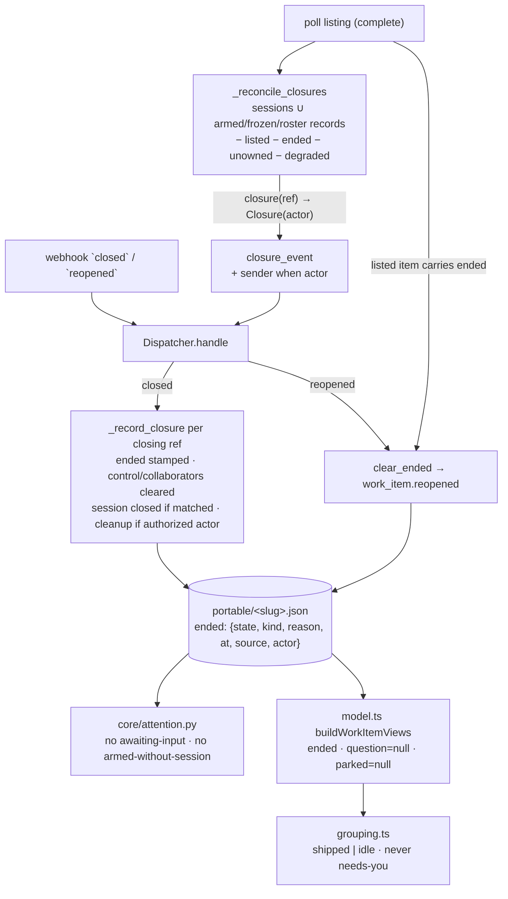

# Design: the `ended` section, and the two surfaces that read it

> Phase 2 of 3. Derived from [`requirements.md`](requirements.md); reviewed together with
> [`testing-plan.md`](testing-plan.md). Tier 3.

## Overview

One new fact, written in one place, read in two:

1. **The fact** — `ended`, a fifth section of the portable record (`workitem.py`),
   with `record_ended` / `ended` / `clear_ended` on `ControlStore` beside
   `record_frozen_graph`.
2. **The writer** — the dispatcher's `closed` branch, which already runs for both
   ingresses. It stamps every closing ref the-loop tracks, whether or not a session
   matched, and a `reopened` action clears the stamp.
3. **More closures reach the writer** — `_reconcile_closures` walks the registry
   (every status) and the portable store (records with `control` / `graph` /
   `collaborators`), skipping ended records; a listed item clears its stamp; the
   GitHub provider reads `closed_by` and puts it on the synthesized event as `sender`.
4. **The readers** — `core/attention.py` and `ui/src/api/model.ts` suppress the
   stale signals for ended records; `grouping.ts` routes ended views to Shipped/Idle.



## 1. The fact — `ENDED` on the record

```python
ENDED = "ended"
SECTIONS = (CONTROL, POLL, GRAPH, COLLABORATORS, ENDED)
```

`write_section` needs no change: a record with only `ended` has a section, so it is
kept; the index lists `"ended"` under `sections`. The section's shape:

| Field | Value |
|-------|-------|
| `state` | `closed` \| `merged` |
| `kind` | `issue` \| `pull-request` |
| `reason` | `issue-closed` \| `pr-merged` \| `pr-closed` (the dispatcher's `_close_reason`) |
| `at` | UTC ISO-8601 with `Z`, seconds precision (`control._utcnow`) |
| `source` | `webhook` \| `poll` (from the delivery id: the poller's start with `poll-close-`) |
| `actor` | the closer's login or `""` |

On `ControlStore` (it already owns the `graph` section for the same "portable fact"
reason):

```python
def record_ended(self, work_item, ended: Dict[str, Any]) -> None: ...
def ended(self, work_item) -> Optional[Dict[str, Any]]: ...   # None unless a mapping
def clear_ended(self, work_item) -> bool: ...                 # False when none
```

`ended()` returns the section only when it is a mapping — a malformed stamp reads as
"not ended" (abuse case 6). The reset path adds `ENDED` to the sections it clears;
`cleanup.py` is untouched (it never imports the store, and the test that asserts that
still holds).

## 2. The writer — the dispatcher's closed branch

Today the branch iterates `matched` sessions and returns early when none matched.
After: the per-session loop is kept as it is (endpoint closes, `session.kept_open`,
`close_session`, `session.autoclosed`, `_cleanup_after_close`); then, for **every ref
in `closing`** the-loop tracks, `_record_closure(ref, routed, reason)`:

```python
def _record_closure(self, ref: WorkItemRef, routed: RoutedEvent, reason: str) -> None:
    """Stamp `ended` and disarm — the part of a close that needs no session."""
    self.control_store.clear(ref)
    self.collaborator_store.clear(ref)
    self.control_store.record_ended(ref, {...})
    eventlog.emit("work_item.ended", ...)
```

*Tracked* means `self.registry.find_by_work_item(ref, include_closed=True)` is not
`None` **or** the portable record has any section (`store.read(ref)` carries one of
`SECTIONS`). A ref with neither is skipped with a debug line: the webhook delivers every
close in the repository, and an untracked issue must not gain a record (abuse case 1).

The matched path's two `clear` calls move into `_record_closure` so there is one place
that disarms; for a matched session that ref is in `closing` by construction (the loop
only closes sessions whose ref is), so behaviour there is unchanged plus the stamp. When
no session matched, the branch no longer returns silently: it records the closure for
tracked refs, and logs "nothing to close" only when none was tracked.

`_cleanup_after_close` for the session-less case: **not** called. Cleanup needs a
session record or a checkout to act on; a ref with a closed session record already had
its close, and the deferred-cleanup remedy (`the-loop cleanup`) is unchanged.

**Reopen.** In `handle`, after the scope decision and before matching:

```python
if routed.event in _CLOSE_EVENTS and routed.action == "reopened":
    for item in routed.work_items:
        if self.control_store.clear_ended(item):
            eventlog.emit("work_item.reopened", work_item=item.ref, source="webhook", ...)
```

then the event continues down the existing path (an unmatched `reopened` on a labelled
item may spawn, as any labelled event may — unchanged). The router already drops a
`reopened` from an unauthorized actor (only `closed` bypasses the guard).

## 3. More closures reach the writer

### 3.1 `_reconcile_closures` — the candidate set

```python
candidates: Dict[str, WorkItemRef] = {}
for session in self.registry.list_sessions():            # every status
    candidates[session.work_item.ref] = session.work_item
for ref in self.state.store.refs():                       # portable records
    if any(store.section(ref, s) for s in (CONTROL, GRAPH, COLLABORATORS)):
        candidates.setdefault(ref, WorkItemRef.parse(ref))
for ref in candidates.values():
    if ref.ref in open_refs or not provider.owns(ref): continue
    if self.control_store.ended(ref) is not None: continue
    if provider.scope_of(ref) in degraded: continue
    ... closure(ref) → the existing body, unchanged ...
```

The store is `self.state.store` (the poll ledger's `WorkItemStore`, the same directory
the dispatcher's `ControlStore` writes). A ref that does not parse is skipped. The
existing test `test_an_already_closed_session_is_not_reconciled_again` inverts: a
closed session **is** asked once, and its stamp keeps it from being asked again — the
test is rewritten to assert that shape.

Cost: one provider call per cycle per candidate absent from the listing and not yet
ended. After the first cycle every closed item carries a stamp, so the steady-state
cost is one call per **open, unlabelled** tracked item per cycle — the same class of
call the active-session rule already made, over a set bounded by what the machine
tracks.

### 3.2 A listed item clears its stamp

In `_process_item`, before the first-sight decision:

```python
if self.control_store.clear_ended(ref):
    eventlog.emit("work_item.reopened", work_item=ref, source="poll")
```

`state.forget` already made a reopened item first-sight again; this makes the record
agree.

### 3.3 The closer, on the polled event

`GhItemState` gains `closed_by: str = ""` (`closed_by.login` from the `issues` REST
object — present for issues and for pull requests, which that endpoint represents as
issues). `Closure` gains `actor: str = ""`; `GitHubPollProvider.closure` copies it.
`closure_event` adds `payload["sender"] = {"login": closure.actor}` **only when** the
actor is non-empty, so a closure GitHub cannot attribute produces the identical payload
to today's. `event_actor` reads `sender.login` for `issues` / `pull_request` events
already, so `_cleanup_after_close` needs no change: the existing
`is_authorized(actor, authorized_users)` decides (R4.3, abuse cases 2 and 3).

## 4. The readers

### 4.1 `core/attention.py`

`records` is already the list of portable records. An `ended = {ref for record in
records if isinstance(record.get("ended"), dict)}` set gates two kinds:
`armed-without-session` (skip when ended) and `awaiting-input` (skip when ended). The
cross-reference comment naming `model.ts::awaitingInput` gains the ended rule.

### 4.2 `ui/src/api/types.ts`, `model.ts`, `grouping.ts`

```ts
export interface EndedRecord { state: string; kind?: string; reason?: string; at?: string; source?: string; actor?: string }
WorkItemRecord.ended?: EndedRecord | null
WorkItemView.ended: EndedRecord | null
```

In `buildWorkItemViews`: `const ended = endedOf(record)` (a mapping with a string
`state`, else `null`); `parked: ended ? null : status?.parked ?? null`; `question:
ended ? null : input.awaiting?.[ref] ?? null`. The rail stays as computed — the
historical position is still true.

`itemGroup`: `if (view.ended) return view.sessionState === "active" ? "running" : "idle"`
first. `sidebarGroup`: `if (view.ended) return isShippedEnd(view.ended) ? "shipped" :
"idle"` before the existing rules, where `isShippedEnd` is `state === "merged" || reason
=== "issue-closed"`; `itemStatus` follows from the group (done / pending). `rowFlag`:
`if (view.ended) return { label: view.ended.state === "merged" ? "merged" : "closed",
urgent: false }` first. `attentionEntries`: `if (view.ended) continue` at the top of
the loop, so a PR endpoint's question or gate under an ended item contributes nothing
either. The detail view's banner condition reads `parked` and `question`, both already
`null`, so it needs no change; the `GateBanner` cannot be reached.

The demo fixture: `makeWorkItem(181, …)` — already the "walked every node, session
closed" item — gains `ended: { state: "merged", kind: "pull-request", reason:
"pr-merged", at: …, source: "webhook", actor: "maintainer" }`, so the demo shows the
Shipped case from the record rather than from the rail alone.

## 5. Events

| Event | Level | Fields |
|-------|-------|--------|
| `work_item.ended` | info | `work_item`, `state`, `kind`, `reason`, `source`, `actor`, `delivery_id` |
| `work_item.reopened` | info | `work_item`, `source` (`webhook` \| `poll`) |

`poll.closure_detected`'s description changes from "an active session's work item" to
"a tracked work item" — the catalog describes behaviour, and the behaviour widened.

## UI/UX design

N/A beyond §4.2 — no new element: the existing groups, dot, chip slot and banners take
the ended state. The chip reads `merged` or `closed` in the node's slot, muted (not the
urgent colour), which is the prototype's own idiom for a non-urgent flag (`paused`).

## Data models

The `ended` section (§1). No schema file describes the portable record; `docs/cli/state.md`
is its reference and is updated (R6.1).

## Error handling

| Failure | Behaviour |
|---------|-----------|
| the store cannot be written on the close path | the existing `write_section` raises `OSError` as it does for `control`; the session close already happened and is logged; the next poll cycle retries the stamp (the item is absent from the listing and not ended) |
| a malformed `ended` (not a mapping) | both readers treat the record as not ended; the writer overwrites it on the next closure |
| `closed_by` absent from the REST object | `actor = ""`; no `sender`; cleanup deferred `no-actor` (today's behaviour) |
| a ref in `portable/` that does not parse | skipped by reconciliation with a debug line (the store already tolerates it) |
| the listing is failed / interrupted / degraded | reconciliation does not run for it (unchanged) |

## Security design

| Boundary (requirements) | Enforcement |
|-------------------------|-------------|
| who may put a stamp on a record | only the dispatcher's close path, from a provider's `closed` event or the provider's own state answer; never from comment text (A1: untracked refs are skipped) |
| who may release local resources on a closure | `_cleanup_after_close`, unchanged: named **and** authorized; the polled event's `sender` is GitHub's `closed_by`, judged by the same rule (A2, A3) |
| a stale or forged stamp on an open item | cleared by the next listing that carries the item, or by an authorized `reopened` (A4, A5); the stamp arms nothing while it stands |
| a malformed stamp | reads as not ended on both surfaces (A6) |
| what the stamp carries | a state, a kind, a reason, a timestamp, a source and a login — all already visible on the ticket (`docs/cli/state.md` § Security is updated: "one of four fixed keywords" gains the closure vocabulary) |

## Testing strategy

See [`testing-plan.md`](testing-plan.md): unit rows over the store, the dispatcher's
closed and reopened branches, the poller's candidate set and stamp-clearing, the
provider's `closed_by`, the attention surface and the dashboard model; integration
scenarios through the webhook receiver and `poll_once`; one negative test per abuse case;
the event catalog and docs parity suites.
