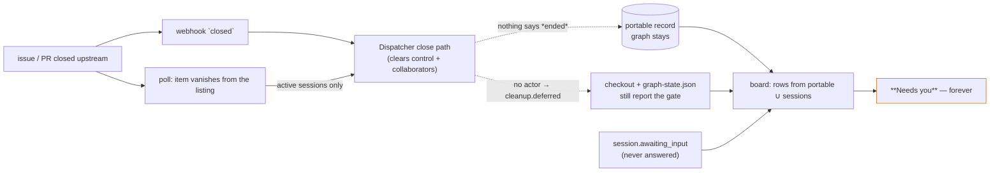

# Requirements: a closed work item is recorded as ended, and the board stops asking for a human on it

> Phase 1 of 3 (requirements → design → tasks). Tier 3 (`human-approves-pr`; below
> `security.review.humanSignOffMinTier: 4`): the change adds one **section** to the
> portable work-item record, writes it on the close path both ingresses already share,
> reads it on the two attention surfaces, and widens which items the poller asks
> "did this end?" about. No new grant, no new route, no schema under
> `autonomy.sensitivePaths`. The one authorization-adjacent change — a polled closure
> now names who closed the item — **attributes** an event; it relaxes no gate.

## Introduction

[Issue #329](https://github.com/MadaraUchiha-314/the-loop/issues/329), opened by the
owner: work items whose GitHub issues or pull requests were closed days ago keep
appearing on the control plane, and most of them sit in **Needs you** with `human gate`,
`blocked` or `needs input` chips, so the operator's inbox never converges to empty.

At `cab21a6` (13.6.0) the board's membership *is* the `portable/` directory plus the
session registry, and nothing on either says "this work item ended":

- the close path (`Dispatcher.handle`, the `closed` branch) clears `control` and
  `collaborators`, and the poller clears `poll` — but `graph` is never cleared, so any
  item that answered phase-selection keeps a record, and a record with no closure fact
  is indistinguishable from an open one;
- the closed session record stays in the registry (`status: closed`) and still puts a
  row on the board through `/api/v1/sessions`, so deleting the portable record would
  not retire the row either;
- `_reconcile_closures` walks only **active** sessions on a complete listing, so an
  item whose session is paused, closed, or never existed on this machine never learns
  it ended — and the webhook's `closed` event does nothing when no session matches;
- a polled closure carries no `sender`, so `_cleanup_after_close` defers every one
  (`cleanup.deferred / no-actor`), which leaves the checkout and its `graph-state.json`
  reporting the parked gate forever;
- `session.awaiting_input` is closed only by a later `session.reply_sent`, and nothing
  on closure emits one, so a question asked before the close stays open forever.

This work item makes closure a **recorded fact** — an `ended` section on the portable
record, written wherever the close path runs — and makes both attention surfaces read
it: an ended item is demoted to *Shipped* or *Idle* with its stale question, gate and
blocked-node flags suppressed. Around that fact it closes the propagation gaps: the
close path stamps items with no session, the poller asks about every item it tracks
rather than only the active ones, a reopen clears the fact, and a polled closure names
who closed the item so an authorized closer's cleanup runs as a webhook closer's does.

## Requirements

### Requirement 1 — closure is a fact on the portable record

**User story:** As an operator running the-loop on more than one machine, I want "this
work item ended, when and how" written beside `control` and `graph`, so that any
machine reading the record knows the item is over without asking GitHub.

#### Acceptance criteria (EARS)

1.1 WHEN the dispatcher handles a `closed` event for a work item — from the webhook or
from the poller's synthesized closure — THEN it SHALL write an `ended` section on that
work item's portable record carrying `state` (`closed` | `merged`), `kind` (`issue` |
`pull-request`), `reason` (`issue-closed` | `pr-merged` | `pr-closed`), `at` (UTC,
ISO-8601), `source` (`webhook` | `poll`) and `actor` (the closer's login, or `""` when
the event names none).

1.2 The `ended` section SHALL be written for every ref the event **closes**
(`_closing_refs`) that the-loop tracks — a ref with a session record of any status on
this machine, or a portable record carrying any section — and SHALL NOT be written for
a ref the-loop has never tracked: a `closed` webhook for an unrelated issue in the
repository creates no record.

1.3 WHEN the closing ref has a portable record but no live session THEN the close path
SHALL still stamp `ended` and clear `control` and `collaborators`, exactly as it does
when a session matched; the only difference is that no session is closed.

1.4 The `ended` section SHALL be a **portable** section of the record (`SECTIONS`
grows by one): a record carrying only `ended` is kept, not deleted, and `index.json`
lists it under `sections`. `graph` SHALL be left in place on closure (its reader,
`Dispatcher._tmux_for`, still serves a reopened item, and `graph-state.json` in the
checkout is the authority on resume — [decision-113](../../decisions/decision-113.md)).

1.5 `the-loop sessions reset` SHALL clear `ended` with the other portable sections (a
reset is start-over); `the-loop cleanup` SHALL leave it (cleanup is local, the record
is the tracking that outlives the machine).

1.6 Writing `ended` SHALL emit `work_item.ended` (work_item, state, kind, reason,
source, actor, delivery_id); clearing it SHALL emit `work_item.reopened` (work_item,
source). Both SHALL be in the event catalog.

### Requirement 2 — a reopened work item is open again

**User story:** As an operator who reopens a ticket, I want the board to treat it as
open, so that a closure stamp never outlives the closure.

#### Acceptance criteria (EARS)

2.1 WHEN the dispatcher handles an `issues` or `pull_request` event with action
`reopened` for a ref whose record carries `ended` THEN it SHALL remove the `ended`
section before any other handling of the event.

2.2 WHEN a poll cycle lists a work item (it is open and labelled) whose record carries
`ended` THEN the poller SHALL remove the `ended` section before processing the item.

2.3 A ref whose record carries no `ended` SHALL be untouched by either path: no write,
no event.

### Requirement 3 — the poller asks about every item it tracks, not only the active sessions

**User story:** As an operator whose daemon was down, or whose item was paused, when
the ticket closed, I want the next poll cycle to notice, so that closure reaches the
board without a live session.

#### Acceptance criteria (EARS)

3.1 WHEN a poll cycle's listing is complete for a scope THEN closure reconciliation
SHALL consider, for that provider: every session record in the registry (`active`,
`paused` or `closed`) **and** every portable record carrying a `control`, `graph` or
`collaborators` section — minus refs the listing carries, minus refs whose record
already carries `ended`, minus refs the provider does not own, minus refs in a degraded
scope.

3.2 A record carrying only `poll` SHALL NOT be reconciled: it is the ledger of a
thread once seen, carries no arming, no frozen shape and no roster, and puts no urgent
flag on the board (its cost per cycle would be one provider call for every unlabelled
open item the poller ever listed).

3.3 A closure found this way SHALL take the dispatcher's close path exactly as an
active session's does (`poll.closure_detected`, the synthesized event, `poll`
forgotten, `summary.closures` counted); a still-open item (`closure is None`) and an
unanswerable one (`ProviderError`) SHALL be left as they are, as today.

3.4 The rules that already bound reconciliation SHALL hold unchanged: nothing is
reconciled after an interrupted or failed listing (issue-159 AC4.2), nor in a degraded
scope (issue-315), nor for a ref the provider does not own.

### Requirement 4 — a polled closure names who closed the item

**User story:** As an operator on a polling deployment, I want a closure by an
authorized user to release the item's local resources the way a webhook closure does,
so that a parked gate in a stranded checkout does not keep the item in *Needs you*.

#### Acceptance criteria (EARS)

4.1 WHEN the GitHub provider answers the closure question THEN `Closure` SHALL carry
`actor`: the login GitHub records as having closed the item (`closed_by.login` on the
`issues` REST object), or `""` when GitHub reports none.

4.2 WHEN the provider synthesizes the close event AND the closure names an actor THEN
the event's payload SHALL carry `sender: {login: <actor>}`; WHEN it names none THEN
the payload SHALL carry no `sender`, exactly as today.

4.3 The cleanup decision SHALL be unchanged: `_cleanup_after_close` runs cleanup for a
**named, authorized** actor and defers (`cleanup.deferred`, `unauthorized-actor` or
`no-actor`) otherwise. A polled closure by a login outside `routing.authorizedUsers`
SHALL defer with `unauthorized-actor` naming that login.

### Requirement 5 — an ended item never asks for a human

**User story:** As the operator reading the board, I want an ended item under
*Shipped* or *Idle* with no urgent chip and no banner, so that *Needs you* holds only
what needs me.

#### Acceptance criteria (EARS)

5.1 WHEN a work item's record carries `ended` THEN `buildWorkItemViews` SHALL set the
view's `ended` to that section and SHALL set `question` and `parked` to `null`,
whatever the events and the graph report say.

5.2 WHEN a view is ended THEN `itemGroup` SHALL never answer `needs-you` — a blocked
rail node, a PR endpoint's question and a PR endpoint's parked gate included — and
`sidebarGroup` SHALL answer `shipped` for `state: merged` or `reason: issue-closed`,
and `idle` for `reason: pr-closed` (a pull request closed unmerged was abandoned, not
shipped).

5.3 WHEN a view is ended THEN `rowFlag` SHALL answer a non-urgent flag naming the end
(`merged` | `closed`) ahead of every other flag, `attentionEntries` SHALL contribute
no entry for it, and the detail view SHALL render neither the gate banner nor the
question banner.

5.4 WHEN a record carries `ended` THEN `GET /api/v1/attention` SHALL report neither
`awaiting-input` nor `armed-without-session` for it — the same rule as 5.1, on the
service side, so the two surfaces agree (the existing cross-reference between
`attention.py` and `model.ts::awaitingInput` extends to this rule).

5.5 The demo fixture SHALL carry one ended work item so the grouping is visible
without a service, and the dashboard SHALL render an ended record from a 13.6.0
service (no `ended` field) exactly as today — the field is optional on
`WorkItemRecord`.

### Requirement 6 — documented where the operator looks

#### Acceptance criteria (EARS)

6.1 `docs/cli/state.md` SHALL document the `ended` section (fields, when written,
when cleared, what deleting it does), list it in the index's `sections`, and carry it
in the reset table.

6.2 `docs/capabilities/webhook-triggers.md` SHALL state the closure behaviour (the
stamp, the session-less close, the widened reconciliation, the attributed polled
closure) with a history row; `docs/capabilities/control-plane.md` SHALL state the
demotion rule with a history row; `decision-113` SHALL record why the record is
stamped rather than deleted and why `graph` stays.

## Security considerations

- **Actors & trust:** GitHub (its `closed` webhook and its REST `issues` object are
  the only sources of the closure fact and the closer's login); authorized users
  (`routing.authorizedUsers` — the only logins whose closure releases local
  resources); anyone with write access to the repository (may close, reopen and
  relabel an issue, and therefore may make the board *demote* an item and, on a
  tracked repository, may propose an `ended` section in a pull request); the
  operator (reads the board, runs reset and cleanup).
- **Trust boundaries & data:** the `ended` section is derived from the provider's
  own state, never from comment text; the actor on a polled closure is GitHub's
  `closed_by`, the same provenance as a webhook's `sender`. The stamp is a **fact
  about visibility**, never authority: it arms nothing, spawns nothing, deletes
  nothing local, and does not gate control commands — `the-loop cleanup` on a closed
  item works exactly as before. The one act it can trigger is the existing cleanup,
  and only through the existing named-authorized-actor check.
- **Abuse cases (EARS):**
  1. WHEN a `closed` webhook arrives for an issue the-loop has never tracked THEN no
     record SHALL be created — an attacker who can close issues cannot fill
     `portable/` with stamps.
  2. WHEN a polled closure's `closed_by` names a login outside `authorizedUsers` THEN
     cleanup SHALL be deferred with `unauthorized-actor` — attribution never widens
     who may destroy an operator's checkout.
  3. WHEN a polled closure names no closer THEN cleanup SHALL be deferred with
     `no-actor`, exactly as today.
  4. WHEN an `ended` section is present on a record (hand-edited, or merged from a
     tracked repository) for an item that is open THEN the next listing that carries
     the item SHALL clear it — the stamp cannot hide an open item for longer than one
     poll cycle, and it arms nothing while it stands.
  5. WHEN a `reopened` event arrives from an unauthorized actor THEN the router
     SHALL drop it before the dispatcher (the existing guard: only `closed` bypasses
     the actor check); the poller's listing clears the stamp on the next cycle instead.
  6. WHEN the `ended` section is malformed (not a mapping) THEN both surfaces SHALL
     treat the record as not ended — a malformed stamp fails towards *showing* the
     item, which is the safe direction for an attention surface.
- **Fail closed:** no `ended` section means the item is treated exactly as at 13.6.0;
  reconciliation never runs on a failed, interrupted or degraded listing; an
  unanswerable closure question leaves the item as it is; the actor gate on cleanup is
  unchanged. This work item adds no grant and widens no authorization.

## Out of scope

- Deleting the portable record on closure (decision-113: the record with `ended` is
  the tracking that outlives the machine, and the closed session record would keep
  the row anyway).
- Emitting a synthetic `session.reply_sent` to close the question — the surfaces
  suppress the question for an ended item instead, and the event log stays a record of
  what happened.
- Relaxing the cleanup actor gate for provider-verified closures with no closer.
- A retention window after which ended items leave *Shipped* (a later work item can
  add one; the fact it would read is now recorded).
- Advancing or retracting a parked gate in the checkout's `graph-state.json`.

## Open questions

None raised on the ticket. The ticket's item 3 ("clear the `graph` section so records
converge to deletion") is answered differently — the record is stamped and kept — for
the reasons in [decision-113](../../decisions/decision-113.md); the owner can overrule
at the PR.

## Review comments

> Appended by the-loop's `record-feedback` hook when a human gate approves with
> comments (issue-109). Append-only and attributed: an approval never silently
> discards a reviewer's suggestions, and the feedback travels with the document
> it concerns rather than living in a side-channel tracker.
