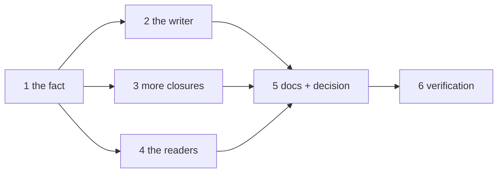

# Tasks: a closed work item is recorded as ended, and the board stops asking for a human on it

> The last spec artifact. A DAG derived from the design and testing plan; each task names
> the testing-plan row that proves it. TDD: the test first, red, then green.

## Task list

- [x] 1. The fact — `ENDED` in `workitem.py` (`SECTIONS`), `record_ended` / `ended` /
  `clear_ended` on `ControlStore`, `ENDED` in `reset.py`, the two event types in
  `eventlog.py`
  - _Depends on:_ none
  - _Requirements:_ R1.4, R1.5, R1.6
  - _Test:_ T1 — the store, control and reset tests; T11 — the event catalog
- [x] 2. The writer — `Dispatcher._record_closure` on the closed branch (matched and
  session-less), the `reopened` clearing in `handle`
  - _Depends on:_ 1
  - _Requirements:_ R1.1–R1.3, R2.1, R2.3
  - _Test:_ T1 — the routing tests; T3 — the two webhook scenarios; T9 — A1, A5
- [x] 3. More closures — the poller's candidate set, the listed-item clearing,
  `GhItemState.closed_by` → `Closure.actor` → `sender`
  - _Depends on:_ 1
  - _Requirements:_ R2.2, R3.1–R3.4, R4.1–R4.3
  - _Test:_ T1 — the poller and provider tests; T3 — the three poll scenarios; T9 — A2, A3, A4
- [x] 4. The readers — `core/attention.py`; `types.ts`, `model.ts`, `grouping.ts`, the
  demo fixture
  - _Depends on:_ 1
  - _Requirements:_ R5.1–R5.5
  - _Test:_ T1 — the attention test; T2 — the dashboard tests; T9 — A6
- [x] 5. Docs, capability docs, decision — `docs/cli/state.md`,
  `docs/capabilities/webhook-triggers.md`, `docs/capabilities/control-plane.md`,
  `decision-113` + index row, `ui/README.md`
  - _Depends on:_ 2, 3, 4
  - _Requirements:_ R6.1, R6.2, the capability-docs gate
  - _Test:_ T11 — docs parity; T13 — `make check`
- [x] 6. Verification — execute `testing-plan.md`, record `evidence/verification.md` and
  `evidence/security-review.md`
  - _Depends on:_ 5
  - _Requirements:_ all
  - _Test:_ T1, T2, T3, T9, T11, T13, T14

## Dependency graph (DAG)

## Checkpoints

After task 1: the store, control, reset and catalog tests green. After tasks 2–4: T1,
T2 and T3 green. After task 5: `make check` and the dashboard's three commands. Then
the verification node, the self-review rounds and the security review gate
(`evidence/security-review.md`), then the PR with the reviewer briefing.

## Review comments

> Appended by the-loop's `record-feedback` hook when a human gate approves with
> comments (issue-109). Append-only and attributed: an approval never silently
> discards a reviewer's suggestions, and the feedback travels with the document
> it concerns rather than living in a side-channel tracker.
