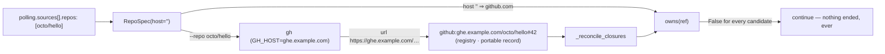

# Bugfix spec: a poll source's bare `OWNER/REPO` is on the GitHub the-loop resolves, so closure reconciliation owns what listing polled

> Phase 1 of 3 for a bug (bugfix → design → tasks). Tier 3 (`human-approves-pr`; below
> `security.review.humanSignOffMinTier: 4`): no schema, workflow or config key changes;
> a host that already reaches every `gh` argv reaches one more place through the same
> grammar.

## Summary

[Issue #331](https://github.com/MadaraUchiha-314/the-loop/issues/331): on a GitHub
Enterprise deployment whose poll source declares its repositories in the bare
`OWNER/REPO` form, closure reconciliation (issue-94, widened by issue-329) never stamps
`ended` on any work item. Closed issues and merged pull requests stay on the
control-plane board as if open, and no session is ever closed through the reconciliation
path. Listing, comment forwarding and every other read work in the same configuration,
so the failure is invisible: every closure candidate is dropped by a silent `continue`.

The two halves of the poller disagree about where a bare repository is:

- **Listing** shells out to `gh issue list --repo octo/hello`, and `gh` resolves the host
  from `$GH_HOST` (or its own config). The items it returns carry the enterprise host in
  their URL, so every ref the poller mints — and every ref in the registry and the
  portable records — is `github:ghe.example.com/octo/hello#42`.
- **`GitHubPollProvider.owns()`** compares the ref's host against `spec.host or
  DEFAULT_GITHUB_HOST`. A bare entry parses to `RepoSpec(host="")`, which `owns()` reads
  as github.com. It answers `False` for every ref the listing itself produced.



## Steps to reproduce

1. Set `GH_HOST=ghe.example.com` (or `integrations.github.host: ghe.example.com`).
2. Configure a poll source with `repos: [octo/hello]`.
3. Let the poller track an open issue in that repository, then close the issue upstream.
4. No `poll.closure_detected` event, no `ended` section on the portable record, the item
   is never demoted on the board.

The unit-level form:

```python
p = GitHubPollProvider(repos=parse_repos(["octo/hello"]), label="")
ref = WorkItemRef.parse("github:ghe.example.com/octo/hello#42")
assert p.owns(ref) is False   # the item IS from the configured repository
```

## Expected vs actual

- **Expected:** a source's bare `OWNER/REPO` means the same GitHub everywhere in the
  poller — the one `integrations.github.host` / `$GH_HOST` resolves — so a ref the
  listing minted is a ref the source owns, and a closed item is stamped and demoted.
- **Actual:** the listing goes where `gh` points; `owns()` assumes github.com; the two
  never meet on an enterprise host, and reconciliation is a no-op with no log line,
  event or warning.

## Root cause (confirmed)

Issue-311 made the host explicit in `RepoSpec` (`[HOST/]OWNER/REPO`) and taught
`owns()` to compare hosts (R5.3, so an enterprise source does not claim its github.com
twin). It left a bare entry's host **unresolved**: `RepoSpec.host == ""` was documented
as "github.com", while the listing for that same entry went wherever `gh` resolved —
which, on an enterprise deployment, is not github.com. The asymmetry is between the
source's declared scope (assumed) and the refs its own listing minted (observed).

A second, quieter consequence of the same gap: with only `integrations.github.host` set
(no `$GH_HOST`), a bare entry's listing goes to **github.com**, because `gh` never sees
the key the-loop resolved. The resolver exists (issue-311, `ghhost.github_host`) but the
poller never asked it.

## Requirements

### Requirement 1 — a bare repository is on the resolved host, everywhere in the poller

**User story:** as an operator on GitHub Enterprise, I want `repos: [octo/hello]` to mean
the GitHub I configured, so that listing and closure reconciliation agree on scope
without me host-pinning every entry.

#### Acceptance criteria (EARS)

1.1 WHEN a poll source is built from configuration THEN a `repos` entry with no host
SHALL inherit the host `ghhost.github_host` resolves from the CLI config and the
environment (`integrations.github.host`, an enterprise `github.api.baseUrl`, `$GH_HOST`,
github.com — the daemon runs outside any checkout, so the origin-remote tier does not
apply).

1.2 WHEN the resolved host is `github.com` THEN the entry SHALL be exactly what it was
before this change: `RepoSpec.host == ""`, `gh_repo == "OWNER/REPO"`, every `gh` argv
byte-identical.

1.3 WHEN an entry names its host (`HOST/OWNER/REPO`) THEN that host SHALL win over the
resolved default, so a source may mix repositories on two GitHubs.

1.4 WHEN a bare entry has inherited a host THEN every read the source makes for it —
listings, comments, reviews, closure state — SHALL name that host (issue-311 R4), the
scope it is reported under SHALL name it, and `owns()` SHALL claim refs on it and refuse
refs on github.com with the same `OWNER/REPO`.

1.5 WHEN the CLI config is hot-reloaded THEN the host SHALL be resolved again with the
sources, so a change to `integrations.github.host` takes effect on the next cycle
exactly as a change to `repos` does.

1.6 The provider's log description (`polling github …`) SHALL spell each repository
with its host when it is not github.com, so the paper trail shows which GitHub a source
was bound to.

### Requirement 2 — proof

2.1 The fix SHALL include the regression from the ticket: a provider built from a bare
entry under a resolved enterprise host owns `github:<host>/OWNER/REPO#n` and does not
own `github:OWNER/REPO#n`; the test fails before the fix.

2.2 The fix SHALL prove the end-to-end path through `poll_once`: a tracked item on a bare
enterprise source that disappears from the listing and reads as closed is stamped
`ended` and closed through the dispatcher.

## Security considerations

The bug itself is not exploitable: it withholds a closure, it never grants one. The fix
routes an already-validated host string through one more constructor.

| # | Abuse case | Boundary | Mitigation |
|---|------------|----------|------------|
| A1 | The resolved default host is not the shape of a host and reaches a `--repo` argument | config/env → argv | `github_host` already skips a malformed candidate with a warning (issue-311 A1); `RepoSpec.parse` applies `is_github_host` to the inherited host exactly as to a written one and refuses with a `ValueError` naming the entry, so a bad default fails the source at plan time rather than reaching `gh` |
| A2 | An enterprise source claims a github.com repository with the same `OWNER/REPO` (issue-311 R5.3, the rule this fix must not undo) | ref → `owns()` | The host comparison in `owns()` is unchanged; only the spec's host becomes the resolved one. A github.com ref is still refused by a source bound to an enterprise host, and vice versa — asserted by the regression test's negative half |
| A3 | A github.com deployment changes behaviour | regression | R1.2: the resolver answers `github.com`, which `RepoSpec` keeps unwritten; every existing argv, scope name and `describe()` string is unchanged, asserted by the existing host tests (`test_a_github_com_read_is_byte_identical`) |
| A4 | A poll source is made to read a GitHub the operator did not configure | config → host | The inherited host comes from the operator's own config or `gh`'s own `$GH_HOST`, the same inputs `gh` already honoured for the listing; the fix removes a disagreement, it adds no input |

No new attack surface: no new config key, no new grant, no new process, no new network
destination the listing did not already reach.

## Out of scope

- **Logging the "not owned" skip in `_reconcile_closures`.** With several sources, every
  candidate is legitimately not-owned by all but one; a per-candidate debug line would
  be noise, and the fix removes the only case where the skip was wrong.
- **The origin-remote tier for the daemon.** The daemon runs outside any checkout by
  design (issue-311); a poll source on a host only the checkout knows is host-pinned.
- **Jira.** No Jira poll provider exists.

## Open questions

None. The ticket names both fix directions; `design.md` chooses one and
[decision-114](../../decisions/decision-114.md) records why.
