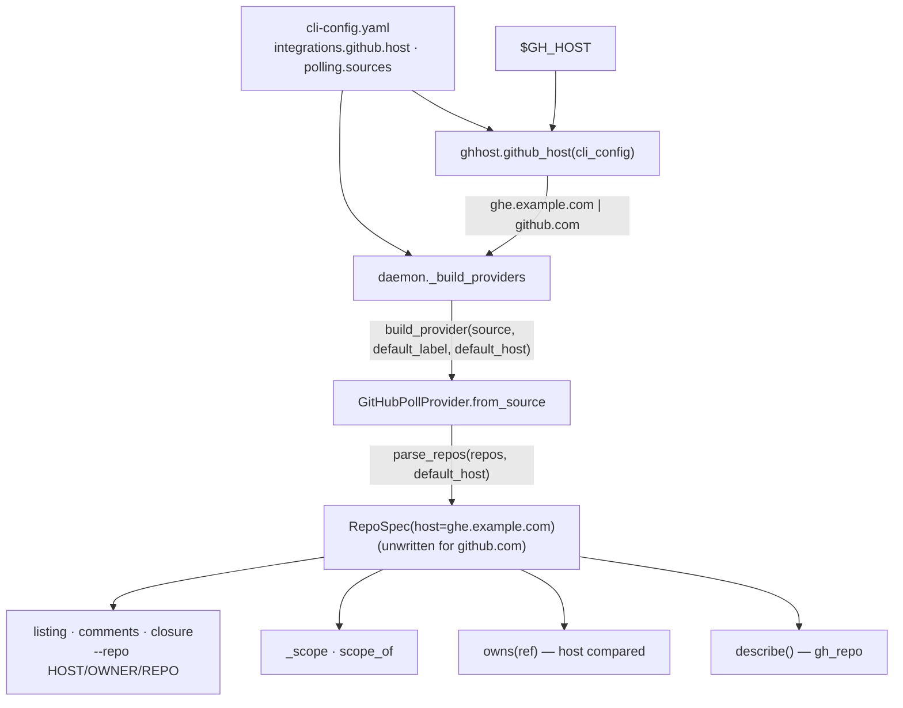

# Design: the source inherits the resolved host when it is built

> Phase 2 of 3. Derived from [`bugfix.md`](bugfix.md); reviewed together with
> [`testing-plan.md`](testing-plan.md). Tier 3.

## Overview

The ticket offers two directions: make `owns()` resolve an empty spec host at
comparison time, or make the source inherit the configured default host when it is
built. This design takes the second, because the bug is not in `owns()` — it is that a
bare entry's host was never decided, so every consumer of `RepoSpec.host` decided for
itself (`gh` one way, `owns()` another). Deciding it **once, where the source is
built**, makes every consumer agree without teaching any of them about the resolver:

1. **The grammar** — `RepoSpec.parse(value, default_host="")` fills a two-segment
   entry's host from `default_host`, through the same normalisation (`github.com` →
   unwritten) and the same validation (`is_github_host`) a written host gets.
2. **The contract** — `PollProvider.from_source(source, *, default_label, default_host="")`
   and `build_provider(...)` carry the default through; the GitHub provider hands it to
   `parse_repos`.
3. **The caller** — the daemon resolves the host with `ghhost.github_host` from the same
   CLI config it reads `polling` from, at pre-flight, at the initial plan and on every
   hot reload (one helper, `_build_providers`, used by all three).
4. **The paper trail** — `describe()` spells each repository as `gh_repo`, so the
   startup and reload lines show the host a source was bound to.



## Components & interfaces

### `poller/github.py`

```python
@classmethod
def parse(cls, value: str, default_host: str = "") -> "RepoSpec": ...
def parse_repos(values: Sequence[str], default_host: str = "") -> List[RepoSpec]: ...

@classmethod
def from_source(cls, source, *, default_label: str, default_host: str = "") -> "GitHubPollProvider": ...
def describe(self) -> str:  # "github " + ", ".join(s.gh_repo ...)
```

`RepoSpec.parse`: a three-segment value keeps its own host (R1.3). A two-segment value
takes `default_host`. Either way the host then passes the one normalisation
(`github.com` → `""`) and, when still set, the one grammar (`is_github_host`); a failure
raises `ValueError` naming the entry and, for an inherited host, that it was the default
(A1). `parse_repos` de-duplicates on `gh_repo` as before, so `["octo/hello",
"ghe.example.com/octo/hello"]` under a default of `ghe.example.com` is one repository.

`owns()`, `_scope`, `scope_of`, `_repo_flag` and every `GhClient` call are **unchanged**:
they already read `spec.host`, which is now the decided one.

### `poller/base.py`

`from_source` and `build_provider` gain `default_host: str = ""` — keyword-only,
defaulted, so every existing caller and every test that builds a provider without a
host is unchanged. The base docstring says what the argument means for a provider that
has hosts and that one without (Jira, some day) may ignore it.

### `poller/daemon.py`

```python
def _build_providers(data: Mapping[str, Any], *, default_label: str) -> List[PollProvider]:
    """Every source in the CLI config `data`, bound to the resolved host (issue-331)."""
    default_host = github_host(data)
    sources = PollConfig.from_mapping(data.get("polling") or {}).sources
    return [build_provider(s, default_label=default_label, default_host=default_host) for s in sources]
```

Used by the pre-flight (`default_label=""`), by `build_plan()` for the initial plan and,
through the `Reloader`, on every config edit (R1.5). `github_host` is called with no
`repo_root`, so tiers 1–3 and github.com apply (bugfix R1.1). Each call site loads the
CLI config once, as before, and hands the mapping in — the helper is pure over it, which
is also what makes it testable without a file.

## Data models

None changed. `RepoSpec` keeps its three fields; a bare entry's `host` is now the
resolved default instead of `""`-meaning-github.com. No config key, no schema, no
portable record, no event type.

## Error handling

| Condition | Behaviour |
|-----------|-----------|
| The resolved default is not a host (A1) | `github_host` already skipped it with a warning and answered the next tier; if a caller passes a malformed default directly, `RepoSpec.parse` raises `ValueError` and the source fails at plan time (pre-flight exits 1 naming it; a reload keeps the previous plan, as `Reloader` does on any build error) |
| An entry names a host and a default is set | the entry's host wins (R1.3) |
| No host anywhere | `github.com`, unwritten — the pre-change behaviour (R1.2) |

## Security design

- **AuthN/AuthZ:** unchanged. `gh` authenticates per host and sends only the credential
  it holds for the host in `--repo`; the inherited host is one the operator configured
  or `gh` already resolved for the listing (A4).
- **Input validation & injection surfaces:** the inherited host passes `is_github_host`
  inside `RepoSpec.parse` before it can reach `gh_repo` (A1) — the same expression that
  guards a written host, a ref host and the resolver's own candidates. `gh` is spawned
  from an argv list.
- **Secrets handling:** none involved.
- **Least privilege:** no new permission; the source reads the repositories it always
  listed, on the host it always listed them from.
- **Fail-closed behaviour:** a malformed default fails the source at build time rather
  than producing a `--repo` argument; `owns()` still refuses a ref whose host differs
  from the spec's (A2).
- **Abuse-case coverage:** A1 → `test_repospec_refuses_a_malformed_default_host`;
  A2 → the negative half of `test_a_bare_repo_inherits_the_default_host_and_owns_its_refs`;
  A3 → `test_a_github_com_default_leaves_the_spec_unwritten` and the existing
  `test_a_github_com_read_is_byte_identical`; A4 → by construction (no new input), noted
  in `evidence/security-review.md`.

## Testing strategy

Unit tests in `test_poller.py` pin the grammar (`RepoSpec.parse` / `parse_repos` with a
default), the contract (`from_source` / `build_provider` carry it; an explicit host wins;
github.com stays unwritten), the ticket's regression on `owns()`, and `describe()`. A
unit test on `daemon._build_providers` proves the daemon resolves the host from the same
config file (`integrations.github.host`, then `$GH_HOST`). One scenario in
`test_poller_integration.py` walks `poll_once` on a bare enterprise source: the tracked
item vanishes from the listing, reads as closed on the enterprise host, is stamped
`ended` and closed through the dispatcher. The existing issue-311 host tests are the
regression net for github.com.

## Trade-offs & decisions

[decision-114](../../decisions/decision-114.md): inherit at build time rather than
resolve inside `owns()`. Resolving in `owns()` would fix the reported symptom and leave
the listing still going wherever `gh` points — a source configured through
`integrations.github.host` alone would keep polling github.com while owning enterprise
refs, the same asymmetry mirrored.

## Open questions

None.

## Review comments

> Appended by the-loop's `record-feedback` hook when a human gate approves with
> comments (issue-109). Append-only and attributed.
