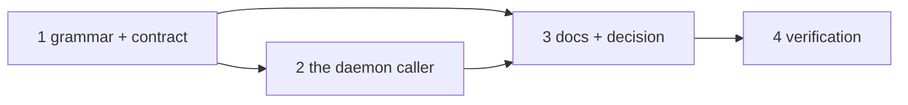

# Tasks: a poll source's bare `OWNER/REPO` is on the GitHub the-loop resolves

> The last spec artifact. A DAG derived from the design and testing plan; each task names
> the testing-plan row that proves it. TDD: the test first, red, then green.

## Task list

- [x] 1. The grammar and the contract — `RepoSpec.parse(default_host)`,
  `parse_repos(default_host)`, `from_source` / `build_provider` carry it, `describe()`
  spells `gh_repo` (`poller/github.py`, `poller/base.py`)
  - _Depends on:_ none
  - _Requirements:_ R1.1–R1.4, R1.6, R2.1, A1–A3
  - _Test:_ T1 — the grammar, contract, `owns()` and `describe()` tests; T8; T10
- [x] 2. The caller — `daemon._build_providers` resolving the host with
  `ghhost.github_host`, used by the pre-flight, the initial plan and the reloader
  - _Depends on:_ 1
  - _Requirements:_ R1.1, R1.5
  - _Test:_ T1 — the daemon helper test; T2 — the `poll_once` scenario
- [x] 3. Docs, capability docs, decision — `docs/config/cli/polling-options.md`,
  `docs/config/cli/integrations-options.md`, `docs/cli/concepts.md`, the config
  template comment, `docs/capabilities/cli.md` (rule + history row), `decision-114` +
  index row
  - _Depends on:_ 1, 2
  - _Requirements:_ the capability-docs gate
  - _Test:_ T12 — `make check` (markdownlint, docs parity)
- [x] 4. Verification — execute `testing-plan.md`, record `evidence/verification.md` and
  `evidence/security-review.md`
  - _Depends on:_ 3
  - _Requirements:_ all
  - _Test:_ T1, T2, T8, T10, T12, T13

## Dependency graph (DAG)

## Checkpoints

After task 1: the poller unit suite green. After task 2: the integration scenario green.
After task 3: `make check`. Then the self-review rounds and the security review gate,
then the PR with the reviewer briefing.

## Review comments

> Appended by the-loop's `record-feedback` hook when a human gate approves with
> comments (issue-109). Append-only and attributed.
