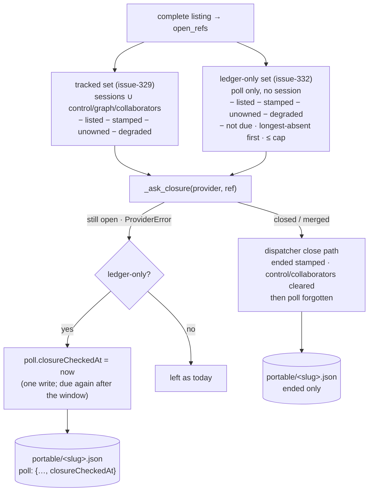

# Design: the ledger-only set — absent for a window, asked once, capped per cycle

> Phase 2 of 3. Derived from [`requirements.md`](requirements.md); reviewed together with
> [`testing-plan.md`](testing-plan.md). Tier 3.

## Overview

One second candidate set beside the tracked one, with a schedule the tracked set does
not have, feeding the same question and the same close path:

1. **The schedule** — two timestamps the ledger already carries (`lastPolledAt`) or now
   carries (`closureCheckedAt`), a window in cycles × interval, a cap per cycle.
2. **The set** — `_ledger_candidates()`: every `poll`-only record with no session, not
   listed, not stamped, due; longest-absent first.
3. **The question** — the body of `_reconcile_closures` factored into `_ask_closure()`
   so both sets share it verbatim; a ledger-only *open* or *unanswerable* result writes
   `closureCheckedAt`; a closure is indistinguishable from a tracked one.



## 1. The schedule

```python
LEDGER_RECHECK_EVERY_CYCLES = 60   # window = this × PollConfig.interval_seconds
LEDGER_CHECKS_PER_CYCLE = 20       # per provider per cycle
```

Both live in `poller/poller.py` beside `_SEEN_COMMENTS_CAP` — the poller core is their
only reader (unlike `REPROBE_EVERY_CYCLES`, which the GitHub provider shares).

**Why time on the ledger, not a cycle counter.** The ticket phrases the trigger as "absent
for N consecutive successful cycles". A counter kept in memory never reaches N under
`poll --once` from cron — every cycle is a new process — and that is the deployment
shape the closed rows were reported from. A counter written to the ledger costs one
record write plus an index rewrite per absent record per cycle, which is the one thing
the ledger's per-item flush was designed to avoid. The ledger already records the last
cycle that *saw* the item (`lastPolledAt`); with one more timestamp for the last cycle
that *asked* about it, "absent for a window" is a comparison with no write, and a
"still open" answer costs exactly one write. The window is `LEDGER_RECHECK_EVERY_CYCLES ×
self.config.interval_seconds`, read per cycle so a hot-reloaded interval is honoured; at
the default interval it is one hour, the same slow re-probe issue-315 chose.

**Why a cap.** The first cycle after upgrade on a busy deployment could otherwise put
hundreds of questions to the provider in one cycle — each a `gh api` subprocess — and
reconciliation has no stop-event check of its own. Twenty per provider per cycle drains a
backlog of a hundred in five cycles and bounds the cycle's length. The longest-absent
records go first: they are the likeliest to have closed, and once asked they are either
stamped or dated, so the cap never re-examines the same head of the queue.

## 2. The set — `PollState` and `_ledger_candidates`

On `PollState`, two methods beside `forget`:

```python
def absent_since(self, ref: str) -> str:
    """The later of lastPolledAt and closureCheckedAt ("" when neither)."""

def note_closure_check(self, ref: str, checked_at: str) -> None:
    """Record that the provider was asked and the item was not confirmed
    closed; flushed at once, like `forget`."""
```

`absent_since` compares the two strings lexically — both are `_utcnow()`'s
`%Y-%m-%dT%H:%M:%SZ`, which orders as text — and returns `""` when neither parses to
that shape, which the poller reads as *due*. Parsing is `datetime.strptime` against that
one format; anything else is unparsable, and unparsable means due (R1.2): the cost of a
bad timestamp is one question and one well-formed write, after which the record is on
the schedule.

On `Poller`:

```python
def _ledger_candidates(
    self, open_refs: set, tracked: set, now: str, window_seconds: int
) -> List[WorkItemRef]:
```

walks `self.state.store.refs()`, keeps a ref that has `POLL` and none of `CONTROL`,
`GRAPH`, `COLLABORATORS`, is not in `tracked` (the refs `_closure_candidates` returned —
so a session record of any status excludes it, R2.3), is not in `open_refs`, is not
stamped (`self.closure_store.ended(ref) is None`), parses as a ref, and is due; returns
them ordered by `(absent_since, ref)`. Ownership and the degraded scope are checked by
the caller, as they are for the tracked set, so the cap counts questions and not
skips (R1.3).

## 3. The question — `_ask_closure`

`_reconcile_closures` becomes:

```python
degraded = degraded or set()
tracked = self._closure_candidates()
for ref in tracked:
    ... the four skips as today ...
    self._ask_closure(provider, ref, summary)
now = _utcnow()
asked = 0
for ref in self._ledger_candidates(open_refs, {r.ref for r in tracked}, now, window):
    if not provider.owns(ref) or provider.scope_of(ref) in degraded:
        continue
    if asked >= LEDGER_CHECKS_PER_CYCLE:
        break
    asked += 1
    summary.ledger_checks += 1
    if not self._ask_closure(provider, ref, summary):
        self.state.note_closure_check(ref.ref, now)
```

`_ask_closure` is the existing body — `provider.closure(ref)` under the `ProviderError`
handler, the `None` skip, the `poll.closure_detected` event, `dispatcher.handle`,
`state.forget`, `summary.closures` — returning `True` only when a closure was dispatched.
Both *still open* and *unanswerable* return `False`, and for a ledger-only record both
date the check (R1.5, A1): an item GitHub cannot answer about is deferred a window rather
than retried every cycle at the head of the queue.

**Order of the stamp and the forget (A4).** `Dispatcher.handle` runs the closed branch
inline: `_tracks(ref)` sees the `poll` section, `_record_closure` stamps `ended`, and only
then does the poller's `state.forget` drop `poll`. The record ends as `ended` only —
kept, indexed, demoted on the board (decision-113) — never deleted by the race the
asynchronous delivery path would otherwise allow.

## 4. The counter

`PollSummary.ledger_checks: int = 0`; `poll.cycle` emits `ledger_checks=summary.ledger_checks
or None`, the same omit-when-zero shape as `closures`. The heartbeat is untouched
(requirements § Out of scope).

## Data models

The `poll` section gains one optional field:

| Field | Value |
|-------|-------|
| `closureCheckedAt` | UTC ISO-8601 with `Z`, seconds precision — the last cycle that asked the provider whether this unlisted item ended and was not told *closed* |

No schema file describes the portable record; `docs/cli/state.md` is its reference (R3.1).

## Error handling

| Failure | Behaviour |
|---------|-----------|
| `ProviderError` on a ledger-only question | logged and evented as today (`poll.item_error`, `will_retry`), `summary.errors` appended, **and** `closureCheckedAt` written — retried after the window, not next cycle |
| a `lastPolledAt` / `closureCheckedAt` that does not parse | due now; one question; a well-formed `closureCheckedAt` written on a non-closure |
| the ledger cannot be written after a non-closure | `write_section` raises `OSError` as it does for every ledger write; the cycle ends as a ledger failure does today; the record is due again next cycle |
| a ref in `portable/` that does not parse | skipped with a debug line (as `_closure_candidates` does) |
| the listing is failed / interrupted / degraded | reconciliation does not run for it (unchanged) |
| more due records than the cap | the longest-absent twenty are asked; the rest next cycle |

## Security design

| Boundary (requirements) | Enforcement |
|-------------------------|-------------|
| how many provider calls a planted record set can cost | the cap per provider per cycle; one question per record per window; an unanswerable record is dated like an open one (A1) |
| what a forged timestamp can do | delay the question — never write `ended`; a future timestamp is simply not due (A2) |
| acting on doubt | `_ask_closure` returns `False` for *open* and *unanswerable*; the ledger-only branch then writes a timestamp and nothing else (A3) |
| who writes the stamp | the dispatcher's close path, from the provider's answer, through `_tracks`; the poller forgets `poll` after the synchronous stamp (A4) |
| cleanup on a ledger-only closure | the synthesized event carries `closed_by` as `sender`; `_cleanup_after_close` is unchanged (issue-329 R4.3) — and a ledger-only item has no session or checkout to clean |

## Testing strategy

See [`testing-plan.md`](testing-plan.md): unit rows over `PollState`'s two methods, the
candidate set (each exclusion, the window, the order, the cap), the two non-closure
outcomes writing the timestamp, the closure outcome stamping and forgetting, the
counter; one integration scenario through `poll_once` and the `gh` double; one negative
test per abuse case; the event catalog and docs parity suites.

## Trade-offs & decisions

[`decision-115`](../../decisions/decision-115.md): time on the ledger rather than a
counter; a constant window and cap rather than a config key; the unanswerable case
deferred rather than retried.

## Open questions

None.

## Review comments

> Appended by the-loop's `record-feedback` hook when a human gate approves with
> comments (issue-109). Append-only and attributed: an approval never silently
> discards a reviewer's suggestions, and the feedback travels with the document
> it concerns rather than living in a side-channel tracker.
