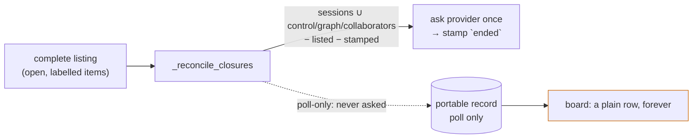

# Requirements: a closed poll-only work item leaves the board by itself

> Phase 1 of 3 (requirements → design → tasks). Tier 3 (`human-approves-pr`; below
> `security.review.humanSignOffMinTier: 4`): the change widens which records the poller
> asks "did this end?" about, under a window and a per-cycle cap, and adds one field to
> the `poll` section of the portable record. No new grant, no new route, no config key,
> no schema under `autonomy.sensitivePaths`. A closure found this way takes the close
> path issue-329 already gates.

## Introduction

[Issue #332](https://github.com/MadaraUchiha-314/the-loop/issues/332), opened by the
owner: closure reconciliation (issue-329) deliberately leaves out portable records that
carry only a `poll` section, so the ledger of a thread the poller once saw stays on the
control plane forever after its issue or pull request closes. On a busy deployment a
dozen-plus closed rows accumulate, and the only remedy is `the-loop reset`, which is
manual and clears more than the operator may want.

At `161ba52` (13.7.1) the rule is exactly what decision-113 D4 chose: every session record
and every portable record that is armed (`control`), frozen (`graph`) or rostered
(`collaborators`) is asked once per cycle while it is absent from the listing and not yet
stamped; a record carrying only `poll` is never asked, because asking would cost one
provider call per unlabelled open item per cycle, forever, for rows that carry no urgent
flag.

The ticket names four options and prefers the first: **lazy reconciliation**. Absence
from a complete listing is already strong evidence that an item closed or lost its
label; one bounded check per item confirms which, and the stamp the close path writes
makes the set self-pruning. This work item implements that option. The other three —
an opt-in config knob, a board-side retention window, a targeted CLI cleanup — are out
of scope, for the reasons given below.

## Requirements

### Requirement 1 — a ledger-only record is asked, lazily and boundedly

**User story:** As an operator on a polling deployment, I want a closed item the poller
once saw to leave the plain rows of the board without my intervention, so that the
board converges to what is open.

#### Acceptance criteria (EARS)

1.1 WHEN a poll cycle's listing is complete for a scope THEN, after the tracked set of
issue-329 is reconciled, closure reconciliation SHALL also consider every **ledger-only**
record of that provider: a portable record carrying `poll` and none of `control`, `graph`
or `collaborators`, with no session record of any status on this machine — minus refs the
listing carries (their own and linked), minus refs whose record carries `ended`, minus
refs the provider does not own, minus refs in a degraded scope, minus refs that are not
yet **due**.

1.2 A ledger-only record is **due** WHEN the later of `poll.lastPolledAt` and
`poll.closureCheckedAt` lies at least `LEDGER_RECHECK_EVERY_CYCLES × intervalSeconds`
seconds before the cycle's own time (sixty cycles — one hour at the default interval). A
timestamp that is absent or does not parse SHALL count as due.

1.3 At most `LEDGER_CHECKS_PER_CYCLE` (twenty) ledger-only records SHALL be asked per
provider per cycle, the longest-absent first; the rest wait for a later cycle. The cap
counts questions actually put to the provider, not records skipped by 1.1.

1.4 WHEN the provider answers that a ledger-only item is closed or merged THEN the closure
SHALL take the path the tracked set takes: `poll.closure_detected`, the synthesized close
event through the dispatcher (which stamps `ended` and clears `control` and
`collaborators`), the `poll` section forgotten, `summary.closures` counted. The record
then carries only `ended` and is never asked again.

1.5 WHEN the provider answers that a ledger-only item is still open, OR cannot answer
(`ProviderError`), THEN the poller SHALL write `poll.closureCheckedAt` = the cycle's time
on that record and nothing else: no stamp, no close, no forgetting. The record is asked
again only once the window of 1.2 has elapsed from that time.

1.6 The cycle SHALL count the questions 1.3 admits — `PollSummary.ledger_checks`, and
`ledger_checks` on the `poll.cycle` event (omitted when zero, like `closures`) — so the
provider calls this rule spends are visible where the cycle's other counters are.

1.7 The rules that already bound reconciliation SHALL hold unchanged for ledger-only
records: nothing is asked after a failed or interrupted listing (issue-159 AC4.2), nor
in a degraded scope (issue-315), nor for a ref the provider does not own.

### Requirement 2 — the tracked set is unchanged

**User story:** As the owner of issue-329's behaviour, I want the armed, frozen, rostered
and session-backed items reconciled exactly as today, so that this work item adds a set
and changes no rule.

#### Acceptance criteria (EARS)

2.1 A record carrying `control`, `graph` or `collaborators`, or a session record of any
status, SHALL be reconciled every cycle it is absent and unstamped, with no window and
no cap — the urgent set stays urgent.

2.2 Every existing reconciliation test SHALL pass unchanged, with one exception: the test
that pinned issue-329's R3.2 (*a poll-only record is not reconciled*) becomes the pair
*a poll-only record seen this window is not asked* / *a poll-only record absent for the
window is asked once*.

2.3 A record with `poll` beside `control`, `graph` or `collaborators` is a member of the
tracked set, never of the ledger-only set: no record is asked twice in one cycle.

### Requirement 3 — documented where the operator looks

#### Acceptance criteria (EARS)

3.1 `docs/cli/state.md` SHALL document `closureCheckedAt` in the `poll` section's table
and say what deleting the ledger does to the rule (the record is due again).

3.2 `docs/cli/concepts.md` (*How a session ends*) SHALL state that an item the poller
only ever listed is confirmed ended lazily; `docs/capabilities/webhook-triggers.md` SHALL
replace "a record carrying only `poll` is not asked" with the windowed, capped rule and
carry a history row; `decision-115` SHALL record why the window is expressed in time on
the ledger rather than as a cycle counter, and why there is no config knob.

3.3 The event catalog's `poll.closure_detected` and `poll.cycle` descriptions SHALL name
the ledger-only set and the new counter.

## Security considerations

- **Actors & trust:** GitHub (its REST `issues` object is the only source of the
  closure answer); anyone with write access to a tracked repository whose `portable/`
  directory is committed (may plant or edit a poll-only record, including its
  timestamps); the operator (reads the board, runs reset).
- **Trust boundaries & data:** the ledger-only check reads two timestamps the poller
  itself wrote and asks the provider one question; its only write on a non-closure is a
  timestamp. A closure is stamped by the dispatcher's existing close path from the
  provider's answer, never from record contents. The rule is a **schedule for a
  question**, never authority: it arms nothing, spawns nothing, deletes nothing local,
  and the one act a closure can trigger — cleanup — passes the existing
  named-and-authorized actor gate (issue-329 R4.3).
- **Abuse cases (EARS):**
  1. WHEN many poll-only records are planted in a tracked `portable/` directory THEN the
     poller SHALL spend at most `LEDGER_CHECKS_PER_CYCLE` provider calls per provider per
     cycle on them, and at most one per record per window — a record the provider cannot
     answer (a number that does not exist) is deferred a window like an open one, so a
     planted set can never starve the real ledger-only rows of the cap.
  2. WHEN a record's `lastPolledAt` or `closureCheckedAt` is forged into the future THEN
     the record SHALL simply not be due — it stays a plain row, exactly today's
     behaviour — and no path writes `ended` from a timestamp.
  3. WHEN the provider answers *still open* or cannot answer THEN nothing SHALL be
     closed, stamped or forgotten — the rule never acts on doubt, as issue-94 never did.
  4. WHEN a ledger-only item is confirmed closed THEN the stamp SHALL be written by the
     dispatcher's close path through its `_tracks` gate (the `poll` section is what makes
     the record tracked), and the poller SHALL forget `poll` only after that synchronous
     stamp — a closure never deletes the record instead of stamping it.
- **Fail closed:** no ledger-only record means 13.7.1 behaviour; a failed, interrupted
  or degraded listing asks nothing; an unanswerable item is deferred, not closed; the
  cleanup actor gate is unchanged. This work item adds no grant and widens no
  authorization.

## Out of scope

- **An opt-in config knob** (the ticket's option 2). The window and the cap are bounds,
  not policy; a key would put a schema change (`autonomy.sensitivePaths`) on a rule with
  no tunable stake, and issue-315 chose a constant (`REPROBE_EVERY_CYCLES`) for the same
  kind of slow re-probe. If a deployment needs a different window, that is the ticket
  to add the key.
- **A board-side retention window** (option 3). decision-113 deferred retention for
  *Shipped*; extending it to plain rows would hide open items whose label was removed,
  and would leave the record on disk unstamped — the fact would still be missing.
- **A targeted CLI cleanup** (option 4). Manual where the ticket asked for
  self-pruning; the record ends up carrying only `ended`, which `the-loop sessions reset`
  already clears.
- Reconciling ledger-only records with no window (the "opt-in provider calls" reading of
  option 2): the recurring cost is the reason decision-113 excluded them.
- A heartbeat field for the new counter (`poll-status.json`): `the-loop status` renders
  the counters it has; the `poll.cycle` event carries this one.

## Open questions

None raised on the ticket. The window (sixty cycles) and the cap (twenty) are the
design's choices, documented with their reasons in `decision-115`; the owner can
overrule at the PR.

## Review comments

> Appended by the-loop's `record-feedback` hook when a human gate approves with
> comments (issue-109). Append-only and attributed: an approval never silently
> discards a reviewer's suggestions, and the feedback travels with the document
> it concerns rather than living in a side-channel tracker.
