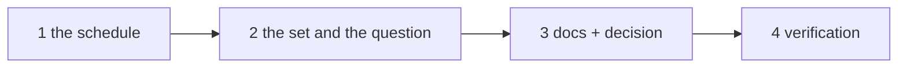

# Tasks: a closed poll-only work item leaves the board by itself

> The last spec artifact. A DAG derived from the design and testing plan; each task names
> the testing-plan row that proves it. TDD: the test first, red, then green.

## Task list

- [x] 1. The schedule — `LEDGER_RECHECK_EVERY_CYCLES` / `LEDGER_CHECKS_PER_CYCLE`,
  `PollState.absent_since` / `note_closure_check`, `PollSummary.ledger_checks`, the
  `poll.cycle` field, the two catalog descriptions
  - _Depends on:_ none
  - _Requirements:_ R1.2, R1.5, R1.6, R3.3
  - _Test:_ T1 — the `PollState` tests; T11 — the event catalog
- [x] 2. The set and the question — `_ledger_candidates`, `_ask_closure` factored out of
  `_reconcile_closures`, the ledger-only loop with its cap and its dating of a
  non-closure
  - _Depends on:_ 1
  - _Requirements:_ R1.1, R1.3, R1.4, R1.5, R1.7, R2.1–R2.3
  - _Test:_ T1 — the candidate-set and outcome tests; T3 — the scenario; T9 — A1–A4
- [x] 3. Docs, capability doc, decision — `docs/cli/state.md`, `docs/cli/concepts.md`,
  `docs/capabilities/webhook-triggers.md` (+ history row), `decision-115` + index row
  - _Depends on:_ 2
  - _Requirements:_ R3.1, R3.2, the capability-docs gate
  - _Test:_ T11 — docs parity; T13 — `make check`
- [x] 4. Verification — execute `testing-plan.md`, record `evidence/verification.md` and
  `evidence/security-review.md`
  - _Depends on:_ 3
  - _Requirements:_ all
  - _Test:_ T1, T3, T9, T11, T13, T14

## Dependency graph (DAG)

## Checkpoints

After task 1: the `PollState` and catalog tests green. After task 2: T1 and T3 green,
every pre-existing reconciliation test green. After task 3: `make check`. Then the
verification node, the self-review rounds and the security review gate
(`evidence/security-review.md`), then the PR with the reviewer briefing.

## Review comments

> Appended by the-loop's `record-feedback` hook when a human gate approves with
> comments (issue-109). Append-only and attributed: an approval never silently
> discards a reviewer's suggestions, and the feedback travels with the document
> it concerns rather than living in a side-channel tracker.
