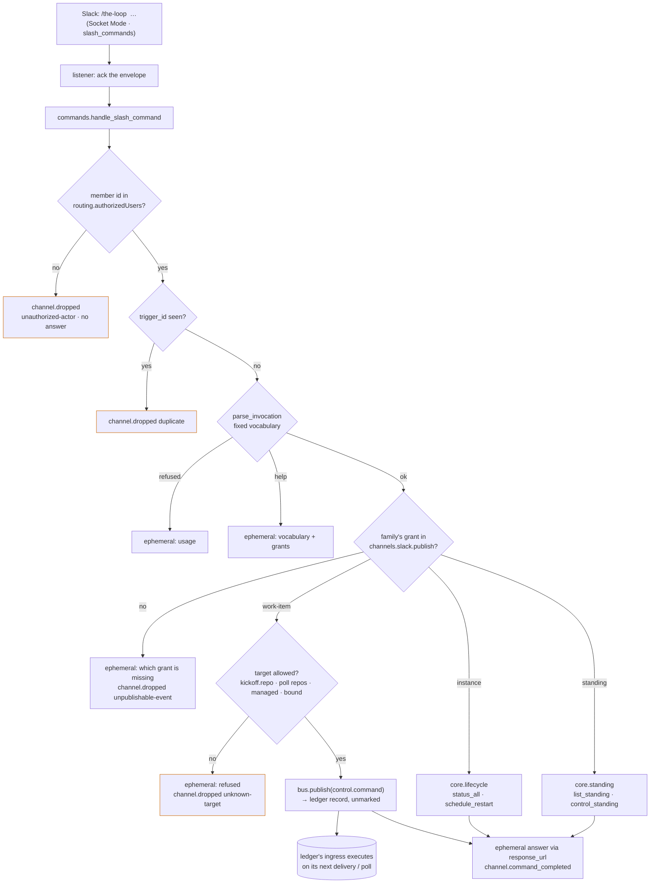

# Design: a slash command is the channel's third inbound shape, and a work-item verb still goes through the ledger

> Phase 2 of 3. Derived from [`requirements.md`](requirements.md); reviewed together with
> [`testing-plan.md`](testing-plan.md). Tier 3.

## Overview

Five moves, four of them in `cli/the_loop/channels/`, none of them a new key in the
config schema:

1. **Two catalog rows.** `instance.command` and `standing.command` join `channels/events.py`
   as publishable, not subscribable, **not recorded** — the grants for the verbs that act
   on this process's host rather than on a ticket. `control.command` is reused, unchanged,
   for the work-item verbs.
2. **One new module, `channels/commands.py`.** The slash-command handler: authorize →
   parse (a fixed vocabulary, fixed grammars) → grant → act → answer. A work-item verb
   publishes a `control.command` event through the bus so the ledger records it exactly as
   the thread path does; an instance or standing verb calls the core facade the API and the
   CLI already route to.
3. **The listener accepts `slash_commands`.** `run_socket_listener` acknowledges the
   envelope and hands the payload to the handler, as it does for `events_api` and
   `interactive`. Nothing else in the transport moves.
4. **A packaged app manifest** (`channels/slack-app-manifest.yaml`) and a
   `the-loop channels manifest` action that prints it; `channels status` gains a
   `commands:` line.
5. **The guide.** `docs/guide/slack.md`, plus the option, command, capability and
   template docs the requirements list.



The thread pipeline (`channels/inbound.py`) is not touched: a slash command is not a
reply, has no thread, moves no cursor and is acknowledged by no reaction (there is no
message of the member's to react on — Slack shows the invocation to the member alone).
What the two shapes share is the *discipline* — the same allow-list first, the same
grants as catalog rows, the same record shape on the ledger — not the code path.

## 1. The catalog — `channels/events.py`

```python
"instance.command": EventSpec(
    "A slash command on a channel that addresses this instance itself — status, "
    "restart, upgrade — run through the core facade the API exposes; not recorded "
    "(no ticket): the event log is its paper trail.",
    origin="channel", subscribable=False, publishable=True, recorded=False),
"standing.command": EventSpec(
    "A slash command on a channel that lists, starts, stops or restarts a standing "
    "session — run through the core facade; not recorded (no ticket).",
    origin="channel", subscribable=False, publishable=True, recorded=False),
```

`PUBLISHABLE_EVENTS` grows to six; `is_recorded` says `False` for both; the docs table
and `channels status` print them from the same definition, as the existing test pins.
`_publish_list` needs no change: a grant is any publishable name.

## 2. The handler — `channels/commands.py`

### 2.1 The vocabulary

```python
INSTANCE_VERBS = ("status", "restart", "upgrade")
STANDING_VERBS = ("list", "start", "stop", "restart")
FAMILY_GRANTS = {"work-item": "control.command", "instance": "instance.command",
                 "standing": "standing.command"}

@dataclass(frozen=True)
class Invocation:
    family: str = ""      # help | work-item | instance | standing; "" = refused
    verb: str = ""        # a control COMMAND constant, an instance verb, a standing verb
    target: str = ""      # the raw work-item token / the standing name
    subject: str = ""     # @login for the collaborator commands
    address: str = ""     # instance:<name>
    error: str = ""       # why it was refused (the usage line is appended)
```

`parse_invocation(text, control: ControlConfig) -> Invocation` reads `text.split()`:

| Tokens | Result |
|--------|--------|
| none, or `help` | `help` |
| `status` / `restart` / `upgrade`, nothing else | `instance` |
| `standing list`, nothing else | `standing`, verb `list` |
| `standing start\|stop\|restart <name>`, `<name>` ∈ `standing.NAME_RE`, nothing else | `standing` |
| `<verb> <work-item> [@login] [instance:<name>]` where `<verb>` is the **last word of a configured control keyword** (`the-loop start` → `start`, an operator's `loop go` → `go`) or the command's own name | `work-item`, with `verb` the command constant |
| anything else — an unknown verb, extra tokens, a second `@login`, two `instance:` tokens, a missing argument, a collaborator command without a login, a non-collaborator command with one, a disabled keyword (`""`) | refused, `error` set |

The work-item token is the first token that is neither `@…` nor `instance:…`; `@login`
goes through `collaborators.parse_logins` (one login, or refused); `instance:<name>`
through `instance.parse_address` (one name, or refused — the ambiguity rule the ticket
path already has). Everything is matched as whole tokens; nothing is searched for
inside prose, because there is no prose: a slash command's text *is* its arguments.

### 2.2 The work-item target

```python
def resolve_work_item(token: str, cli_config) -> WorkItemRef   # ValueError when refused
def may_target(ref: WorkItemRef, cli_config) -> bool
```

`resolve_work_item` accepts, in order: a GitHub issue/PR URL
(`https://<host>/<owner>/<repo>/(issues|pull)/<n>`); `github:…` through
`WorkItemRef.parse`; `[host/]owner/repo#n`; `#n` or `n` against
`channels.slack.kickoff.repo` (refused when it is empty). A bare `owner/repo` — from the
token or from `kickoff.repo` — carries the **resolved** GitHub host
(`ghhost.github_host(cli_config)`, the issue-331 rule), so a GitHub Enterprise deployment
names the same work item the poller does.

`may_target` is the boundary of A3: the ref's `path` must be `kickoff.repo` or a
`polling.sources[].repos` entry (each normalised through the same host rule), **or**
the ref must be in `core.instance.describe_instance(config)["managed"]` (declared, a
session record, a control record) or in the channel state's `conversations` (a bound
thread). Compared as canonical refs, case-insensitively on the path. A read that raises
(a malformed `polling` block, an unreadable registry) contributes nothing — the target
is then refused, which is the fail-closed direction.

### 2.3 The handler

```python
def handle_slash_command(
    payload: Mapping[str, Any],
    cli_config: Optional[Mapping],
    *,
    respond: Optional[Callable[[str, str], bool]] = None,   # (response_url, text)
    post_comment: Optional[Callable] = None,
    lifecycle: Any = None,   # core.lifecycle by default
    standing: Any = None,    # core.standing by default
) -> Dict[str, Any]
```

The steps, in order — every refusal returns `{"outcome": <reason>}` and is a
`channel.dropped` line:

1. `config = SlackChannelConfig.from_mapping(cli_config)`; `member = payload["user_id"]`.
   **Authorize first** (R3.1): `member` not in `config.authorized_users` (or the list is
   empty) → `unauthorized-actor`, **no answer**.
2. **Duplicate** (A9): `trigger_id` already in the process-local `_SEEN` ring (a
   `deque(maxlen=256)` beside a set) → `duplicate`, no answer. Slack retries a slash
   command it did not see acknowledged; the listener acknowledges before handling, so a
   retry is rare and this is belt and braces.
3. `invocation = parse_invocation(text, _control_config(cli_config))`. Refused →
   `unknown-command`, answer the error plus the usage line.
4. `help` → answer the vocabulary and, per family, whether this channel holds its grant.
5. **Grant** (R3.2): `FAMILY_GRANTS[family] not in config.publish` →
   `unpublishable-event`, answer *this channel does not hold `<grant>` — add it to
   `channels.slack.publish`*.
6. `channel.command_received` (channel, actor, family, verb, target: the **resolved**
   work-item ref, the standing name, or `instance` — emitted once the target passed its
   own validation, so the field is never free text).
7. Act:
   - **work-item**: `resolve_work_item` → `ValueError` → `unknown-target`, answered;
     `may_target` false → `unknown-target`, answered (*this instance is not configured
     for `<path>`*). Then the recorded line is **composed**, never copied:
     `f"{control.keyword(verb)}"` + `f" @{subject}"` when a subject + `f" instance:{address}"`
     when an address. `Event(event_type="control.command", work_item=ref.ref, text=line,
     source="slack", actor=principal_for(config.principals, "slack", member),
     detail={"invocation": "slash", "command": verb})` →
     `bus.publish(event, cli_config, channels=[], ledger=GitHubLedger(cli_config,
     post_comment=post_comment)).record`. The ledger's `relay_body` writes the same
     unmarked, enveloped, keyword-intact comment the thread path writes (`_RELAYED`).
     Outcome `recorded` (answer: *recorded `<line>` on `<ref>` — `<url>`; the loop
     executes it on its next ingress*) or `record-failed` (answer: the ledger's error).
   - **instance**: `status` → `lifecycle.status_all(cli_config)`, rendered (§2.4);
     `restart` / `upgrade` → `lifecycle.schedule_restart(cli_config,
     with_upgrade=(verb == "upgrade"), config_path=cli_config_module.default_cli_config_path())`
     — the path this process read, as `POST /api/v1/restart` passes the holder's path —
     answered with the pid and the logfile. Outcome `ok` / `failed` (the facade raised;
     `str(exc)` in the answer, the exception never out of the handler).
   - **standing**: `list` → `standing.list_standing(cli_config)` rendered one row per
     session (`name`, running or not, declared or created); `start|stop|restart` →
     `standing.control_standing(name, verb, cli_config)` rendered from its `sessions`
     rows (`outcome`, `detail`). `ValueError` / `LookupError` from the facade is the
     answer's text and outcome `failed`.
8. `channel.command_completed` (channel, actor, family, verb, work_item or standing,
   outcome). Then the answer.

**The answer** goes through `respond(response_url, text)`; the default is
`_webhook_responder`: refuse a `response_url` that is not `https://hooks.slack.com/`
(A5) — log at warning, send nothing — else `WebhookClient(url).send(text=text,
response_type="ephemeral")`. A failed send is a `channel.command_answer_failed` line;
the outcome stands. Every answer is plain text (mrkdwn), under Slack's limit, and
carries no token and no payload text beyond the validated tokens.

### 2.4 Rendering `status`

From `status_all`'s document:

```text
the-loop status — instance `laptop-b` (mode: open) · ok
• service: running (pid 4242) — http://127.0.0.1:8787
• gh-webhook: running, hosted by the service
• poller: stopped (enabled)
• standing: supervisor running · watcher stopped
```

One line per service row (`running` / `stopped`, `disabled` when not enabled, `hosted
by the service` when the row says so), one line for the standing sessions (or *none*),
`ok` from the document. No pids of anything but the-loop's own services, no paths but
the service URL — the same facts `the-loop status` prints.

## 3. The transport — `channels/slack.py`

`run_socket_listener.handle` admits a third request type:

```python
if request.type not in ("events_api", "interactive", "slash_commands"):
    return
client.send_socket_mode_response(SocketModeResponse(envelope_id=request.envelope_id))
...
if request.type == "slash_commands":
    commands.handle_slash_command(payload, frozen_config)
    return
```

The acknowledgment precedes the handling, as for every other envelope, so Slack's
3-second deadline is met whatever the facade takes; the answer arrives through the
`response_url`, which Slack honours for 30 minutes. The `except Exception` around the
handling stays: one bad command never ends the listener. Nothing in `poll_once` or the
watcher changes — a slash command has no poll form (R2.1).

**Catch-up on connect** (R2.6, added at review). `slack.catch_up(cli_config)` runs
`inbound.poll_once` once after `client.connect()` and emits `channel.caught_up` with the
cycle's counts; a raising cycle is logged and the listener listens anyway. `poll_once`
refuses only `read.mode: off`, so the same cycle is `the-loop channels poll`'s
reconciliation in a socket deployment. `handle_socket_event` drops a message whose `ts`
is at or before its thread's cursor as `duplicate` — the shared cursor is the
at-most-once contract across both transports, which the issue-245 design stated and
this makes symmetric.

`channels status` prints one more line:

```text
  commands:     /the-loop over Socket Mode — work-item: granted · instance: not granted · standing: not granted
```

or `off (read.mode is poll — slash commands need read.mode: socket)`. And
`the-loop channels manifest` prints the packaged manifest (§4).

## 4. The manifest — `channels/slack-app-manifest.yaml`

Slack's app-manifest format, the one *Create an app → From a manifest* imports:

```yaml
display_information:
  name: the-loop
  description: Drive the-loop from Slack — one thread per work item, a slash command for the rest.
features:
  bot_user:
    display_name: the-loop
    always_online: false
  slash_commands:
    - command: /the-loop
      description: "Drive the-loop: start a work item, check the instance, standing sessions"
      usage_hint: "help | start #123 | status | upgrade | standing start <name>"
      should_escape: false
oauth_config:
  scopes:
    bot: [chat:write, channels:history, groups:history, reactions:write, commands]
settings:
  event_subscriptions:
    bot_events: [message.channels, message.groups]
  interactivity:
    is_enabled: true
  org_deploy_enabled: false
  socket_mode_enabled: true
  token_rotation_enabled: false
```

Packaged beside the module (hatch ships every file under `the_loop/`, as it ships the
schemas); read with `importlib.resources`; printed verbatim by `channels manifest`;
reproduced in the guide, with a test pinning the fenced block to the file. `commands`
is the one scope the slash command adds; `groups:history` and `message.groups` are
what a **private** channel needs and were missing from the documented scope list. The
app-level token (`xapp-`, `connections:write`) is not a manifest concern — it is minted
under *Basic Information → App-Level Tokens* after the import; the guide says so.

## 5. Event log — `eventlog.py`

| Event | Level | Fields |
|-------|-------|--------|
| `channel.command_received` | info | `channel`, `actor`, `family`, `verb`, `target` |
| `channel.command_completed` | info | `channel`, `actor`, `family`, `verb`, `work_item` or `standing`, `outcome` |
| `channel.command_answer_failed` | warning | `channel`, `actor`, `error` |

`channel.dropped` gains three reasons in its description: `unknown-command`,
`unknown-target`, `duplicate`. `target` on the first event is the raw work-item token
or the standing name — a ref-shaped or grammar-bounded string, never free text.

## 6. Docs

- `docs/guide/slack.md` — the guide (R4.2); added to the guide sidebar in
  `docs/.vitepress/config.mts`.
- `docs/config/cli/channels-options.md` — two rows in the `publish` table, a *Slash
  command* section, the private-channel scopes beside the bot token.
- `docs/cli/commands/channels.md` — the `manifest` action, the slash command in the
  `listen` paragraph, the `commands:` line of `status`.
- `docs/capabilities/channels.md`, `docs/capabilities/standing-sessions.md` — the
  behaviour and a history row each.
- `README.md`, `skills/the-loop/reference/collaboration.md` — name the guide (and the
  collaboration reference drops its stale `channels.slack.authorizedUsers` line).
- `skills/the-loop/templates/cli-config.yaml`, `.the-loop/cli-config.yaml` — the two
  grants in the `publish` comment.
- Both `cli-config.schema.json` copies — the `publish` description names the two
  grants (byte-identical, one string).
- `docs/decisions/decision-116.md` + index row.

## UI/UX design

N/A — the visible surface is Slack's own slash-command UI (the `usage_hint` the manifest
declares) and ephemeral text answers.

## Data models

None persisted. The duplicate ring is process memory. No new state file, no new key in
the channel state.

## Error handling

| Failure | Behaviour |
|---------|-----------|
| unlisted member, empty allow-list | dropped, unanswered, logged |
| unknown verb, malformed argument, two keywords, two addresses | refused, usage answered |
| grant missing | refused, the grant named in the answer |
| target outside the allowed set, unparsable ref, `#n` with no `kickoff.repo` | refused, answered |
| ledger refuses the record (`gh` exits 1) | outcome `record-failed`, the error answered |
| the facade raises (`ValueError`, `LookupError`, anything) | outcome `failed`, `str(exc)` answered |
| `response_url` off-host, missing, or the send fails | no answer; `channel.command_answer_failed`; the outcome stands |
| slash command over `poll` mode | never arrives; `channels status` says why |

## Security design

| Boundary (from the requirements) | Enforced by |
|----------------------------------|-------------|
| A1 unlisted member | step 1: `config.authorized_users` check before parsing; empty denies all; no answer |
| A2 missing grant | step 5: `FAMILY_GRANTS` against `config.publish`; nothing acted on |
| A3 foreign repository | `may_target`: `kickoff.repo` ∪ poll repos ∪ managed ∪ bound; a failing read contributes nothing |
| A4 text beyond the vocabulary | `parse_invocation` refuses extra tokens and second keywords; the recorded line is composed from `control.keyword(verb)` and validated tokens |
| A5 off-host `response_url` | `_webhook_responder` sends only to `https://hooks.slack.com/` |
| A6 malformed name / login / address | `standing.NAME_RE`, `collaborators.parse_logins`, `instance.parse_address` |
| A7 restart argv | `schedule_restart` builds it; the handler passes one boolean and the path it read |
| A8 event payloads | ids, family, verb, outcome; never `text`, never a token |
| A9 duplicate delivery | the `trigger_id` ring |

## Testing strategy

Unit (`cli/tests/test_channels_commands.py`): the parser over every row of §2.1 and
every refusal; `resolve_work_item` over the four shapes and the host rule;
`may_target` over each source and the failing read; the handler over each family with
fakes for the ledger writer, the facade and the responder; every abuse case; the
catalog and the event types. Integration (`test_channels_integration.py`): a `/the-loop
start #7` over the listener's handler records the same unmarked, enveloped comment a
thread reply records and the ingress's parser reads it as `start`; `/the-loop status`
and `/the-loop standing start` reach the facade and answer; a thread keyword still
relays (R1, pinned). Docs: the manifest pin, the publish table pin, docs parity, `make
check`.

## Trade-offs & decisions

See [decision-116](../../decisions/decision-116.md): why a slash command and not
Workflow Builder, why the work-item verbs go through the ledger while the other two
families call the facade, why three grants and not one, why the target is bounded.

## Review comments

> Appended by the-loop's `record-feedback` hook when a human gate approves with
> comments (issue-109). Append-only and attributed: an approval never silently
> discards a reviewer's suggestions, and the feedback travels with the document
> it concerns rather than living in a side-channel tracker.
