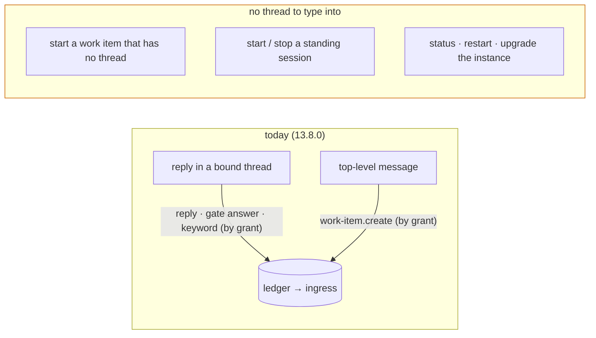

# Requirements: drive the loop from Slack — the keywords in the thread, a slash command for the rest, and one guide

> Phase 1 of 3 (requirements → design → tasks). Tier 3 (`human-approves-pr`; below
> `security.review.humanSignOffMinTier: 4`): a new **inbound shape** on the Slack
> channel (a slash command) behind the same allow-list and the same grant model the
> thread already has, two additive catalog rows, a packaged Slack app manifest, and
> documentation. No schema key is added; both schema copies change only in one
> description string (an `autonomy.sensitivePaths` match, which is why this is not
> tier 2).

## Introduction

[Issue #334](https://github.com/MadaraUchiha-314/the-loop/issues/334), opened by the
owner against 13.8.0, asks four things of the Slack integration:

1. Every control keyword an authorized user can post on a work item (`the-loop start`,
   `the-loop execute`, …) should work from that work item's Slack thread, exactly as if
   it had been posted on the ticket — "we already have the architecture for this with
   channels and events; use it".
2. The operations that today need the **control plane** — "upgrade the loop", restart,
   status — should be reachable from Slack too, and ideally as something **reusable and
   importable** (the issue asks whether Slack allows workflows in JSON/YAML).
3. It is not clear how to **start a work item** or a **standing session** from Slack.
4. There is no documentation of the Slack integration and its modes of interaction.

At `e54592d` (13.8.0) the first ask is **already true by grant**, and nothing says so
where an operator looks. With `control.command` in `channels.slack.publish`, a keyword
typed in a bound thread is classified before anything else, recorded on the ledger
**unmarked** with the keyword intact and an envelope naming the person, and executed by
the ledger's own ingress through the control seam a typed GitHub comment goes through
(issue-309, decision-103 D1). The default grant is `[work-item.reply]`, so out of the
box the keyword is dropped as `unpublishable-event` — which is what the owner saw.

The other three asks share one gap: **every inbound Slack message today is bound to a
conversation**. A reply reaches the work item (or standing session) its thread is bound
to; a top-level message can only *become* a work item (`work-item.create`). There is no
way to address the-loop itself — *this instance, restart yourself*; *start
`github:o/r#334`, which has no thread yet*; *bring up the `supervisor` standing
session* — because those have no thread to type into.

This work item closes the gap with one **slash command**, `/the-loop`, received over the
Socket Mode transport the channel already has, whose verbs are the vocabulary the-loop
already exposes on the ticket, the CLI and the API — and with one guide page that
explains every mode of interaction Slack offers. Slack Workflow Builder is deliberately
**not** the mechanism ([decision-116](../../decisions/decision-116.md)): the importable,
reusable artifact Slack does offer is the **app manifest**, which this work item ships.

## Requirements

### Requirement 1 — a control keyword in a work item's thread is a control keyword on the work item

**User story:** As an authorized user reading a work item's Slack thread, I want to type
`the-loop start` (or any other control keyword) there and have it work exactly as on the
ticket, so that I never have to open GitHub to steer the loop.

#### Acceptance criteria (EARS)

1.1 WHEN an authorized member types a message carrying exactly one configured control
keyword in a thread bound to a work item AND the channel holds the `control.command`
grant THEN the channel SHALL record it on the ledger as an **unmarked** comment on that
work item carrying the keyword intact and an envelope naming the person, and SHALL
deliver nothing itself — the ledger's ingress executes it. (13.8.0 behaviour, pinned by
this work item's tests; not a change.)

1.2 The recorded comment SHALL be one the ledger's ingress parses to that command
(`parse_command` on the body yields the command and nothing else), so `start`, `stop`,
`pause`, `resume`, `execute`, `contribute`, `do`, `review`, `cleanup`,
`add-collaborator @login` and `remove-collaborator @login` — and an `instance:<name>`
address token beside any of them — all reach the same seam with the same meaning as
a typed GitHub comment.

1.3 A `the-loop execute` typed on Slack SHALL sign the checklist **as ticked on the
ticket**: the relayed record quotes the message (`> …`), and the phase-selection
gate reads a checklist only from unquoted lines, so a checklist written inside the
Slack message is not read. The guide SHALL state this limit.

1.4 WHEN the channel does not hold the `control.command` grant THEN the keyword SHALL
be dropped (`unpublishable-event`), never delivered to the agent as prose (issue-309
R2.3, unchanged) — and the guide SHALL say which grant turns the keyword on.

### Requirement 2 — a slash command addresses the-loop itself, with the vocabulary it already has

**User story:** As an authorized member, I want `/the-loop <verb> …` in Slack for the
things that have no thread to type into — start a work item, start a standing session,
ask the instance for its status, restart or upgrade it — so that Slack is a complete
operator surface, not only a reply surface.

#### Acceptance criteria (EARS)

2.1 WHEN the Slack app delivers a slash command over Socket Mode THEN the listener
SHALL acknowledge it within Slack's deadline and hand its payload to one handler, and
the handler SHALL answer the member **ephemerally** (visible to them alone) through the
command's `response_url`. Slash commands SHALL be received over Socket Mode only: in
`poll` mode there is no transport that can meet the deadline, and `channels status`
SHALL say so.

2.2 The vocabulary SHALL be fixed and parsed as whole tokens, never as free text:

| Invocation | Meaning | Grant it needs |
|-----------|---------|----------------|
| `/the-loop help` | the vocabulary and which grants this instance holds | none beyond authorization |
| `/the-loop <keyword> <work-item> [@login] [instance:<name>]` where `<keyword>` is one of the configured control keywords' second words (`start`, `stop`, `pause`, `resume`, `execute`, `contribute`, `do`, `review`, `cleanup`, `add-collaborator`, `remove-collaborator`) | the same control keyword, on that work item, **through the ledger** (R3) | `control.command` |
| `/the-loop status` | the instance's name and its services' liveness — what `the-loop status` prints | `instance.command` |
| `/the-loop restart` | schedule `the-loop restart` — what `POST /api/v1/restart` does | `instance.command` |
| `/the-loop upgrade` | schedule `the-loop restart --with-upgrade` | `instance.command` |
| `/the-loop standing list` | the standing sessions, declared and recorded, with liveness | `standing.command` |
| `/the-loop standing start\|stop\|restart <name>` | the same verb `the-loop standing <verb>` applies | `standing.command` |

An unknown verb, a missing or malformed argument, a second keyword, or two `instance:`
addresses SHALL be refused with the usage line and act on nothing.

2.3 A `<work-item>` argument SHALL be accepted in these shapes and no others:
`github:[host/]owner/repo#N`, `[host/]owner/repo#N`, `#N` or `N` (resolved against
`channels.slack.kickoff.repo`), and a GitHub issue or pull-request URL. It SHALL parse
to a `WorkItemRef`; a value that does not is refused.

2.4 The work item a slash command names SHALL be one this instance **may act on**: its
repository is `kickoff.repo` or one of `polling.sources[].repos`, or the work item is
already in the instance's managed set (declared, a session record, a control record) or
has a bound conversation. Any other target SHALL be refused (`unknown-target`) and
nothing SHALL be recorded — the operator's credential never writes onto a repository
this instance was not configured for.

2.5 A standing-session `<name>` SHALL match the standing-session grammar
(`^[a-z0-9][a-z0-9-]{0,39}$`); an `instance:<name>` address SHALL match the instance
grammar (the same); an `@login` SHALL match GitHub's login grammar. A token outside
its grammar is refused; none is ever interpolated from free text.

### Requirement 3 — a slash command has the same authority as a thread reply, and a work-item verb still goes through the ledger

**User story:** As an operator, I want the slash command to widen nothing: the same
people, the same grants, the same record on the ticket — so that adding a surface adds
no authority.

#### Acceptance criteria (EARS)

3.1 WHEN a slash command arrives THEN the handler SHALL check the member id against the
`slack` ids of `routing.authorizedUsers` **before** parsing anything; an unlisted member
(or an empty list) SHALL be dropped (`unauthorized-actor`), answered with **nothing**,
and recorded in the event log — the same silence a dropped thread reply gets.

3.2 The verbs SHALL be grouped into three grants, each a **catalog event type** in
`channels.slack.publish`: the existing `control.command` (work-item verbs) and two new
rows, `instance.command` (`status`, `restart`, `upgrade`) and `standing.command`
(`standing …`). None is granted by default. WHEN an authorized member invokes a verb
whose grant the channel lacks THEN the handler SHALL act on nothing, record
`unpublishable-event`, and tell the member which grant is missing.

3.3 WHEN a work-item verb is accepted THEN the handler SHALL publish a
`control.command` event whose text is composed from the **configured keyword** and the
validated tokens only (`the-loop start`, `the-loop add-collaborator @octocat`,
`the-loop start instance:laptop-b`), with the person resolved from config, so the
ledger records exactly what the thread path records (R1.1) and the ledger's ingress
executes it. The handler SHALL start, spawn or deliver nothing itself.

3.4 `instance.command` and `standing.command` SHALL be **not recorded** on the ledger
(there is no ticket) and not subscribable; their paper trail SHALL be the event log:
`channel.command_received` and `channel.command_completed` (channel, actor, verb, the
target's id, the outcome), ids only, never the message text.

3.5 `status`, `restart`, `upgrade` and the `standing` verbs SHALL call the **core
facade** the CLI and the API already route to (`core.lifecycle.status_all`,
`core.lifecycle.schedule_restart`, `core.standing.list_standing`,
`core.standing.control_standing`) — never a shell, never a second implementation — and
the ephemeral answer SHALL render what the facade returned.

3.6 A failure anywhere after acceptance — the ledger refuses the record, the facade
raises, the `response_url` post fails — SHALL be a recorded outcome and an ephemeral
error where one can still be sent, never an exception out of the listener, and never a
retry that could act twice.

### Requirement 4 — the Slack app is defined once, in an importable manifest, and there is one guide

**User story:** As an operator setting Slack up, I want one file that creates the Slack
app with every scope, event and command the-loop needs, and one page that tells me
every way I can drive the loop from Slack, so that I set it up once and know what I
have.

#### Acceptance criteria (EARS)

4.1 the-loop SHALL ship a **Slack app manifest** (Slack's own importable format —
*Create an app → From a manifest*) declaring the bot user, the bot scopes the channel
needs (`chat:write`, `channels:history`, `groups:history`, `reactions:write`,
`commands`), the `message.channels` / `message.groups` event subscriptions,
interactivity, Socket Mode and the `/the-loop` slash command. `the-loop channels
manifest` SHALL print it, and the guide SHALL reproduce it; a test SHALL pin the two
together.

4.2 A new guide page, `docs/guide/slack.md`, SHALL document: the setup (manifest, the
two tokens, the config); every **mode of interaction** — the thread (reply, gate
answer, control keyword, standing session), the buttons, the kickoff, the slash
command — with the grant each needs; how to start a work item and a standing session
from Slack; what the control plane offers from Slack and what it does not; the limits
(Socket Mode for buttons and commands, the listener as a foreground process, the
quoted checklist of R1.3); and why Workflow Builder is not the mechanism.

4.3 `docs/config/cli/channels-options.md` SHALL carry the two new grants in the
`publish` table and a section on the slash command; `docs/cli/commands/channels.md`
SHALL carry `manifest` and the slash command; `docs/capabilities/channels.md` and
`docs/capabilities/standing-sessions.md` SHALL carry the behaviour and a history row;
the README and the operating-model reference SHALL name the guide; the two config
templates SHALL name the grants; the event catalog (`eventlog.EVENT_TYPES`) SHALL
describe the new types and the new drop reasons.

## Security considerations

- **Actors & trust:** authorized members (`routing.authorizedUsers`, `slack` ids — the
  one allow-list, read before anything else); unlisted members and bots (dropped
  silently); the operator (whose config grants the three event types and names the
  repositories a command may target); Slack (the payload's `user_id`, `command`,
  `text`, `channel_id` and `response_url` are untrusted input — `text` is parsed
  against a fixed vocabulary and fixed grammars, never interpolated); GitHub (the
  ledger, written under the operator's own credential).
- **Trust boundaries & data:** a slash command is a **new inbound shape** on an
  existing channel. It crosses the same boundary a thread reply crosses (Slack →
  the-loop's process → the ledger / the core facade), with two differences that are
  the security design: it is **not bound to a thread**, so the work item it names is
  an argument (bounded by R2.4 to repositories and work items this instance is
  configured for), and two of its verb groups act on **this process's host** (a
  restart, a tmux session) rather than on a ticket — which is why they are separate
  grants, off by default, and reach nothing but the core verbs the API already exposes
  with no in-app authentication of its own (decision-084: network scoping is the API's
  boundary; here the allow-list and the grant are the boundary).
- **Abuse cases (EARS):**
  1. WHEN an unlisted member invokes `/the-loop` with any text THEN nothing SHALL be
     parsed, recorded on the ledger, executed or answered.
  2. WHEN an authorized member invokes a verb whose grant the channel lacks THEN
     nothing SHALL be recorded or executed; the member SHALL be told which grant is
     missing.
  3. WHEN a work-item verb names a repository outside `kickoff.repo`,
     `polling.sources[].repos`, the managed set and the bound conversations THEN
     nothing SHALL be recorded — the operator's credential SHALL never comment on a
     repository this instance was not configured for.
  4. WHEN the command text carries anything beyond the vocabulary — a second keyword,
     a shell metacharacter, a second `instance:` address, prose — THEN it SHALL be
     refused whole; the text recorded on the ledger SHALL be composed from the
     configured keyword and validated tokens, never from the payload.
  5. WHEN a crafted payload arrives with a `response_url` outside Slack's own host
     THEN the handler SHALL answer nothing through it — the URL must be
     `https://hooks.slack.com/…`.
  6. WHEN the standing name, the login or the instance name is outside its grammar
     THEN it SHALL be refused before any call — nothing reaches a tmux name, a file
     name or a comment.
  7. WHEN `restart` or `upgrade` is accepted THEN the scheduled argv SHALL be the
     fixed one `core.lifecycle.schedule_restart` builds (no text from the payload).
  8. WHEN a command event is recorded THEN the event log SHALL carry ids, the verb and
     the outcome — never the command text, never a token.
  9. WHEN the same `trigger_id` is delivered twice THEN the second delivery SHALL be
     refused as a duplicate — a work-item verb is recorded at most once per trigger.
- **Fail closed:** no `channels` section, `enabled: false`, `read.mode` other than
  `socket`, an empty allow-list, no grant for the verb group, an unknown target — each
  means nothing happens. This work item grants nothing by default: a 13.8.0 config
  with the `control.command` grant gains the work-item verbs of the slash command (the
  same authority, on a work item the instance is configured for); `instance.command`
  and `standing.command` must be written down.

## Out of scope

- Slack **Workflow Builder** workflows and the Deno "workflow app" platform (the
  reasons are in decision-116).
- A slash command from a **thread** binding to that thread's work item — Slack's slash
  command payload carries no `thread_ts`; the work item is always an argument.
- `standing say` and `standing create|delete` from the slash command — a thread reply
  already delivers to a standing session, and creation stays the dashboard's and the
  API's.
- Poll-mode delivery of slash commands (Slack's 3-second acknowledgment makes it
  impossible without an inbound HTTP endpoint the-loop does not expose).
- A `completed` feedback in Slack when the ledger's ingress finishes executing a
  relayed keyword (the issue-325 seam, unchanged): the work item's thread, opened by
  the start itself (issue-317), is the feedback.

## Open questions

None raised on the ticket beyond the ones this document answers: *does Slack allow
importable workflows?* — not Workflow Builder ones, but an **app manifest** is exactly
that, and it is what ships (decision-116); *how do I start a work item / a standing
session from Slack?* — `/the-loop start <work-item>` and `/the-loop standing start
<name>` (R2), or a top-level kickoff message followed by `the-loop start` in the thread
it opens (R1).

## Review comments

> Appended by the-loop's `record-feedback` hook when a human gate approves with
> comments (issue-109). Append-only and attributed: an approval never silently
> discards a reviewer's suggestions, and the feedback travels with the document
> it concerns rather than living in a side-channel tracker.
