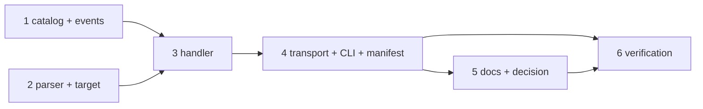

# Tasks: drive the loop from Slack — the keywords in the thread, a slash command for the rest

> The last spec artifact. A DAG derived from the design and testing plan; each task names
> the testing-plan row that proves it. TDD: the test first, red, then green.

## Task list

- [x] 1. The catalog and the event types — `instance.command` and `standing.command` in
  `channels/events.py`; `channel.command_received`, `channel.command_completed`,
  `channel.command_answer_failed` and the three new drop reasons in `eventlog.py`; the
  `publish` description in both schema copies
  - _Depends on:_ none
  - _Requirements:_ R3.2, R3.4, R4.3
  - _Test:_ T1 — the catalog tests; T10 — schema parity, event catalog
- [x] 2. The parser and the target — `parse_invocation`, `resolve_work_item`,
  `may_target` in `channels/commands.py`
  - _Depends on:_ none
  - _Requirements:_ R2.2–R2.5
  - _Test:_ T1 — the parser, resolver and target tests; T8 — A3, A4, A6
- [x] 3. The handler — `handle_slash_command`, the three families, the responder, the
  duplicate ring, the `status` rendering
  - _Depends on:_ 1, 2
  - _Requirements:_ R2.1, R3.1–R3.6
  - _Test:_ T1 — the handler tests; T8 — A1, A2, A5, A7, A8, A9
- [x] 4. The transport and the CLI — `slash_commands` in `run_socket_listener`; the
  packaged manifest and `channels manifest`; the `commands:` line of `channels status`
  - _Depends on:_ 3
  - _Requirements:_ R2.1, R4.1
  - _Test:_ T1 — the manifest test; T2 — the four scenarios (the thread-keyword pin included)
- [x] 5. Docs, capability docs, decision — `docs/guide/slack.md` and the sidebar, the
  option and command pages, `channels.md` and `standing-sessions.md`, the README and
  the collaboration reference, the two templates, `decision-116` + index row
  - _Depends on:_ 4
  - _Requirements:_ R1.3, R1.4, R4.2, R4.3, the capability-docs gate
  - _Test:_ T10 — the manifest pin, the publish-table pin, docs parity; T12 — `make check`
- [x] 6. Verification — execute `testing-plan.md`, record `evidence/verification.md`
  and `evidence/security-review.md`
  - _Depends on:_ 4, 5
  - _Requirements:_ all
  - _Test:_ T1, T2, T8, T10, T12, T13

## Dependency graph (DAG)

## Checkpoints

After task 2: the parser tests green. After task 3: T1 green. After task 4: T1 and T2
green. After task 5: `make check`. Then the verification node, the self-review rounds
and the security review gate (`evidence/security-review.md`), then the PR with the
reviewer briefing.

## Review comments

> Appended by the-loop's `record-feedback` hook when a human gate approves with
> comments (issue-109). Append-only and attributed: an approval never silently
> discards a reviewer's suggestions, and the feedback travels with the document
> it concerns rather than living in a side-channel tracker.
