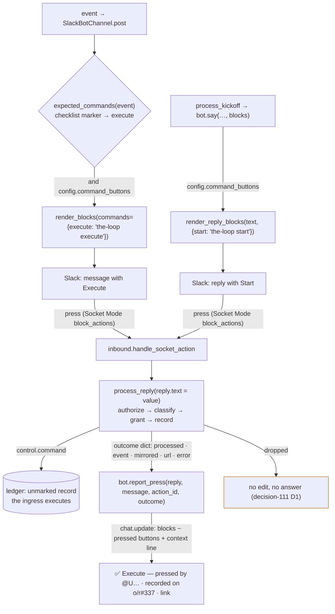

# Design: a command button is a reply with the keyword as its value; the press is reported by editing the message

> Phase 2 of 3. Derived from [`requirements.md`](requirements.md); reviewed together with
> [`testing-plan.md`](testing-plan.md). Tier 3.

## Overview

Four moves, all in `cli/the_loop/channels/` and the `channels` command, none a new
config key, grant, scope or state file:

1. **The renderer learns two command buttons.** `render_blocks` takes a `commands`
   mapping (command → configured keyword) and renders one button per entry, value =
   keyword, `action_id = the-loop:command:<command>`. Which message gets which button is
   decided by the channel from the event: the phase-selection checklist mirror gets
   `execute`; the kickoff reply gets `start`. Both only when
   `SlackChannelConfig.command_buttons` holds (`read.mode: socket` **and** the
   `control.command` grant).
2. **A press is already a reply.** `handle_socket_action` is unchanged in what it does
   with the value: the press enters `process_reply` as the member's reply carrying
   `the-loop execute`, which `_classify` reads as `control.command` (the same
   `parse_command`) and the ledger records unmarked. Nothing in the pipeline's order
   moves.
3. **The outcome is written back onto the pressed message.** After `process_reply`
   returns `processed`, the action handler calls `SlackBotChannel.report_press`, which
   rebuilds the message's blocks — the pressed button set replaced by a context line
   (✅ / ⚠️, the button's name, the member, what happened, the record's link), link
   buttons kept — and `chat.update`s it. Best-effort; a dropped press is not reported.
4. **`channels status` explains.** The `buttons:` line names both sets, and prints the
   numbered steps that still apply when either cannot be received.



## 1. The renderer — `channels/slack.py`

### 1.1 The vocabulary

```python
#: The phase-selection checklist's own marker (graph/hooks/selection.py) — the one
#: message that asks for `the-loop execute`; pinned to the hook's constant by a test.
PHASE_SELECTION_MARKER = "<!-- the-loop:phase-selection -->"

#: command constant → button label. Fixed; the value is the CONFIGURED keyword.
COMMAND_BUTTONS: Dict[str, str] = {"execute": "Execute", "start": "Start"}

#: action_id → the name the outcome line uses (never the payload's button text).
BUTTON_NAMES = {"the-loop:approve": "Approve", "the-loop:changes": "Request changes",
                "the-loop:command:execute": "Execute", "the-loop:command:start": "Start"}
```

### 1.2 The config

`SlackChannelConfig` gains `control_keywords: Tuple[Tuple[str, str], ...]` — every
control command and its configured keyword, read from `routing.control` through
`ControlConfig.from_mapping` (imported at call time, as `inbound._control_config`
imports it) — and:

```python
@property
def command_buttons(self) -> bool:          # decision-103 D5, restated for keywords
    return self.read_mode == "socket" and "control.command" in self.publish

def keyword(self, command: str) -> str: ...  # "" for an unknown or disabled command

def command_buttons_for(self, *commands: str) -> Dict[str, str]:
    """command → keyword for the buttons this channel may render now: {} unless
    `command_buttons`; a command with an empty keyword is left out."""
```

`expected_commands(event) -> Tuple[str, ...]` is module-level: `("execute",)` when
`event.event_type == "comment.agent"` and `PHASE_SELECTION_MARKER in event.text`; `()`
otherwise. `post` passes `commands=self.config.command_buttons_for(*expected_commands(event))`.

### 1.3 `render_blocks(event, verbosity, *, interactive, max_chars, commands=None)`

After the link button and before the Approve pair (a command button is the message's
call to action, so it comes first among the non-link buttons):

```python
for command, keyword in (commands or {}).items():
    actions.append({"type": "button", "style": "primary",
                    "text": {"type": "plain_text", "text": COMMAND_BUTTONS.get(command, command.title())},
                    "action_id": f"{ACTION_PREFIX}command:{command}", "value": keyword})
```

`render_reply_blocks(text, commands) -> List[Dict]` renders a plain section plus, when
`commands` is non-empty, one actions block of the same buttons — what the kickoff reply
uses. `say(thread, text, channel_id="", blocks=None)` passes `blocks` through.

### 1.4 `report_press(reply, message, action_id, outcome) -> bool`

```python
def report_press(self, reply: InboundReply, message: Mapping[str, Any],
                 action_id: str, outcome: Mapping[str, Any]) -> bool:
```

- `landed`: for `control.command` / `gate.feedback` → `outcome["mirrored"]`; for
  `work-item.reply` → `mirrored and delivered` (a standing session: `delivered`).
- The line, from fixed words: `{✅|⚠️} *{BUTTON_NAMES[action_id]}* — pressed by <@{reply.author}> · {what}` where `what` is
  *recorded on `<url|ref>` — the loop runs it on its next ingress* (control.command),
  *recorded on `<url|ref>` as the answer of record* (gate.feedback), *delivered to the
  session* (work-item.reply), or *not recorded: `<error>`* / *recorded, not delivered:
  `<error>`* when it did not land. `<url|ref>` degrades to the bare ref when the record
  carries no URL.
- The blocks: every block of `message["blocks"]` in order; an `actions` block keeps its
  `url` elements only when `landed` (all of them when not), and is dropped when nothing
  remains; then the context block. A message with no blocks gets a section of its text.
- `client.chat_update(channel=reply.channel_id or config.channel, ts=reply.ts,
  text=f"{message.text}\n{plain line}", blocks=blocks)`. Success is
  `channel.press_reported` (channel, work_item, thread, action, outcome); any
  exception is `channel.press_report_failed` (…, error) and `False`. A missing token
  is a quiet `False` (the read that produced the press already reported it) — the
  `react` contract, restated.

## 2. The pipeline — `channels/inbound.py`

- `_record` returns the ledger's `PostResult` (or `None`) instead of a bool;
  `process_reply` adds `url` (the record's) and `error` (the record's or the
  delivery's) to its outcome dict. Every existing key keeps its meaning; the two
  `== {"outcome": …}` pins in the tests are on **dropped** outcomes, which are unchanged.
- `handle_socket_action`: after `process_reply`, `if outcome["outcome"] == "processed":
  bot.report_press(reply, payload.get("message") or {}, action_id, outcome)`. The
  channel it builds is the one that reacts — the same object, so a test's fake sees both.
- `process_kickoff`: `bot.say(reply.thread, text, reply.channel_id,
  blocks=render_reply_blocks(text, config.command_buttons_for("start")))`.

Nothing else moves: the order `map → drop own → authorize → classify → grant → record`,
the reactions, the cursor rules.

## 3. The status line — `commands/channels_cmd.py`

```text
  buttons:      Approve / Request changes: on · Execute / Start: on
```

or, when either set is off, the line names it and the steps that still apply follow:

```text
  buttons:      Approve / Request changes: off · Execute / Start: off — a press reaches
                the-loop only over Socket Mode. To turn buttons on:
                  1. mint an app-level token: api.slack.com/apps → your app → Basic
                     Information → App-Level Tokens → Generate (scope connections:write),
                     and export it as THE_LOOP_SLACK_APP_TOKEN (now: unset)
                  2. set channels.slack.read.mode: socket (now: poll)
                  3. add to channels.slack.publish: gate.feedback (Approve / Request
                     changes), control.command (Execute / Start)
                  4. the-loop restart — the service hosts the listener; `the-loop status`
                     shows the slack-listener row, and `the-loop channels status` this
                     line as on
```

`_button_lines(slack) -> List[str]` computes it: step 1 only while the app token is
unset, step 2 only while `read.mode != socket`, step 3 only for grants missing, step 4
whenever any of 1–3 printed. Presence only for the token, by the R3.1 contract.

## 4. Event log — `eventlog.py`

| Event | Level | Fields |
|-------|-------|--------|
| `channel.press_reported` | info | `channel`, `work_item`, `thread`, `action`, `outcome` |
| `channel.press_report_failed` | warning | `channel`, `work_item`, `thread`, `action`, `error` |

`action` is the `action_id` (a fixed string the-loop rendered); never the value.

## 5. Docs

- `docs/guide/slack.md` — the modes table (two rows gain *or press Execute / Start*),
  a *Buttons* subsection (which messages, the outcome edit, the app-level token is
  required and why), the *Limits* bullet, the `channels status` excerpt.
- `docs/config/cli/channels-options.md` — `read.mode` names the command buttons; the
  `publish` table's `control.command` row names them.
- `docs/cli/commands/channels.md` — the `buttons:` block of `status`.
- `docs/capabilities/channels.md` — the rendering bullet, a new *press outcome* bullet,
  the observability list, a history row.
- `README.md`, `skills/the-loop/reference/collaboration.md` — one clause each.
- `skills/the-loop/templates/cli-config.yaml`, `.the-loop/cli-config.yaml` — the
  `read.mode` comment names buttons.
- `docs/decisions/decision-117.md` + index row.

## UI/UX design

N/A for prototypes — the surface is Slack's Block Kit, rendered by Slack. The two
states a member sees:

```text
┌ the-loop · github:o/r#337 ──────────────────────────────────┐
│ The agent commented · github:o/r#337                        │
│ 🤖 the-loop — which phases does this work item need? …      │
│ [Open on GitHub] [Execute]                                   │
└──────────────────────────────────────────────────────────────┘
        ↓ press
┌──────────────────────────────────────────────────────────────┐
│ The agent commented · github:o/r#337                        │
│ 🤖 the-loop — which phases does this work item need? …      │
│ [Open on GitHub]                                             │
│ ✅ Execute — pressed by @jc · recorded on github:o/r#337     │
│    (link) — the loop runs it on its next ingress            │
└──────────────────────────────────────────────────────────────┘
```

## Data models

None persisted. The pressed message's blocks are read from the payload and handed back.

## Error handling

| Failure | Behaviour |
|---------|-----------|
| unlisted member presses | dropped, no edit, no answer, logged (`unauthorized-actor`) |
| grant removed after render | dropped `unpublishable-event`, no edit |
| ledger refuses the record | outcome `processed`, `mirrored: False`, `error`; ⚠️ line, buttons kept |
| `chat.update` refused (`cant_update_message`, transport) | `channel.press_report_failed`; the outcome stands |
| no bot token at report time | quiet `False` (already reported by the read) |
| `message` absent from the payload | a section of the message text (empty allowed) plus the line |
| `read.mode` not socket | no command button rendered; `status` says which steps remain |

## Security design

| Boundary (from the requirements) | Enforced by |
|----------------------------------|-------------|
| A1 unlisted member | `process_reply`'s allow-list, before the record; `report_press` runs only on `processed` |
| A2 crafted value | the value is text through `_classify` → `parse_command`; no shell, no argv, no file name reads it |
| A3 grant removed after render | the grant check after classification (`unpublishable-event`) |
| A4 the edited text | `BUTTON_NAMES` keyed by `action_id`, `<@member>`, the ref, the record URL, the error string the ledger returned; never `reply.text` |
| A5 a message the bot did not post | Slack refuses `chat.update`; recorded, nothing else changes |
| A6 double press | each press judged independently; the ingress and gates absorb repeats (the newest authorized `execute` decides; a running session is not spawned twice) |
| A7 poll mode | `command_buttons` is false without `socket`; `render_blocks` gets `{}` |

## Testing strategy

Unit (`cli/tests/test_channels.py`): the config (`command_buttons`, `keyword`,
`command_buttons_for`, an operator-renamed keyword, a disabled one); `expected_commands`;
`render_blocks` with and without `commands` (the value is the keyword, the `action_id`
under the prefix, nothing without socket + grant); `render_reply_blocks`; `report_press`
(blocks rebuilt, link buttons kept, command buttons removed on success and kept on
failure, the line's words, no value in the text, a refused update is an event and
`False`); `process_reply`'s `url`; the status lines per configuration; the marker pin;
the event types. Integration (`test_channels_integration.py`): a press of Execute over
the socket handler records the same unmarked comment a typed `the-loop execute` records
and the ingress's parser reads `execute`, then the message is edited; a kickoff reply
carries Start and its press records `the-loop start`; an unlisted member's press edits
nothing; a failed record keeps the button and says so. Docs: docs parity, `make check`.

## Trade-offs & decisions

See [decision-117](../../decisions/decision-117.md): a command button under the
existing `control.command` grant rather than a new one; the outcome by editing the
message rather than a reply; Socket Mode still required, with `status` as the answer.

## Review comments

> Appended by the-loop's `record-feedback` hook when a human gate approves with
> comments (issue-109). Append-only and attributed: an approval never silently
> discards a reviewer's suggestions, and the feedback travels with the document
> it concerns rather than living in a side-channel tracker.
