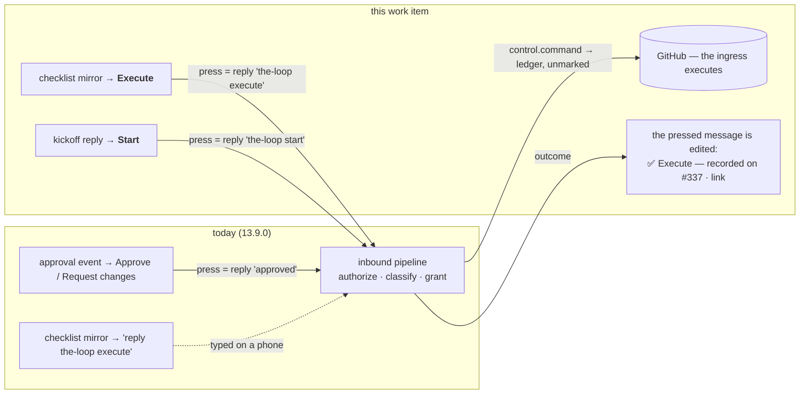

# Requirements: an Execute button (and a Start button) on the Slack messages that expect the keyword, the outcome shown on the message, and a `channels status` that says how to turn buttons on

> Phase 1 of 3 (requirements → design → tasks). Tier 3 (`human-approves-pr`; below
> `security.review.humanSignOffMinTier: 4`): two new Block Kit buttons on the Slack
> channel whose press enters the **existing** inbound pipeline as that member's reply
> carrying the configured keyword — the same allow-list, the same `control.command`
> grant, the same unmarked ledger record — plus an edit of the pressed message and a
> longer `channels status` line. No schema key is added; no new grant is introduced.

## Introduction

[Issue #337](https://github.com/MadaraUchiha-314/the-loop/issues/337), opened by
@jc1993 against 13.9.0, says that driving the-loop from a phone means typing exact
command strings — `the-loop execute` into the phase-selection thread — and asks for a
button instead, "same authorization path as a typed command". Two sub-asks: (1) make
the button work without hand-provisioning a Socket Mode app, or, if an app-level token
is genuinely required, say so **in `channels status` with the exact steps** rather than
the current one-line hint; (2) **show the outcome in the thread** after a press, so the
person is not left wondering whether the tap registered. The owner added: a **Start**
button too, equivalent to `the-loop start`.

At `a8acc96` (13.9.0) the channel already renders Approve / Request changes buttons on
approval-shaped events (issue-309), and a press already enters the pipeline as the
member's reply carrying the button's value — judged by the ordinary authorization and
grants (`handle_socket_action`). What is missing is narrow:

1. No message carries a button whose value is a **control keyword**. The
   phase-selection checklist reaches Slack as a `comment.agent` mirror ending in *"then
   reply `the-loop execute`"*, and the kickoff reply ends in *"replies here reach it"*
   while the guide says *then type `the-loop start` in that thread*.
2. A press's only feedback is the 👀 / ✅ / ⚠️ reaction (issue-325) — on a phone, three
   emoji under a message do not say *what* ran.
3. `channels status` prints `buttons: link only (Approve buttons need read.mode: socket
   and the gate.feedback grant)` and stops.

The app-level token **is** genuinely required. Slack delivers a button press only to a
connection that acknowledges it within three seconds — a Socket Mode connection opened
with an `xapp-` token — or to a public Request URL; the-loop refuses to expose one
(decision-084, decision-116 D5). A 60-second poller has nowhere to receive the click.
So sub-ask 1 is answered by **saying so, precisely**, not by a new transport.

## Requirements

### Requirement 1 — a button where a keyword is expected, with the keyword as its value

**User story:** As an authorized member on a phone, I want to press **Execute** on the
phase-selection message and **Start** on a freshly opened work item's message instead of
typing `the-loop execute` / `the-loop start`, so that the two keywords I use most are one
tap — with exactly the authority a typed keyword has.

#### Acceptance criteria (EARS)

1.1 WHEN the Slack channel posts the phase-selection checklist for a work item (the
`comment.agent` mirror of the-loop's own checklist comment, recognised by its
`<!-- the-loop:phase-selection -->` marker) AND a press can be received (R1.4) THEN the
message SHALL carry an **Execute** button whose `value` is the configured execute keyword
(`routing.control.keywords.execute`, default `the-loop execute`).

1.2 WHEN a kickoff opens an issue and the channel replies in the thread with the link
AND a press can be received THEN that reply SHALL carry a **Start** button whose `value`
is the configured start keyword (default `the-loop start`).

1.3 WHEN a member presses a command button THEN the press SHALL enter the inbound
pipeline as that member's reply carrying the button's value — through `map → drop own →
authorize → classify → grant → record` unchanged — so it classifies as
`control.command`, is recorded on the ledger **unmarked** with the keyword intact and an
envelope naming the person, and is executed by the ledger's ingress. The Slack code
SHALL start, spawn, execute or deliver nothing itself. An unlisted member's press SHALL
be dropped (`unauthorized-actor`) with no answer and no mark.

1.4 A command button SHALL be rendered only where a press can be received and acted
on: `read.mode: socket` AND the `control.command` grant in `channels.slack.publish`.
Under any other configuration the message SHALL carry the link button alone, as today.
A keyword the operator disabled (`""`) SHALL produce no button.

1.5 The button vocabulary SHALL be a fixed table — `execute` → *Execute*, `start` →
*Start* — with the value taken from the configured keyword, never from the message; the
`action_id` SHALL be under the `the-loop:` prefix the action handler already reads.

### Requirement 2 — the outcome is shown on the pressed message

**User story:** As the member who pressed a button, I want the message itself to say
what the press did — what was recorded, where, or why it failed — so that I know the
tap registered without opening GitHub.

#### Acceptance criteria (EARS)

2.1 WHEN a press is **accepted** by the pipeline (an outcome of `processed`) THEN the
channel SHALL edit the pressed message: the pressed button set is replaced by a context
line stating the button's name, who pressed it (a Slack mention of the member id), and
what happened — *recorded on `<ref>`* with the record's link for a `control.command` or
`gate.feedback`; *delivered to the session* for a `work-item.reply`; the error when the
record or the delivery did not land. Link buttons (*Open on GitHub*) SHALL stay.

2.2 WHEN the action landed THEN the pressed message's non-link buttons SHALL be removed
— a press acts once; WHEN it did not land THEN they SHALL stay beside a ⚠️ line, so the
member can press again once the cause is fixed.

2.3 The edit SHALL be best-effort: a failed or refused `chat.update` is a
`channel.press_report_failed` event and the pipeline's outcome stands; a **dropped**
press (unauthorized, unmapped, unpublishable) SHALL leave the message untouched — a
refusal leaves no mark (decision-111 D1).

2.4 The same edit SHALL apply to the existing Approve / Request changes buttons.

2.5 The issue-325 reactions on the pressed message SHALL be unchanged; the edit is in
addition to them.

2.6 The context line SHALL be composed from fixed words, the button's name derived from
its `action_id`, the member id, the work item ref and the record URL — never from the
button's value, the message text or a token.

### Requirement 3 — `channels status` says exactly how to get buttons

**User story:** As an operator, I want `the-loop channels status` to tell me, step by
step, what my configuration is missing for buttons to work, so that I do not have to
work it out from a one-line hint.

#### Acceptance criteria (EARS)

3.1 The `buttons:` line SHALL name both button sets and whether each can be received:
*Approve / Request changes* (Socket Mode + `gate.feedback`) and *Execute / Start*
(Socket Mode + `control.command`).

3.2 WHEN either set cannot be received THEN `status` SHALL print, under the line, only
the numbered steps that still apply: mint the app-level token (where in Slack's UI,
which scope, which environment variable — with its presence, never its value); set
`read.mode: socket`; add the missing grant(s) to `channels.slack.publish`; restart so
the service hosts the listener. WHEN both sets can be received THEN no steps SHALL be
printed.

3.3 The guide SHALL state plainly that the app-level token is required for any button,
and why (Slack delivers a press only to an acknowledging connection or a public Request
URL, and the-loop exposes none).

### Requirement 4 — the documentation follows the change

4.1 `docs/guide/slack.md` SHALL show the two buttons in the modes-of-interaction table,
the outcome edit, and the requirement of R3.3; `docs/config/cli/channels-options.md`
SHALL name the command buttons under `read.mode` and the `control.command` grant;
`docs/cli/commands/channels.md` SHALL describe the new `buttons:` block; the channels
capability doc SHALL carry the behaviour and a history row; the README and the
operating-model reference SHALL mention the buttons; the event catalog SHALL describe
`channel.press_reported` and `channel.press_report_failed`.

## Security considerations

- **Actors & trust:** authorized members (the `slack` ids of `routing.authorizedUsers`
  — judged by the pipeline before anything is recorded, exactly as for a typed reply);
  unlisted members and bots (dropped, unanswered, no mark); the operator (whose
  `publish` grants and `read.mode` decide whether a button is rendered at all); Slack
  (the `block_actions` payload — `user.id`, `actions[].action_id`, `actions[].value`,
  `message.blocks`, `message.ts` — is untrusted input; the value is *text* through the
  pipeline, the blocks are handed back to Slack only for the-loop's own message).
- **Trust boundaries & data:** no new boundary. A command button is a message on the
  Slack channel with a fixed value; the press crosses Slack → the-loop's process → the
  ledger exactly where a typed keyword crosses it, through the same code path
  (`handle_socket_action` → `process_reply`). The one new outbound call is
  `chat.update` on the pressed message, under the bot token, which Slack accepts only
  for a message that bot posted. No new grant, no new scope (`chat:write` covers
  `chat.update`), no new state.
- **Abuse cases (EARS):**
  1. WHEN an unlisted member presses Execute or Start THEN nothing SHALL be recorded,
     executed or edited, and no answer SHALL be given.
  2. WHEN a crafted `block_actions` payload carries a `value` that is not a keyword (or
     is prose around one) THEN it SHALL be judged as text by the ordinary pipeline — a
     keyword classifies as `control.command` under the grant, anything else as a reply
     — and never reach a shell, an argv or a file name.
  3. WHEN the `control.command` grant was removed after a button was rendered THEN the
     press SHALL be dropped as `unpublishable-event` and nothing recorded.
  4. WHEN the pressed message is edited THEN the new text SHALL carry no token, no
     payload text and no value — the button's name from a fixed table keyed by
     `action_id`, the member id, the ref, the record URL.
  5. WHEN a payload names a message the bot did not post THEN the edit SHALL fail at
     Slack (`cant_update_message`), be recorded as `channel.press_report_failed`, and
     change nothing else.
  6. WHEN the same button is pressed twice before the first edit lands THEN both
     presses SHALL be judged independently and the second keyword recorded like a
     second typed one — the ledger's ingress and the gates already absorb a repeated
     `execute` (the newest authorized comment decides) and a repeated `start` (a running
     session is not spawned twice).
  7. WHEN `read.mode` is not `socket` THEN no command button SHALL be rendered, so no
     press can be lost silently.
- **Fail closed:** no `channels` section, `enabled: false`, `read.mode` other than
  `socket`, no `control.command` grant, a disabled keyword — each means no command
  button. A 13.9.0 configuration with `read.mode: socket` and the `control.command`
  grant gains the buttons with **no new authority**: the grant already let every
  authorized member type the keyword.

## Out of scope

- A transport that receives a press without an app-level token — Slack offers only an
  acknowledging Socket Mode connection or a public Request URL, and the-loop exposes no
  endpoint (decision-084, decision-116 D5). The answer is the precise `status` output.
- Buttons for the other keywords (`stop`, `pause`, `resume`, `cleanup`, …): no message
  the-loop posts today expects them, so there is nothing to attach them to. The table
  of R1.5 is where one is added when a message does.
- A button on a message the-loop did not post (a member's own kickoff message): the bot
  can neither add blocks to nor edit it.
- A reply in the thread in addition to the edit: the edit is on the message under the
  member's thumb, and a reply would be one more message on a phone.

## Open questions

None. The owner's comment (a Start button) is R1.2.

## Review comments

> Appended by the-loop's `record-feedback` hook when a human gate approves with
> comments (issue-109). Append-only and attributed: an approval never silently
> discards a reviewer's suggestions, and the feedback travels with the document
> it concerns rather than living in a side-channel tracker.
