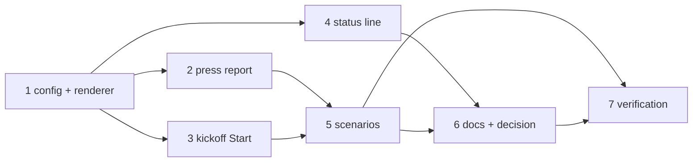

# Tasks: Execute / Start buttons, the outcome on the message, the status steps

> The last spec artifact. A DAG derived from the design and testing plan; each task names
> the testing-plan row that proves it. TDD: the test first, red, then green.

## Task list

- [ ] 1. The config and the renderer — `PHASE_SELECTION_MARKER`, `COMMAND_BUTTONS`,
  `BUTTON_NAMES`, `control_keywords` / `command_buttons` / `keyword` /
  `command_buttons_for` on `SlackChannelConfig`, `expected_commands`, `render_blocks`'s
  `commands`, `render_reply_blocks`, `say(blocks=)`, `post` passing the commands
  - _Depends on:_ none
  - _Requirements:_ R1.1, R1.2, R1.4, R1.5
  - _Test:_ T1 — the config, marker and render tests; T8 — A7
- [ ] 2. The press report — `report_press` on the channel, the two event types in
  `eventlog.py`, `process_reply` carrying `url` / `error`, `handle_socket_action`
  calling the report on `processed`
  - _Depends on:_ 1
  - _Requirements:_ R1.3, R2.1–R2.6
  - _Test:_ T1 — the report tests; T8 — A1, A2, A3, A4, A5, A6
- [ ] 3. The kickoff's Start button — `process_kickoff` replying with
  `render_reply_blocks`
  - _Depends on:_ 1
  - _Requirements:_ R1.2
  - _Test:_ T2 — the kickoff scenario
- [ ] 4. The status line — `_button_lines` in `channels_cmd.py`
  - _Depends on:_ 1
  - _Requirements:_ R3.1, R3.2
  - _Test:_ T1 — the status tests
- [ ] 5. The scenarios — the four integration scenarios over the socket handlers
  - _Depends on:_ 2, 3
  - _Requirements:_ R1.3, R2.1, R2.2, R2.3, R2.5
  - _Test:_ T2
- [ ] 6. Docs, capability docs, decision — the guide, the option and command pages,
  `channels.md`, the README and the collaboration reference, the two templates,
  `decision-117` + index row
  - _Depends on:_ 4, 5
  - _Requirements:_ R3.3, R4.1, the capability-docs gate
  - _Test:_ T10 — docs parity; T12 — `make check`
- [ ] 7. Verification — execute `testing-plan.md`, record `evidence/verification.md`
  and `evidence/security-review.md`
  - _Depends on:_ 5, 6
  - _Requirements:_ all
  - _Test:_ T1, T2, T8, T10, T12, T13

## Dependency graph (DAG)

## Checkpoints

After task 1: the render tests green. After task 2: the report tests green. After task
5: T1 and T2 green. After task 6: `make check`. Then the verification node, the
self-review rounds and the security review gate (`evidence/security-review.md`), then
the PR with the reviewer briefing.

## Review comments

> Appended by the-loop's `record-feedback` hook when a human gate approves with
> comments (issue-109). Append-only and attributed: an approval never silently
> discards a reviewer's suggestions, and the feedback travels with the document
> it concerns rather than living in a side-channel tracker.
