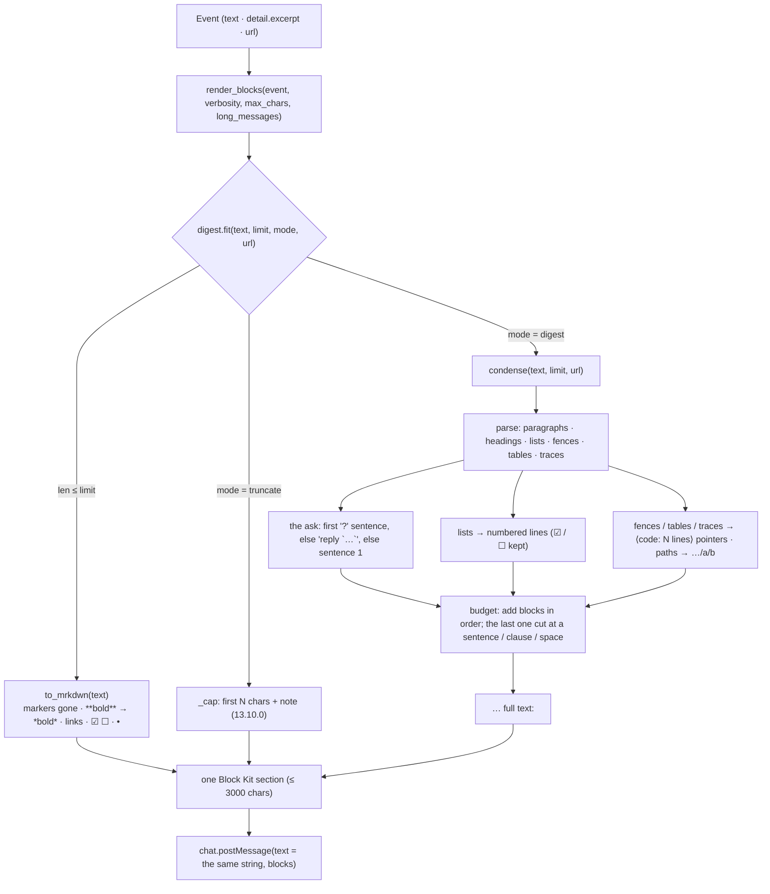

# Design: a structural digest inside the Slack renderer — the ask first, choices numbered, code and traces as pointers, cut at a sentence

> Phase 2 of 3. Derived from [`requirements.md`](requirements.md); reviewed together with
> [`testing-plan.md`](testing-plan.md). Tier 3.

## Overview

One new module, `cli/the_loop/channels/digest.py`, and one new config key. The
renderer (`render_blocks`) already caps each text section with `_cap`; every section
now goes through `digest.fit(text, limit, mode, url)` instead, which returns the text
as written (mrkdwn-rendered) when it fits, the 13.10.0 cut when `mode == "truncate"`,
and the digest otherwise. Nothing outside the renderer changes: the bus, the ledger,
the pipeline, the buttons and the reactions are untouched, and the plain-text fallback
of the post carries the same string the section shows.



## 1. The module — `channels/digest.py`

Pure functions over strings; stdlib `re` only; every pattern linear (a character class
that excludes its own delimiter, no nested quantifier).

```python
DIGEST_MODES: Tuple[str, ...] = ("digest", "truncate")
DEFAULT_DIGEST_MODE = "digest"

def strip_comments(text: str) -> str      # forward scan for `<!--` … `-->`; unclosed = kept
def to_mrkdwn(text: str) -> str           # R3.4 + A2: comments out, broadcasts neutralised,
                                          # **b** ~~s~~ headings links task boxes bullets
def condense(text: str, limit: int, url: str = "") -> str   # R1–R3: the digest
def truncate(text: str, limit: int) -> str                  # 13.10.0's `_cap`, moved here
def fit(text: str, limit: int, mode: str = DEFAULT_DIGEST_MODE, url: str = "") -> str
```

### 1.1 `fit` — the one entry point

```python
def fit(text, limit, mode="digest", url=""):
    text = text.strip()
    if len(text) <= limit:
        return to_mrkdwn(text)            # R4.1: untouched but for the drawing
    if mode == "truncate":
        return truncate(to_mrkdwn(text), limit)   # R1.4
    return condense(text, limit, url)     # R1.1
```

`limit` is `min(max_chars, _SECTION_LIMIT)` as today. The threshold is measured on the
**raw** text, so a message the author wrote under the cap is never digested because
its rendering grew.

### 1.2 `condense` — the digest

Parsing, in one pass over the lines (after `strip_comments`):

| Block | Recognised by | Rendered as |
|-------|---------------|-------------|
| fence | a line starting with ```` ``` ```` or `~~~` to the matching closer (an unclosed fence runs to the end) | `_⟨code: N lines⟩_` |
| table | two or more consecutive lines starting with `\|` | `_⟨table: N rows⟩_` (header and separator counted out) |
| trace | two or more consecutive lines matching `^Traceback \(most recent call last\)`, `^\s+File ".*", line \d+`, `^\s+at \S.*\(.*\)$`, `^\w+(Error\|Exception)\b.*` | `_⟨stack trace: N lines⟩_` |
| heading | `^#{1,6}\s+` | `*heading*` |
| list | consecutive lines matching `^\s*(?:[-*+]\|\d{1,3}[.)]\|[A-Z][.)]\|[a-z]\))\s+`, a task box `\[( \|x\|X)\]` optional; a non-blank line that is not itself an item, fence, heading or table row joins the item (GitHub's lazy continuation) | `1. ☑ item` — numbered in order, the box kept |
| paragraph | anything else, up to a blank line; a `>` quote prefix stripped | the sentences, joined by a space |

The **ask** (R2.1): the first sentence, scanning paragraphs and headings in order (not
list items, not pointers), that ends in `?`; else the first sentence containing
*reply* and a backtick span; else none. The sentence is removed from its paragraph and
rendered first, bold. When there is none, nothing leads and the first block is what it
was (the text's first sentence, R2.1's third clause, falls out of R2.3).

The **budget**: first the whole `limit` — when everything fits once drawn and nothing
was replaced, that is the digest and there is no footer; otherwise
`limit - len(footer) - 2`, and blocks are rendered and appended in order while they fit; the first block that does not fit is cut with `_cut(text, room)` — the last
sentence boundary within `room`, else the last clause boundary, else the last
whitespace, else nothing — and appended with `…` when non-empty; every later block is
left out. A list is appended item by item under the same rule (an item is cut at a
sentence/clause). Lines are joined by `\n`; a blank line separates the ask, the list
and the paragraphs.

The **footer** (R1.3): `_… full text: <{url}|GitHub>_` or `_… the full text is on
the ticket_`, appended when anything was cut, left out or replaced by a pointer — a
pointer *is* a replacement, so a text over the cap made of fences whose pointers fit
still carries it. Absent only when the digest carried every word.

Paths (R3.2): `(?<![\w/:])(/(?:[\w.@+~-]+/){2,}[\w.@+~-]+)` → `…/` + the last two
segments, applied to paragraphs and items after parsing. The lookbehind excludes a
path inside a URL (`…//host/a/b` — the `/` before the host follows `/`; `/a/b` follows
a word character) and a drive-less Windows path is never matched.

Every produced line other than a pointer, a heading's bold marks, a list number, the
box glyph, the `…` and the footer is a substring of `to_mrkdwn(strip_comments(text))`
— the faithfulness property T1 pins.

### 1.3 `to_mrkdwn`

Order matters and is fixed: comments out (`strip_comments`); broadcasts neutralised
(`<!` → `&lt;!`, A2 — after the comment scan so the-loop's own markers are already
gone); `**x**` / `__x__` → `*x*` (`[^*\n]+` / `[^_\n]+` inside); `~~x~~` → `~x~`;
`^#{1,6}\s+(.+)$` → `*\1*`; `!?\[text\]\(url\)` → `<url|text>` (`[^\]\n]+` and
`[^)\s]+`); `^(\s*)[-*+]\s+\[[xX]\]\s*` → `☑`, `\[ \]` → `☐`, a plain bullet →
`•`. Idempotent on its own output. Never changes the words.

## 2. The renderer — `channels/slack.py`

- `render_blocks(event, verbosity, *, interactive, max_chars, commands=None,
  long_messages=DEFAULT_DIGEST_MODE)`: the text section and the excerpt section call
  `digest.fit(text, min(max_chars, _SECTION_LIMIT), long_messages, event.url)`; the
  verbose context lines keep `_cap(str(value), 300)` — a detail value is a label, not
  prose. `_cap` stays as the alias of `digest.truncate` for the callers that import it.
- `SlackChannelConfig.long_messages: str = DEFAULT_DIGEST_MODE`, parsed from
  `section.get("longMessages")` with the `verbosity` rule (unknown → the default with a
  warning). Passed by `post` as `long_messages=self.config.long_messages`.
- `post`'s fallback text (R1.5): `render(replace(event, text=fitted), verbosity)` where
  `fitted` is the text section's string — computed once, used for both the section and
  the fallback, so the notification and the message agree. A short text renders
  exactly as before (`fit` is `to_mrkdwn`, and `to_mrkdwn` is the identity on plain
  prose).

## 3. The config — schema, templates, status

- Both schema copies (`.the-loop/cli-config.schema.json`, `cli/the_loop/schemas/`),
  byte-identical, additive: `channels.slack.longMessages` — `string`, enum
  `digest | truncate`, default `digest`, description saying what each does.
  `maxChars`'s description restated as the threshold.
- `skills/the-loop/templates/cli-config.yaml`, `.the-loop/cli-config.yaml`: one
  commented line under `maxChars`.
- `commands/channels_cmd.py`: after `maxChars:` —

  ```text
    longMessages: digest — above maxChars: the ask first, choices numbered, code and traces as pointers, cut at a sentence, the link for the rest
  ```

  or

  ```text
    longMessages: truncate — above maxChars: the first maxChars characters and a note (13.10.0)
  ```

## 4. Docs

- `docs/config/cli/channels-options.md` — `### slack.longMessages`; `slack.maxChars`
  restated; the example YAML gains the line.
- `docs/guide/slack.md` — a section *Reading it on a phone* (what the digest is, an
  example before/after of the phase-selection checklist, that it is structural and
  never paraphrases, the full text behind the link, `longMessages: truncate` to turn
  it off, `maxChars` as the size lever); the *Limits* list gains one bullet.
- `docs/cli/commands/channels.md` — the `status` bullet names the line.
- `docs/capabilities/channels.md` — the rendering bullet rewritten; a new *long text*
  bullet; a design link; a history row.
- `README.md`, `skills/the-loop/reference/collaboration.md` — one clause each where
  they say what Slack shows.
- `docs/decisions/decision-118.md` + index row.

## UI/UX design

N/A for prototypes — Slack draws Block Kit. The phase-selection checklist as a member
on a phone sees it, before and after (`maxChars: 900`):

```text
before (13.10.0)                              after
┌──────────────────────────────────────┐      ┌──────────────────────────────────────┐
│ The agent commented · github:o/r#338 │      │ The agent commented · github:o/r#338 │
│ 🤖 _the-loop_ — **which phases does  │      │ *🤖 _the-loop_ — which phases does   │
│ this work item need?**               │      │ this work item need?*                │
│                                      │      │ Before the loop starts, tell it what │
│ Before the loop starts, tell it what │      │ this item actually needs. *Untick    │
│ this item actually needs. **Untick   │      │ anything … then reply `the-loop      │
│ anything this work item does not     │      │ execute`.* The tick state at that    │
│ need — right here on this comment —  │      │ moment is frozen …                   │
│ then reply `the-loop execute`.** The │      │ 1. ☑ brainstorming                   │
│ tick state at that moment is frozen  │      │ 2. ☑ requirements-definition         │
│ and becomes the graph this item walk │      │ 3. ☑ design … 7. ☑ verification     │
│ … (2 341 more characters — see the l │      │ _… full text: GitHub_                │
│ [Open on GitHub] [Execute]           │      │ [Open on GitHub] [Execute]           │
└──────────────────────────────────────┘      └──────────────────────────────────────┘
```

## Data models

None persisted. `SlackChannelConfig` gains one frozen field.

## Error handling

| Failure | Behaviour |
|---------|-----------|
| empty or whitespace-only text | `fit` returns `""`; the renderer adds no section, as today |
| a text with no sentence boundary at all (one 5 000-character token) | cut at the budget, `…`, the footer — never an exception |
| an unclosed fence, an unterminated `<!--` | the fence runs to the end (one pointer); the comment opener is kept as text |
| an unknown `longMessages` | warning, `digest`; the schema refuses it at load |
| `condense` raising | must not — the empty, whitespace, pathological and unicode inputs are tests; were it to, `post` raises `ChannelError` → `channel.post_failed`, the event is not lost (the bus's contract) |

## Security design

| Boundary (from the requirements) | Enforced by |
|----------------------------------|-------------|
| A1 super-linear parsing | every regex a character class excluding its delimiter or line-anchored; `strip_comments` a forward scan; `test_a_pathological_comment_digests_in_linear_time` (64 KB of unclosed openers under a generous wall-clock bound) |
| A2 a broadcast sequence | `to_mrkdwn` rewrites `<!` after the comment scan, on every path (`fit` always converts); `test_a_slack_broadcast_in_a_comment_is_neutralised` |
| A3 a text link posing as the pointer | the footer is built from `url` (the event's) only; `test_the_footer_links_the_event_never_the_text` |
| A4 a misleading first question | the footer always links the record; nothing reads the digest (unchanged pipeline — no new call) |
| A5 a foreign HTML comment | `strip_comments` is not marker-aware: every `<!-- … -->` goes |

## Testing strategy

Unit (`cli/tests/test_channels_digest.py`): `to_mrkdwn` (each rule, idempotence, plain
prose untouched); `condense` (the ask leads; the reply-instruction fallback; no ask;
lists numbered with boxes; fences, tables, traces as pointers with counts; paths
shortened, URLs untouched; the sentence / clause / whitespace cut; the footer with and
without a URL; the faithfulness property; the budget honoured; empty / whitespace /
pathological / unicode inputs); `fit` (short passes untouched, `truncate` is the
13.10.0 output, the raw length is the threshold); the config (`long_messages` parse,
unknown → default with a warning, schema default parity); `render_blocks` (the section
is the digest, the excerpt is digested too, the fallback text matches, the marker never
reaches Slack, `truncate` keeps the old cut); `channels status` (the line per value).
Integration (`test_channels_integration.py`): a long agent comment reaches Slack as the
digest — through `publish_comment` → the bus → the channel — with the ask first, no
fence, within `maxChars`, the link, and the ledger untouched; a short comment passes
through untouched; a notification's artifact excerpt is digested. Docs: docs parity
(`p3`–`p5` on the new heading), schema parity, `make check`.

## Trade-offs & decisions

See [decision-118](../../decisions/decision-118.md): a structural digest rather than a
model summary; one enum key with `maxChars` as the threshold rather than a second
knob; mrkdwn rendering on every message, the digest only above the cap.

## Review comments

> Appended by the-loop's `record-feedback` hook when a human gate approves with
> comments (issue-109). Append-only and attributed: an approval never silently
> discards a reviewer's suggestions, and the feedback travels with the document
> it concerns rather than living in a side-channel tracker.
