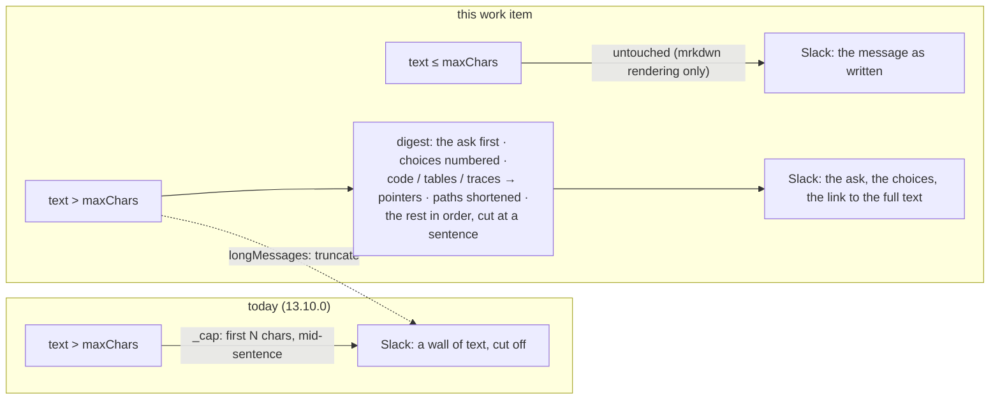

# Requirements: long agent output reaches Slack as a digest — the ask first, choices numbered, code and traces as pointers, cut at a sentence — instead of a hard truncation

> Phase 1 of 3 (requirements → design → tasks). Tier 3 (`human-approves-pr`; below
> `security.review.humanSignOffMinTier: 4`): a rendering change inside the Slack
> channel — one new config key (`channels.slack.longMessages`, additive in both schema
> copies, an `autonomy.sensitivePaths` entry as issue-325's `reactions` block was), no
> new call, grant, token, scope or state. Nothing the-loop *does* changes: the ledger is
> still the record, Slack is still a view of it.

## Introduction

[Issue #338](https://github.com/MadaraUchiha-314/the-loop/issues/338), opened by
@jc1993 against 13.10.0, says the Slack thread mirrors the GitHub comment body more or
less verbatim, and that text — written for a wide browser window — is unreadable on a
phone. `maxChars: 2900` is a hard cut, often mid-sentence, and the part cut off is
often the decision; `verbosity` only removes whole layers. The ask is a
**transformation layer between the agent's output and Slack**, applied only to long
text: summarize instead of truncating (never mid-sentence, the full comment behind a
link), lead with the ask, render a choice as a numbered list, strip what Slack cannot
use (long code fences, absolute paths, stack traces — a pointer instead), and leave
short messages untouched.

At `3b7563c` (13.10.0) the channel renders every text section the same way:
`_cap(text, maxChars)` — the first `maxChars` characters, `rstrip`ped, then
*… (N more characters — see the link)*. GitHub markdown reaches Slack unconverted
(`**bold**`, `## headings`, `[text](url)`, `- [x]` checkboxes and the-loop's own
`<!-- … -->` markers all show literally — the last one noted as an observation in the
issue-337 log). The plain-text fallback Slack uses for the phone's push notification
(`chat.postMessage`'s `text`) carries the whole body, uncapped.

**What the digest is, and is not.** It is a *structural* condensation done by the
channel, deterministically: it finds the sentence that asks something and puts it
first, renders a list of choices as a numbered list, replaces code fences, tables and
stack traces with a pointer to the record, shortens absolute paths, keeps the rest in
the author's order until the budget is spent, and cuts at a sentence. It is **not** a
generated summary: no model reads the text, so the digest never contains a sentence the
author did not write. The Slack message is the interface to a decision the ledger
records; a view that could paraphrase — or invent — an option is the wrong tool for that
seat. See [decision-118](../../decisions/decision-118.md).

## Requirements

### Requirement 1 — long text is digested, never cut mid-sentence

**User story:** As an authorized member reading the-loop on a phone, I want a long
message condensed to what I need to act — the decision and the ask — with the full
text one tap away, so that I do not scroll a wall of text to find the question, and
never lose the sentence the cut fell on.

#### Acceptance criteria (EARS)

1.1 WHEN a text section of a Slack message (an event's `text`, or the artifact
`excerpt` a notification carries) is longer than `channels.slack.maxChars` AND
`channels.slack.longMessages` is `digest` (the default) THEN the channel SHALL post a
**digest** of that text that fits in `maxChars` characters, composed only of sentences
and list items the text contains (in the channel's mrkdwn rendering), pointer lines for
what was replaced (R3), and one closing line linking the full text.

1.2 WHEN the digest cannot carry the whole text THEN it SHALL end at a **sentence
boundary** (`.`, `!`, `?` followed by whitespace or the end, or a line end); IF the
sentence that does not fit is longer than the remaining budget THEN the digest SHALL
end at the last clause boundary (`,`, `;`, `:`, an em dash) or, failing that, at
whitespace — never inside a word, and never inside a sentence when a boundary exists.

1.3 WHEN anything was left out or replaced THEN the digest SHALL close with a line
naming the full text's location: *… full text: <link>* with the event's URL (the
ledger comment or the work item), or *… the full text is on the ticket* when the event
carries no URL. The link SHALL come from the event, never from the text.

1.4 WHEN `channels.slack.longMessages` is `truncate` THEN the channel SHALL behave as
at 13.10.0: the first `maxChars` characters and the *… (N more characters — see the
link)* note. An unknown value SHALL resolve to `digest` with a warning; the schema
SHALL refuse it at load.

1.5 The plain-text fallback of the Slack message (the `text` argument Slack shows in a
push notification) SHALL carry the same digest when the section was digested, so the
notification on the phone leads with the ask too.

### Requirement 2 — the ask leads, choices are a numbered list

**User story:** As the member the message needs something from, I want the first line
to say what is being asked and a choice to be a short numbered list I can answer with
one number, so that I can act from the notification without reading the context.

#### Acceptance criteria (EARS)

2.1 WHEN the text contains a sentence ending in `?` outside a list item or code THEN
the digest SHALL open with that sentence — the **first** such sentence, in bold —
before anything else; WHEN it contains no question but a sentence that asks for a
reply (the word *reply* and an inline code span, as the phase-selection checklist's
*then reply `the-loop execute`*) THEN that sentence SHALL lead instead; WHEN it
contains neither THEN the digest SHALL open with the text's first sentence as written.

2.2 WHEN the text contains a list — `-` / `*` / `+` bullets, `1.` / `1)` numbering,
`A.` / `A)` lettering, GitHub task-list boxes `- [ ]` / `- [x]` — THEN the digest SHALL
render each item on one line, **numbered** `1.`, `2.`, … in the item's order, with a
task-list box rendered as ☐ / ☑ before the item, and an item longer than the line
budget cut at a sentence or clause boundary as R1.2.

2.3 The digest SHALL keep the author's order for everything but the leading ask: the
sentences around the ask stay where they were, headings become bold lines, and
paragraphs, lists and pointers follow in sequence until the budget is spent.

### Requirement 3 — what Slack cannot use becomes a pointer

**User story:** As a phone reader, I want code fences, tables, stack traces and long
absolute paths out of the message with a note of where they are, so that the message is
prose I can read and the detail is still one tap away.

#### Acceptance criteria (EARS)

3.1 WHEN the digest runs THEN every fenced code block SHALL be replaced in place by
*⟨code: N lines⟩*, every markdown table by *⟨table: N rows⟩*, and every stack trace
(a run of two or more lines shaped like Python's `Traceback` / `File "…", line N`,
Java's / Node's `at …(…)`, or a `SomethingError:` line) by *⟨stack trace: N lines⟩*;
the closing line (R1.3) then carries the link to the full text.

3.2 WHEN the digest runs THEN an absolute path of three or more segments
(`/home/user/the-loop/cli/the_loop/channels/slack.py`) SHALL be shortened to its last
two segments with an ellipsis (`…/channels/slack.py`); a path inside a URL SHALL be
untouched.

3.3 The digest SHALL never carry an HTML comment (`<!-- … -->`): the-loop's own
markers and envelopes are invisible on GitHub and SHALL be invisible on Slack.

3.4 The channel SHALL render GitHub markdown as Slack mrkdwn in **every** text
section, digested or not: `**bold**` → `*bold*`, `~~strike~~` → `~strike~`, an ATX
heading → a bold line, `[text](url)` → `<url|text>`, `- [x]` / `- [ ]` → ☑ / ☐, a
bullet → `•`, and an HTML comment removed. This conversion changes how the words are
drawn, never which words are there.

### Requirement 4 — short messages pass through untouched

**User story:** As an operator, I want a two-line message to reach Slack exactly as
written, so that the digest costs nothing where it is not needed.

#### Acceptance criteria (EARS)

4.1 WHEN a text section is at most `maxChars` characters long THEN the channel SHALL
post it whole, in the author's order, with no pointer, no closing line and no
digest — the mrkdwn rendering of R3.4 alone.

4.2 `maxChars` SHALL keep its meaning (how much text one message carries, minimum
200, capped at Slack's 3000-character section limit) and its default (`1500`); what
happens *above* it is `longMessages`. A 13.10.0 configuration SHALL parse unchanged
and gain the digest.

4.3 `the-loop channels status` SHALL print the resolved `longMessages` beside
`maxChars`, and say in one line what each value does.

### Requirement 5 — the documentation follows the change

5.1 `docs/config/cli/channels-options.md` SHALL document `slack.longMessages` (type,
default, what the digest does and does not do) and restate `slack.maxChars` as the
threshold; `docs/guide/slack.md` SHALL carry a section on reading the-loop from a phone
(what the digest changes, that it is structural, how to see the full text, how to turn
it off); `docs/cli/commands/channels.md` SHALL name the `status` line; the channels
capability doc SHALL carry the behaviour and a history row; the two config templates
SHALL carry the key; the README and the operating-model reference SHALL mention the
digest where they describe what Slack shows.

## Non-functional requirements

- **Deterministic and linear.** The digest is pure text processing over the message —
  no model, no network, no file — and every pattern it uses is linear in the input
  (character classes that exclude the delimiter, no nested quantifiers, HTML comments
  found by a forward scan), so a 64 KB comment costs milliseconds and a crafted one
  costs the same.
- **Faithful.** Every line of the digest that is not a pointer or the closing line is
  text the author wrote (after the mrkdwn conversion). Pinned by a test.
- **Observable.** `channel.post_failed` and the existing events are unchanged; the
  digest adds no event, because rendering is not an action.

## Security considerations

- **Actors & trust:** the text the digest reads is **untrusted** in two cases — a
  collaborator's or authorized member's comment mirrored as `comment.human`, and any
  agent comment — and trusted in none: the digest treats every input as text. The
  operator (who sets `longMessages` and `maxChars`). Slack (which renders the mrkdwn
  the channel hands it, including any control sequence the text carries).
- **Trust boundaries & data:** no new boundary. The digest sits inside the channel's
  renderer, between the event the bus handed it and the `chat.postMessage` call the
  channel already makes; it reads nothing else and writes nothing. The full text stays
  on the ledger, where it always was; the digest only decides which of its sentences
  are drawn. No token, no id, no path is *introduced* by the digest — shortened paths
  are the author's own paths with the head removed.
- **Abuse cases (EARS):**
  1. WHEN a comment is crafted with markup that could make a naive parser
     super-linear (thousands of unclosed `**`, `<!--`, `[`, fence openers) THEN the
     digest SHALL complete in linear time — every pattern excludes its own delimiter
     and the comment scan is forward-only — and a test SHALL bound the cost.
  2. WHEN a mirrored comment carries a Slack broadcast sequence (`<!channel>`,
     `<!here>`, `<!everyone>`, `<!subteam^…>`) THEN the channel SHALL neutralise it
     (`&lt;!…`), digested or not, so a comment on a ticket can never page a workspace.
  3. WHEN a text contains a link labelled as the full text THEN the closing line SHALL
     still link the **event's** URL; the text's link is rendered as any link, never
     promoted to the pointer.
  4. WHEN a text is crafted so that its first question is misleading and the decision
     sits later THEN the digest SHALL still carry the closing link to the record, and
     nothing the-loop *does* SHALL read the digest: gates, control and sessions read the
     ledger, never the Slack rendering (decision-103 D1). The digest is a view.
  5. WHEN a text contains an HTML comment that is not the-loop's THEN it SHALL be
     removed all the same — a comment is never rendered, whoever wrote it.
- **Fail closed:** an unknown `longMessages` value resolves to the default `digest`
  with a warning and the schema refuses it at load; a malformed section still
  disables the channel as before. A digest that raises — it must not, and a test
  exercises the empty, the whitespace-only and the pathological input — would surface
  as `channel.post_failed`, never as a lost event.

## Out of scope

- **A model-written summary.** A generated summary can paraphrase or invent an option
  in the one message a member acts on; the-loop bundles no runtime (decision-005) and
  adds no secret to the post path. `longMessages` is an enum so a `summarize` value —
  routed through a `reviews.critics`-style executable entry — can be added when
  someone wants it; this work item does not.
- **Changing what the agent writes.** The `the-loop:writing` skill already asks for
  conclusion-first prose; the digest reads the structure that is there rather than
  demanding a new one.
- **A per-event-type policy** (digest the agent's comments, not the notifications):
  one threshold, one behaviour, until a reader needs otherwise.
- **Escaping `&`, `<`, `>` for mrkdwn in general.** Pre-existing pass-through; only
  the broadcast sequences (A2) are neutralised here, because they act.
- **Slack's own message-length limits** beyond the 3000-character section cap the
  channel already honours.

## Open questions

None. The ticket's five asks map to R1 (1), R2 (2, 3), R3 (4) and R4 (5).

## Review comments

> Appended by the-loop's `record-feedback` hook when a human gate approves with
> comments (issue-109). Append-only and attributed: an approval never silently
> discards a reviewer's suggestions, and the feedback travels with the document
> it concerns rather than living in a side-channel tracker.
