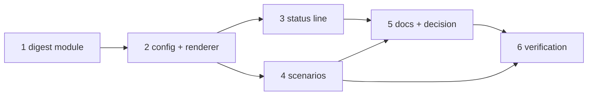

# Tasks: the Slack digest

> The last spec artifact. A DAG derived from the design and testing plan; each task names
> the testing-plan row that proves it. TDD: the test first, red, then green.

## Task list

- [x] 1. The digest module — `channels/digest.py`: `strip_comments`, `to_mrkdwn`,
  `condense` (parse, the ask, lists, pointers, paths, the budget, the cut, the
  footer), `truncate`, `fit`
  - _Depends on:_ none
  - _Requirements:_ R1.1–R1.3, R2.1–R2.3, R3.1–R3.4, R4.1
  - _Test:_ T1 — the digest tests; T7; T8 — A1, A2, A3, A5
- [x] 2. The config and the renderer — `long_messages` on `SlackChannelConfig`, the
  schema key in both copies, `render_blocks(long_messages=)` calling `fit` for the text
  and excerpt sections, `post`'s fallback text
  - _Depends on:_ 1
  - _Requirements:_ R1.4, R1.5, R4.2
  - _Test:_ T1 — the config and render tests; T10 — schema parity
- [x] 3. The status line — `channels_cmd.py`
  - _Depends on:_ 2
  - _Requirements:_ R4.3
  - _Test:_ T1 — the status test
- [x] 4. The scenarios — three integration scenarios through the bus
  - _Depends on:_ 2
  - _Requirements:_ R1.1, R2.1, R3.1, R4.1
  - _Test:_ T2
- [x] 5. Docs, capability docs, decision — the option page, the guide, the command
  page, `channels.md`, the two templates, the README and the collaboration reference,
  `decision-118` + index row
  - _Depends on:_ 3, 4
  - _Requirements:_ R5.1, the capability-docs gate
  - _Test:_ T10 — docs parity; T12 — `make check`
- [x] 6. Verification — execute `testing-plan.md`, record `evidence/verification.md`
  and `evidence/security-review.md`
  - _Depends on:_ 4, 5
  - _Requirements:_ all
  - _Test:_ T1, T2, T7, T8, T10, T12, T13

## Dependency graph (DAG)

## Checkpoints

After task 1: the digest tests green. After task 2: the render tests green. After task
4: T1 and T2 green. After task 5: `make check`. Then the verification node, the
self-review rounds and the security review gate (`evidence/security-review.md`), then
the PR with the reviewer briefing.

## Review comments

> Appended by the-loop's `record-feedback` hook when a human gate approves with
> comments (issue-109). Append-only and attributed: an approval never silently
> discards a reviewer's suggestions, and the feedback travels with the document
> it concerns rather than living in a side-channel tracker.
