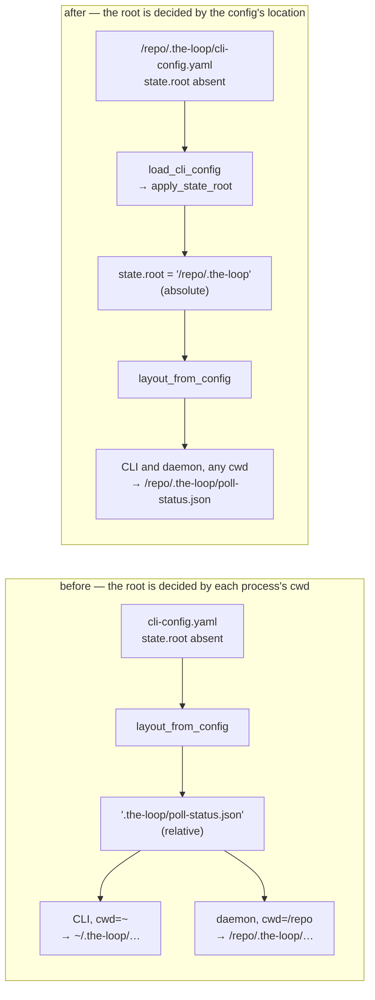

# Design: one state root per configuration, and health surfaces that report on it

## Overview

**The root becomes absolute where the config is loaded, and every spawn carries the
config path it resolved.** Those two changes remove the divergence itself; the other
three make the system say so when something is nonetheless wrong — a health body that
names what is running, an event for an ingress that failed to start, and a `status` that
prints the files it read.

The fix lands at the **load boundary**, not at the read boundary. `load_cli_config(path)`
already fans values into the document it returns (`apply_integrations` injects
`_ghBinary`, `apply_instance` injects `_instance`); a third pass, `apply_state_root`,
rewrites `state.root` to an absolute path anchored on the config file. Every one of the
~30 existing `layout_from_config(config)` call sites then resolves the same directory
with no signature change, in the daemon and in the CLI alike.



## Architecture

Five components change; nothing new is introduced beyond one module-level function and
one docs page.

| # | Component | Change | Requirement |
|---|-----------|--------|-------------|
| D1 | `the_loop/cli_config.py` | `apply_state_root(config, config_path)`, called from `load_cli_config` | R1.1–R1.4 |
| D2 | `the_loop/client/__init__.py`, `the_loop/core/lifecycle.py`, `the_loop/core/daemons.py` | every spawn passes `THE_LOOP_CLI_CONFIG` | R1.5 |
| D3 | `the_loop/api/routes.py` | `/api/v1/health` reports the enabled ingresses, the config path and the state root | R2 |
| D4 | `the_loop/api/ingress.py` | `ingress.hosted_failed` for an enabled ingress that did not start; `_host` releases the lock of a loop that ends on its own | R2.6, R3 |
| D5 | `the_loop/state.py`, `the_loop/commands/lifecycle_cmd.py` | `rival_roots()`; `status` prints its config, its root, and any rival | R4 |
| D6 | `docs/cli/supervision.md` (+ links) | supervision is the operator's, with the unit | R5 |

### D1 — the anchored root

```python
def resolve_state_root(config: Mapping, config_path: Path) -> str:
    """`state.root` as an absolute path, anchored on the config file (R1.1-R1.4)."""
```

The anchoring rule, in one sentence: **a relative `state.root` is resolved against the
config file's base directory — the directory that the config's `.the-loop/` sits in.**

| `config_path` | `state.root` | resolved |
|---|---|---|
| `/repo/.the-loop/cli-config.yaml` | *absent* | `/repo/.the-loop` |
| `/repo/.the-loop/cli-config.yaml` | `.the-loop` | `/repo/.the-loop` |
| `/repo/.the-loop/cli-config.yaml` | `var/state` | `/repo/var/state` |
| `/home/coder/.the-loop/cli-config.yaml` | *absent* | `/home/coder/.the-loop` |
| *anything* | `/srv/the-loop` | `/srv/the-loop` |
| *anything* | `~/loop-state` | `<expanded home>/loop-state` |

The "one step out" — `config_path.parent.parent` when `config_path.parent` is named
`.the-loop`, else `config_path.parent` — is what keeps the **default** landing where it
lands today. Anchoring on the config file's own directory would turn the default into
`/repo/.the-loop/.the-loop`, and an explicit `state.root: .the-loop` (which several
configs carry) into a second nested directory. The rule as written changes **no** path
for anyone whose daemon and CLI both ran from the base directory — which is the
configuration that works today — and changes the path only for the processes that were
already reading the wrong file.

This is `resolve_env_file`'s rule, one directory out. `env.file` (issue-318,
decision-108 D2) resolves a relative path against the config file's directory for
exactly this reason: the config is found in four places, two of them outside any
checkout, and "beside my config" is the one rule that reads the same from all four.
`state.root` needs the same rule shifted by one, because the config lives *inside* the
directory the root names.

**`apply_state_root` runs even for an empty document.** `load_cli_config` currently skips
its `apply_*` passes when the file is missing (`if data:`). The root must be resolved
anyway: a fresh install with no config file at all would otherwise keep the `cwd`-relative
default and keep this bug in the one configuration nobody has yet customised. The
resolved path is then whatever `default_cli_config_path()` selected — the home fallback —
so `the-loop` with no config writes to `~/.the-loop/` from every directory instead of
scattering a state root into every directory it is run from.

**`layout_from_config` is unchanged.** A dict that never went through the loader — a
test's literal, an SDK caller's hand-built mapping — keeps today's behaviour. The absolute
root is a property of *loading a config file*, which is the only context in which there is
a file to anchor on.

### D2 — the spawn carries the config

Three spawn sites pass `THE_LOOP_CLI_CONFIG` set to `cli_config.default_cli_config_path()`
— the path **this** process resolved, `--config` included:

| Site | Spawns | Today |
|---|---|---|
| `client._spawn_service` | `-m the_loop.api.serve` | fixed argv, inherited env |
| `lifecycle.spawn_service` | `-m the_loop.api.serve` | fixed argv, inherited env |
| `core.daemons.control_daemon` | `-m the_loop.daemon_entry <daemon>` | fixed argv, inherited env |
| `lifecycle.schedule_restart` | `-m the_loop --config <path> restart` | **already threads it** |

An environment variable rather than an argv flag, for three reasons. `the_loop.api.serve`
has no argument parser and gaining one to carry a single value that already has an
environment form is a worse trade. The variable is documented at the same priority as
`--config` (`cli_config.py`'s module docstring, priority 2), so this is the existing
mechanism, not a new one. And it is **inherited** — a standing session, a `the-loop
restart` or anything else the daemon later spawns resolves the same file, where a flag
would have to be re-threaded at every hop.

Precedence is unchanged and still correct: a child that is itself a CLI invocation with
`--config` uses the flag (`cli.py`'s pre-scan sets `_override`, priority 1); everything
else uses the inherited variable before it would have fallen through to `cwd`.

The value is only ever a path this process already resolved — the issue-222 property
`schedule_restart` holds: no request, comment or config value can name another file
(AC1).

### D3 — the health body

```json
{
  "status": "degraded",
  "version": "13.11.0",
  "configPath": "/repo/.the-loop/cli-config.yaml",
  "stateRoot": "/repo/.the-loop",
  "ingresses": [
    {"name": "poller", "enabled": true, "running": false,
     "detail": "polling.enabled is true but no poller holds /repo/.the-loop/poll.pid"},
    {"name": "gh-webhook", "enabled": false, "running": false, "detail": ""},
    {"name": "slack-listener", "enabled": false, "running": false, "detail": ""}
  ]
}
```

`status` is `"degraded"` when any **enabled** ingress is not running, `"ok"` otherwise —
the same `enabled_services` / `RunLock.is_held()` pair `the-loop status` already uses, so
the API and the CLI cannot disagree about what is up. `status` and `version` keep their
types and meanings, so a client reading `body["status"] == "ok"` gets *stricter*, never
broken.

**HTTP stays 200** (R2.4). The status code answers "did the service answer", which is
what `client.healthy()` measures and what `ensure_service` spins on: a 503 would make
every unrelated CLI command conclude "no service" and spawn another one, forever, on a
box whose only fault is a stopped poller. The body is where health lives.

`configPath` and `stateRoot` are the two facts that would have ended the reported outage
in one `curl`, and they are not an escalation: `GET /api/v1/config` already serves the
whole document to the same callers on the same loopback boundary (AC3).

The route builds this from `holder.current` (the live config, re-read per request since
issue-222) and `holder.path`, so a config change is reflected without a restart.

### D4 — the event that was missing

`start_hosted_ingresses` emits `ingress.hosted_failed` at `level="error"` for every
**enabled** ingress whose starter returned `None` or raised:

```python
eventlog.emit("ingress.hosted_failed", level="error", ingress=name, reason=reason)
```

The reasons are the ones already written to the logfile — lock held by pid N, `polling.sources`
is empty, a missing token *variable name*, an unbindable port — so nothing new reaches
the event log (AC5). What changes is **where** they land: `the-loop events`, the SSE
stream and self-diagnosis read the event log, and none of them could see a poller that
never started. The service keeps serving either way (R3.2): the API being up is what
makes the reason reachable.

**And the lock is made to tell the truth.** `_host(name, lock, run, stop)` — one helper
every hosted ingress now goes through — runs the loop on its thread and, in a `finally`
that fires only when no shutdown was requested, **releases the lock** and emits the same
failure event. Without it, a run loop that returns during startup (a missing `gh`, an
unbindable port) leaves the lock held **by the service's pid**, and the service is alive,
so `the-loop status` and `/api/v1/health` both report the dead ingress as *running*: the
reported outage, reproduced by the fix that was supposed to catch it. The Slack listener
has had exactly this discipline since issue-334 ("so `status` never reports a dead
listener as running"); this generalises it to the poller and the receiver.

This is the ticket's item 3 made concrete. "`poller.stopped` with no matching
`poller.started`" is a *derived* signal that something must compute; an explicit failure
event is the same information as a fact, at the moment it is true.

### D5 — `status` names its files

```
config      /repo/.the-loop/cli-config.yaml
state       /repo/.the-loop
conflict    ~/.the-loop also holds a poller heartbeat — reporting on /repo/.the-loop
instance    (unnamed) [open] — 0 declared, 18 managed
service     running (pid 1119072) [enabled] — http://127.0.0.1:4114, healthy
poller      running (hosted in the service, pid 1119072) [enabled]
            last cycle: 2026-09-10T17:01:19Z (27s ago) — 18 item(s), …
```

`state.rival_roots(layout)` returns the candidate roots — `./.the-loop` and
`~/.the-loop`, the two branches `default_cli_config_path` can fall through to — that are
**not** the resolved root and **do** hold a `poll-status.json`. It reads the filesystem
and nothing else; it never merges, copies or deletes (out of scope), and it does not move
the exit code (R4.3): whether another directory holds an old file is not a statement about
whether this instance's enabled services are running.

The JSON form carries the same three fields (`configPath`, `stateRoot`, `conflictingRoots`)
so a script sees what the terminal does.

### D6 — supervision, documented

A new `docs/cli/supervision.md`, linked from `docs/cli/service.md` and the state page,
saying in its first line that `the-loop start` starts the services **once** and does not
restart them, and carrying: a `systemd --user` unit (`Type=simple`, `Restart=always`,
`WorkingDirectory` explicitly **not** load-bearing after this change, `Environment=THE_LOOP_CLI_CONFIG=…`),
the cron form for `daemon_entry poller --once`, and what a supervisor should watch —
`GET /api/v1/health` with `status == "ok"`, which is only now worth watching.

## Data models

No schema shape changes. Two description changes, both to text that is now wrong:

- `state.root` in `.the-loop/cli-config.schema.json` (and its byte-identical package
  copy) documents the anchoring rule instead of the bare default.
- `docs/cli/state.md`'s "relative to the process's working directory" becomes the rule.

`docs/api-specs/openapi/` gains the health response's new fields — the contract test
(`test_api_contract_parity.py`) pins the surface against it.

## Error handling

| Condition | Behaviour |
|---|---|
| `state.root` is a non-string (a list from a hand edit) | Warn and fall back to the anchored default — `resolve_env_file`'s posture, and for its reason: a list must not be `str()`-ed into a path. |
| the config file does not exist | The root is still anchored, on the path that *would* have been read. Deterministic in the one configuration nobody has customised. |
| the resolved root's parent does not exist | Unchanged: the stores create directories on write, as they do today. |
| a rival root cannot be stat'ed (permissions) | It is not reported. `status` must never fail on an observation. |
| `holder.current` is mid-edit / unparseable when `/health` is called | `ConfigHolder` keeps the previous document (issue-222's documented behaviour); health reports on that. |

## Testing strategy

Unit tests own the resolution table (D1) and `rival_roots` (D5); integration scenarios
own the two behaviours a unit test cannot express — **two processes with different
working directories resolving one config to one root**, and **a degraded health body when
an enabled poller is absent**. See `testing-plan.md`.

The regression test that would have caught this is the one to write first: load the same
config file from two different working directories and assert every `StateLayout` path is
equal. It fails on `main` and passes after D1.

## Alternatives considered

| Alternative | Why not |
|---|---|
| Thread a resolved `StateLayout` parameter through the poller, as the ticket suggests | It fixes the poller and leaves ~30 other `layout_from_config(config)` call sites — the session registry, the event log, the channels store — resolving against `cwd`. The ticket itself notes the heartbeat is "the third file it has bitten". The load boundary fixes all of them at once. |
| Anchor a relative root on the config file's own directory (`config_path.parent`) | Turns the default into `<repo>/.the-loop/.the-loop` and an explicit `state.root: .the-loop` into a nested second root — a silent state move for every existing install. The base directory keeps today's paths. |
| Make `state.root` required, and refuse a config without one | Breaks every existing config, to make the operator restate a default that can be derived correctly. |
| Resolve against `$PWD` at *import* time instead of per call | Same bug, frozen earlier. |
| Return HTTP 503 from `/health` when degraded | R2.4/AC4: `ensure_service` would spawn a second service forever. |
| Have the service **restart** a hosted ingress that failed | A supervisor inside the thing being supervised, with no bound on the retry loop, is a second outage mode. R5 documents the supervisor that already exists on every target platform. |
| Compute "`poller.stopped` with no `poller.started`" in `status` | A derived signal, only as good as the log's retention, when the failure can simply be recorded as it happens (D4). |
